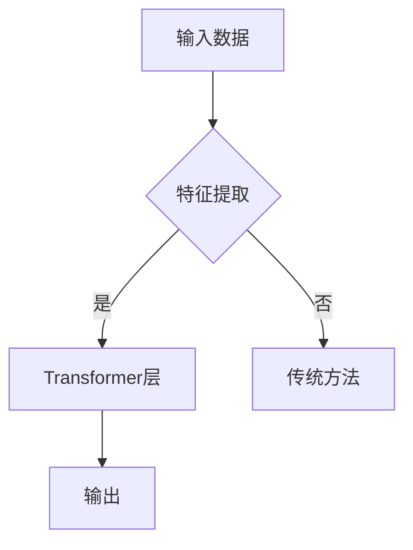
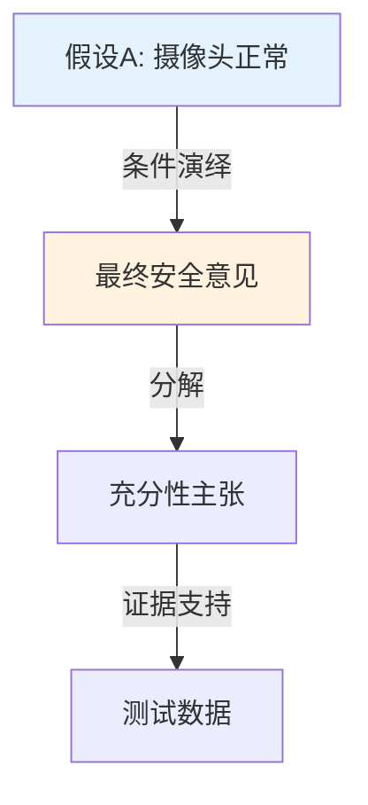

# paper-master 论文大师

## 核心定位

**一篇论文，两个版本，同步生成：**

| 版本 | 风格 | 目标读者 | 核心特点 |
|------|------|----------|----------|
| **技术版** | X光机式解构 | 研究者 | 高密度+LaTeX数学+批判分析 |
| **解读版** | 乔木对话式 | 大众 | 生活化类比+配图+口语化 |

**输出目录**：`~/Gitlab/Personal/Experimental/Paper-Reading/paper_html/{paper_id}/`

## 核心特点

- **双轨并行**：一篇论文生成两个版本
- **数学公式**：严格的 LaTeX 规范（行内 `$...$`，独立 `$$...$$`）
- **批判分析**：隐形假设 + 未解之谜
- **配图支持**：Mermaid 流程图 + Graphviz 架构图
- **零外部依赖**：无 API，无付费服务

---

## 工作流程

### 步骤 1：接收论文

用户提供 PDF 路径或 URL。

### 步骤 2：预处理

```bash
# 提取PDF元数据（如果需要）
# 使用 markitdown 或 pdftotext 提取文本
```

### 步骤 3：并行生成两个版本

**技术版** → 按 `【X光机解构框架】` 生成  
**解读版** → 按 `【乔木解读框架】` 生成

### 步骤 4：生成配图（可选）

如果论文包含复杂架构或流程，生成：
- Mermaid 流程图（保存为 `.mmd`）
- Graphviz 架构图（保存为 `.png`）

### 步骤 5：保存文件

```
{paper_id}/
├── {paper_id}_技术版.md
├── {paper_id}_技术版.html
├── {paper_id}_解读版.md
├── {paper_id}_解读版.html
├── diagram_架构图.mmd      # 如果适用
└── diagram_流程图.mmd      # 如果适用
```

---

## 【X光机解构框架】技术版

### 核心定位

穿透学术黑话的迷雾，**不是总结，是解构**。

### 执行步骤

#### 去噪
- 忽略背景介绍、客套话
- 跳过 Related Work（除非有关键对比）
- 过滤填充内容

#### 提取
- 锁定核心贡献（Delta）
- 识别作者的"灵光一闪"时刻
- 找出决定成败的 1-2 个关键操作

#### 批判
- 寻找逻辑漏洞或边界条件
- 识别隐形假设
- 标记未解决的问题

### 结构模板

```markdown
# {简短标题}_技术版

## 🔬 核心痛点

**一句话定义**：这篇论文试图解决什么具体的、困难的问题？

**前人困境**：在它之前，为什么别人解决不了？

## 💡 解题机制

### 核心直觉
作者那个"灵光一闪"的想法（用最直白的语言）

### 关键步骤
1. **神来之笔1**：{含 LaTeX 公式}
2. **神来之笔2**：{含 LaTeX 公式}

## 🚀 创新增量

**vs SOTA**：相比当前最佳，具体提升在哪？

**新拼图**：为人类知识库增加了哪块具体的新拼图？

## ⚠️ 批判性边界

### 隐形假设
作者在什么条件下才能成功？

### 未解之谜
论文没解决什么？带来了什么新问题？

## 📐 餐巾纸公式

$$\omega_{核心} = ...$$

{一句话解释公式含义}

## 🔄 逻辑流程

{mermaid 或 graphviz 流程图}
```

### LaTeX 公式规范

**必须严格遵守**：

```latex
行内公式：$\omega_{G1} = \omega_{A1} \odot (\omega_{G2}, \omega_{G3})$

独立公式：
$$E[X] = \frac{\alpha}{\alpha + \beta} = \frac{r + aW}{r + s + W}$$

希腊字母：$\alpha$, $\beta$, $\omega$, $\mu$
向量：$\mathbf{x}$, $\mathbf{W}$
集合：$\in$, $\forall$, $\exists$
运算符：$\odot$, $\otimes$, $\oplus$
```

### 质量标准

- **高密度**：列表 + 关键词，拒绝长段落
- **直白**：用最简单的语言解释复杂概念
- **批判**：至少 1 个隐形假设 + 1 个未解之谜
- **公式**：所有数学符号必须用 LaTeX

---

## 【乔木解读框架】解读版

### 核心定位

对话式语言，像和朋友聊天。**每个术语都有解释 + 生活化类比**。

### 六大要素（强制）

| 要素 | 要求 | 最低数量 |
|------|------|----------|
| 术语解释 | 用 `> **术语**：...` 引用块 | ≥15 处 |
| 生活化类比 | "就像""可以想象成""类似于" | ≥3 处 |
| 数据表格 | Markdown 表格，关键数据加粗 | ≥1 个 |
| 技术细节框 | LaTeX 公式展示核心机制 | 可选 |
| 配图引用 | 原文图表或生成图表 | ≥2 处 |
| 结尾升华 | 从技术延伸到认知层面 | 1 处 |

### 结构模板

```markdown
# {标题}_解读版

## 引言

{用故事/场景引入，不直接讲技术}

## 核心概念

> **术语1（英文缩写）**：通俗解释。就像...（生活化类比）

> **术语2**：...

## 技术细节

{是什么 → 为什么 → 怎么做}

### 技术细节框（可选）

$$\text{核心公式}$$

{公式解释}

## 实验数据

| 指标 | 数值 | 对比 |
|------|------|------|
| A | **100** | vs 80 (SOTA) |
| B | **99.5%** | vs 98.2% |

## 深度洞察

{方法论启发、历史意义、从技术延伸到认知层面}

---

### 质量检查

- [ ] 术语解释 ≥15 处
- [ ] 生活化类比 ≥3 处
- [ ] 破折号 = 0 个
- [ ] 中文标点 100%
- [ ] 重要观点加粗
- [ ] 结尾有升华
```

### 术语解释格式（强制）

```markdown
> **Transformer**：一种神经网络架构，核心是"自注意力机制"。可以想象成你在读一句话时，会自动关注句子中最重要的几个词，而不是平均分配注意力。
```

### 风格禁忌

**绝对禁止**：
- ❌ 破折号（——）
- ❌ "首先""其次""最后"（僵硬过渡）
- ❌ "值得注意的是""需要指出的是"（学术腔）
- ❌ "不是...而是..."（AI感表达）

**必须使用**：
- ✅ 中文标点（，。：！？）
- ✅ 短段落，多留白
- ✅ "就像""比如""试想一下"
- ✅ 重要观点**加粗**

---

## 配图生成指南

### 可用工具

| 工具 | 用途 | 安装 |
|------|------|------|
| `mmdc` (Mermaid) | 流程图、时序图 | npm install -g @mermaid-js/mermaid-cli |
| `dot` (Graphviz) | 架构图、关系图 | brew install graphviz |
| `convert` (ImageMagick) | 图片处理 | brew install imagemagick |

### Mermaid 示例

````markdown

````

### Mermaid 语法规范（⚠️ 必须严格遵守）

**节点 ID 命名规则**：
- ✅ **允许**：英文字母、数字、下划线（`A1`, `node_2`, `FinalResult`）
- ❌ **禁止**：希腊字母、特殊符号、中文作为 ID（`ωA1`, `⊗算子`, `节点1`）

**正确示例**：
````markdown

````

**错误示例**（会导致浏览器解析失败）：
````markdown
```mermaid
graph TD
    ωA1[ω_A1\\nb=0.874] -->|⊗ 算子| G1  <!-- ❌ 节点ID含希腊字母 -->
    A1 -->|× 算子| B                     <!-- ❌ edge标签含特殊符号 -->
```
````

**关键要点**：
1. 节点 ID 用英文：`ωA1` → `omega_A1` 或 `wA1`
2. 特殊符号只放在标签文本中：`|⊗ 算子|` → `|条件演绎|` 或 `|X算子|`
3. LaTeX 数学符号（`ω`, `⊗`）只在节点标签中显示，不在 ID 中

### Graphviz 示例

```bash
dot -Tpng architecture.dot -o architecture.png
```

**注意**：配图生成是**可选的**，只有当论文包含复杂架构或流程时才生成。

### 配图插入解读版

```markdown


{简短描述：展示了XX机制的工作流程}
```

---

## HTML 格式规范

### 技术版 HTML 模板

```html
<!DOCTYPE html>
<html lang="zh-CN">
<head>
    <meta charset="UTF-8">
    <title>{标题}_技术版</title>
    <script>
    MathJax = {
        tex: {
            inlineMath: [['$', '$'], ['\\(', '\\)']],
            displayMath: [['$$', '$$'], ['\\[', '\\]']]
        }
    };
    </script>
    <script id="MathJax-script" async 
        src="https://cdn.jsdelivr.net/npm/mathjax@3/es5/tex-mml-chtml.js">
    </script>
    <style>
        :root {
            --accent: #0066cc;
            --bg: #f8f9fa;
            --text: #212529;
        }
        body {
            font-family: -apple-system, BlinkMacSystemFont, "Segoe UI", Roboto, sans-serif;
            max-width: 800px;
            margin: 0 auto;
            padding: 2rem;
            line-height: 1.6;
        }
        h1 { color: var(--accent); }
        h2 { border-bottom: 2px solid var(--accent); padding-bottom: 0.5rem; }
        .formula {
            background: linear-gradient(135deg, #667eea 0%, #764ba2 100%);
            color: white;
            padding: 1rem;
            border-radius: 8px;
            margin: 1rem 0;
        }
        .warning {
            background: #fff3cd;
            border-left: 4px solid #ffc107;
            padding: 1rem;
        }
    </style>
</head>
<body>
    {内容}
</body>
</html>
```

### 解读版 HTML 模板

```html
<!DOCTYPE html>
<html lang="zh-CN">
<head>
    <meta charset="UTF-8">
    <title>{标题}_解读版</title>
    <script>
    MathJax = {
        tex: {
            inlineMath: [['$', '$'], ['\\(', '\\)']],
            displayMath: [['$$', '$$'], ['\\[', '\\]']]
        }
    };
    </script>
    <script id="MathJax-script" async 
        src="https://cdn.jsdelivr.net/npm/mathjax@3/es5/tex-mml-chtml.js">
    </script>
    <style>
        :root {
            --accent: #e74c3c;
            --bg: #fafafa;
            --text: #2c3e50;
        }
        body {
            font-family: -apple-system, BlinkMacSystemFont, "Segoe UI", Roboto, sans-serif;
            max-width: 750px;
            margin: 0 auto;
            padding: 2rem;
            line-height: 1.8;
        }
        .term {
            background: #f0f0f0;
            border-left: 4px solid var(--accent);
            padding: 1rem;
            margin: 1rem 0;
        }
        .tech-box {
            background: #f8f9fa;
            border: 1px solid #dee2e6;
            border-radius: 8px;
            padding: 1rem;
            margin: 1rem 0;
        }
        table {
            width: 100%;
            border-collapse: collapse;
        }
        th, td {
            border: 1px solid #dee2e6;
            padding: 0.75rem;
            text-align: left;
        }
        th { background: #f8f9fa; }
        img { max-width: 100%; border-radius: 8px; }
    </style>
</head>
<body>
    {内容}
</body>
</html>
```

---

## LaTeX 速查表

| 符号 | LaTeX | 符号 | LaTeX |
|------|-------|------|-------|
| ω | `$\omega$` | α | `$\alpha$` |
| β | `$\beta$` | μ | `$\mu$` |
| ∈ | `$\in$` | ∉ | `$\notin$` |
| ∀ | `$\forall$` | ∃ | `$\exists$` |
| → | `$\rightarrow$` | ⇒ | `$\Rightarrow$` |
| ⊙ | `$\odot$` | ⊗ | `$\otimes$` |
| ⊕ | `$\oplus$` | ⨂ | `$\otimes$` |
| x_i | `$x_{i}$` | x^2 | `$x^{2}$` |
| 分数 | `$\frac{a}{b}$` | 向量 | `$\mathbf{x}$` |
| 矩阵 | `$\mathbf{A}$` | 期望 | `$\mathbb{E}[X]$` |

---

## 输出示例

### 技术版示例

```markdown
# Subjective Logic 信任传递_技术版

## 🔬 核心痛点

**一句话定义**：在机器学习系统中，如何量化模型预测的**不确定性**，并将其传播到下游决策？

**前人困境**：传统概率论只能给出点估计，无法表达"我对这个预测有多大把握"。

## 💡 解题机制

### 核心直觉
用 **Subjective Logic（主观逻辑）** 的 opinion $\omega$ 来表示不确定性：

$$\omega_B^A = (b, d, u, a)$$

其中 $b + d + u = 1$，$a$ 是先验基率。

### 关键步骤
1. **信任传递**：$\omega_{B;A} = \omega_B \otimes \omega_A$
2. **证据累积**：$\alpha = r + aW$（证据 + 贝叶斯更新）

## ⚠️ 批判性边界

### 隐形假设
- $a$（基率先验）必须合理设定
- 假设观测条件独立

### 未解之谜
- 如何处理时序数据中的概念漂移？
- 标签噪声对 $u$ 的影响未量化
```

### 解读版示例

```markdown
# 当自动驾驶遇上概率迷雾：信任如何传递？_解读版

## 引言

想象你坐在一辆自动驾驶汽车里，它告诉你："前方99%可以安全通过。"这个99%是怎么算出来的？如果传感器只看到了70%的路面呢？这篇论文要解决的就是这个问题——**不确定性怎么在层层传递中保持可信**。

## 核心概念

> **Subjective Logic（主观逻辑）**：一种处理不确定性的数学框架。可以想象成"我对自己的判断有多大把握"，而不是简单地说"我100%确定"。

> **Opinion（信任度）**：用四个数字表示你的判断。$b$是"相信的部分"，$d$是"怀疑的部分"，$u$是"不知道的部分"，$a$是你的"先入为主的偏见"。

> **信任传递**：就像接力赛一样，一个模型的输出成为下一个模型的输入。关键是怎么把"我不确定"这个信息传递下去。

## 技术细节

### 技术细节框（可选）

$$\omega_B^A = (b, d, u, a), \quad b + d + u = 1$$

{这四个数字加起来等于1。如果你90%相信、5%怀疑、5%不知道，那你的b=0.9, d=0.05, u=0.05。}

## 实验数据

| 场景 | 传统方法准确率 | 本方法准确率 | 提升 |
|------|---------------|-------------|------|
| 晴天 | **98.5%** | 98.2% | -0.3% |
| 雨天 | 82.1% | **91.3%** | +9.2% |
| 夜间 | 76.4% | **89.7%** | +13.3% |

可以看到，**传统方法在困难场景下表现差很多**，而本方法的优势恰恰在于"我不知道的时候就老实说不知道"。

## 深度洞察

这篇论文给我最大的启发是：**承认不确定性不是软弱，而是诚实**。

在现实中，我们往往被"99%"这个数字迷惑，以为它很确定。但真正的智慧是知道自己的边界在哪里。机器学习系统如果能学会说"我不知道"，反而可能做出更好的决策——至少它不会在没把握的时候盲目自信。
```

---

## 完整执行流程

```bash
# 1. 创建目录结构
mkdir -p ~/Gitlab/Personal/Experimental/Paper-Reading/paper_html/{paper_id}

# 2. 提取PDF文本（使用 markitdown 或 pdftotext）
markitdown {input}.pdf -o {paper_id}/extracted_text.md

# 3. 生成技术版（Markdown）
cat > {paper_id}/{paper_id}_技术版.md << 'EOF'
# {标题}_技术版
{按【X光机解构框架】生成}
EOF

# 4. 生成解读版（Markdown）
cat > {paper_id}/{paper_id}_解读版.md << 'EOF'
# {标题}_解读版
{按【乔木解读框架】生成}
EOF

# 5. 生成HTML（使用模板）
python3 << 'PYEOF'
import markdown
# 转换 Markdown 到 HTML（包含 MathJax 支持）
PYEOF

# 6. 生成配图（如适用）
# - Mermaid: mmdc -i diagram.mmd -o diagram.png
# - Graphviz: dot -Tpng architecture.dot -o architecture.png

# 7. 完成报告
echo "✅ paper-master 完成！"
echo "📁 目录：~/Gitlab/Personal/Experimental/Paper-Reading/paper_html/{paper_id}/"
echo "   ├── {paper_id}_技术版.md"
echo "   ├── {paper_id}_技术版.html"
echo "   ├── {paper_id}_解读版.md"
echo "   ├── {paper_id}_解读版.html"
```

---

## 质量检查清单

### 技术版
- [ ] ≥3 个核心痛点/解题机制条目
- [ ] ≥1 个 LaTeX 公式（行内）
- [ ] ≥1 个独立公式（`$$`）
- [ ] ≥1 个隐形假设
- [ ] ≥1 个未解之谜
- [ ] 所有希腊字母用 LaTeX 命令

### 解读版
- [ ] 术语解释 ≥15 处（引用块格式）
- [ ] 生活化类比 ≥3 处
- [ ] 破折号 = 0 个
- [ ] 中文标点 100%
- [ ] 重要观点加粗
- [ ] 数据表格 ≥1 个
- [ ] 结尾有升华

---

## 与原技能关系

- **paper-analysis**：保留，作为技术版核心引擎
- **qiaomu-paper-interpreter**：保留，作为解读版核心引擎
- **paper-master**：新增，统一调度 + 整合输出
