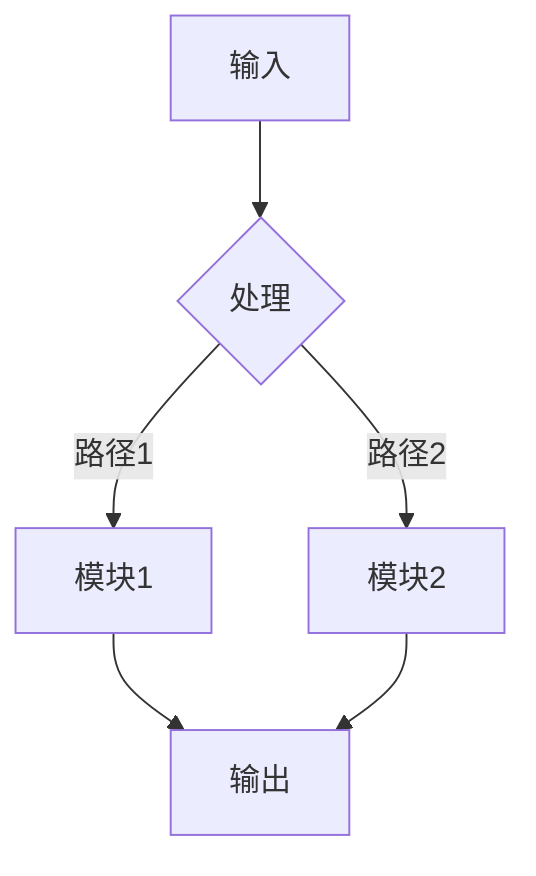

# {简短标题}_技术版

> 🔬 X光机式解构 | {日期} | {作者}

---

## 🔬 核心痛点

**一句话定义**：{这篇论文试图解决什么具体的、困难的问题？}

**前人困境**：{在它之前，为什么别人解决不了？}

---

## 💡 解题机制

### 核心直觉
{作者那个"灵光一闪"的想法（用最直白的语言）}

### 关键步骤

1. **神来之笔1**：{含 LaTeX 公式}
   $$\omega_{核心} = ...$$

2. **神来之笔2**：{含 LaTeX 公式}
   $$\text{关键机制} = ...$$

---

## 🚀 创新增量

### vs SOTA
{相比当前最佳，具体提升在哪？}

### 新拼图
{为人类知识库增加了哪块具体的新拼图？}

---

## ⚠️ 批判性边界

### 隐形假设
{作者在什么条件下才能成功？}

- [ ] 假设1：{具体描述}
- [ ] 假设2：{具体描述}

### 未解之谜
{论文没解决什么？带来了什么新问题？}

- [ ] 问题1：{具体描述}
- [ ] 问题2：{具体描述}

---

## 📐 餐巾纸公式

$$\text{核心公式} = ...$$

{一句话解释公式含义}

---

## 🔄 逻辑流程

---

## 📊 关键数据

| 指标 | 数值 | 对比 |
|------|------|------|
| A | **100** | vs 80 |
| B | **99.5%** | vs 98.2% |

---

## 🔍 技术细节

### 背景
{必要的上下文}

### 方法
{核心算法/模型}

### 结果
{实验结论}

---

## 📚 参考文献

{核心引用}

---

*Generated by paper-master | {时间戳}*
