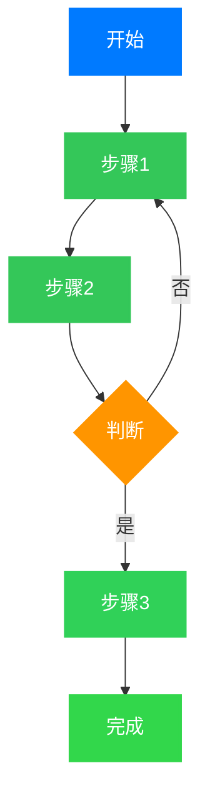
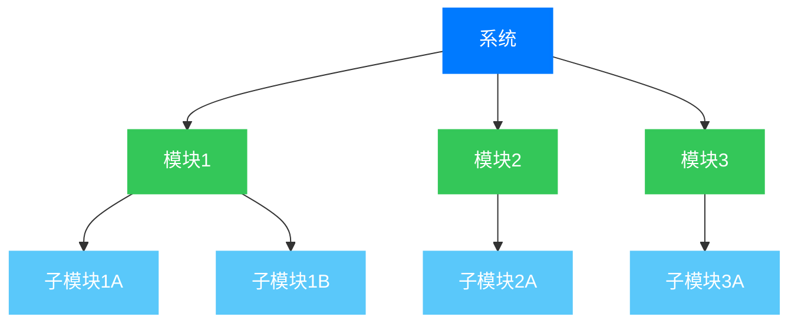
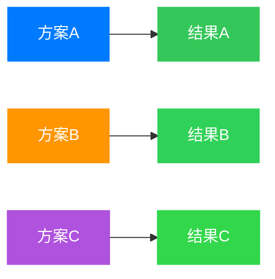
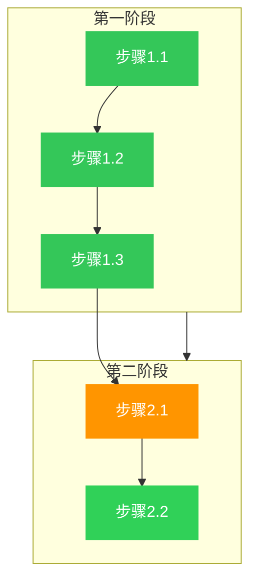
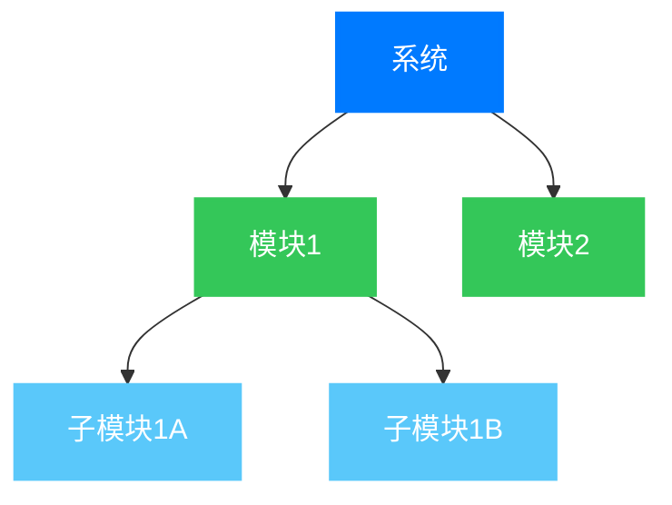

# Mermaid 图表规范 - 苹果风格配色

## 核心要求（必须遵守）

- ✅ **所有 mermaid 图必须使用苹果风格配色**
- ✅ **所有节点和连线文字必须为白色（`color:#ffffff`）以确保清晰可见**
- ✅ **边框宽度**：核心节点 3px，重要节点 2px，次要节点 1px
- ✅ **使用 subgraph 对相关元素进行分组**
- ✅ **为复杂图表添加图例说明**

## 苹果风格配色方案

### 蓝色系
- 主色：`#007AFF` - 苹果标准蓝，用于主要步骤、核心内容
- 辅色：`#5AC8FA` - 天蓝���，用于次要元素、支撑内容

### 绿色系
- 主色：`#34C759` - 苹果绿，用于成功、完成、结果、硬件、软件
- 次色：`#30D158` - 深绿色，用于实现阶段
- 强调：`#32D74B` - 亮绿色，用于最终成果

### 橙色系
- 主色：`#FF9500` - 苹果橙，用于警告、分析、评估
- 次色：`#FFCC00` - 金黄色，用于次级警告

### 红色系
- 主色：`#FF3B30` - 苹果红，用于风险、错误、关键问题、最高等级

### 紫色系
- 主色：`#AF52DE` - 苹果紫，用于复杂分析、中间步骤、支持过程

### 灰色系
- 主色：`#8E8E93` - 苹果灰，用于辅助信息、参考等级

## 节点样式规范

### 样式语法
```mermaid
style NodeID fill:[填充色],stroke:[边框色],stroke-width:[边框宽度],color:[文字颜色]
```

### 节点类型与样式

#### 核心节点（最重要）
```yaml
fill: #007AFF
stroke: #007AFF
stroke-width: 3px
color: #ffffff
```

#### 重要节点
```yaml
fill: #34C759
stroke: #34C759
stroke-width: 2px
color: #ffffff
```

#### 警告/分析节点
```yaml
fill: #FF9500
stroke: #FF9500
stroke-width: 2px
color: #ffffff
```

#### 风险/错误节点
```yaml
fill: #FF3B30
stroke: #FF3B30
stroke-width: 3px
color: #ffffff
```

#### 辅助/次要节点
```yaml
fill: #8E8E93
stroke: #8E8E93
stroke-width: 1px
color: #ffffff
```

#### 复杂过程节点
```yaml
fill: #AF52DE
stroke: #AF52DE
stroke-width: 2px
color: #ffffff
```

## 模板代码

### 流程图模板



### 系统架构图模板



### 对比图模板



### 使用 subgraph 的模板



## 适用场景

### 流程图
用于方法论步骤（FMEA、FTA、STPA、HARA、TARA等）

示例场景：
- ISO 26262 功能安全流程
- 风险分析步骤
- 算法执行流程

### 系统架构图
用于标准体系、系统分解

示例场景：
- ISO 26262 标准体系
- 软件架构分层
- 系统组件关系

### 对比图
用于方法或标准对比

示例场景：
- ASIL A-D 对比
- 不同开发方法对比
- 技术方案对比

### 风险分析图
用于 ASIL 等级、风险评估

示例场景：
- ASIL 确定矩阵
- 风险评估流程
- 安全目标分解

## 添加位置指南

### 方法论部分
在介绍分析方法时添加流程图

### 系统架构部分
在介绍标准或系统结构时添加架构图

### 对比分析部分
在进行方法或标准对比时添加对比图

### 风险分析部分
在讨论 ASIL 等级或风险矩阵时添加风险图

## ASCII 图转换规则

将所有 ASCII 风格的树状图转换为 mermaid 图：

**Before (ASCII)**：
```
系统
├─ 模块1
│  ├─ 子模块1A
│  └─ 子模块1B
└─ 模块2
```

**After (Mermaid)**：


## 复杂图表的图例

对于复杂的图表，在图表下方添加图例说明：

```mermaid
[图表代码]
```

**图例说明**：
- 🔵 蓝色节点：核心概念
- 🟢 绿色节点：实现步骤
- 🟠 橙色节点：分析评估
- 🔴 红色节点：风险警告
- 🟣 紫色节点：中间过程
- ⚪ 灰色节点：辅助信息

## 调试技巧

### 1. 验证文字颜色
确保所有节点的 `style` 中包含 `color:#ffffff`

### 2. 检查边框宽度
根据节点重要性选择合适的 `stroke-width`（1px/2px/3px）

### 3. 测试渲染
在支持 Mermaid 的 Markdown 编辑器中预览

### 4. 简化复杂图表
如果图表过于复杂，考虑拆分为多个相关联的图表
