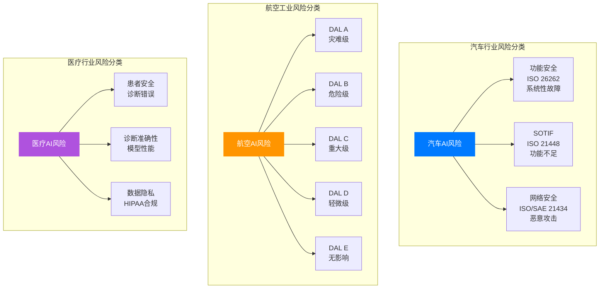
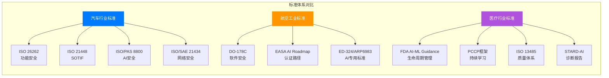

# AI驱动行业风险管理：汽车、航空、医疗行业的深度对比研究

## 引言

人工智能技术正在深刻改变汽车、航空和医疗三大高风险行业的运作模式。这三个行业有一个共同特点：系统失效可能导致人员伤亡、重大财产损失或严重社会后果。随着AI技术在感知、决策和控制领域的广泛应用，如何有效识别、评估和管理AI带来的新型风险，已成为行业监管机构、制造商和医疗机构共同面临的重大课题。

本文将从风险分类框架、标准体系、实践案例、管理方法和进展挑战五个维度，对汽车、航空、医疗三个行业的AI风险分析与风险管理进行系统性对比研究，旨在为读者提供全面的方法论解读和丰富的实践参考。

---

## 第一章 三大行业AI风险分类框架对比

### 1.1 汽车行业风险分类体系

汽车行业的AI风险分类建立在功能安全（Functional Safety）、预期功能安全（SOTIF）和网络安全（Cybersecurity）三大支柱之上，形成了独特的"三层防护"体系。

**功能安全风险**主要源于AI组件的系统性故障和随机硬件失效。根据ISO/PAS 8800:2024的定义，这类风险包括硬件随机失效影响AI推理、系统性设计缺陷导致ML架构异常，以及模型输出不足导致的车辆不安全行为。功能安全风险直接影响制动、转向等关键控制功能，可能导致车辆在安全关键情境下出现不可预测的行为，或未能正确检测和响应危险情况。

**SOTIF风险**是汽车行业特有的风险类别，指系统按设计执行但因功能不足而导致的危害。ISO 21448:2022详细阐述了这一概念，其核心在于系统功能正常但对现实场景的理解出现偏差。这类风险涵盖感知系统对复杂情境的理解不足、环境变化（如恶劣天气、光照变化）导致的鲁棒性不足、训练数据未覆盖的边缘情况，以及用户合理可预见的误用。SOTIF对于ADAS（1-2级）和紧急干预系统尤为重要，因为这些系统需要正确的态势感知才能确保安全。

**网络安全风险**涵盖恶意攻击和未授权访问带来的威胁。汽车AI系统面临的具体攻击向量包括对抗样本攻击（如通过恶意贴纸导致交通标志误识别）、道路标线篡改导致车道控制失效、目标检测 manipulation 故意分散注意力引发碰撞，以及供应链攻击在模型训练阶段植入恶意数据。2014年Jeep Cherokee被远程入侵的事件，以及后续Tesla和Lexus NX300的安全漏洞，都证明了网络安全风险的现实威胁。

### 1.2 航空工业风险分类体系

航空工业的风险分类基于设计保证等级（Design Assurance Levels, DALs），建立了从A到E的五级风险严重程度体系，体现了航空业对安全的极致追求。

**DAL A（灾难级）**指可能导致飞机损失或多人死亡的故障；**DAL B（危险级）**指大幅降低安全裕度、可能导致严重伤害的故障；**DAL C（重大级）**指显著降低安全裕度、可能造成伤害的故障；**DAL D（轻微级）**指轻微降低安全裕度、造成乘客不适的故障；**DAL E（无影响级）**指对飞机运行或安全无影响的故障。

航空AI风险的核心挑战在于**确定性缺失**。传统航空系统采用确定性设计，而ML模型本质上是概率性的。"学习型AI"（动态适应）与"学习型AI"（静态、离线训练）的区分进一步复杂化了这一问题。概率性行为使传统验证方法失效，ML模型行为由自动调整的参数（权重）定义，无法追溯到具体功能需求，违背了DO-178C的核心可追溯性目标。传统结构覆盖率指标（语句、决策、MC/DC）对于嵌入在权重数据数组而非代码逻辑中的行为不具代表性，神经网络几乎不可能达到所需的MC/DC覆盖率。

**可解释性/可理解性风险**是航空AI面临的另一重大挑战。深度学习模型作为"黑箱"运行，无法轻易探测其逻辑以了解何时可能产生不安全反应。监管机构要求理解AI决策的驱动因素，但当前技术难以满足这一要求。此外，训练数据的质量和代表性风险同样突出：训练数据可能未覆盖所有操作场景，偏差/方差权衡挑战依然存在，在安全关键系统中罕见但关键的边缘情况在训练中同样罕见。

### 1.3 医疗行业风险分类体系

医疗AI风险分类围绕患者安全、诊断准确性和数据隐私三大核心维度展开，体现了医疗行业以人为本的价值观。

**患者安全风险**是医疗AI最核心的风险类别。不准确的AI诊断可能导致错误治疗，延误病情，或在手术机器人等应用中直接造成身体伤害。AI系统的"幻觉"（hallucination）问题在医疗场景中尤其危险，模型可能生成看似合理但实际错误的医疗建议。Kyra Schneider等人的研究显示，AI系统在患者安全事件分类中可达90%的准确率，但仍存在10%的误差空间，这在医疗领域可能是致命的。

**诊断准确性风险**涉及AI系统在疾病检测和分类中的表现。根据2025年发表在Nature Medicine上的系统综述和荟萃分析，生成式AI与医师的诊断性能比较显示，AI在特定任务上已接近或达到专家水平，但在复杂病例和罕见疾病诊断上仍存在差距。PROBAST+AI工具的发布为评估AI预测模型的偏倚风险和适用性提供了标准化框架，强调了验证数据集独立性和临床适用性的重要性。

**数据隐私与安全风险**源于医疗数据的敏感性。HIPAA法规对健康信息的保护提出了严格要求，AI系统的训练和运行需要大量患者数据，如何在数据利用和隐私保护之间取得平衡是重大挑战。医疗AI还需应对数据poisoning攻击，即攻击者通过篡改训练数据来植入后门或降低模型性能。

### 1.4 三大行业风险分类对比分析

| 风险维度 | 汽车行业 | 航空工业 | 医疗行业 |
|---------|---------|---------|---------|
| **核心风险** | 功能安全、SOTIF、网络安全 | 设计保证等级（DAL）、认证合规 | 患者安全、诊断准确性、数据隐私 |
| **风险等级体系** | ASIL A-D | DAL A-E | 基于患者伤害程度分级 |
| **主要挑战** | 非确定性AI与确定性安全标准的矛盾 | 可追溯性缺失、黑箱问题 | 诊断错误后果严重、隐私保护 |
| **监管重点** | 车辆整体安全、公路使用者保护 | 适航性、机组/乘客生命保护 | 临床安全性、治疗效果 |
| **独特风险** | 边缘情况（长尾问题） | 学习型AI的持续适应 | 医疗决策的可解释性要求 |

三大行业的风险分类反映了各自的行业特性：汽车行业强调系统的预期功能安全和对复杂道路环境的适应；航空工业关注设计保证和适航认证的完整性；医疗行业则以患者安全和诊断准确性为核心关切。

---

## 第二章 标准体系与监管框架深度解析

### 2.1 汽车行业标准体系

汽车行业已建立起覆盖功能安全、预期功能安全、网络安全和AI安全的多层次标准体系，形成了较为完整的监管框架。

**ISO 26262**是汽车功能安全的基石标准，第3版预计将于2027年10月发布。该标准定义了ASIL A到D四个汽车安全完整性等级，通过HARA（危害分析与风险评估）确定风险等级，覆盖产品全生命周期。然而，ISO 26262假设确定性设计，AI/ML的非确定性本质对其构成根本挑战。2025年调查显示，49%的汽车开发者将安全视为首要关注点，AI算法的非确定性特性使合规变得更加复杂。

**ISO 21448:2022**专门针对SOTIF风险，填补了ISO 26262留下的空白。该标准适用于设计按预期执行但因功能不足导致危害的情况，特别关注感知堆栈的性能局限。对于依赖ML的感知系统，SOTIF提供了验证态势感知能力的框架，包括边缘情况和分布偏移的处理。ISO 21448对ADAS（1-5级）和紧急干预系统尤为重要，因为这些系统的正确态势感知是安全的前提。

**ISO/PAS 8800:2024**是汽车AI安全的里程碑式标准，作为首个直接将功能安全原则应用于汽车AI的规范，于2024年12月发布。该标准扩展了ISO 26262原则，专门针对AI元素，聚焦机器学习方法，定义了AI安全管理框架和生命周期，覆盖影响车辆安全的外AI元素的交互。标准帮助"构建关于消除不合理风险的安全保证论证"。

**ISO/TS 5083:2025**于2025年4月发布，为3级和4级ADS（自动驾驶系统）的卡车和客车提供安全实现和演示指导，涵盖安全设计、验证、验证和部署后安全。

**ISO/SAE 21434**于2021年发布，为汽车网络安全工程提供全生命周期框架。该标准要求进行威胁分析与风险评估（TARA），要求部署后进行漏洞管理和事件响应。UN R155法规与该标准对接，对OEM具有约束力。

**EU AI Act**于2024年8月1日生效，将分阶段实施至2027年。汽车AI系统被归类为"高风险AI系统"，适用于自动驾驶和ADAS技术，作为行业特定法规的补充而非替代。高风险系统需满足严格的文档要求、风险管理系统、严格测试验证、培训数据治理和部署后监控。

### 2.2 航空工业标准体系

航空工业的标准体系以DO-178C和DO-254为核心，正积极扩展以适应AI挑战，EASA和FAA的AI路线图为行业发展指明了方向。

**DO-178C（机载系统软件考虑）**是航空软件安全的金标准，但该标准在ML时代的适用性有限。DO-178C开发于ML复兴之前（2011/2012年定稿），尽管涵盖了基于模型的开发、面向对象技术和形式化方法等现代实践，但在可追溯性和覆盖率分析方面与ML系统存在根本性不兼容。研究显示，在DAL D（低关键性）级别，如果ML工作流定位为低级软件需求，所有目标均可实现；但在A-C级别（更高关键性），当前方法几乎不可能实现。

**EASA AI路线图**于2020年发布，2023年更新至2.0版本，提出了以人为中心的AI愿景。路线图时间表显示：2022-2025年为机组辅助阶段，2025年首个AI认证目标（飞行员辅助工具），2025-2030年人机协作，2030-2035年实现完全自主。路线图定义了三个AI级别：1级（人类增强/辅助）提供AI支持工具，2级（人-AI团队）允许AI在人类监督下做出决策，3级（高级自动化）达到更高自主性。核心概念包括超越传统软件保证的"学习保证"、建立信任所需的"AI可解释性"，以及覆盖需求到部署的"W形流程"。

**FAA AI安全保证路线图**于2024年6月发布，包含七项指导原则：在航空生态系统内工作、聚焦AI的安全和利用AI实现安全的双重方法、避免"拟人化"、区分学习型与学习型AI、渐进方法、利用安全连续体、使用行业共识标准。2025年9月发布的飞机自动化安全框架定义了四类自动化：辅助类（帮助飞行员）、监督类（需要飞行员监控）、替代类（可独立执行但有飞行员备用）、自主类（独立运行但有特定监控）。

**ED-324/ARP6983**（SAE G34/EUROCAE WG-114）是最新的AI专用标准，标题为"开发和认证/批准含AI航空产品的流程标准"，2025年8月完成第7版草案并公开征求意见，预计2025年第四季度至2026年第一季度发布。范围（问题1）限于非适应性ML的监督模式，限制在DAL C / AL 3 / SWAL 2级别，覆盖机载和ATM/ANS领域，明确排除信息安全和人因（未来版本处理）。核心概念是"机器学习组成要素"（MLC），即将ML模型和所需数据处理作为单一实体处理。

**NPA 2025-07**（EASA，2025年11月）提出AI可信度的详细规范和AMC与GM建议，旨在使"AI可信度"设置与EU AI Act保持一致，适用于高风险AI系统、1级（辅助）和2级（团队）AI，意见征集截止2026年2月10日。

### 2.3 医疗行业标准体系

医疗行业AI监管以FDA AI/ML指导原则为核心，EU MDR和EU AI Act为补充，ISO 13485提供质量管理体系支撑。

**FDA AI/ML指导原则**是医疗AI监管的核心。2025年1月发布的《AI启用设备软件功能：生命周期管理和营销提交建议》草案提供了AI医疗设备的全生命周期管理框架。2024年12月发布的《AI启用设备软件功能的预定变更控制计划营销提交建议》定稿指南（2025年8月发布）解决了ML医疗设备持续学习的监管挑战，允许制造商在初始批准时预先描述预期的模型更新类型，建立预定变更控制计划（PCCP），在保证安全有效性的同时实现技术迭代。

**FDA透明度原则**（2024年6月发布）为ML启用医疗设备的透明度提供指导，包括向用户披露的信息类型、设备如何做出决策的说明，以及训练数据和方法的关键方面。

**EU MDR（医疗器械法规）**和**IVDR**（体外诊断法规）对AI医疗设备提出严格的CE标志要求，涵盖临床评价、性能验证和上市后监督。

**EU AI Act**将医疗AI归类为高风险系统，适用严格监管。2024年发表在Health Policy的研究详细分析了EU AI Act对医疗的影响，强调了高风险AI系统的文档要求、风险管理系统、测试验证、数据治理和部署后监控义务。

**ISO 13485**为医疗设备（包括AI软件）提供质量管理体系要求，与IEC 62304（医疗设备软件生命周期流程）共同构成医疗AI开发的质量基础。

**STARD-AI**（2025年10月发布）是诊断准确性研究AI报告的共识声明，在原有STARD 2015基础上增加了AI特有考量，为AI诊断研究提供透明完整报告的最低标准。

### 2.4 三大行业标准体系对比

| 维度 | 汽车行业 | 航空工业 | 医疗行业 |
|-----|---------|---------|---------|
| **核心标准** | ISO 26262/21448/8800 | DO-178C/EASA AI Roadmap | FDA AI-ML Guidance/ISO 13485 |

| **AI专用标准** | ISO/PAS 8800:2024, ISO/TS 5083:2025 | ED-324/ARP6983, NPA 2025-07 | FDA PCCP指南, STARD-AI |
| **监管机构** | ISO, UN WP.29, 各国NCAP | FAA, EASA, 各国民航局 | FDA, EMA, 各國衛生主管機關 |
| **关键差异** | ASIL分级，EU AI Act补充 | DAL分级，严格适航认证 | 基于风险分级，持续学习监管 |
| **当前成熟度** | 较高，标准体系较完整 | 发展中，AI标准刚起步 | 中等，PCCP框架创新 |

三大行业的标准体系反映了不同的监管哲学：汽车行业采取"补充式"方法，EU AI Act作为行业特定法规的补充；航空工业采取"演进式"方法，在现有适航框架内逐步扩展；医疗行业则采取"创新式"方法，通过PCCP框架实现持续学习设备的监管平衡。

---

## 第三章 实践案例深度分析

### 3.1 汽车行业实践案例

**Waymo（4级自动驾驶）**建立了十二项安全就绪验收标准，采用基于证据的分析确定不合理风险的消除，结合定性和定量信号进行残余风险评估，构建覆盖硬件层、ADS行为层和运营层的整体安全案例。2025年发布的研究包括"机动摩托车手伤害风险的机械方法建模"、"从红绿灯到匝道：ADS评估的碰撞率基准"以及"评估安全案例：自下而上的Claims和证据评估指导"，体现了分层、动态和可信的安全视角。

**BMW（3级自动驾驶）**开发了全面的安全完整性框架，整合系统工程、工程风险分析和贝叶斯数据分析。关键方法包括跨硬件/软件故障、性能限制和规范不足的系统性风险最小化、危害场景中不确定性的识别和量化，以及用于残余风险估计的随机模拟和敏感性分析。该框架旨在为其首个SAE 3级系统提供安全保证。

**Mercedes-Benz AI集成**展示了AI在信息娱乐系统中的成熟应用。MBUX系统集成生成式AI，提供自然语言语音助手、ChatGPT/Bing集成（正在过渡到Google Cloud的Gemini via MB.OS）、基于驾驶员生物特征和情绪的主动辅助、自动调整车辆设置（环境照明、悬挂）、驾驶员偏好记忆以实现个性化体验。

**行业趋势**显示，2024年AI处理器市场规模为89亿美元（42%为ADAS，58%为信息娱乐），预计2030年达到198亿美元（ADAS以19%CAGR增长，信息娱乐以8%CAGR增长）。ADAS占据42%市场份额，平台融合趋势明显，驱动因素是中央处理器。

### 3.2 航空工业实践案例

**预测性维护**是AI在航空领域最成熟的应用方向。

美国空军B-1B轰炸机（C3 AI平台）使用基于传感器的算法（SBA）和虚拟传感器工具包，规模达75十亿行数据来自5000次出动。结果包括从数据提取到警报分析时间减少85%、警报准确率92%、11个故障模式29个模型监控1000多个组件、模型开发时间从数周缩短到数天。

**波音Insight Accelerator**使用AI从完整飞行数据（QAR/CPL）进行预测性维护，识别部件过早故障模式，避免飞机停场（AOG）事件。

**Airbus/Skywise Fleet Performance+**使easyJet在2024年两个月内避免了近80次航班取消，计划2025年扩展到A220和A350机型。

**Honeywell Ensemble**的EngineCompressorAI算法用于发动机健康预测，分析振动、温度、压力和燃油消耗，案例研究显示压气机喘振提前近10周被检测到。

**AI副驾驶测试**（斯坦福+美国空军试飞员学校，2026年1月）展示了AI在紧急情况下的辅助能力。该系统使用检索增强生成（RAG）技术，在iPad平台上运行，在斯坦福全动模拟器和爱德华兹空军基地的Learjet 25上进行空中测试，24名试飞员在有无AI情况下飞自定义场景。重点是帮助飞行员诊断问题、减少工作量、在紧急情况下更快响应。

**Merlin自主飞行员**（2025年5月）获得新西兰CAA颁发的实验适航证书，在Cessna 208B Grand Caravan上实现自主飞行，初步用于减少机组操作。

**Reliable Robotics + NASA**（2025年12月）获得NASA合同推进AI飞行测试，在自动Cessna 208B Caravan上模拟意外情况，研究区域机场运营，目标是收集支持大型无人驾驶飞机性能标准的数据。

### 3.3 医疗行业实践案例

**AI患者安全事件分类**展示了AI在医疗风险管理中的应用潜力。Kyra Schneider等人的研究评估了AI系统在患者安全事件分类中的准确性，与医院风险经理决策比较达到90%的准确率，涵盖核心安全支柱。这一应用可以简化流程、减少员工工作量，同时保持高准确性。

**生成式AI与医师诊断准确性比较**（2025年3月Nature Medicine系统综述）发现生成式AI在特定诊断任务上已达到或接近专家水平，但在复杂病例和罕见疾病诊断上仍有提升空间。研究强调了人机协作的重要性，AI最适合作为医师的辅助工具而非替代者。

**急诊室分诊AI预测**（2025年5月BMC Medical Informatics荟萃分析）显示AI在预测急诊室处置方面具有较高的诊断测试准确性，为急诊分诊决策提供支持。

**AI驱动运营效率提升**（2025年3月MDPI研究）发现海湾合作委员会地区的AI干预通过运营效率的中介作用提升患者安全，数字能力起调节作用。该研究强调AI不仅直接影响患者安全，还通过改善运营流程间接提升安全水平。

**PROBAST+AI工具**（2025年3月BMJ发布）为AI预测模型的偏倚风险和适用性评估提供标准化框架，是继PROBAST之后的重要更新，专门针对回归或AI方法的预测模型。

### 3.4 实践案例对比分析

| 应用领域 | 汽车行业 | 航空工业 | 医疗行业 |
|---------|---------|---------|---------|
| **最成熟应用** | ADAS/信息娱乐AI | 预测性维护 | 诊断辅助 |
| **领先企业** | Waymo, BMW, Mercedes-Benz | Boeing, Airbus, Honeywell | FDA批准AI医疗设备企业 |
| **部署状态** | 大规模量产/运营测试 | 有限运营/测试 | 逐步临床部署 |
| **主要挑战** | 边缘情况、长尾问题 | 高关键性认证 | 临床验证、持续学习 |
| **量化收益** | ADAS处理器市场198亿美元（2030） | 分析时间减少85%，警报准确率92% | 分类准确率90% |

三大行业的实践案例反映了AI应用的成熟度差异：汽车行业在ADAS和自动驾驶方面投入巨大但面临长尾挑战；航空工业在预测性维护方面取得显著成效，高关键性应用仍在测试阶段；医疗行业在诊断辅助方面稳步推进，强调临床验证和人机协作。

---

## 第四章 风险分析方法与管理实践对比

### 4.1 汽车行业风险分析方法

汽车行业已发展出系统化的AI风险分析方法，与NIST AI RMF和ISO/IEC 42001保持一致。

**六步风险评估流程**包括：识别和清点AI系统（找到每个模型，包括"影子项目"），按固有风险等级分类系统；映射利益相关者和影响区域（识别构建者、法律、最终用户，映射潜在影响）；威胁建模（识别来自有偏/不完整训练数据的威胁，评估对抗性提示和未审核组件的风险，评估信息泄露风险）；风险分析（AI全生命周期持续评估，概率验证，稳健测试数据集和压力测试）；缓解策略实施（多层控制，输出过滤和提示清理，关键系统冗余）；持续监控（跟踪安全态势进展，部署后性能评估，持续漏洞管理）。

**ML FMEA（失效模式与影响分析）**将ML最佳实践与PFMEA整合，系统识别、优先排序和缓解ML管道风险，提供ML FMEA模板供开发团队使用，促进与安全专家的沟通。

**AutoSecGPT**是AI驱动的威胁建模工具，与ISO/SAE 21434标准对齐，促进TARA（威胁分析与风险评估），根据ISO/SAE 21434和NIST SP 800-53识别安全控制。

**ACTISM框架**（后果驱动和威胁知情安全建模）动态更新网络安全态势，解决静态评估方法的局限，在Tesla EV车载信息娱乐系统上得到验证。

**生命周期管理最佳实践**涵盖设计阶段（早期集成安全，采用航空业实践如RTCA DO 178C，建立高管承诺的正式安全计划，使用FMEA、蝴蝶结建模等分析工具，透明的无责安全报告文化）、开发阶段（全生命周期综合质量管理，所有活动的可追溯性和可验证性，上游供应商对下游集成商的贡献，CAL 2+组件推荐动态模糊测试）、验证阶段（基于场景的测试，涵盖建模与仿真、受控轨道测试、开放道路测试，测试空间采样和测试用例组成，性能测量和指标生成，独立"地面真相"系统用于数据收集）、部署后阶段（持续验证和监控，网络安全漏洞管理（ISO 21434要求），事件响应协议，OTA更新安全评估，模型漂移检测和适应）。

### 4.2 航空工业风险分析方法

航空工业发展出适应AI特点的风险分析方法，强调渐进式认证和学习保证。

**EASA W形流程方法**是ML开发的专用流程，包括五步：需求定义（包括ML特定考量）、数据准备和质量保证、模型设计与训练、验证与确认、部署与监控。关键概念包括超越传统软件保证的"学习保证"，以及时间依赖性分析（对时间敏感系统的关键挑战）。

**FAA渐进式方法**包含三项核心原则。安全连续体原则：从最低风险应用开始，获得经验并建立信心，逐步推进到更高风险领域，每一步保持既定安全水平。基于用例的认证原则：特定功能焦点而非一般"AI"认证，验证行为和系统安全效果，不要求解释具体实现（例如神经网络），鼓励行业通过示例"教"监管者。双重方法原则：确保AI的安全，利用AI实现安全增强。

**风险基线安全保证关键实践**包括：学习型AI与学习型AI的差异化方法（学习型AI：离线训练，运行中确定性，传统基于性能的法规足够，行为验证可行但传统可追溯性打破；学习型AI：运行中适应，需要全新认证方法，需要持续监控和验证，更高风险，更严格部署限制）；需求可追溯性适应（将训练的ML模型作为低级软件需求处理，神经网络权重作为参数数据项，关注系统级功能正确性而非模型内部）；测试策略（基于场景的广泛测试，适用时的形式化方法，用于危险场景的模拟（斯坦福的"飞行员的噩梦"方法），最终验证的飞行中测试）。

**可解释性（XAI）要求**是认证的核心：建立用户和监管者信任，使人类对决策承担责任，支持认证过程，允许诊断意外行为。EASA定义：提供关于AI如何产生结果的易懂、可靠和相关信息的Capability。技术应用包括：NASA开发的EXPLAIND原型用于验证/验证，LRP（逐层相关性传播）显示哪些输入特征对决策有贡献，SHAP/LIME用于模型后验可解释性，RAG用于紧急情况的"高级Ctrl+F"。

### 4.3 医疗行业风险分析方法

医疗行业结合传统医疗器械监管框架和AI特有要求，发展出独特的风险分析方法。

**预定变更控制计划（PCCP）**是FDA为ML医疗设备创新的监管框架，允许制造商在初始批准时预先描述预期的模型更新类型，包括：预期变更的描述、变更无需额外监管提交的条件、确保变更后设备安全有效的流程、变更日志和评估的文档要求。PCCP的核心是在保证安全有效性的同时实现技术迭代，解决了传统医疗器械监管与AI持续学习特性的矛盾。

**透明度和可解释性原则**（FDA 2024年6月）要求ML医疗设备制造商向用户和监管者披露关键信息：设备如何做出决策的说明、训练数据和方法的关键方面、设备的已知限制和潜在偏倚。

**风险评估框架**整合了ISO 14971（医疗器械风险管理）的原则，应用于AI特有风险：患者安全风险（诊断错误、治疗建议不当）、网络安全风险（数据泄露、恶意篡改）、算法偏倚风险（对特定人群的诊断准确性差异）、持续学习风险（模型漂移、更新后性能变化）。

**临床验证要求**强调：独立验证数据集的使用、临床环境的真实世界测试、与现有标准的性能比较、持续的上市后性能监控。

**PROBAST+AI工具**为AI预测模型评估提供标准化框架，涵盖偏倚风险评估和适用性评估的关键领域。

### 4.4 三行业方法论深度对比

| 方法维度 | 汽车行业 | 航空工业 | 医疗行业 |
|---------|---------|---------|---------|
| **核心方法** | ML FMEA, AutoSecGPT, 六步流程 | W形流程, 渐进式方法, DAL分类 | PCCP, 透明度原则, PROBAST+AI |
| **关键差异** | 强调SOTIF和网络安全 | 强调学习保证和认证 | 强调临床验证和持续学习 |
| **验证方法** | 场景测试, 模拟, 开放道路 | 模拟, 飞行测试, 形式化方法 | 临床试验, 真实世界验证 |
| **持续监控** | OTA更新, 模型漂移检测 | 学习AI的持续监控 | 上市后监控, PCCP框架 |
| **可解释性** | 用户/审计员解释 | 监管者/飞行员理解 | 医师/患者理解 |
| **利益相关者** | OEM, 供应商, 监管者 | 飞机制造商, 航空公司, 监管者 | 制造商, 医疗机构, 监管者 |

三大行业的风险分析方法反映了不同的行业传统和监管哲学。汽车行业强调系统化和自动化的风险评估工具；航空工业坚持渐进式认证和学习保证的概念；医疗行业则通过PCCP框架实现持续学习与安全保证的平衡。

---

## 第五章 AI风险分析与风险管理进展与挑战

### 5.1 汽车行业进展与挑战

**技术进展**方面，2024-2025年见证了多项里程碑。统一生命周期框架的提出整合了ISO 26262、ISO 21448和ISO/PAS 8800，展示了概念、系统、组件和运营阶段的活动重叠。生成式AI用于测试，创建多样化和边缘情况的场景，更快、更安全地收集训练数据。基于推理的AI模型（如NVIDIA的视觉语言动作模型）具备人类般的逐步推理能力，应对罕见边缘情况。自动化威胁建模（AutoSecGPT）根据ISO/SAE 21434简化TARA。高级模糊测试技术使用自学习AI改进测试输入，CAL 2+组件的漏洞检测更全面。

**标准进展**包括ISO/PAS 8800:2024（首个直接应用功能安全原则于汽车AI的标准）、ISO/TS 5083:2025（3-4级ADS安全指导）、EU AI Act分阶段实施（2025年2月禁止某些AI系统，2027年8月高风险系统规则全面适用）。

**行业挑战**同样突出。长尾边缘情况问题仍是自动驾驶的主要障碍，传统AV架构难以处理罕见、复杂的驾驶场景，需要数百万英里的广泛测试。高开发成本是最大痛点，工业化产品、处理边缘情况、高验证/验证费用导致L4部署时间表自2023年以来推迟1-2年。规模化同时保持安全是重大挑战，运营扩展时防止重大故障，公众信任脆弱，监管者/公众对自主事故的容忍度低。供应链复杂性带来新风险，第三方GenAI模型引入"活风险"，存在模型采购盲点、训练数据中毒、代理治理差距，动态特性使传统审计困难。监管协调是持续挑战，区域法规碎片化，EU AI Act分阶段实施至2027年带来不确定性，行业特定法规与EU AI Act的重叠关系待澄清。

**2025年行业优先级**（汽车软件报告调查）显示：安全（49%开发者首要关注）、主要驱动力（42%专业人士认为AI推动自主车辆设计，41%认为AI影响联网车辆）、战略重点（代码质量、安全合规、安全合规、全球协作、竞争力）。

### 5.2 航空工业进展与挑战

**监管进展**是2025-2026年的主题。ED-324/ARP6983草案定稿（2025年8月），NPA 2025-07发布征求意见（2025年11月），首个针对AI可信度的监管提案出台。路线图发布（FAA AI安全保证路线图2024年6月，EASA AI路线图2.0 2023年5月，FAA飞机自动化安全框架2025年9月）。认证路径建立（D级可与现有DO-178C实现，基于用例的渐进方法明确，学习型与学习型AI区分正式化）。

**行业实施**在预测性维护方面取得显著成果：广泛部署于主要航空公司和OEM，量化收益（分析时间减少85%，警报准确率92%），扩展到更多机型（A220、A350 2025年）。决策支持工具方面：AI副驾驶与美国空军试飞员学校测试，冲突检测系统运营测试，跑道配置辅助（含可解释性）。自主系统方面：实验适航证书颁发（Merlin、Reliable Robotics），NASA合作伙伴关系进行飞行测试，聚焦减少机组操作。

**持续挑战**同样显著。高关键性认证方面，A-C级用当前方法仍极其困难，可追溯性和覆盖率问题未完全解决，安全关键飞行控制AI无清晰路径。可解释性与性能权衡方面，更复杂的模型（深度学习）性能更好但可解释性更差，更简单的模型更可解释但可能错过细微模式，安全关键应用需要权衡。数据挑战方面，run-to-failure数据稀缺（因此对生成式AI感兴趣），训练数据可能不代表所有操作场景，偏差/方差权衡难以管理，边缘情况在训练中罕见但在运营中关键。学习型AI认证方面，适应系统无既定方法，持续监控要求未完全定义，已认证模型更新程序不清晰，动态系统监管差距存在。

**时间表预测**：近期（2025-2026）ED-324/ARP6983发布，更多D级AI认证运营系统，扩展预测性维护实施；中期（2026-2030）1-2级AI指导定稿，首个2级（人-AI团队）认证，学习型AI认证方法发展；长期（2030-2035）3级（高级自动化）认证，首个A级/B级安全关键AI系统，自主商业航空运营。

### 5.3 医疗行业进展与挑战

**监管进展**方面，FDA PCCP指南（2024年12月发布，2025年8月定稿）解决了ML医疗设备持续学习的监管挑战。FDA生命周期管理草案（2025年1月）提供AI医疗设备全生命周期管理框架。STARD-AI发布（2025年10月）为AI诊断准确性研究提供报告标准。EU AI Act对高风险医疗AI系统提出严格要求，适用日期为2026年8月（治理和处罚）、2027年8月（高风险系统全面规则）。

**技术进展**体现在多个方向。生成式AI与医师诊断性能比较显示AI在特定任务上达到专家水平。AI患者安全事件分类达到90%准确率。急诊室分诊AI预测显示较高诊断测试准确性。PROBAST+AI工具提供标准化偏倚风险评估框架。

**临床实施挑战**包括：临床验证的复杂性（需要独立验证数据集、真实世界测试、与现有标准比较）；持续学习监管（ML医疗设备如何在保证安全有效性的同时实现技术迭代）；可解释性需求（医师和患者需要理解AI决策依据）；偏倚和公平性（确保AI对不同人群的诊断准确性一致）；数据隐私保护（HIPAA、GDPR等法规对训练数据的要求）；人机协作（AI作为医师辅助工具而非替代者的定位）。

**行业挑战**涵盖：监管协调（FDA、EU MDR、EU AI Act的多重监管要求）；临床整合（如何在现有临床工作流中有效嵌入AI工具）；报销和采纳（如何证明AI临床价值以获得报销和广泛采纳）；培训和信任（医师培训和建立对AI工具的信任）；长期性能监控（模型漂移和部署后性能下降的检测与应对）。

### 5.4 三大行业进展与挑战对比

| 维度 | 汽车行业 | 航空工业 | 医疗行业 |
|-----|---------|---------|---------|
| **当前成熟度** | ADAS量产, L4运营测试 | 预测性维护成熟, 高关键性测试 | 诊断辅助逐步部署 |
| **主要突破** | ISO/PAS 8800, 统一框架 | ED-324/ARP6983, EASA NPA | PCCP框架, STARD-AI |
| **最大挑战** | 长尾问题, 规模化安全 | 高关键性认证, 可解释性 | 临床验证, 持续学习 |
| **时间表** | 2025-2028关键期 | 2025-2035渐进路径 | 2025-2027合规窗口 |
| **共同挑战** | 可解释性, 持续监控, 监管协调 |

三大行业在AI风险管理方面都取得了实质性进展，但面临的挑战各有特点。汽车行业需要解决长尾问题和规模化安全；航空工业需要突破高关键性认证瓶颈；医疗行业需要平衡创新与严格的临床验证要求。

---

## 第六章 三行业异同点深度分析

### 6.1 风险分类的异同

**共同点**：三大行业都认识到AI带来的新型风险超出了传统工程风险的范畴，都建立了基于风险等级的分级体系（ASIL、DAL、风险分级），都将可解释性和透明度作为监管的核心要求，都面临AI非确定性与传统安全标准确定性假设之间的矛盾。

**差异点**：汽车行业强调SOTIF（预期功能安全）这一独特风险类别，关注系统按设计执行但功能不足的场景；航空工业基于飞行器安全的传统，建立了严格的DAL分级体系，将认证合规置于核心位置；医疗行业以患者安全和诊断准确性为核心，数据隐私保护占据重要地位。

### 6.2 标准体系的异同

**共同点**：三大行业都在积极发展AI专用标准，都采用基于风险的分级监管方法，都需要处理持续学习AI的监管挑战，都强调全生命周期管理而非一次性认证。

**差异点**：汽车行业建立了较为完整的AI安全标准体系（ISO/PAS 8800、ISO/TS 5083），并受EU AI Act补充监管；航空工业在现有适航框架（DO-178C）内渐进式扩展，EASA和FAA的AI路线图提供了清晰的发展方向；医疗行业通过PCCP框架实现持续学习设备的创新监管，FDA走在监管创新的前沿。

### 6.3 管理方法的异同

**共同点**：三大行业都采用基于场景的测试方法，都需要建立持续监控和验证机制，都认识到利益相关者沟通的重要性，都面临AI"黑箱"特性的挑战。

**差异点**：汽车行业强调自动化的风险评估工具（AutoSecGPT、ACTISM）和全供应链安全管理；航空工业坚持渐进式认证和学习保证的概念，强调飞行测试在验证中的核心作用；医疗行业注重临床验证和真实世界证据，强调人机协作的临床整合。

### 6.4 发展路径的异同

**共同点**：三大行业都采用渐进式发展策略，从低风险应用逐步扩展到高风险应用，都强调行业与监管的协作，都认识到人才和能力建设的关键作用。

**差异点**：汽车行业聚焦于ADAS和自动驾驶的商业化，同时应对EU AI Act的合规要求；航空工业以安全连续体为指导，从辅助系统逐步向自主系统演进；医疗行业优先解决诊断辅助的临床验证和持续学习监管框架。

---

## 第七章 结论与展望

### 7.1 核心发现总结

本文对汽车、航空、医疗三大高风险行业的AI风险分析与风险管理进行了系统性对比研究，得出以下核心发现：

**第一，三大行业面临共同的AI风险挑战**。AI的非确定性本质与传统的确定性安全标准之间存在根本矛盾；可解释性/透明度是监管和信任建立的核心要求；持续学习AI需要全新的监管方法论；边缘情况和长尾问题是最普遍的技术挑战；供应链安全和第三方组件管理日益重要。

**第二，三大行业形成了差异化的风险管理体系**。汽车行业建立了以ISO/PAS 8800为核心的AI安全标准体系；航空工业通过EASA W形流程和FAA渐进式方法适应AI特点；医疗行业通过PCCP框架实现持续学习与安全保证的平衡。

**第三，实践应用方面存在明显的成熟度差异**。航空预测性维护已广泛部署并产生量化收益；汽车ADAS已进入大规模量产阶段，L4自动驾驶仍在测试验证；医疗AI诊断辅助正在逐步临床部署，强调人机协作。

**第四，监管框架正在快速演进**。2024-2026年是三大行业AI监管的关键期，多项重要标准将发布实施；国际协调和标准统一是行业共同诉求；监管创新（如PCCP框架）正在为其他行业提供参考。

### 7.2 未来发展趋势

**技术趋势**方面，基于推理的AI模型（如VLA）将更好地处理边缘情况；生成式AI将更广泛地用于合成数据创建和测试；自动化风险评估工具将变得更加成熟和普及；持续学习和自适应系统的监管框架将逐步完善。

**监管趋势**方面，AI专用标准将从低风险应用扩展到高风险领域；国际监管协调将加强，减少碎片化；持续学习AI的监管将更加成熟；可解释性要求将更加明确和标准化。

**行业趋势**方面，人机协作将成为主流模式，AI作为辅助而非替代；跨行业最佳实践分享将增加；供应链安全和第三方组件管理将更加严格；安全和合规将成为AI部署的前提条件而非障碍。

### 7.3 实践建议

**对汽车行业**：建立统一的AI安全治理框架，整合ISO 26262、ISO 21448和ISO/PAS 8800；投资可解释性工具和持续监控能力；建立第三方AI组件的供应商评估机制；制定EU AI Act合规路线图。

**对航空工业**：积极采用ED-324/ARP6983等新兴标准；推进预测性维护等成熟应用的扩展；建立人机协作的测试和验证方法；参与国际监管协调。

**对医疗行业**：建立符合PCCP框架的持续学习管理体系；加强临床验证和真实世界证据收集；发展医师培训和临床整合能力；平衡创新与严格的患者安全要求。

### 7.4 结语

高风险行业的AI风险分析与风险管理正处于快速演进阶段。三大行业在保持各自特色的同时，正在形成共同的风险管理原则和最佳实践。随着技术的成熟和监管框架的完善，AI将在这些行业发挥越来越重要的作用，但前提是安全、可靠、可信地部署和应用。

未来十年将是AI在高风险行业实现规模化应用的关键期。成功的关键在于：坚持渐进式发展路径，从低风险应用逐步扩展；建立完善的监管框架，平衡创新与安全；发展可解释性和透明度，建立利益相关者信任；加强跨行业学习和最佳实践分享；培养具备AI和安全双重能力的人才队伍。

---

## 参考文献

1. ISO/PAS 8800:2024 - Road Vehicles - Safety and Artificial Intelligence
2. ISO 21448:2022 - Road Vehicles - Safety of the Intended Functionality
3. ISO/TS 5083:2025 - Safety for Automated Driving Systems
4. EU AI Act (Regulation (EU) 2024/1689)
5. EASA AI Roadmap 2.0 (2023)
6. FAA AI Safety Assurance Roadmap (2024)
7. ED-324/ARP6983 - Process Standard for Development and Certification/Approval of Aeronautical Products Implementing AI
8. FDA Predetermined Change Control Plan Guidance (2024)
9. FDA Artificial Intelligence-Enabled Device Software Functions: Lifecycle Management Draft Guidance (2025)
10. Waymo Safety Research Publications (2025)
11. Automotive Software Report 2025 (Perforce)
12. NASA EXPLAIND Project Documentation
13. STARD-AI Reporting Guideline (2025)
14. PROBAST+AI Tool (2025, BMJ)
15. U.S. Air Force B-1B Predictive Maintenance Case Study
16. Nature Medicine - Diagnostic Performance Comparison between Generative AI and Physicians (2025)
