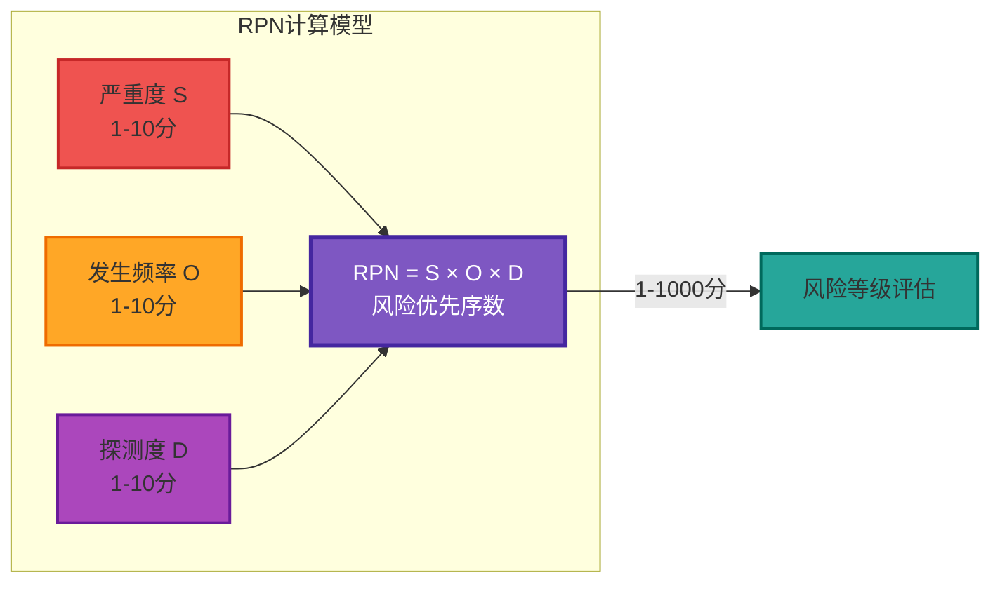
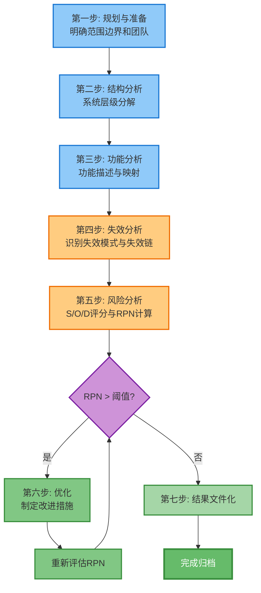
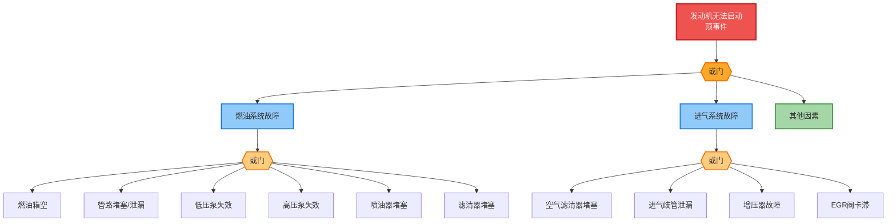
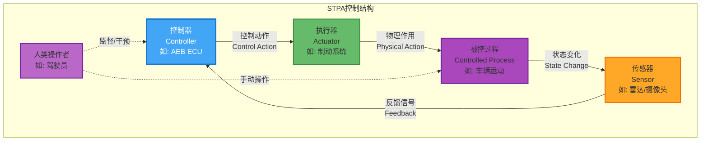
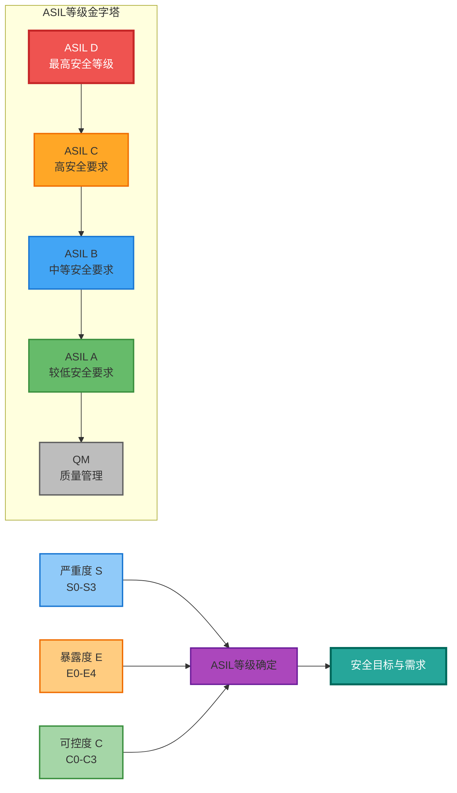
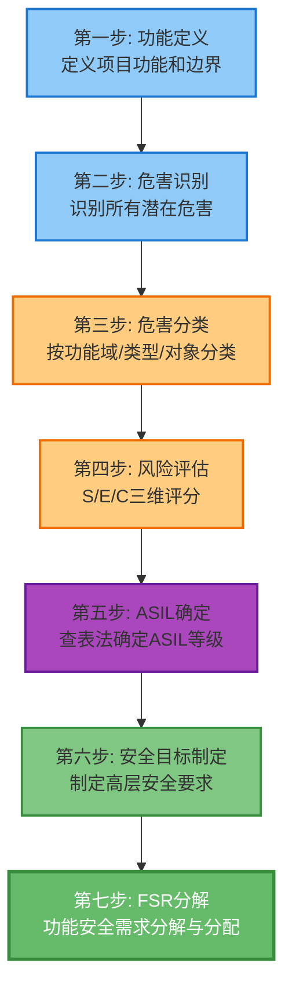
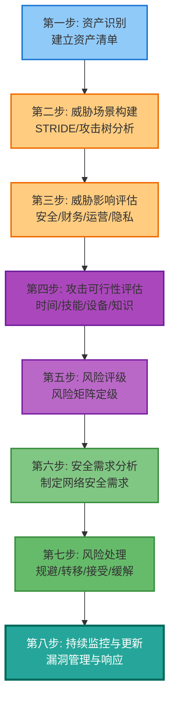
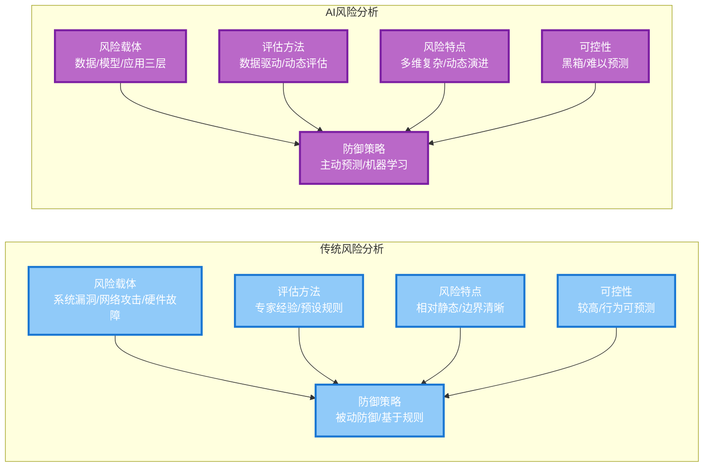

# 汽车领域风险分析综述：从传统方法到AI时代的演进与标准体系

## 一、引言

### 1.1 汽车行业风险分析的重要性

当我们回顾汽车工业的百年发展历程，一个不可忽视的事实是：汽车已经从单纯的机械交通工具演变为高度复杂的电子电气与软件系统集成的智能终端。这一深刻变革不仅重塑了汽车的驾驶体验，更从根本上改变了我们思考汽车安全的方式。

现代汽车的电子电气系统代码量已经突破亿行大关，一辆高端车型的ECU数量可达百余个，涵盖发动机控制、制动系统、转向系统、ADAS高级驾驶辅助系统、车联网通信等关键功能域。这种前所未有的系统复杂度，使得传统的机械可靠性设计方法论面临严峻挑战。据行业统计，电子电气系统故障已成为现代汽车召回的首要原因，其比例在过去十年间持续攀升。

汽车安全从被动安全（碰撞后的生存保护）发展到主动安全（预防事故发生），再到今天的功能安全与预期功能安全，要求我们在车辆设计阶段就必须系统性地识别、评估和控制潜在风险。这不再是"发现问题、解决问题"的迭代思维，而是"预见问题、预防问题"的系统工程思维。

从法规层面看，全球主要汽车市场正在经历从推荐性标准到强制性法规的转变。欧盟UNECE R155法规要求车辆制造商必须建立网络安全管理系统并获得CSMS认证才能进入市场；R156法规则针对软件更新提出了SUMS认证要求。在中国，工信部发布的《关于加强智能网联汽车生产企业及产品准入管理的意见》同样将功能安全和数据安全作为产品准入的必要条件。这种监管趋势意味着，风险分析不再仅仅是工程实践的优化，更是市场准入的门槛。

与此同时，人工智能技术正以前所未有的速度渗透汽车领域。从基于深度学习的感知算法，到端到端的自动驾驶大模型，再到大语言赋能的智能座舱，AI正在重新定义汽车的"大脑"。然而，AI系统的风险特征与传统电子电气系统存在本质差异：模型的不可解释性、数据的依赖性、对抗样本的脆弱性、环境分布偏移的不确定性，这些新风险载体需要全新的分析方法论。

本文旨在系统梳理汽车领域风险分析的方法论体系，从传统的FMEA、FTA到现代的STPA，从功能安全的HARA到网络安全的TARA，从定性分析到定量评估，从单机系统到车云协同。我们将深入剖析每种方法的原理、步骤与案例，对比传统与AI风险分析的差异，并详细解读国际与欧盟主流标准体系，为读者构建完整的汽车风险分析知识图谱。

### 1.2 文章结构概览

本文采用"方法论-对比-标准-展望"的四段式结构，系统性地介绍汽车领域风险分析的完整体系。

在方法论部分，我们将深入探讨五种核心风险分析方法：FMEA失效模式与影响分析作为预防性质量工具的典型代表；FTA故障树分析作为演绎推理的经典方法；STPA系统理论过程分析作为复杂系统安全的新范式；HARA危害分析与风险评估作为ISO 26262功能安全的核心步骤；TARA威胁分析与风险评估作为ISO/SAE 21434网络安全工程的基础。每种方法都将从背景历史、核心原理、操作步骤、案例实践四个维度进行详尽阐述。

在对比分析部分，我们将从风险载体、评估方法、风险特点、可控性、防御策略五个维度，系统对比传统风险分析与AI风险分析的异同，揭示AI时代风险分析面临的独特挑战与应对策略。

在标准解读部分，我们将梳理IEC 61508、ISO 26262、ISO 21448、ASPICE、ISO/SAE 21434、UNECE R155/R156等主流标准的技术要点、等效关系与实施路径，帮助读者在复杂的标准丛林中找到清晰的主线。

在总结展望部分，我们将回顾方法论的演进脉络，分析未来发展趋势，并为不同应用场景提供方法选择建议。

---

## 二、传统风险分析方法论

### 2.1 FMEA——失效模式与影响分析

#### 2.1.1 背景与历史

FMEA的故事始于20世纪60年代美国国家航空航天局（NASA）的阿波罗登月计划。在那个航天技术尚处于萌芽阶段的年代，太空探索的高风险性使得传统的"测试-发现问题-修改设计"的迭代模式代价过于高昂。工程师们需要一种能够在设计阶段就系统识别潜在失效模式的方法，这就是FMEA诞生的背景。

从NASA的军事航天领域起步，FMEA迅速扩展到核工业、化工、航空等高安全行业。1970年代，随着日本汽车工业的崛起，FMEA迎来了第二次发展高峰。丰田、日产等企业将FMEA与精益生产、质量圈等管理方法深度融合，形成了具有东方特色的持续改进文化。1980年代，FMEA被引入汽车行业，并在福特、通用、克莱斯勒等美国车企中得到广泛应用。

为了规范FMEA的实施方法，美国汽车工业行动小组（AIAG）与德国汽车工业协会（VDA）于2019年联合发布了AIAG-VDA FMEA标准，这是FMEA发展史上最重要的里程碑之一。该标准统一了美系与德系FMEA的术语、表格格式和评分方法，消除了跨国供应链中的沟通障碍。2024年，AIAG-VDA FMEA标准进行了新一轮更新，进一步强化了七步法结构、更强调了鲁棒性设计思想，并完善了对于自动驾驶等新兴技术的应用指南。

#### 2.1.2 核心原理

FMEA本质上是一种**预防性的可靠性分析工具**，其核心思想是：在产品或系统投入生产使用之前，系统性地识别所有可能的失效模式，分析每种失效模式对系统功能的影响，并按照风险优先级排序，指导改进措施的制定与实施。

FMEA的三维评估模型是其技术核心。这一模型通过三个维度的量化评分，计算出**风险优先序数**（Risk Priority Number，RPN），作为失效模式优先级排序的依据：

**严重度（Severity，S）** 评估失效模式一旦发生，对系统功能、用户安全或法规符合性的影响程度。评分范围通常为1-10分，其中1分表示无影响，10分表示可能导致严重伤害或死亡的致命影响。在汽车行业，S值大于等于8的失效模式通常需要重点关注。

**发生频率（Occurrence，O）** 评估失效模式实际发生的可能性。评分范围同样为1-10分，其中1分表示失效几乎不可能发生，10分表示失效几乎必然发生。O值的评估需要结合历史数据、类似系统经验以及设计特性分析。

**探测度（Detection，D）** 评估在产品出厂前或失效发生前，通过测试、检查等手段发现失效模式的能力。评分范围为1-10分，其中1分表示失效肯定能被检测到，10分表示失效无法被检测到。D值越高，说明现有的检测手段越不充分。

**RPN计算公式**：$RPN = S \times O \times D$



RPN的取值范围为1-1000分。RPN越高，表示该失效模式的风险越大，需要优先采取措施降低风险。需要特别强调的是，RPN仅用于优先级排序，三个维度的权重并非总是相等，在特定行业或应用场景下，组织可能需要根据自身经验调整评估标准。

FMEA可根据分析对象的不同，分为三种主要类型。**设计FMEA（DFMEA）** 针对产品设计阶段，分析设计缺陷导致的失效；**过程FMEA（PFMEA）** 针对制造和装配过程，分析工艺缺陷导致的失效；**系统FMEA** 针对整个系统层级，分析子系统之间接口和交互的潜在问题。

#### 2.1.3 操作步骤

FMEA的实施遵循结构化的七步法流程（AIAG-VDA 2019版标准将原有的五大步骤扩展为七步），每一步都有明确的目标和交付物要求。



**第一步：规划与准备。** 这一阶段的核心任务是明确分析的范围、边界和团队组成。范围定义需要回答"分析什么"和"不分析什么"这两个基本问题，通常通过系统边界图来表达。团队组成应涵盖设计、工艺、质量、制造等多学科专家，确保知识的全面覆盖。一个典型的FMEA团队包括：1名项目经理（负责协调和资源保障）、2-3名设计工程师（负责技术方案和设计决策）、1名工艺工程师（负责制造可行性分析）、1名测试工程师（负责检测能力评估）、1名质量工程师（负责标准和规范把控）。

**第二步：结构分析。** 结构分析的目的是将系统分解为可管理的分析单元，建立系统、子系统、组件的层级结构。在汽车行业，通常采用功能域划分的方法，将系统分解为动力域、底盘域、车身域、信息域等功能模块。每个模块进一步分解为子系统，最终分解到具体的电子元器件或机械零件。结构分析的结果以**结构树**或**方块图**的形式表达，清晰展示各层级之间的包含关系和接口关系。

**第三步：功能分析。** 功能分析将结构分解的结果转化为功能描述，建立结构与功能的对应关系。每个组件不仅要知道"是什么"，更要明确"做什么"和"为谁做"。功能描述应包含五个要素：主语（谁在做）、动词（做什么）、对象（对什么做）、条件（在什么条件下做）、结果（产出什么）。例如，对于汽车电子稳定控制系统的轮速传感器，功能描述为：在车辆行驶过程中（条件），轮速传感器（主语）实时测量（动词）车轮转速信号（对象），并将其转换为数字信号输出（结果），精度要求达到±1rpm（标准）。

**第四步：失效分析。** 失效分析是FMEA的核心环节，其目标是识别所有可能的失效模式及其失效链。失效模式是指组件偏离其设计意图的具体表现，常见的失效模式类型包括：功能丧失（如传感器完全不输出）、功能降级（如输出精度下降）、功能过度（如输出值偏高）、功能错误（如输出值偏差）、功能间歇（如时好时坏）、功能延迟（如响应时间超标）。每种失效模式需要追溯其**失效链**：失效模式 → 失效影响（对上一层级的影响） → 失效后果（对整车功能和用户的影响）。

**第五步：风险分析。** 在失效模式与失效链明确之后，需要对每个失效模式进行S、O、D三个维度的评分，计算RPN，并识别高风险失效模式。评分过程应遵循以下原则：基于客观数据而非主观臆断；参考历史经验和类似系统；团队讨论达成共识并记录分歧；评分要有充分的理由支撑。评分完成后，需要设置RPN阈值（如100分），高于阈值的失效模式必须制定改进措施。

**第六步：优化。** 优化的目标是降低高风险失效模式的RPN值，主要通过三种途径：降低S值（通过设计变更减少失效后果的严重程度）、降低O值（通过设计改进减少失效发生的可能性）、提高D值（通过增加检测手段提前发现失效）。每项改进措施需要明确责任人、完成期限和验证方法。措施实施后，需要重新评估RPN，验证改进效果。

**第七步：结果文件化。** FMEA是一项动态演进的文档，需要持续更新和迭代。结果文件化不仅包括FMEA表格本身的归档保存，还包括分析过程中的决策记录、改进措施跟踪、经验教训总结等。这些文档将成为后续项目的重要参考资料，也是功能安全审计和评估的重要证据。

#### 2.1.4 案例介绍：车规级MCU的DFMEA分析

为了更好地理解FMEA的实际应用，让我们以车规级微控制器（MCU）的设计FMEA为例进行详细说明。假设我们要为一款新能源汽车的动力域控制器设计MCU芯片，该MCU负责电机控制、电池管理、整车协调等关键功能。

**系统定义与分析边界：** 本次DFMEA的分析范围是MCU芯片本身及其关键外设接口，包括CPU内核、时钟系统、电源管理单元、存储器系统、通信接口（CAN、LIN、SPI）、模数转换器（ADC）等。不包括MCU外部的PCB设计、连接器选型等。

**结构分解与功能分析：** MCU的结构树顶层为"车规级MCU"，第二层分解为六个子系统：时钟系统（负责提供系统时钟）、电源系统（负责提供各级工作电压）、CPU内核（负责指令执行和运算处理）、存储系统（负责程序和数据存储）、通信系统（负责与外部ECU通信）、模拟外设（负责信号采集）。每个子系统进一步分解为具体的电路模块。

**失效模式识别：** 以时钟系统为例，其功能是为CPU和其他外设提供稳定、准确的时钟信号。可能的失效模式包括：时钟完全停止（振荡器停振）、时钟频率偏移（超出规定范围）、时钟抖动过大（相位噪声超标）、时钟信号丢失（输出管脚故障）。针对每种失效模式，需要分析其对上一层次（MCU整体）的影响：时钟停止将导致CPU内核停止工作，MCU完全丧失功能；频率偏移可能导致通信时序错误或ADC采样不准；抖动过大可能影响高速通信的可靠性。

**RPN计算示例：** 我们以"时钟停止"失效模式为例进行RPN评估。严重度S评估：时钟停止将导致MCU完全丧失功能，进而导致动力系统停止工作，车辆可能失去动力甚至在行驶中失控，考虑到车速可能达到100km/h以上，人员伤亡风险极高，因此S=10。发生度O评估：车规级晶振的失效率通常在10FIT（10^-9器件小时）量级，考虑到系统设计通常包含看门狗复位等安全机制，实际发生概率较低，因此O=3。探测度D评估：时钟信号可以通过功能监测电路检测，时钟停止会被MCU内部看门狗检测到并触发复位，同时外部ECG可以监测时钟信号，因此D=3。RPN = 10 × 3 × 3 = 90分。

**改进措施制定：** 针对RPN=90分的时钟停止失效模式，团队制定了以下改进措施。首先是设计改进：在时钟电路中增加冗余设计，配置双晶振备份，主晶振失效时自动切换到备用晶振。其次是监测增强：在软件中增加时钟健康监测任务，定期检查时钟频率和稳定性，异常时进入安全状态。最后是功能降级：设计时钟失效时的安全降级策略，限制动力输出，提示驾驶员尽快停车。实施改进措施后，重新评估RPN：由于冗余设计的引入，O值从3降低到1；D值从3降低到1；RPN降低到10 × 1 × 1 = 10分，风险得到有效控制。

#### 2.1.5 优缺点分析

FMEA作为汽车行业应用最广泛的风险分析方法，具有显著的优点。它提供了一种结构化、系统化的分析框架，使风险识别从经验驱动转向方法驱动。FMEA的适用范围极为广泛，从电子电气系统到机械系统，从硬件设计到软件架构，都可以应用FMEA进行分析。FMEA的输出（RPN排序）为资源优化配置提供了明确依据，使改进工作能够聚焦于高风险领域。此外，FMEA强调团队协作和多学科知识整合，有助于打破部门壁垒，促进知识共享。

然而，FMEA也存在明显的局限性。首先，FMEA高度依赖专家经验，评分过程存在主观性，不同团队对同一失效模式的评估可能存在较大差异。其次，FMEA是一种**静态分析方法**，难以有效处理系统组件之间的复杂交互和涌现行为。当系统复杂度超过一定程度时，失效模式的组合数量将呈指数级增长，FMEA的分析效率急剧下降。再次，FMEA聚焦于单点失效，对于共因失效（如电源故障导致多个传感器同时失效）和级联失效的分析能力有限。最后，FMEA难以有效分析软件密集型系统中的逻辑错误和算法缺陷。

### 2.2 FTA——故障树分析

#### 2.2.1 背景与历史

故障树分析（Fault Tree Analysis，FTA）的诞生可以追溯到1961年，当时美国贝尔电话实验室的H.A. Watson为美国空军开发民兵导弹发射控制系统时，首次提出了故障树的概念。民兵导弹是当时最先进的核武器运载工具，其可靠性要求极高，传统的测试方法无法满足需求。Watson创造性地提出了一种"自上而下"的演绎分析方法：从系统故障（顶事件）出发，层层追溯导致故障的原因，最终到达可直接观测的基本事件。这种方法不仅能够系统性地识别故障路径，还能够进行定量概率计算，为可靠性工程提供了强大的分析工具。

1960年代至1970年代是FTA发展的黄金时期。在航空航天领域，F-16战斗机、阿波罗飞船、航天飞机等重大项目都广泛采用FTA进行可靠性分析。在核工业领域，美国核管理委员会（NRC）将FTA作为核电站安全分析的标准方法。1970年代中期，FTA被引入汽车工业，主要应用于发动机、变速箱、制动系统等关键子系统的可靠性设计。进入21世纪后，随着汽车电子电气系统的爆发式增长，FTA在汽车领域的应用日益广泛，成为功能安全认证的重要分析工具。

#### 2.2.2 核心原理

FTA采用**自上而下的演绎推理方法**，从系统故障（顶事件）出发，逐层分解导致故障发生的原因，最终形成一棵倒置的逻辑树。树的顶端是**顶事件**（Top Event），即我们关注并希望预防的系统故障；树的中间节点是**中间事件**（Intermediate Event），是导致顶事件发生的直接原因或组合条件；树的底端是**基本事件**（Basic Event），是不能再分解的底层故障，可以直接观测或测量。

FTA的逻辑表达能力依赖于**逻辑门**的运用。最基本的三种逻辑门是：

**与门（AND Gate）**：当所有输入事件都发生时，输出事件才发生。数学表达式为：$E_{out} = E_1 \times E_2 \times \cdots \times E_n$。在故障树中，与门表示"同时满足"的条件。例如，"发动机无法启动"可能由"燃油系统故障"与"点火系统故障"共同导致，两个条件需要同时满足。

**或门（OR Gate）**：当任意一个输入事件发生时，输出事件就发生。数学表达式为：$E_{out} = E_1 + E_2 + \cdots + E_n - E_1 E_2 - \cdots$。在故障树中，或门表示"任一发生"的条件。例如，"制动失效"可能由"制动液泄漏"或"制动卡钳故障"或"制动助力器失效"任一原因导致。

**非门（NOT Gate）**：输出事件是输入事件的逻辑否定。数学表达式为：$E_{out} = \neg E_{in}$。非门在故障树中使用相对较少，通常用于表达特定条件的排除。

FTA分析包括**定性分析**和**定量分析**两种主要类型。定性分析的核心任务是识别**最小割集**（Minimal Cut Set），即能够导致顶事件发生的最小事件组合。割集是基本事件的一个集合，当集合中的所有事件同时发生时，顶事件必然发生。最小割集是指不包含冗余事件的割集，即去掉任何一个事件后，该集合就不再是割集。最小割集的数量直接反映了系统的脆弱程度，越多的最小割集意味着越多的故障路径需要关注。

定量分析的核心任务是计算顶事件的发生概率。给定基本事件的故障概率，通过逻辑门的概率计算规则，可以自下而上地计算出顶事件的概率。概率计算公式如下：对于与门，$P_{out} = \prod_{i=1}^{n} P_i$；对于或门，$P_{out} = 1 - \prod_{i=1}^{n} (1 - P_i)$。

#### 2.2.3 操作步骤

FTA的实施遵循系统化的八步流程，每一步都至关重要。

**第一步：系统定义与边界确定。** 在开始故障树构建之前，必须明确分析对象的范围和边界。这包括：定义顶事件（系统故障）的具体表现形式；确定系统的工作模式和环境条件；明确分析的深度要求（哪些事件需要进一步分解，哪些作为基本事件）；识别系统与外部环境的接口关系。边界定义的质量直接影响后续分析的准确性和效率。

**第二步：顶事件选择。** 顶事件是故障树分析的起点，通常选择那些后果严重、发生概率较高的系统故障。在汽车领域，常见的顶事件选择包括：车辆无法启动、制动失效、转向助力丧失、碰撞安全系统未触发等。顶事件的定义应尽可能具体、可测量、可验证，避免模糊的描述。

**第三步：构建故障树。** 这是FTA最核心的步骤，需要运用工程知识和逻辑推理能力，从顶事件出发，层层追溯其发生原因。构建过程中应遵循以下原则：从已知的系统功能和结构出发，确保逻辑正确性；优先使用历史故障数据和类似系统经验；保持故障树的简洁性，避免不必要的复杂化；使用标准的逻辑符号，确保表达清晰。

**第四步：识别基本事件。** 基本事件是故障树的叶子节点，代表不能再分解的底层故障。基本事件通常包括：元件的硬件故障（电阻开路、电容击穿、芯片失效）、人的操作失误、环境影响（温度、湿度、振动）、软件缺陷等。每个基本事件需要定义清晰的故障描述和可观测的特征。

**第五步：定性分析——最小割集识别。** 识别最小割集是定性分析的核心任务。常用的方法包括：**上行法**（从故障树底部向上逐层计算，使用逻辑表达式简化规则识别割集）和**下行法**（从顶事件向下逐层遍历，追踪所有可能导致顶事件的路径）。现代FTA软件通常提供自动化的最小割集计算功能。

**第六步：定量分析——概率计算。** 定量分析需要收集或估算各基本事件的故障概率数据。汽车行业常用的数据来源包括：IEC TR 62380可靠性数据手册、SN29500失效率预测标准、行业经验数据库（如OEM的 warranty data）。使用概率计算公式自下而上计算顶事件概率，并进行敏感性分析，识别对顶事件概率贡献最大的基本事件。

**第七步：结果评估与改进建议。** 基于定性分析和定量分析的结果，评估系统的可靠性水平，识别薄弱环节。评估内容包括：最小割集数量和结构是否合理、顶事件概率是否满足设计要求、哪些基本事件是主要风险来源。改进建议应针对关键割集提出，可能的改进方向包括：增加冗余设计降低单点失效风险、选用可靠性更高的元器件、增加监测和诊断功能提前发现故障、改进维护策略等。

**第八步：文档化与更新。** FTA是一项动态分析活动，需要随着设计的演进持续更新。文档化不仅包括故障树本身，还应包括：数据来源和假设条件、分析方法和计算过程、结果解释和改进建议、评审记录和变更历史。

#### 2.2.4 案例介绍：柴油发动机无法启动故障分析

让我们通过一个具体的汽车故障案例来说明FTA的实际应用。假设一辆配备高压共轨柴油发动机的商用车出现"发动机无法启动"的问题，我们需要通过FTA分析识别故障原因。

**顶事件定义：** "发动机无法启动"——在发动机冷启动状态下，起动机正常运转但发动机无法点火着车。

**第一层分解：** 导致发动机无法启动的直接原因可以分为三大类：**燃油系统故障**（无法建立正确的燃油供给）、**进气系统故障**（无法建立正确的空气供给）、**其他因素**（机械故障或电控系统故障）。使用或门连接，因为任一原因都可能导致顶事件。

**第二层分解——燃油系统：** 燃油系统故障进一步分解为：燃油箱无油或油量不足、燃油管路堵塞或泄漏、燃油泵故障（低压泵或高压泵）、喷油器故障（无法喷油或雾化不良）、燃油滤清器堵塞。使用或门连接，任一子故障都可能导致燃油系统故障。

**第二层分解——进气系统：** 进气系统故障分解为：空气滤清器严重堵塞、进气歧管泄漏或断裂、废气涡轮增压器故障（机械故障或泄压阀故障）、EGR阀卡滞在关闭位置。

**第三层分解——燃油泵故障：** 以高压燃油泵为例，进一步分解其故障原因。可能的故障模式包括：机械磨损（柱塞磨损导致压力不足）、驱动系统故障（齿轮断裂或链条跳齿）、电磁阀故障（控制信号异常导致泵油量不足）。

**最小割集识别：** 通过分��，故障树的最小割集包括：{燃油箱空}、{低压泵失效}、{高压泵失效}、{喷油器堵塞}、{空气滤清器堵塞}、{增压器机械故障}、{正时链条跳齿}等。每个最小割集代表一条独立的故障路径。



**定量概率分析：** 假设各基本事件的年失效率如下：低压泵失效0.1%、高压泵失效0.05%、喷油器堵塞0.02%、空气滤清器堵塞0.01%、增压器机械故障0.03%、正时链条跳齿0.01%。使用或门概率公式计算顶事件概率：$P_{top} = 1 - (1-0.001)(1-0.0005)(1-0.0002)(1-0.0001)(1-0.0003)(1-0.0001) ≈ 0.12\%$。即约千分之一的车辆在一年内可能出现发动机无法启动故障。

**改进建议：** 基于FTA分析结果，提出的改进措施包括：在高压油泵入口增加燃油品质传感器，提前检测污染；优化高压油泵的润滑和冷却设计，提高耐久性；增加进气阻力监测传感器，在空气滤清器堵塞初期发出预警；在售后服务中增加燃油系统冲洗维护项目。

#### 2.2.5 FTA与FMEA的关系

FTA和FMEA是两种互补的风险分析方法，它们从不同的角度分析系统的可靠性问题。FMEA采用**自下而上**的方法，从组件出发，分析组件失效可能导致的上层影响；FTA采用**自上而下**的方法，从系统故障出发，追溯导致故障的下层原因。在实践中，两种方法通常配合使用：FMEA帮助识别完整的失效模式清单，FTA帮助理解故障传播路径和组合效应。ISO 26262功能安全标准明确要求在ASIL B及以上等级的安全目标分解中同时使用FMEA和FTA两种方法，以确保分析的完整性。

### 2.3 STPA——系统理论过程分析

#### 2.3.1 背景与历史

系统理论过程分析（System Theoretic Process Analysis，STPA）是由麻省理工学院（MIT）Nancy Leveson教授于2004年前后提出的一种新型系统安全分析方法。Leveson教授是系统安全领域的知名学者，她在深入研究了大量航空、航天、化工等领域的事故案例后发现，传统的FMEA和FTA方法存在根本性的局限——它们假设事故是由组件故障导致的线性因果链，而在现代复杂系统中，事故往往源于系统约束的缺失和组件之间的不安全交互。

STPA的理论基础是**STAMP事故模型**（System-Theoretic Accident Model and Processes）。STAMP模型将系统视为由组件构成的控制结构（Control Structure），事故发生的原因不是组件故障本身，而是组件之间控制信号传递的偏差。Leveson教授通过对挑战者号航天飞机失事、博帕尔毒气泄漏、泰坦尼克号沉没等经典案例的STAMP分析，展示了该模型在解释复杂系统事故方面的强大能力。

2011年，Leveson教授出版了《Engineering a Safer World》一书，系统阐述了STPA的理论基础、实施方法和应用案例，标志着STPA方法论的成熟。此后十年，STPA在航空、核电、医疗器械、汽车自动驾驶等领域得到广泛应用。在汽车领域，随着ADAS和自动驾驶技术的发展，STPA正逐渐成为功能安全分析的重要补充方法。

#### 2.3.2 核心原理

STPA的革命性突破在于它从根本上改变了安全分析的思维范式。传统的FMEA/FTA基于**还原论思想**，认为系统可以分解为独立的组件，事故是组件故障导致的线性因果链。这种假设在简单的机械系统中是合理的，但在软件密集型、人机交互复杂、反馈回路众多的现代系统中往往不成立。

STPA基于**系统论思想**，将安全视为系统的一种**涌现属性**，不是组件属性的简单叠加。系统之所以安全，是因为存在有效的**安全约束**（Safety Constraints）来防止系统进入危险状态。安全的本质不是"组件不失效"，而是"约束被遵守"。

STPA引入了一个关键概念：**不安全控制行为**（Unsafe Control Action，UCA）。UCA是指控制行为在特定情境下可能导致事故的情形。控制行为由四个要素定义：**控制动作**（Controller向被控对象发出的信号）、**控制输入**（Controller接收的反馈信号）、**控制模式**（系统当前的工作模式）、**控制算法**（Controller根据输入计算输出的逻辑）。UCA可以发生在四种情况下：控制动作应该发出但没有发出（Omission）、控制动作不应该发出但发出（Commission）、控制动作发出但时机错误（Timing wrong）、控制动作发出但强度或方向错误（Wrong value）。

STPA与传统方法的关键差异体现在多个维度。思维模式上，FMEA/FTA关注线性因果链，STPA关注系统性控制问题。分析起点上，FMEA/FTA从组件失效出发，STPA从系统约束缺失出发。适用范围上，FMEA/FTA更适合传统的硬件系统，STPA更适合软件密集型、人机交互复杂的现代系统。风险定义上，FMEA/FTA将风险定义为失效的后果、概率和可探测性的乘积，STPA将风险定义为约束缺失导致的控制偏差。

#### 2.3.3 操作步骤

STPA的实施分为七个步骤，每一步都围绕"控制结构"这一核心概念展开。

**第一步：系统定义。** 这一步骤的目标是建立对被分析系统的共同理解。需要明确的要素包括：系统的目的和功能、系统边界（与外部环境的接口）、系统的工作模式（正常、降级、紧急等）、系统的物理架构和功能架构。与FMEA/FTA的系统定义相比，STPA更强调**控制结构**的识别，即系统中的控制回路和信息流向。

**第二步：识别损失。** STPA的分析起点是**损失**（Loss），而不是组件故障。损失包括四类：人员伤亡（生命、健康）、财产损失（车辆、设施）、环境损失（污染、生态破坏）、业务损失（服务中断、声誉受损）。这一步骤需要建立完整的损失场景清单，作为后续危害分析的起点。

**第三步：识别危害。** 在损失的基础上，STPA识别可能导致损失的**危害**（Hazard）。危害是系统状态或条件，当危害发生时，如果缺乏有效的控制或保护，将导致损失。危害的表述应遵循"系统状态 + 可能导致的后果"的格式，例如："自适应巡航控制系统在高速行驶时错误识别前车距离，可能导致非预期减速"。危害与损失的区别在于：损失是最终结果，危害是可能导致损失的中间状态。

**第四步：构建控制结构。** 这是STPA最具特色的步骤。控制结构是系统中**控制回路**的图形化表达，描述了控制器、被控对象、传感器、反馈路径之间的信息流向。构建控制结构时，需要识别：系统中有哪些控制器（人工或自动）、每个控制器控制什么、被控对象如何反馈状态给控制器、控制回路中的时间延迟和信息处理逻辑。对于汽车电子电气系统，一个典型的控制结构包括：感知层（传感器）、决策层（控制器/ECU）、执行层（执行器）、以及人机交互层（驾驶员）。

**第五步：识别不安全控制行为（UCA）。** 基于控制结构，逐个分析每个控制行为在不同系统状态下��否可能成为UCA。



分析框架基于四个问题：控制动作是否应该在某种情境下发出但没有发出？控制动作是否不应该在某种情境下发出但却发出？控制动作是否在错误的时机发出？控制动作的强度、方向或其他参数是否错误？对于每个控制器，需要考虑其在不同工作模式、不同输入条件下可能产生的所有UCA。

**第六步：识别安全约束。** 针对每个UCA，STPA导出**安全约束**（Safety Constraint），即防止UCA发生或减轻其后果的要求。安全约束的表述应遵循"不应该 + UCA"或"应该 + 相反行为"的格式。例如，针对UCA"ACC系统在前车距离正常时发出制动指令"，导出的安全约束是："ACC系统不应在 前车距离大于安全阈值 时发出制动指令"。

**第七步：制定控制措施。** 针对每条安全约束，制定具体的控制措施。控制措施分为四类：**预防措施**（防止UCA发生，如增加传感器冗余、改进算法）、**检测措施**（及时发现偏差，如运行时监测、信号校验）、**恢复措施**（UCA发生后减轻后果，如系统降级、驾驶员接管）、**告警措施**（提醒驾驶员注意潜在风险）。这一步骤的输出将直接指导后续的安全设计和验证工作。

#### 2.3.4 案例介绍：AEB自动紧急制动系统STPA分析

自动紧急制动系统（Autonomous Emergency Braking，AEB）是现代汽车ADAS的核心安全功能之一。下面通过一个简化的案例说明STPA在AEB系统分析中的应用。

**系统定义：** AEB系统通过雷达或摄像头检测前方障碍物，在驾驶员未采取制动措施时自动触发制动，避免或减轻碰撞。系统组成包括：前方感知模块（雷达/摄像头）、AEB控制器（算法处理）、制动执行模块（ESC/真空助力器）、驾驶员监测模块。

**控制结构：** AEB系统的控制结构包含三个主要控制回路：感知回路（雷达→AEB控制器→制动器）、决策回路（AEB控制器判断是否触发制动）、驾驶员接管回路（驾驶员踩油门/转向可中断AEB）。

**危害识别：** 基于AEB系统的功能，可能的危害包括：误制动（AEB在不应制动时制动）、漏制动（AEB应在制动时未制动）、制动过晚（制动触发时机过晚导致碰撞）、制动过猛（制动力度过大导致后车追尾）。

**UCA识别：** 以AEB控制器向制动器发出的"制动请求"控制动作为例，识别的UCA包括：制动请求在前方无障碍物时发出（误制动）；制动请求在前方有障碍物但驾驶员已制动时发出（冗余制动，可接受）；制动请求在前方有障碍物但距离尚远时发出（过早制动）；制动请求在碰撞不可避免但驾驶员未制动时未发出（漏制动）；制动请求的制动力度过小（制动力不足）。

**安全约束导出：** 针对上述UCA，导出的安全约束包括：只有当感知系统确认前方存在障碍物且碰撞时间（TTC）小于阈值时，才能发出制动请求；当驾驶员主动踩油门或转向时，应抑制AEB制动请求；制动请求的制动力度应根据TTC和相对速度动态计算；当AEB系统故障时，应向驾驶员发出清晰警告，并降级到基本功能。

#### 2.3.5 优势与挑战

STPA相比传统FMEA/FTA方法具有显著优势。STPA能够有效分析复杂系统中的**交互失效**，这是传统方法的盲区。STPA将软件算法和控制逻辑纳入分析范围，适合现代汽车软件密集型系统的特点。STPA的分析结果直接导出安全需求和约束，为后续设计提供明确指导。STPA强调从系统层面思考安全，有助于发现更深层次的设计缺陷。

然而，STPA的实施也面临挑战。STPA的学习曲线相对陡峭，需要分析师具备系统思维和工程经验。STPA的分析过程会产生大量的UCA和安全约束，文档管理工作量较大。对于缺乏STPA经验的团队，如何保证分析的系统性和完整性是一个挑战。此外，STPA与其他功能安全方法的衔接（如ISO 26262的ASIL分解）仍在探索中。

### 2.4 HARA——危害分析与风险评估

#### 2.4.1 背景与历史

危害分析与风险评估（Hazard Analysis and Risk Assessment，HARA）是ISO 26262功能安全标准定义的核心分析方法，是汽车功能安全开发流程的起点和基础。HARA的渊源可以追溯到IEC 61508功能安全基础标准中的**初步危害分析**（Preliminary Hazard Analysis，PHA），但HARA针对汽车行业的特殊性进行了专门定制。

ISO 26262标准于2011年首次发布，2018年发布第二版（ISO 26262:2018）。作为汽车功能安全的"黄金标准"，ISO 26262已被全球主要汽车制造商和供应商广泛采纳，成为产品功能安全认证的事实依据。HARA作为ISO 26262-3（概念阶段）的核心内容，规定了从功能定义到安全目标制定的全流程方法。

HARA在功能安全开发流程中的地位至关重要。它是连接**功能需求**与**安全需求**的桥梁：通过系统性地识别危害事件、评估风险等级、确定ASIL等级，HARA为后续的安全目标制定和安全需求分配提供了量化的依据。可以说，HARA的质量直接决定了整个功能安全项目的有效性。

#### 2.4.2 核心原理

HARA的核心任务是识别**危害事件**（Hazard Event）并确定其**ASIL等级**（Automotive Safety Integrity Level）。危害事件是**危害**（Hazard）与**车辆运行场景**（Operating Scenario）的组合。仅有危害（如"车辆意外加速"）不足以定义风险，必须结合特定的运行场景（如"车辆在高速公路上以120km/h行驶"），才能评估风险的严重程度。

HARA采用**三维风险评估模型**，通过三个维度量化评估每种危害事件的风险等级：

**严重度（Severity，S）**：评估危害事件一旦发生，可能造成的人员伤害程度。S分为四个等级：S0表示无伤害；S1表示轻伤（不需要医疗干预）；S2表示重伤（需要医疗干预，可能住院）；S3表示致命或危及生命的重伤（可能导致死亡或严重永久性伤害）。

**暴露度（Exposure，E）**：评估车辆处于特定运行场景的概率。E分为五个等级：E0表示极低概率（几乎不可能）；E1表示低概率（不太可能发生）；E2表示中等概率（可能在某些场景下发生）；E3表示高概率（很可能发生）；E4表示极高概率（几乎总是处于该场景）。

**可控度（Controllability，C）**：评估驾驶员或其他道路交通参与者避免伤害的能力。C分为四个等级：C0表示完全可控（正常驾驶员能够轻松控制）；C1表示简单可控（大多数驾驶员能够控制）；C2表示正常可控（经过警告或培训后能够控制）；C3表示难以控制或不可控（即使驾驶员采取行动也无法避免伤害）。

基于S、E、C三个维度，HARA通过查表法确定ASIL等级。ASIL分为五个等级：QM（质量管理）、ASIL A（最低安全等级）、ASIL B、ASIL C、ASIL D（最高安全等级）。QM表示该危害事件的风险可以通过正常的质量管理流程控制，不需要额外的功能安全措施；ASIL A-D则表示需要按照相应等级的安全措施进行开发。

#### 2.4.3 ASIL等级确定

ISO 26262:2018标准定义了完整的ASIL等级确定矩阵。以下是标准中部分关键组合的ASIL对应关系：

| 严重度 \ 暴露度 \ 可控度 | C1（简单可控） | C2（正常可控） | C3（难以控制） |
|--------------------------|----------------|----------------|----------------|
| S1 + E4                  | QM             | QM             | A              |
| S2 + E3                  | QM             | A              | B              |
| S2 + E4                  | A              | B              | B              |
| S3 + E2                  | QM             | A              | B              |
| S3 + E3                  | A              | B              | C              |
| S3 + E4                  | B              | C              | D              |



从上表可以看出：危害的严重程度越高、暴露概率越高、可控性越低，所需的ASIL等级就越高。ASIL D是最高安全等级，适用于可能导致生命威胁且暴露概率和可控度都较高的危害事件，如制动系统失效、转向系统失效等。ASIL A是最低的安全等级要求，通常适用于可能导致轻微伤害且可控性较高的危害事件。

需要特别说明的是，ASIL等级的确定不仅取决于三个维度的评分，还与产品定位、法规要求、客户期望等因素相关。在实际项目中，团队可能需要在合规性与成本之间进行权衡，选择合适的ASIL目标。

#### 2.4.4 操作步骤

HARA的实施遵循七步流程，与ISO 26262概念阶段的工作产品相对应。



**第一步：功能定义。** HARA的起点是对被分析项目的**功能**进行清晰、完整的定义。功能定义应包括：项目的主要功能和辅助功能、项目的正常运行条件和边界条件、项目的接口（与驾驶员、与其他系统、与环境的交互）。功能定义应足够详细，以便后续识别危害场景，但不需要深入到具体的设计实现。

**第二步：危害识别。** 危害识别的目标是系统性地识别项目中所有可能导致伤害的危害。常用的危害识别方法包括：**头脑风暴**（组织跨学科团队进行创意发散）、**HAZOP**（危害与可操作性分析，使用引导词如"无"、"多"、"少"、"早"、"晚"等进行系统化发散）、**FTA/FMEA分析**（借鉴传统可靠性分析的结果）、**历史事故分析**（参考行业召回数据和事故报告）。危害识别的输出是**危害清单**，记录每种危害的描述、潜在后果、相关场景。

**第三步：危害分类。** 对识别的危害进行分类，便于后续分析和跟踪。常见的分类维度包括：按功能域分类（动力系统、制动系统、转向系统等）、按危害类型分类（功能丧失、功能降级、功能过度、功能错误）、按影响对象分类（驾驶员、乘客、行人、其他道路交通参与者）。

**第四步：风险评估（S/E/C评分）。** 对每种危害事件进行S、E、C三个维度的评分。评分过程应遵循以下原则：基于客观证据而非主观臆断，参考行业数据、历史经验、类似项目；团队协商达成共识，记录不同意见；评分应考虑最坏情况，即假设所有不利条件同时发生；评分应有明确的理由支撑，便于后续评审和追溯。

**第五步：ASIL确定。** 根据S、E、C评分，通过查表法确定每种危害事件的ASIL等级。对于S0、E0、C0的组合，风险为零，不需要进一步的安全措施。对于QM等级的项目，通过正常的质量管理流程控制即可。对于ASIL A-D等级的项目，需要制定相应的安全目标。

**第六步：安全目标制定。** 安全目标（Safety Goal，SG）是从危害事件导出的高层安全要求，是后续安全设计的输入。每条安全目标应满足以下要求：可验证（可以通过测试或分析验证）、可追溯（可以追溯到具体的危害事件）、完整（覆盖所有已识别的危害事件）。安全目标的表述通常采用"应"或"必须"的命令式语言，如"车辆不应在驾驶员未主动请求时产生非预期的纵向加速度"。

**第七步：功能安全需求分解。** 对于高ASIL等级的安全目标（如ASIL D），可能需要进行**ASIL分解**，将安全需求分配到冗余的安全要素上。分解规则为：ASIL D = ASIL C(D) + ASIL A(D)，即两个独立的ASIL C和ASIL A需求可以共同满足ASIL D的要求。分解的前提是分解后的要素之间满足**独立安全要素**（Dependent Failure）的条件。

#### 2.4.5 案例介绍：自适应巡航控制ACC系统的HARA分析

自适应巡航控制（Adaptive Cruise Control，ACC）是广泛应用于量产车型的高级驾驶辅助功能。让我们通过一个简化的案例说明HARA的实施过程。

**功能定义：** ACC系统是一种纵向控制功能，在驾驶员设定的速度范围内，自动调节车辆速度以保持与前车的安全距离。系统主要功能包括：速度设定与调节、跟车距离控制、前车识别与跟踪、弯道减速、紧急情况下的预警和制动请求。

**危害识别：** 通过HAZOP方法识别的ACC系统主要危害包括：非预期的纵向加速、非预期的纵向减速或制动、跟车距离过小、跟车距离过大无法跟车、速度设定超出合理范围。

**危害事件与风险评估：** 以"ACC非预期加速"为例进行详细分析。该危害与车辆运行场景"高速公路行驶"组合形成危害事件。

- 严重度S评估：非预期加速可能导致高速行驶时与其他车辆发生追尾碰撞，S3（致命伤害）。
- 暴露度E评估：ACC功能主要在高速公路使用，高速公路行驶在用户总行驶里程中的占比约为10-15%，E3（高概率）。
- 可控度C评估：驾驶员可以通过踩刹车、转向、关闭ACC等方式终止非预期加速，C2（正常可控）。

查表得：S3 + E3 + C2 = ASIL B。

**安全目标制定：** 针对"ACC非预期加速"危害事件，制定的安全目标为：ACC系统应防止在驾驶员未请求的情况下产生非预期的纵向加速度（ASIL B）。分解为更具体的功能安全需求：ACC控制器应监测输出请求与实际执行之间的一致性（ASIL B@H）；系统应具备安全状态，当检测到不一致时禁用ACC功能并警告驾驶员（ASIL B@H）。

### 2.5 TARA——威胁分析与风险评估

#### 2.5.1 背景与历史

威胁分析与风险评估（Threat Analysis and Risk Assessment，TARA）是ISO/SAE 21434汽车网络安全标准定义的核心分析方法。与功能安全领域的HARA相对应，TARA是汽车网络安全工程的技术基础。

汽车网络安全作为一个独立的安全领域，兴起于2010年代初期。2010年，美国研究人员展示了通过车载信息娱乐系统入侵车辆控制系统的可能性，这一事件引起了行业对汽车网络安全的广泛关注。随后，多起实际发生的汽车网络安全攻击事件（如2015年Jeep Cherokee远程入侵、2016年特斯拉Model S远程入侵）进一步推动了行业对网络安全风险的认知升级。

2021年，国际标准化组织（ISO）与美国汽车工程师学会（SAE）联合发布了ISO/SAE 21434标准，这是汽车网络安全工程领域的里程碑事件。该标准定义了从概念阶段到产品报废的全生命周期网络安全要求，其中TARA分析是概念阶段和风险评估阶段的核心活动。

TARA借鉴了信息安全领域成熟的威胁建模方法论，如STRIDE、PASTA等，并针对汽车行业的特殊性进行了定制。汽车网络安全的威胁载体包括：外部攻击接口（车联网通信、OBD诊断接口、远程更新接口）、车内网络（CAN、CAN FD、Automotive Ethernet）、电子控制单元（ECU）的软硬件安全漏洞等。

#### 2.5.2 核心原理

TARA的核心目标是识别网络安全威胁、评估风险等级、制定网络安全需求，从而指导安全设计和验证工作。与HARA关注"故障导致的风险"不同，TARA关注"攻击导致的风险"。

TARA分析涉及四个核心概念：

**资产（Asset）**：需要保护的对象，包括数据资产（如个人信息、安全关键数据）、功能资产（如车辆控制功能、通信功能）、物理资产（如车辆本身）。资产识别是TARA的起点，需要全面梳理系统中需要保护的各类资产。

**威胁场景（Threat Scenario）**：描述攻击者如何利用资产的漏洞或接口对资产造成影响的场景。威胁场景是攻击者的视角，回答"攻击者想要什么"和"攻击者如何获取"的问题。

**攻击可行性（Attack Feasibility）**：评估威胁场景被实际利用的难易程度。评估维度包括：攻击所需时间、所需专业技能、所需设备/资源、对目标系统的了解程度、是否需要物理接触等。

**影响（Impact）**：评估威胁场景被成功利用后造成的后果。影响评估包括四个维度：安全影响（可能导致人身伤害）、财务影响（可能导致经济损失）、运营影响（可能导致服务中断）、隐私影响（可能导致数据泄露）。

基于威胁场景、攻击可行性和影响评估，TARA最终输出**风险等级**和**网络安全需求**。

#### 2.5.3 TARA与HARA的对比

| 对比维度 | HARA | TARA |
|----------|------|------|
| 关注领域 | 功能安全（故障导致的风险） | 网络安全（攻击导致的风险） |
| 标准依据 | ISO 26262 | ISO/SAE 21434 |
| 分析起点 | 危害（系统状态） | 资产（保护对象） |
| 风险维度 | 严重度、暴露度、可控度 | 攻击可行性、影响 |
| 输出 | 安全目标（SG） | 网络安全需求（SecR） |
| 威胁源 | 系统自身的失效模式 | 外部攻击者的恶意行为 |
| 评估方法 | 基于场景的概率评估 | 基于攻击能力的可行性评估 |

需要强调的是，HARA和TARA并非相互独立，而是应该协同进行。在实际项目中，功能安全危害和网络安全威胁可能指向同一风险源，需要统一规划和协调应对。

#### 2.5.4 操作步骤

TARA的实施遵循八步流程，与ISO/SAE 21434的工作产品要求相对应。



**第一步：资产识别。** 资产识别的目标是建立被分析项目的资产清单。资产分类包括：数据资产（个人隐私数据、安全关键配置数据、诊断数据）、功能资产（安全关键功能、诊断功能、通信功能）、接口资产（外部通信接口、内部网络接口、诊断接口）。每项资产需要明确其安全属性要求：机密性（防止未授权访问）、完整性（防止未授权篡改）、可用性（防止未授权拒绝）。

**第二步：威胁场景构建。** 基于资产清单，构建威胁场景清单。常用的威胁建模方法包括：**STRIDE**（Spoofing欺骗、Tampering篡改、Repudiation抵赖、Information Disclosure信息泄露、Denial of Service拒绝服务、Elevation of Privilege权限提升），针对每种威胁类型识别对资产的可能攻击；**攻击树**（类似FTA的自上而下方法，从攻击目标出发追溯攻击路径）。威胁场景的描述应包括：攻击目标（攻击者想要什么）、攻击路径（攻击者如何实现目标）、攻击条件（攻击的前提条件）。

**第三步：威胁影响评估。** 对每种威胁场景，评估其成功利用后的影响。影响评估涵盖四个维度：安全影响（是否可能导致人身伤害，参照HARA的S评级）、财务影响（直接经济损失、召回成本、保险成本）、运营影响（服务中断、品牌声誉）、隐私影响（数据泄露规模、违规处罚）。影响评估取四个维度中的最高等级作为综合影响评级。

**第四步：攻击可行性评估。** 攻击可行性评估确定威胁场景被实际利用的难易程度。ISO/SAE 21434推荐使用**攻击可行性等级**（Attack Feasibility Rating）方法，评估维度包括：攻击所需时间（从数分钟到数月不等）、所需专业技能（从脚本小子到专家级）、所需设备（从通用设备到专用设备）、所需目标知识（从公开信息到内部信息）、物理访问需求（从远程到物理接触）。

**第五步：风险评级。** 基于攻击可行性和影响评估，确定风险等级。ISO/SAE 21434推荐使用风险矩阵法，风险等级通常分为高、中、低三级。高风险威胁需要优先采取缓解措施；中风险威胁需要制定应对计划；低风险威胁可以接受或暂时搁置。

**第六步：安全需求分析。** 针对高风险和中风险威胁，制定网络安全需求。安全需求分为**风险降低需求**（降低风险等级）和**风险接受需求**（接受残余风险）。安全需求的类型包括：安全机制需求（认证、加密、入侵检测）、安全配置需求（安全参数设置）、安全过程需求（密钥管理、漏洞管理）。

**第七步：风险处理。** 根据风险评估结果，确定每种威胁的处理策略。处理策略分为四类：**规避**（通过设计变更消除威胁，如移除不安全的接口）、**转移**（将风险转移给第三方，如购买网络安全保险）、**接受**（在残余风险可接受的条件下接受风险）、**缓解**（通过安全措施降低风险，如增加防护机制）。高风险威胁通常需要采用规避或缓解策略。

**第八步：持续监控与更新。** 网络安全是持续的过程，需要建立**漏洞管理流程**，持续监控新的威胁和漏洞，及时更新TARA分析和安全措施。

#### 2.5.5 案例介绍：车联网TARA分析

假设我们要对一款具备4G车联网连接的纯电动汽车进行TARA分析，重点关注远程控制功能的安全性。

**资产识别：** 识别的主要资产包括：资产1-车辆远程控制接口（TCU），负责接收云端指令控制车门解锁、空调启动等，安全属性要求完整性>可用性>机密性；资产2-车内通信网络（CAN总线），承载各ECU之间的控制指令，安全属性要求完整性>可用性；资产3-个人用户数据（位置历史、驾驶习惯），安全属性要求机密性。

**威胁场景构建：** 以资产1为例，使用STRIDE方法识别威胁场景。威胁1-欺骗（Spoofing）：攻击者伪装成合法用户发送控制指令；威胁2-篡改（Tampering）：攻击者篡改传输中的控制指令内容；威胁3-抵赖（Repudiation）：用户否认发送过某条指令；威胁4-信息泄露（Information Disclosure）：通过远程接口窃取车辆位置信息；威胁5-拒绝服务（DoS）：攻击导致远程控制服务不可用；威胁6-权限提升（EoP）：攻击者获取超出正常权限的控制能力。

**攻击可行性与影响评估：** 以威胁1"伪装成合法用户发送控制指令"为例进行评估。攻击可行性：需要破解用户认证机制，考虑到移动APP登录通常采用短信验证码，攻击者需要获取用户手机或SIM卡，可行性评估为"中"（需要中等资源投入）。影响评估：如果攻击成功，攻击者可远程解锁车辆并启动，存在安全风险（可能导致车辆被盗），安全影响评级为S2（中度伤害），综合影响评级为"高"。

**风险评级：** 攻击可行性"中" + 影响"高" = 风险等级"高"。

**安全需求制定：** 针对该高风险威胁，制定的网络安全需求包括：远程控制指令必须经过双向认证（服务器认证车辆，车辆认证服务器）；控制指令必须包含防重放攻击的随机数和时间戳；关键控制指令（如启动发动机）需要二次确认（如车主要确认按钮）；车辆端必须记录所有远程控制指令的操作日志，便于审计和追溯。

---

## 三、传统风险分析与AI风险分析

### 3.1 传统风险分析的特点

传统风险分析方法（FMEA、FTA、STPA、HARA、TARA）在汽车行业已有数十年的应用历史，形成了成熟的理论体系和实践经验。理解这些方法的特点，是判断何时使用传统方法、何时需要引入AI辅助的前提。

**风险载体的相对稳定性。** 传统方法分析的风险载体主要包括：系统漏洞（设计缺陷、代码错误）、网络攻击（针对已知攻击向量的入侵尝试）、硬件故障（元器件老化、环境应力导致的失效）。这些风险载体具有相对稳定的特征——漏洞的类型和攻击模式可以被系统化地分类，故障的物理机制可以被理解和预测。这使得传统方法能够通过穷举式的分析（如FMEA的失效模式清单、FTA的故障树）来覆盖大部分风险场景。

**评估方法基于专家经验与预设规则。** 传统风险评估高度依赖领域专家的经验知识。FMEA的RPN评分需要工程师根据历史数据和专业判断进行赋值；FTA的概率计算需要基于元器件失效率数据库；HARA的S/E/C评分需要安全工程师对危害场景的深入理解。这种"专家驱动"的评估模式具有主观性强、一致性难以保证的局限性，但也具有可解释性强、责任主体明确的优势。

**风险特征的相对静态性。** 传统方法假设系统的风险特征在设计阶段基本确定，运行时变化不大。这一假设在传统的机械系统和简单的电子电气系统中是成立的——一个制动卡钳的设计缺陷在车辆整个生命周期内都是那个缺陷，不会自行"进化"。这种静态性使得传统方法可以采用"一次分析、长期有效"的策略。

**边界清晰与因果关系明确。** 传统方法通常假设系统的边界是清晰的，组件之间的接口是明确的，故障的因果传播路径是可追溯的。这种假设使得分析方法（如FTA的故障树、FMEA的失效链）能够有效地工作。然而，随着系统复杂度的增加，特别是软件比例的增加，这些假设开始受到挑战。

**可控性较高与行为可预测。** 传统系统的行为通常是可以预测的——给定确定的输入，系统产生确定的输出。这种确定性使得安全分析可以采用确定性的方法，如故障树的结构化分析。当系统出现异常行为时，通过追溯输入和状态，可以定位问题的原因。

**防御策略以被动防御为主。** 传统安全防御策略以"检测-响应"为核心：检测到异常或攻击后，采取应对措施减轻影响。这种防御模式在面对已知的、确定性的威胁时是有效的，但面对未知威胁和复杂的攻击链时，响应速度往往跟不上攻击速度。

### 3.2 AI风险分析的特点

随着人工智能技术在汽车领域的广泛应用，特别是深度学习在感知、决策、控制等环节的应用，汽车风险分析正在面临全新的挑战。AI系统的风险特征与传统系统存在本质差异，需要新的分析方法论和工具。

**风险载体的三维交织。** AI系统的风险在三个层面交织：

**数据层风险**：训练数据污染（数据投毒攻击导致模型学习错误模式）、数据偏差（训练数据与实际部署环境的分布偏移导致性能下降）、隐私泄露（从模型中提取训练数据的敏感信息）、数据质量（噪声、缺失值、标注错误影响模型性能）。

**模型层风险**：对抗样本攻击（精心构造的输入可以欺骗模型产生错误输出）、模型窃取（通过查询API推断模型参数）、模型不可解释性（决策过程无法被人类理解和审查）、模型后门（模型在特定触发条件下产生恶意行为）。

**应用层风险**：决策偏差（模型对特定群体的表现存在系统性差异）、环境交互风险（自动驾驶车辆与真实道路环境的复杂交互产生涌现行为）、分布外泛化（模型在训练分布外的输入上表现退化）。

**评估方法的范式转变。** AI风险评估正在从"专家驱动"向"数据驱动+模型驱动"转变。机器学习技术被用于辅助风险识别和评估，如使用自然语言处理技术从事故报告和维修记录中提取危害模式，使用图神经网络分析系统组件之间的依赖关系。同时，评估的重点从"失效概率"转向"模型鲁棒性"、"泛化能力"、"公平性"等AI特有的指标。评估方法从静态分析转向动态评估，考虑模型在不同环境条件下的表现变化。

**风险特征的动态演进。** AI系统的风险特征是动态演化的，这是与传统系统最本质的差异。模型可能因部署后的数据分布偏移而逐渐退化；新的对抗攻击技术可能使已有的防御措施失效；系统行为可能因在线学习而发生变化。这种动态性要求风险分析不是一次性的活动，而是持续监控和更新的过程。

**边界模糊与涌现行为。** AI系统的行为边界往往难以精确定义——深度神经网络的决策边界是高度非线性的，难以用传统的数学语言描述。更重要的是，复杂AI系统可能表现出**涌现行为**：系统整体的行为不能简单还原为各组件行为的叠加，在特定输入条件下可能产生设计者未曾预料的反应。这种涌现行为给传统的因果分析方法带来了根本性的挑战。

**可控性挑战与黑箱问题。** AI系统的可控性是一个核心挑战。深度学习模型的决策过程是一个"黑箱"——即使模型的参数已知，也难以解释为什么模型对特定输入产生特定输出。这种不可解释性使得传统的追溯分析方法难以应用。当AI系统出现错误行为时，很难判断是数据问题、模型问题还是系统集成问题。

**智能体特有风险。** 当AI系统以智能体（Agent）的形式运行时，会产生特有的风险。**底座模型传导风险**：智能体使用的底层大模型可能存在幻觉、偏见等问题，这些问题可能传导到智能体的行为中。**环境交互风险**：智能体在真实环境中的行动可能产生意想不到的后果，特别是当智能体具有执行物理动作的能力时。**行为自主风险**：随着智能体自主性的提高，其行为可能超出设计者的预期和控制范围。

### 3.3 对比总结

| 对比维度 | 传统风险分析 | AI风险分析 |
|----------|-------------|------------|
| 风险载体 | 系统漏洞、网络攻击、硬件故障 | 数据、模型、应用三层交织 |
| 评估方法 | 专家经验、预设规则、静态分析 | 数据驱动、动态评估、模型鲁棒性测试 |
| 风险特点 | 相对静态、边界清晰、因果明确 | 多维复杂、动态演进、边界模糊 |
| 可控性 | 较高，行为可预测 | 挑战大，模型不可解释性带来困难 |
| 防御策略 | 被动防御为主，基于规则检测 | 主动预测与防御，结合机器学习 |
| 适应性 | 固定规则，难以适应变化 | 自适应演进，持续学习新威胁 |
| 分析方法 | 穷举式、确定性分析 | 概率式、不确定性分析 |
| 解释性 | 高，分析过程可追溯 | 低，决策过程难解释 |
| 数据依赖 | 低，主要依赖专家知识 | 高，依赖高质量训练数据 |



从对比可以看出，传统风险分析与AI风险分析各有优势和局限。在实践中，两种方法应该**互补使用**：对于已知的、边界清晰的系统组件和接口，使用传统方法进行系统化的风险分析；对于AI模型特有的风险（对抗样本、分布偏移、模型偏见），引入专门的AI风险评估方法。

---

## 四、国际与欧盟标准体系

### 4.1 标准分类概览

汽车领域的标准体系庞杂，但可以从功能安全、过程能力、网络安全三个维度进行梳理。理解这些标准的关系和定位，是企业制定合规策略的基础。

**功能安全类标准**关注产品本身的安全保障，包括IEC 61508（功能安全基础标准）、ISO 26262（道路车辆功能安全）、ISO 21448（预期功能安全SOTIF）。这些标准规定了如何识别危害、制定安全需求、设计安全机制、验证安全目标。

**过程能力类标准**关注开发过程的质量保障，核心是ASPICE（汽车软件过程改进与能力测定）。这类标准规定了软件开发过程应该达到的能力水平，是功能安全实现的过程保障。

**网络安全类标准**关注产品和系统的网络安全防护，包括ISO/SAE 21434（汽车网络安全工程）、UNECE R155（CSMS法规）、UNECE R156（SUMS法规）。这些标准规定了网络安全的管理要求和技术要求，是进入欧盟市场的法规门槛。

### 4.2 功能安全标准详解

#### 4.2.1 IEC 61508——功能安全基础标准

IEC 61508是功能安全领域的"母标准"，发布于1998年，定义了电气/电子/可编程电子安全相关系统（E/E/PE）功能安全的基本概念、通用要求和通用方法。

IEC 61508适用于所有工业领域的E/E/PE系统，包括过程工业（化工、石化）、核工业、医疗器械、轨道交通、汽车等。该标准定义了**安全完整性等级**（Safety Integrity Level，SIL），分为四级：SIL 1（低安全要求）到SIL 4（高安全要求）。SIL等级对应不同的目标失效量（Target Failure Measure），如SIL 1要求安全功能在要求时的失效率低于10^-5至10^-6。

IEC 61508定义了功能安全管理的完整框架，包括：安全管理组织要求、安全生命周期模型（概念、设计、实现、运行、维护、报废）、验证与确认要求、文档要求等。这些概念后来被ISO 26262等派生标准继承和发展。

然而，IEC 61588作为通用标准，不可能针对特定行业的特殊性进行细化。例如，对于汽车行业特有的驾驶员在环场景、ASIL分解规则、随机硬件失效概率要求等，IEC 61508没有给出具体规定。因此，汽车行业在IEC 61508的基础上发展出了专门的标准——ISO 26262。

#### 4.2.2 ISO 26262——道路车辆功能安全

ISO 26262是汽车行业功能安全的核心标准，第一版发布于2011年，第二版（ISO 26262:2018）进行了重大更新和扩展。

ISO 26262的适用范围包括：M、N、O类乘用车和商用车（M类：载客车辆，N类：载货车辆，O类：挂车），总质量不超过3500公斤（2018版已取消此重量限制）。标准共分为12个部分，涵盖从概念阶段到产品报废的整个生命周期。

ISO 26262定义了**汽车安全完整性等级**（ASIL），分为四级：ASIL A（最低）、ASIL B、ASIL C、ASIL D，以及质量管理等级QM。ASIL等级决定了需要遵循的安全要求和验证强度：高ASIL等级（如ASIL D）需要更多的安全机制、更严格的验证、更高的独立性。

ISO 26262的核心内容包括：

**概念阶段（Part 3）**：定义相关项、危害分析与风险评估（HARA）、安全目标制定。

**系统级产品开发（Part 4-6）**：系统架构设计、技术安全需求分配、硬件软件接口、验证与确认。

**硬件级产品开发（Part 5）**：硬件安全需求、硬件设计、随机硬件失效度量（SPFM、LFM、PMHF）、验证与确认。

**软件级产品开发（Part 6）**：软件安全需求、软件架构设计、详细设计、实现、验证与确认。

**支持过程（Part 8-9）**：配置管理、变更管理、验证、确认、联合验证、使用工具、供应链管理。

**ASIL分解（Part 9）**：高ASIL等级可以分解为两个独立要素的低ASIL等级需求，条件是分解后的要素满足独立性要求。

ISO 26262:2018相比第一版的重要变化包括：增加了Part 11（半导体产品应用指南）；增加了对半导体器件的随机硬件失效度量要求；扩展了对模型开发的要求；增加了对网络安全、功能安全、预期功能安全协同的要求。

#### 4.2.3 ISO 21448——预期功能安全（SOTIF）

预期功能安全（Safety of the Intended Functionality，SOTIF）是ISO 26262的重要补充，专注于解决系统功能不足（Functional Insufficiency）和误用（Misuse）导致的风险，而非故障导致的风险。

ISO 21448:2022是SOTIF领域的正式标准，取代了此前发布的技术规范ISO/PAS 21448:2019。SOTIF关注的是：**功能不足**：系统功能本身的局限性导致的风险，如感知系统在特定天气条件下性能下降；**误用**：用户对系统的不当使用导致的风险，如驾驶员过度依赖辅助驾驶系统而忽视监控责任。

SOTIF的分析方法包括：

**场景分类**：将驾驶场景分为四个区域：已知安全场景（已识别且被充分验证）、已知不安全场景（已识别但需要改进）、未知安全场景（未被识别但实际安全）、未知不安全场景（未被识别且实际危险）。SOTIF的目标是减少后两类场景的数量。

**触发条件分析**：识别可能导致功能不足被激活的环境或系统条件，如特定的天气状况、前方目标类型、道路标线特征等。

**验证与确认策略**：针对已知不安全场景，通过仿真或实车测试验证安全措施的有效性；针对未知场景，通过大量测试扩大验证覆盖度。

SOTIF与ISO 26262的互补关系：

| 对比维度 | ISO 26262 | ISO 21448 |
|----------|-----------|-----------|
| 风险来源 | 随机硬件失效、系统性软件故障 | 功能不足、误用 |
| 分析方法 | HARA、FMEA、FTA | 场景分析、触发条件识别 |
| 验证重点 | 故障检测覆盖率、诊断覆盖率 | 场景覆盖度、性能边界测试 |
| 适用范围 | E/E系统故障 | 感知、决策算法性能边界 |

对于ADAS和自动驾驶系统，SOTIF的重要性日益凸显。高等级自动驾驶系统无法仅通过故障检测达到安全目标，还需要证明其在各种场景下的功能表现。

#### 4.2.4 三大功能安全标准的关系

```
IEC 61508（功能安全基础标准，通用）
     │
     ├── 派生 ───→ ISO 26262（汽车功能安全，故障风险）
     │                │
     │                └── 互补 ───→ ISO 21448（汽车SOTIF，性能局限风险）
     │
     └── 影响 ───→ 其他行业标准（铁路IEC 61508-5、医疗IEC 62304）
```

IEC 61508是父标准，定义了通用的功能安全概念、要求和框架。ISO 26262是IEC 61508在汽车行业的派生标准，针对汽车E/E系统的特殊性进行了定制。ISO 21448是独立于ISO 26262的标准，专注于SOTIF风险，与ISO 26262形成互补关系。

### 4.3 过程能力标准详解

#### 4.3.1 ASPICE——汽车软件过程改进与能力测定

ASPICE（Automotive Software Process Improvement and Capability dEtermination）是汽车软件过程评估的标准，由德国汽车工业协会（VDA）主导制定。ASPICE 3.1版本于2024年发布，是最新的正式版本。

ASPICE关注的是**软件开发过程的能力**（How well the process is performed），而不是产品本身的安全性（How safe the product is）。它回答的问题是：开发团队是否有能力持续地、可重复地交付高质量的软件产品？

ASPICE定义了**能力等级**（Capability Level），共六级：

| 等级 | 名称 | 描述 |
|------|------|------|
| CL 0 | 不完整（Incomplete） | 过程未实现或结果未达成 |
| CL 1 | 已执行（Performed） | 过程已实现并产出结果 |
| CL 2 | 已管理（Managed） | 过程在项目级得到规划和监控 |
| CL 3 | 已建立（Established） | 过程在组织级已标准化定义 |
| CL 4 | 可预测（Predictable） | 过程在量化控制下可预测地执行 |
| CL 5 | 优化（Optimizing） | 过程持续量化改进 |

主流汽车制造商（OEM）通常要求供应商达到ASPICE CL 2或CL 3。对于安全相关软件（如ASIL B以上），可能要求CL 3以上。ASPICE评估基于过程参考模型（PRM）和过程评估模型（PAM），定义了32个过程，分为**主要生命周期过程**（SWE.1-SWE.6软件工程过程）、**支持过程**（SUP.1-SUP.11）、**组织生命周期过程**（ORG.1-ORG.5）。

ASPICE与ISO 26262的关系可以概括为：**ASPICE管过程，ISO 26262管产品**。ASPICE确保开发过程的规范性和可重复性，为功能安全目标的实现提供过程保障；ISO 26262定义安全需求的制定和验证要求，确保产品达到安全目标。两者可以融合实施：以ASPICE过程框架为骨架，在相关过程中嵌入ISO 26262的安全要求。

### 4.4 网络安全标准详解

#### 4.4.1 ISO/SAE 21434——汽车网络安全工程

ISO/SAE 21434:2021是汽车网络安全工程的国际标准，定义了从概念阶段到产品报废的全生命周期网络安全要求。该标准由ISO（国际标准化组织）和SAE（美国汽车工程师学会）联合制定，是汽车网络安全领域的里程碑。

ISO/SAE 21434的核心内容包括：

**风险管理框架**：定义了TARA（威胁分析与风险评估）方法论，是标准的技术核心。

**网络安全生命周期**：覆盖概念阶段、产品开发阶段、运维阶段、报废阶段，每个阶段都有明确的安全要求。

**网络安全文化与治理**：要求组织建立网络安全文化、明确安全责任、分配安全资源。

**持续安全管理**：要求建立漏洞管理流程，持续监控和响应新的安全威胁。

**分布式开发安全**：针对多层级的供应链，定义了各方的安全责任和要求。

ISO/SAE 21434与UNECE R155法规的关系是：ISO/SAE 21434是技术标准，定义了"怎么做"；UNECE R155是法规要求，定义了"必须做什么"。R155明确引用ISO/SAE 21434作为合规的技术依据，企业可以声称其产品符合ISO/SAE 21434来证明满足R155要求。

#### 4.4.2 UNECE R155——CSMS法规

UNECE R155是联合国世界车辆法规协调论坛（WP.29）发布的法规，全称为"网络安全和网络安全管理系统"，于2021年生效。

R155的核心要求是：车辆制造商必须建立**网络安全管理系统**（Cyber Security Management System，CSMS），并通过认证机构的审核，才能获得车辆型式认证（VTA）并在欧盟及签约国市场销售。

R155的要求涵盖四个方面：

**CSMS要求**：组织应建立网络安全治理结构、风险管理流程、安全开发流程、漏洞管理流程、事件响应流程。

**车辆型式认证要求**：每种车型在申请VTA前，必须证明其开发过程满足CSMS要求，车辆产品满足网络安全技术要求。

**车辆制造商要求**：制造商应持续监控安全威胁和漏洞，及时向用户推送安全更新，保留安全相关的记录和数据。

**实施时间表**：2022年7月起，新车型必须满足R155要求；2024年7月起，所有新上牌车辆必须满足R155要求。

R155的影响范围包括：欧盟27个成员国、加入1958协定的国家（如日本、韩国、澳大利亚等）、其他接受WP.29法规的国家。

#### 4.4.3 UNECE R156——SUMS法规

UNECE R156是WP.29发布的另一项重要法规，全称为"软件更新和软件更新管理系统"，同样于2021年生效。

R156的核心要求是：车辆制造商必须建立**软件更新管理系统**（Software Update Management System，SUMS），确保车辆软件更新的安全性和可靠性。

R156的核心要求包括：

**SUMS要求**：组织应建立软件更新的治理结构、更新流程、验证流程、回退流程，确保更新过程不会引入新的安全风险或功能安全问题。

**车辆要求**：车辆应具备软件更新能力，包括安全的更新传输、完整的更新验证、失败时的安全回退。

**车型认证要求**：每种车型申请VTA时，必须证明其SUMS流程和车辆软件更新能力满足要求。

**与R155的关系**：R156可以视为R155的补充——R155关注防止网络攻击，R156关注安全地实施软件更新（这也是一种潜在的攻击面）。

### 4.5 标准协同关系图

```
                              ┌─────────────────┐
                              │   IEC 61508     │
                              │  (功能安全基础)  │
                              └────────┬────────┘
                                       │
                              ┌────────▼────────┐
                    ┌─────────│   ISO 26262     │◄─────────┐
                    │         │  (道路车辆FuSa) │           │
                    │         └────────┬────────┘           │
                    │                  │                    │
                    │         ┌────────▼────────┐           │
                    │         │   ISO 21448     │           │
                    │         │   (SOTIF)       │           │
                    │         └────────┬────────┘           │
                    │                  │                    │
         ┌──────────┴──────────┐      │                    │
         │                     │      │                    │
         ▼                     ▼      ▼                    ▼
  ┌─────────────┐      ┌─────────────┐              ┌─────────────┐
  │   ASPICE    │      │UNECE R155   │              │UNECE R156   │
  │  (过程能力)  │      │   (CSMS)    │              │   (SUMS)    │
  └─────────────┘      │  (法规强制)  │              │  (法规强制)  │
         │             └──────┬──────┘              └──────┬──────┘
         │                    │                            │
         │         ┌──────────┴──────────┐                 │
         │         │                     │                 │
         └────────►│  ISO/SAE 21434     ◄┴────────────────┘
                   │   (汽车网络安全)    │
                   │   (行业推荐标准)    │
                   └─────────────────────┘

       过程保障                              产品保障
```

### 4.6 标准点评与趋势

**从硬件到软件的转变。** 传统功能安全标准（IEC 61508、ISO 26262）主要关注硬件随机失效和系统性软件故障。随着软件在汽车中占比的增加，标准正在向更广泛的软件安全领域扩展。ISO 21448（SOTIF）关注软件功能不足，ISO/SAE 21434关注软件网络安全，体现了这一趋势。

**从单一到综合的融合。** 现代汽车安全不再是单一维度的问题，而是功能安全、预期功能安全、网络安全三位一体的综合问题。ISO 26262:2018已经在多个部分提及与SOTIF和网络安全的协同，未来的标准将进一步强化这种融合。

**从推荐到强制的升级。** ASPICE最初是OEM对供应商的推荐要求，现已成为行业共识和事实上的强制要求。UNECE R155/R156是真正的法规强制要求，违规企业将面临无法进入目标市场的后果。这种从推荐到强制的趋势将继续深化。

**从开发到全生命周期的扩展。** 最新的标准体系覆盖了从概念设计、开发、生产、运营到报废的全生命周期。特别是R155/R156强调的运维阶段要求（漏洞监控、安全更新），反映了汽车从"产品"到"服务"的转变。

**实施挑战与应对。** 标准繁多给企业带来了合规挑战：文档复杂度高、认证周期长、协调成本大。建议的应对策略包括：以ASPICE为框架整合各类要求，建立统一的文档管理系统，投资自动化工具（如需求管理、 traceability工具、测试自动化），培养复合型人才。

---

## 五、总结与展望

### 5.1 方法论演进总结

汽车风险分析方法论经历了从传统到现代、从单一到综合的深刻演进。

**传统方法（FMEA/FTA）**奠定了系统化风险分析的基础。FMEA采用自下而上的方法，从组件失效出发分析系统影响，是覆盖面最广的通用方法。FTA采用自上而下的方法，从系统故障出发追溯原因路径，适合定量概率分析。两种方法互为补充，共同构成了传统可靠性分析的核心工具箱。

**系统方法（STPA）**突破了传统方法的局限。STPA将安全视为系统约束的遵守，从控制结构的角度分析不安全交互，特别适合软件密集型、人机交互复杂的现代系统。STPA的引入使汽车安全分析能够更有效地处理复杂系统中的涌现行为。

**量化方法（HARA/TARA）**为风险决策提供了量化依据。HARA通过S/E/C三维评估确定ASIL等级，为功能安全资源的优化配置提供依据。TARA通过攻击可行性和影响评估确定风险等级，为网络安全投资提供指导。两种方法都是连接危害识别与安全设计的桥梁。

**方法论选择矩阵：**

| 应用场景 | 推荐方法 | 理由 |
|---------|---------|------|
| 传统零部件设计开发 | FMEA | 成熟、系统性强、覆盖全面 |
| 安全关键系统定量分析 | FTA | 支持概率计算、最小割集识别 |
| 智能驾驶/ADAS系统 | STPA | 适合复杂控制逻辑、软件密集型 |
| 功能安全开发概念阶段 | HARA | ISO 26262强制要求 |
| 车联网/远程控制安全 | TARA | ISO/SAE 21434核心方法 |
| 综合安全评估 | 多种方法组合 | 取长补短、交叉验证 |

### 5.2 未来趋势

**AI驱动的风险分析。** 人工智能正在从被分析对象转变为分析工具本身。机器学习技术被用于辅助危害识别（从事故报告和维修记录中自动提取模式）、自动化故障树生成（从系统模型自动推导故障路径）、智能风险预测（基于历史数据的风险趋势预测）。未来，AI可能成为风险分析团队的"智能助手"，大幅提升分析效率和质量。

**数字孪生与仿真验证。** 数字孪生技术使虚拟仿真风险场景成为可能。通过高保真的车辆模型和场景库，可以在虚拟环境中测试各种失效和攻击场景，评估安全措施的有效性。数字孪生还将支持实时风险评估——车辆运行时的状态数据与数字孪生模型实时对比，及时发现异常并预警。

**持续合规与DevSecOps。** 随着软件定义汽车的深入，软件不再是静态的一次性交付，而是持续演进的服务。这要求将安全融入DevOps流程（DevSecOps），实现自动化安全测试、持续漏洞监控、实时合规检查。未来的合规将是"内建安全"（Security by Design）而非"事后合规"。

**标准融合与简化。** 标准繁多带来的合规负担正在引起行业的关注。预计未来将出现标准融合的趋势：在统一的安全框架下整合功能安全、SOTIF、网络安全的要求；通过工具化和自动化降低合规成本；通过行业协作共享最佳实践和评估结果。

### 5.3 结语

汽车领域的风险分析方法论正在经历深刻变革。从FMEA到STPA，从HARA到TARA，从ISO 26262到ISO/SAE 21434再到UNECE R155/R156，我们看到的是从传统硬件安全到软件安全、从产品安全到网络安全、从静态合规到持续安全的全方位转型。

面对智能网联汽车的时代挑战，我们需要：

**系统掌握多元方法论。** 理解每种方法的适用场景和局限性，根据具体项目需求选择和组合使用。FMEA/FTA适合传统零部件，STPA适合复杂控制系统，HARA/TARA分别是功能安全和网络安全的必修课。

**把握标准体系的协同关系。** 在IEC 61508-ISO 26262-ISO 21448的功能安全框架下，在ISO/SAE 21434-R155-R156的网络安全框架下，建立统一的安全治理和工程流程，避免标准间的割裂和重复劳动。

**将风险分析融入开发全流程。** 风险分析不是事前的合规活动，而是贯穿产品全生命周期的系统工程。从概念阶段的HARA，到开发阶段的FMEA/FTA/STPA，再到运维阶段的漏洞管理，持续的风险意识和行动是安全的基本保障。

**拥抱AI等新技术带来的机遇。** AI既是新的风险载体，也是提升风险分析能力的新工具。积极探索AI在危害识别、风险预测、自动化验证等环节的应用，同时关注AI特有的风险挑战，建立适应AI时代的风险分析方法论。

汽车安全是一项永无终点的工程。随着技术的发展、标准的演进、监管的深化，风险分析的实践将继续发展和完善。唯有保持学习的心态、系统的思维、严谨的作风，才能在保障汽车安全的同时，推动行业的持续创新。

---

## 参考文献

[1] ISO 26262:2018. Road vehicles — Functional safety. International Organization for Standardization.

[2] ISO/SAE 21434:2021. Road vehicles — Cybersecurity engineering. International Organization for Standardization / SAE International.

[3] ISO 21448:2022. Road vehicles — Safety of the intended functionality. International Organization for Standardization.

[4] IEC 61508:2010. Functional safety of electrical/electronic/programmable electronic safety-related systems. International Electrotechnical Commission.

[5] AIAG & VDA. FMEA Handbook. 2019.

[6] Leveson, N. G. Engineering a Safer World: Systems Thinking Applied to Safety. MIT Press, 2011.

[7] ISO/SAE 21434:2021 Annex: Threat Analysis and Risk Assessment (TARA) methods.

[8] UNECE R155. Uniform provisions concerning the approval of vehicles of categories M, N, O with regard to specific requirements for the safety and cyber security of motor vehicles. 2021.

[9] UNECE R156. Uniform provisions concerning the approval of vehicles of categories M, N, O with regard to software update and software updates management systems. 2021.

[10] VDA QMC. Automotive SPICE PAM 3.1. 2024.

---

## 附录

### 附录A：术语对照表

| 英文缩写 | 英文全称 | 中文翻译 |
|---------|---------|----------|
| FMEA | Failure Mode and Effects Analysis | 失效模式与影响分析 |
| FTA | Fault Tree Analysis | 故障树分析 |
| STPA | System Theoretic Process Analysis | 系统理论过程分析 |
| HARA | Hazard Analysis and Risk Assessment | 危害分析与风险评估 |
| TARA | Threat Analysis and Risk Assessment | 威胁分析与风险评估 |
| ASIL | Automotive Safety Integrity Level | 汽车安全完整性等级 |
| SOTIF | Safety of the Intended Functionality | 预期功能安全 |
| FuSa | Functional Safety | 功能安全 |
| CSMS | Cyber Security Management System | 网络安全管理系统 |
| SUMS | Software Update Management System | 软件更新管理系统 |
| RPN | Risk Priority Number | 风险优先序数 |
| UCA | Unsafe Control Action | 不安全控制行为 |
| SPFM | Single Point Fault Metric | 单点故障度量 |
| LFM | Latent Fault Metric | 潜伏故障度量 |
| PMHF | Probabilistic Metric for Random Hardware Failures | 随机硬件失效概率度量 |

### 附录B：ASIL与SIL对应关系

| ASIL等级 | 对应SIL等级（参考） | 典型应用场景 |
|---------|-------------------|-------------|
| QM | - | 无特殊安全要求的一般系统 |
| ASIL A | SIL 1 | 灯光系统、仪表显示 |
| ASIL B | SIL 2 | 雨刮控制、座椅调节 |
| ASIL C | SIL 2-3 | 电动助力转向、低速AEB |
| ASIL D | SIL 3 | 制动系统、高速AEB、转向控制 |

### 附录C：主流标准发布与强制时间表

| 标准/法规 | 首版发布 | 最新版本 | 强制时间 |
|----------|---------|---------|---------|
| ISO 26262 | 2011 | 2018 | 行业强制（OEM要求） |
| ISO/SAE 21434 | 2021 | 2021 | 法规强制（R155引用） |
| ISO 21448 | 2022 | 2022 | 行业推荐 |
| UNECE R155 | 2021 | 2021 | 2022年新车型/2024年新车 |
| UNECE R156 | 2021 | 2021 | 2022年新车型/2024年新车 |
| ASPICE | 2003 | 3.1 (2024) | OEM强制要求 |
