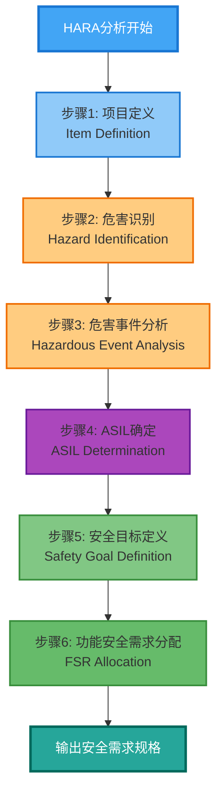
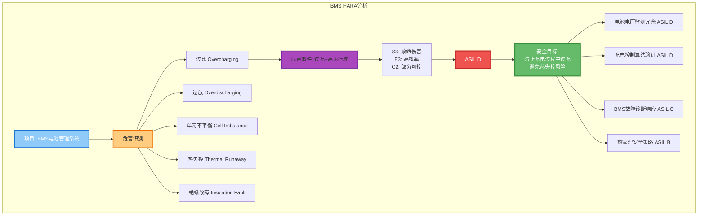

## 引言

想象一下这样的场景：一辆电动汽车正在高速公路上以 $100\text{ km/h}$ 的速度行驶，突然，电子节气门控制系统发生故障，导致车辆意外加速。驾驶员试图踩下刹车，但车辆却继续加速，最终酿成悲剧。这不是虚构的假设，而是真实发生过的汽车安全事故——2009 年丰田意外加速事件。

这个悲剧促使整个汽车行业重新思考安全工程的方法论。在这个过程中，**危害分析与风险评估（Hazard Analysis and Risk Assessment，简称 HARA）** 逐渐成为汽车功能安全的基石。HARA 不仅仅是一个技术流程，更是一种系统化的思维框架，帮助工程师在复杂的汽车系统中识别潜在风险，并制定相应的防护措施。

今天，我们就来深入探讨 HARA 的理论基础、发展历程以及在汽车行业的实际应用。

## HARA 的理论基础

### 什么是 HARA？

HARA 是 **ISO 26262** 汽车功能安全标准中定义的核心流程，旨在系统性地识别由系统故障导致的危害事件，评估相关风险，并制定安全目标以避免不合理风险的发生。简单来说，HARA 回答了三个关键问题：

1. **什么可能出错？**（危害识别）
2. **如果出错了，后果有多严重？**（风险评估）
3. **如何防止或缓解风险？**（安全措施）

HARA 是在整个汽车产品生命周期中实施的第一个主要任务，也是 ISO 26262 合规流程中的关键环节。它发生在概念设计阶段，为后续的系统架构设计、测试和验证奠定了基础。

### ISO 26262 标准的诞生

要理解 HARA，我们必须先了解 ISO 26262 标准的诞生背景。

在汽车电子系统日益复杂的背景下，国际电工委员会（IEC）制定的 **IEC 61508** 标准为功能安全提供了通用的方法论。然而，汽车行业有其特殊性：大规模生产、成本敏感、高度分布式系统架构等。因此，在 IEC 61508 的基础上，汽车行业专门制定了 ISO 26262 标准，即 "道路车辆功能安全" 标准（Road vehicles – Functional safety）。

ISO 26262 首次于 **2011 年** 发布，涵盖了汽车电气/电子系统的整个安全生命周期，从概念阶段、系统设计、硬件设计、软件设计，到生产、运行、服务，直到退役。HARA 在 ISO 26262 第 3 部分（概念阶段）中被正式定义，是功能安全工程活动的起点。

### HARA 的核心概念：ASIL 分级

在 HARA 流程中，最重要的输出之一是 **汽车安全完整性等级（Automotive Safety Integrity Level，ASIL）** 的确定。ASIL 是对系统安全要求的分类，从低到高分为四个等级：QM（质量管理体系）、ASIL A、ASIL B、ASIL C 和 ASIL D。

ASIL 的确定基于三个维度的评估：

1. **严重度（Severity，S）**：如果发生故障，对驾驶员、乘客或其他道路使用者可能造成的伤害程度。
2. **暴露率（Exposure，E）**：车辆运行过程中，暴露在特定操作场景中的概率。
3. **可控性（Controllability，C）**：驾驶员或其他相关人员能够通过合理的操作来避免或减轻事故的能力。

这三个维度的组合确定了最终的 ASIL 等级，可以用一个简单的矩阵来表示：

$$ \text{ASIL} = f(S, E, C) $$

其中，$S \in \{0, 1, 2, 3\}$（从无伤害到致命伤害），$E \in \{0, 1, 2, 3, 4\}$（从极低概率到极高概率），$C \in \{0, 1, 2, 3\}$（从易于控制到难以控制）。ASIL 的等级越高，意味着系统需要更严格的安全措施和更高的开发成本。

```mermaid
graph TB
    subgraph ASIL��维评估模型
        S[严重度 Severity<br>S0: 无伤害<br>S1: 轻微伤害<br>S2: 严重伤害<br>S3: 致命伤害]
        E[暴露率 Exposure<br>E0: 极低概率<br>E1: 低概率<br>E2: 中等概率<br>E3: 高概率<br>E4: 极高概率]
        C[可控性 Controllability<br>C0: 完全可控<br>C1: 易于控制<br>C2: 正常可控<br>C3: 难以控制]

        S --> ASIL[ASIL等级确定]
        E --> ASIL
        C --> ASIL
    end

    ASIL --> R[QM 质量管理]
    ASIL --> A[ASIL A 较低要求]
    ASIL --> B[ASIL B 中等要求]
    ASIL --> CC[ASIL C 高要求]
    ASIL --> D[ASIL D 最高要求]

    style S fill:#ef5350,stroke:#c62828,stroke-width:2px
    style E fill:#ffa726,stroke:#ef6c00,stroke-width:2px
    style C fill:#ffee58,stroke:#f9a825,stroke-width:2px
    style ASIL fill:#ab47bc,stroke:#6a1b9a,stroke-width:3px,color:#ffffff
    style R fill:#bdbdbd,stroke:#616161,stroke-width:2px
    style A fill:#a5d6a7,stroke:#388e3c,stroke-width:2px
    style B fill:#66bb6a,stroke:#388e3c,stroke-width:2px
    style CC fill:#43a047,stroke:#2e7d32,stroke-width:2px
    style D fill:#2e7d32,stroke:#1b5e20,stroke-width:3px,color:#ffffff
```

## HARA 的发展历程

### 早期阶段：经验驱动

在 HARA 方法论正式标准化之前，汽车安全主要依赖于工程师的经验和试错。1950 年代，丰田通过精益生产系统（Toyota Production System）来提升质量，但此时的安全更多是事后反应而非事前预防。

这个阶段的安全分析主要集中在机械系统和简单的电气系统上。对于复杂的电子控制系统，工程师往往依赖故障模式影响分析（Failure Mode and Effects Analysis，FMEA）等工具，但这些方法更偏向于可靠性分析而非系统化的风险评估。

### 标准化阶段：ISO 26262 的诞生

随着汽车电子系统的日益复杂，尤其是电子节气门控制系统（Electronic Throttle Control System，ETCS）、防抱死制动系统（Anti-lock Braking System，ABS）、电子稳定控制系统（Electronic Stability Control，ESC）等安全关键系统的广泛应用，行业对系统化安全分析方法的需求变得迫切。

2009 年的丰田意外加速事件成为了汽车功能安全发展的转折点。这次事故不仅造成了人员伤亡，更暴露了传统安全方法的局限性。事后调查发现，ETCS 的软件设计和安全架构存在缺陷，而这些问题在传统测试中并未被发现。

这次事件促使整个行业重新审视安全工程的方法论，并推动了 ISO 26262 标准的制定和广泛应用。HARA 作为 ISO 26262 的核心流程，开始在汽车行业得到系统性应用。

### 现代阶段：智能网联时代的挑战

随着自动驾驶、车联网、人工智能等新技术的应用，汽车安全工程面临着前所未有的挑战。传统的 HARA 方法论主要针对已知的功能性故障，但在自动驾驶系统中，很多风险来自于人工智能决策的不确定性、传感器感知的局限性以及复杂交通环境中的未知场景。

为了应对这些挑战，ISO 组织在 2022 年发布了 **ISO 21448（SOTIF，Safety of the Intended Functionality，预期功能的安全性）** 标准。SOTIF 补充了 ISO 26262，专门针对由功能设计缺陷而非系统故障导致的风险。这使得 HARA 的范围进一步扩展，从单纯的故障分析扩展到功能安全与预期功能安全的综合分析。

## HARA 的方法论详解

### HARA 的核心流程

HARA 是一个系统化的流程，通常包含以下关键步骤：



#### 步骤 1：项目定义（Item Definition）

在进行 HARA 之前，首先需要明确分析的对象——即 **项目（Item）**。项目定义包括系统的功能、边界、与其他系统的接口、以及操作场景等。这个定义需要清晰、完整，因为它是后续所有分析的基础。

例如，对于制动系统，项目定义可能包括：
- 主要功能：响应驾驶员的制动输入，施加制动力
- 输入：制动踏板位置、车速、路面摩擦系数等
- 输出：制动力分配、ABS 激活信号等
- 与其他系统的接口：ESP、自动驾驶系统等

#### 步骤 2：危害识别（Hazard Identification）

危害识别的目标是识别出所有可能导致车辆危害的故障行为。这个步骤需要考虑：

- **正常操作场景**：车辆在预期条件下的正常使用
- **合理误用场景**：驾驶员可能在合理范围内的非预期操作
- **系统边界条件**：系统在各种工作条件下的行为

例如，对于制动系统，可能的危害包括：
- 制动力不足
- 制动力过强（意外制动）
- 制动力不对称（导致车辆跑偏）
- 制动延迟

在这个阶段，工程师通常会使用系统化的方法，如 **故障模式影响分析（FMEA）** 或 **危险与可操作性分析（Hazard and Operability Study，HAZOP）** 来辅助危害识别。

#### 步骤 3：危害事件分析（Hazardous Event Analysis）

识别出危害后，下一步是分析这些危害在不同操作场景下的影响。危害事件是 **危害 + 操作场景** 的组合。例如：

- 制动力不足 + 高速行驶 = 严重危害事件
- 制动力不足 + 停车状态 = 轻微危害事件

对于每个危害事件，需要评估三个维度：严重度（S）、暴露率（E）和可控性（C）。

**严重度（Severity，S）** 分为四个等级：
- S0：无伤害
- S1：轻微或中等伤害
- S2：严重伤害（危及生命但可存活）
- S3：致命或幸存者极少

**暴露率（Exposure，E）** 分为五个等级：
- E0：极低概率（几乎不可能）
- E1：低概率
- E2：中等概率
- E3：高概率
- E4：极高概率

**可控性（Controllability，C）** 分为四个等级：
- C0：完全可控
- C1：易于控制
- C2：一般可控
- C3：难以控制

#### 步骤 4：ASIL 确定（ASIL Determination）

基于对 S、E、C 的评估，可以确定每个危害事件的 ASIL 等级。ASIL 的确定遵循一个预定义的矩阵，简单来说：

- ASIL D：最高安全要求，通常对应 S3、E4、C3 的组合
- ASIL C：较高安全要求
- ASIL B：中等安全要求
- ASIL A：较低安全要求
- QM：质量管理体系要求，不属于功能安全范畴

需要注意的是，ASIL 的确定不是简单的数学计算，而是需要工程师的专业判断。在某些情况下，可能需要进行定性分析或专家评估。

#### 步骤 5：安全目标定义（Safety Goal Definition）

基于 ASIL 等级，需要定义安全目标。安全目标是最高级别的安全要求，描述了需要防止或缓解的危害事件。安全目标需要与 ASIL 等级一致，并满足以下要求：

- **清晰明确**：用精确的语言描述需要达到的安全状态
- **可验证**：能够通过测试或分析来验证是否满足要求
- **与危害直接相关**：直接针对识别出的危害事件

例如，对于制动系统，一个安全目标可能是：
"在车辆行驶过程中，防止制动力不足导致的车辆无法减速，以确保驾驶员能够在合理距离内将车辆停止（ASIL D）"

#### 步骤 6：功能安全需求分配（Functional Safety Requirement Allocation）

基于安全目标，需要将安全需求分配到系统的各个子系统。这个过程是自顶向下的分解，确保每个子系统都有明确的安全要求，并且这些要求的集合能够满足安全目标。

例如，对于上述制动系统的安全目标，可能需要分配以下功能安全需求：
- 制动传感器冗余（ASIL D）
- 制动执行器监控（ASIL D）
- 制动力分配算法验证（ASIL D）
- 系统故障诊断和响应（ASIL C）

### HARA 的最佳实践

在实际应用中，遵循以下最佳实践可以显著提高 HARA 的质量：

1. **早期介入**：HARA 应该在概念设计阶段就启动，而不是等到设计完成后再进行。早期介入可以避免后期修改的高昂成本。

2. **跨学科协作**：HARA 需要系统工程师、硬件工程师、软件工程师、安全工程师等多学科团队的参与，从不同角度全面识别风险。

3. **迭代更新**：HARA 不是一次性的活动，而应该随着设计的演化和新信息的获取而持续更新。

4. **工具支持**：使用专业的 HARA 工具（如 ANSYS Medini Analyze、Vector DaVinci 等）可以提高效率和一致性。

5. **文档管理**：详细记录 HARA 过程中的决策和依据，这对于后续的审查和追溯至关重要。

## 汽车行业 HARA 实施案例

### 案例一：丰田意外加速事件（2009）

#### 事件背景

2009 年至 2010 年，丰田汽车遭遇了严重的意外加速（Unintended Acceleration，UA）危机。多起报告称丰田车辆在没有驾驶员输入的情况下突然加速，导致多起事故和人员伤亡。丰田最初将问题归咎于地板垫和油门踏板的机械故障，但随后的调查发现，电子节气门控制系统（ETCS）的软件缺陷可能是根本原因。

#### HARA 的缺失与教训

事后分析表明，丰田在 ETCS 的开发过程中存在严重的 HARA 缺陷：

1. **危害识别不足**：丰田未能充分识别 ETCS 软件故障可能导致意外加速的危害。ETCS 使用复杂的软件算法来控制节气门，但这些算法的安全性分析不充分。

2. **安全架构缺陷**：ETCS 缺乏足够的冗余和故障检测机制。当传感器或处理器发生故障时，系统无法及时检测并切换到安全状态。

3. **软件质量问题**：NASA 的调查发现，ETCS 的软件存在多个潜在的故障模式，包括死锁、数据竞争和栈溢出等。

#### ISO 26262 的影响

这次事件成为汽车功能安全发展的转折点。它促使整个行业：

- 开始系统性地实施 ISO 26262 标准
- 重视软件在安全关键系统中的作用
- 加强对 HARA 流程的投入和审查
- 建立独立的功能安全评估体系

丰田在事后重构了 ETCS 的安全架构，增加了多个故障检测和响应机制，并引入了更严格的软件开发流程。这些改进使得 ETCS 满足了 ISO 26262 的 ASIL D 要求，大大提高了系统的安全性。

### 案例二：特斯拉 Autopilot 安全分析

#### 特斯拉的自动驾驶策略

特斯拉是自动驾驶技术的先驱之一，其 Autopilot 和全自动驾驶（Full Self-Driving，FSD）功能在全球范围内拥有大量用户。与传统的汽车制造商不同，特斯拉采取了激进的策略，通过 **纯视觉方案**（Vision Only）来实现自动驾驶功能，仅依赖摄像头、神经网络和强大的计算平台。

#### HARA 的挑战与实施

特斯拉的自动驾驶系统面临着独特的 HARA 挑战：

1. **AI 系统的不确定性**：传统的 HARA 主要针对确定性的软件故障，而特斯拉的自动驾驶系统基于深度学习，其行为具有概率性和不确定性。这超出了传统 ISO 26262 的范畴。

2. **感知系统的局限性**：摄像头的性能受到光照、天气、遮挡等多种因素的影响。HARA 需要充分考虑这些场景下的系统行为。

3. **人机交互的复杂性**：Autopilot 是 L2 级自动驾驶系统，要求驾驶员始终保持对车辆的监控。HARA 需要分析人机交互过程中可能出现的问题，如驾驶员过度依赖系统、注意力不集中等。

尽管特斯拉没有公开详细的 HARA 文档，但从其披露的安全功能可以看出，特斯拉采取了多层次的安全策略：

- **碰撞避免系统**：Autopilot 的主动碰撞避免系统使用传感器检测潜在危险，能够实时介入以避免事故。根据 NHTSA 的数据，配备特斯拉安全技术的车辆在每英里事故率上显著降低。

- **驾驶员监控系统**：特斯拉在方向盘上安装了扭矩传感器，监控驾驶员是否保持对车辆的控制。在 FSD Beta 版本中，还引入了基于摄像头的驾驶员注意力监控。

- **冗余设计**：特斯拉的自动驾驶硬件（如 Hardware 3.0）采用了冗余设计，包括多个摄像头、冗余的电源系统和独立的制动系统。

#### ISO 26262 与 SOTIF 的结合

特斯拉的 Autopilot 系统体现了现代汽车安全分析的趋势：将 ISO 26262 的功能安全与 ISO 21448（SOTIF）的预期功能安全性相结合。

- **功能安全（ISO 26262）**：确保系统在发生硬件或软件故障时，仍能保持安全。例如，摄像头故障时的降级策略，或计算单元故障时的备用控制模式。

- **预期功能安全（SOTIF）**：确保系统在没有故障的情况下，也能安全地执行其预期功能。例如，确保神经网络在复杂交通场景中的决策是可靠的，或确保系统能够识别其性能边界并安全退出。

特斯拉的安全分析虽然未完全遵循传统的 HARA 流程，但其多层次的安全架构和持续的软件更新机制，体现了一种适应性更强的安全工程方法。

### 案例三：电动汽车的 HARA 实施

#### 电动汽车的特殊挑战

电动汽车（Electric Vehicle，EV）的普及带来了新的安全挑战，主要体现在以下几个方面：

1. **高压系统安全**：电动汽车的电池、电机、逆变器等部件工作在高压（通常 $400\text{ V}$ 到 $800\text{ V}$）环境下，绝缘故障可能导致触电或火灾。

2. **电池热失控**：锂离子电池在过充、过放、物理损伤或过热时可能发生热失控，导致火灾或爆炸。

3. **制动系统变化**：电动汽车通常采用再生制动和机械制动的混合系统，增加了系统的复杂性。

4. **软件复杂度**：电动汽车的电池管理系统（BMS）、充电管理系统、能量管理系统等都需要复杂的软件控制，增加了软件故障的风险。

#### BMS 的 HARA 示例

电池管理系统（Battery Management System，BMS）是电动汽车的核心安全系统之一，负责监控电池组的状态、平衡电池单元、防止过充过放等。下面是一个简化的 BMS HARA 示例：



**项目定义**：
- 功能：监控和管理锂离子电池组
- 输入：电池单元电压、温度、电流
- 输出：电池状态信息、充放电控制指令、故障诊断信息

**危害识别**：
- 过充（Overcharging）
- 过放（Overdischarging）
- 单元电压不平衡（Cell imbalance）
- 热失控（Thermal runaway）
- 绝缘故障（Insulation fault）

**危害事件分析**：
以"过充 + 高速行驶"为例：
- **严重度（S）**：S3（过充可能导致热失控、火灾、人员伤亡）
- **暴露率（E）**：E3（车辆行驶中经常充电）
- **可控性（C）**：C2（驾驶员可以通过停车来缓解，但可能来不及）
- **ASIL**：ASIL D

**安全目标**：
"防止电池组在充电过程中发生过充，避免热失控风险（ASIL D）"

**功能安全需求分配**：
- 电池电压监测冗余（ASIL D）
- 充电控制算法验证（ASIL D）
- BMS 故障诊断和响应（ASIL C）
- 热管理系统安全策略（ASIL B）

#### 充电系统的 HARA 示例

充电系统是电动汽车的另一个关键安全系统，特别是在高压直流快充场景下。

**危害识别**：
- 充电连接器过热
- 绝缘故障
- 接地故障
- 充电过程中的电压异常

**危害事件分析**：
以"充电连接器过热 + 室内充电"为例：
- **严重度（S）**：S3（可能导致火灾、人员伤亡）
- **暴露率（E）**：E2（室内充电场景常见）
- **可控性（C）**：C1（用户可以拔掉连接器）
- **ASIL**：ASIL C

**安全目标**：
"防止充电连接器在充电过程中过热，确保充电安全（ASIL C）"

**功能安全需求分配**：
- 充电电流监测和限制（ASIL C）
- 充电温度监测和过热保护（ASIL C）
- 充电连接器状态监测（ASIL B）
- 应急断电机制（ASIL B）

### 案例四：ADAS 系统的 HARA 实施

#### ADAS 系统的特点

高级驾驶辅助系统（Advanced Driver Assistance Systems，ADAS）包括自适应巡航控制（Adaptive Cruise Control，ACC）、自动紧急制动（Autonomous Emergency Braking，AEB）、车道保持辅助（Lane Keeping Assist，LKA）等功能。ADAS 系统的特点是：

1. **传感器融合**：通常使用多个传感器（摄像头、雷达、激光雷达）来感知环境
2. **人机共驾**：驾驶员和系统共同控制车辆，需要明确的责任划分
3. **场景依赖性**：系统性能高度依赖于操作场景（天气、光照、交通状况等）

#### AEB 系统的 HARA 示例

自动紧急制动系统（AEB）能够在检测到碰撞风险时自动施加制动，避免或减轻事故。AEB 是典型的 ASIL D 系统。

**项目定义**：
- 功能：检测前方障碍物，在碰撞不可避免时自动施加制动
- 输入：前方障碍物距离、相对速度、驾驶员制动输入
- 输出：制动力指令、警示信号

**危害识别**：
- 误触发（False positive）
- 漏触发（False negative）
- 制动延迟
- 制动力不足

**危害事件分析**：
以"误触发 + 高速行驶"为例：
- **严重度（S）**：S2（可能导致后车追尾、人员受伤）
- **暴露率（E）**：E3（高速公路常见场景）
- **可控性（C）**：C1（后车可能反应不及）
- **ASIL**：ASIL C

以"漏触发 + 碰撞不可避免"为例：
- **严重度（S）**：S3（可能致命）
- **暴露率（E）**：E2（交通事故概率中等）
- **可控性（C）**：C3（驾驶员可能来不及反应）
- **ASIL**：ASIL D

**安全目标**：
1. "防止 AEB 在不必要的情况下误触发，避免后车追尾（ASIL C）"
2. "确保 AEB 在碰撞不可避免时能够可靠地触发，最大程度减轻事故（ASIL D）"

**功能安全需求分配**：
- 前方障碍物检测算法验证（ASIL D）
- 传感器融合和故障检测（ASIL D）
- 制动系统冗余（ASIL D）
- 误触发抑制策略（ASIL C）

#### LKA 系统的 HARA 示例

车道保持辅助系统（LKA）能够在车辆偏离车道时施加转向扭矩，帮助车辆保持在车道内。

**危害识别**：
- 转向扭矩过大（导致车辆过度转向）
- 转向扭矩方向错误（导致车辆偏离车道更远）
- 系统延迟
- 车道线识别错误

**危害事件分析**：
以"转向扭矩方向错误 + 高速弯道"为例：
- **严重度（S）**：S3（可能导致车辆冲出路面、翻车）
- **暴露率（E）**：E2（高速公路弯道常见）
- **可控性（C）**：C2（驾驶员可能来不及纠正）
- **ASIL**：ASIL D

**安全目标**：
"确保 LKA 系统正确识别车道线并施加正确的转向扭矩，避免误将车辆导向危险方向（ASIL D）"

**功能安全需求分配**：
- 车道线识别算法验证（ASIL D）
- 转向扭矩监控和限制（ASIL D）
- 驾驶员干预检测（ASIL C）
- 系统降级策略（ASIL B）

## HARA 的未来发展趋势

### 人工智能与机器学习的集成

随着人工智能和机器学习在汽车系统中的广泛应用，传统的 HARA 方法论面临着新的挑战。AI 系统的特点是其行为具有概率性和不确定性，传统的故障分析工具可能不再适用。

未来的 HARA 需要集成 AI 安全性分析的方法论，例如：
- **形式化验证**：使用数学方法证明 AI 系统的安全性属性
- **对抗性测试**：通过生成对抗样本来测试 AI 系统的鲁棒性
- **可解释性分析**：提高 AI 决策的可解释性，便于安全性分析

### 数字孪生技术

数字孪生技术可以在虚拟环境中创建汽车系统的数字模型，用于安全性分析和验证。未来，HARA 可能会更加依赖数字孪生技术，在虚拟环境中模拟各种故障场景和操作条件，从而更全面地识别风险。

### 持续学习与更新

汽车系统越来越依赖软件更新来改进功能和修复问题。未来，HARA 需要支持持续学习和更新的机制，确保每次软件更新都不会引入新的安全风险。这可能包括：
- 自动化的回归测试
- 实时监控和安全分析
- 动态的安全需求管理

### 跨领域标准化

随着汽车与互联网、云计算、5G 等技术的融合，汽车安全需要跨越传统的行业边界。未来，HARA 可能需要与其他领域的安全标准（如网络安全、信息安全等）相结合，形成更加综合的安全分析框架。

## 结论

HARA 作为汽车功能安全的基石，已经从简单的故障分析发展成为一套系统化、多层次的工程方法论。从丰田意外加速事件的惨痛教训，到特斯拉 Autopilot 的创新实践，再到电动汽车和自动驾驶系统的广泛应用，HARA 不断演进以应对新的挑战。

对于懂微积分和线性代数的读者来说，HARA 的魅力在于它将复杂的安全问题转化为可分析、可验证的数学模型。通过 ASIL 分级、风险矩阵和系统性的分析流程，HARA 为汽车工程提供了一种科学化的方法来平衡安全性与创新性。

未来，随着人工智能、数字孪生、持续学习等新技术的应用，HARA 将继续演进，为汽车行业的安全发展保驾护航。在这个过程中，工程师需要保持开放的心态，不断学习和创新，以确保每一辆汽车都是安全的。

毕竟，汽车不仅仅是交通工具，更是承载着千家万户幸福的载体。安全的汽车工程，是对生命最好的尊重。
