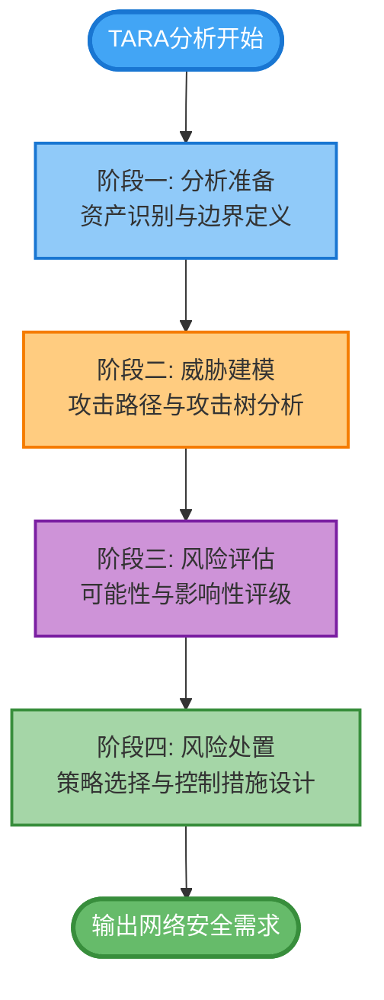
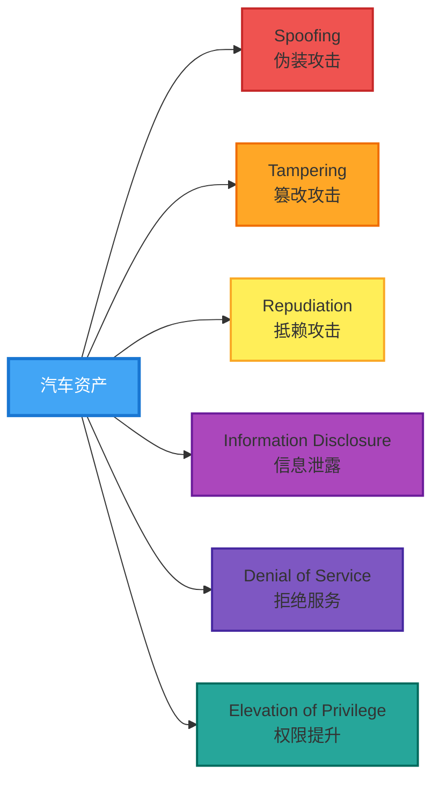

## 引言：网络安全威胁下的汽车安全新范式

随着汽车产业向智能化、网联化、电动化快速演进，车辆已从单纯的机械交通工具转变为高度复杂的移动计算平台。车载电子电气架构的深度融合、远程OTA升级功能的普及、V2X车路协同技术的应用，使得汽车面临着前所未有的网络安全威胁。传统的汽车安全设计理念已无法有效应对现代网络攻击手段的威胁，在此背景下，威胁分析与风险评估（Threat Analysis and Risk Assessment，简称TARA）方法论应运而生，成为汽车网络安全工程领域的核心方法论框架。

TARA分析不仅是ISO/SAE 21434《道路车辆网络安全工程》标准规定的强制性要求，更是汽车制造商和供应商识别、评估、缓解网络安全风险的系统化工程方法。通过科学的TARA分析流程，组织能够全面识别车辆系统面临的威胁场景，定量评估潜在风险等级，并据此制定针对性的安全控制措施，从而在产品全生命周期中有效管理网络安全风险。本文将深入解析TARA分析的方法论体系，结合丰富的行业实践案例，为读者呈现汽车网络安全风险评估的完整知识图谱。

## 第一章 TARA分析的理论基础与标准框架

### 1.1 汽车网络安全威胁的演进脉络

汽车网络安全威胁的发展历程与车辆电子化程度密切相关。在分布式电子电气架构时代，车辆主要通过CAN总线进行车内网络通信，攻击面相对有限，主要威胁来源于物理接触式攻击，如通过OBD-II诊断接口进行的攻击。随着域控制器架构的引入和车载以太网的应用，车辆具备了远程联网能力，攻击者可从云端服务器、手机APP、充电基础设施等多维度发起攻击，威胁态势呈现指数级恶化态势。

当前汽车行业面临的主要威胁类型包括：针对车载信息娱乐系统（IVI）的恶意软件注入与远程控制攻击；针对高级驾驶辅助系统（ADAS）的传感器欺骗与感知系统干扰；针对车联网云平台的API滥用与数据泄露；针对电动汽车充电基础设施的中间人攻击；针对V2X通信的虚假信息注入与拒绝服务攻击。这些威胁一旦被恶意利用，可能导致车辆被远程控制、用户隐私泄露、交通事故发生，甚至危害公共安全。


### 1.2 国际标准体系对TARA的规范化要求

ISO/SAE 21434标准是汽车网络安全领域的里程碑式文件，该标准于2021年正式发布，规定了道路车辆网络安全工程的全生命周期要求。在标准框架下，TARA分析被定位为网络安全风险管理的核心活动，贯穿于概念阶段、产品开发阶段及后开发阶段的全过程。标准明确要求组织应建立系统化的威胁分析方法，识别相关资产可能面临的威胁，并基于威胁可能性和影响严重性进行风险等级评定。

联合国世界车辆法规协调论坛（WP.29）发布的R155法规是另一个重要的法规框架，该法规规定了车辆制造商必须建立网络安全管理体系（CSMS），并对特定车型进行网络安全风险评估。R155法规明确要求制造商应识别并评估与车辆类型相关的网络安全风险，实施相应的风险缓解措施，并通过持续监控机制保持安全态势。值得注意的是，R155法规不仅适用于M类（乘用车）、N类（货车）车辆，还扩展至L类（摩托车）及其他特殊车辆类型。

### 1.3 TARA分析的核心价值定位

TARA分析的核心价值在于将模糊的"网络安全问题"转化为可量化、可管理、可追踪的工程问题。通过系统化的分析流程，组织能够获得以下关键产出：资产清单及其安全属性定义；威胁场景清单及攻击路径分析；风险等级评定结果及排序；安全需求规格及控制措施建议。这些产出直接指导后续的安全设计、验证确认活动，确保安全投入的精准性和有效性。

从系统工程角度而言，TARA分析体现了"安全左移"的先进理念。在产品概念阶段早期开展TARA分析，能够在架构设计阶段就嵌入安全考量，避免后期返工带来的巨大成本。同时，TARA分析也为安全测试提供了明确的测试目标和验收标准，形成了从风险识别到安全验证的完整闭环。

## 第二章 TARA分析方法论体系详解




### 2.1 分析准备阶段：资产识别与边界定义

TARA分析的第一步是明确分析范围和识别保护对象，这一阶段的工作质量直接决定后续分析的完整性和有效性。资产识别需要建立系统化的资产清单，该清单不仅包括物理资产（如ECU、传感器、执行器），还包括逻辑资产（如功能、服务、数据）以及抽象资产（如用户隐私、车辆安全功能完整性）。

在资产识别过程中，需要为每个资产定义明确的安全属性。**机密性**（Confidentiality）关注资产信息不被未授权访问；**完整性**（Integrity）关注资产信息不被未授权篡改；**可用性**（Availability）关注资产在需要时能够正常访问和使用。对于汽车行业而言，不同类型资产的安全属性优先级存在显著差异：例如，存储在车联网平台的个人用户数据以机密性为首要考量；而用于制动控制的ECU信号则以完整性和可用性为首要考量。

分析边界的定义同样关键。组织需要明确TARA分析的系统范围，包括哪些电子电气组件、通信接口、软件模块纳入分析范围。对于复杂系统，建议采用分层分析方法：先进行整车层面的资产和威胁识别，再针对特定子系统进行深入分析。这种分层方法既能保证分析的完整性，又能控制分析的工作量。

**案例实践：某OEM的资产识别实践**

某欧洲豪华汽车制造商在开发新一代智能驾驶平台时，采用了结构化的资产识别方法。首先，项目团队基于SysML系统建模工具建立了完整的系统架构模型，识别出超过200个资产项。随后，团队采用STRIDE威胁分析方法，针对每个资产类型进行威胁发散，识别出1500余个威胁场景。为提高分析效率，团队建立了资产-威胁映射矩阵，将高频威胁场景模板化，使后续类似项目的TARA分析周期缩短了60%。

### 2.2 威胁建模阶段：攻击路径与攻击树分析


威胁建模是TARA分析的核心环节，其目标是将抽象的威胁具体化为可分析的攻击场景。当前汽车行业主流的威胁建模方法包括STRIDE、PASTA、TVRA等，每种方法各有侧重和适用场景。



**STRIDE**（Spoofing、Tampering、Repudiation、Information Disclosure、Denial of Service、Elevation of Privilege）方法由微软提出，广泛应用于软件安全领域。在汽车行业应用中，STRIDE方法能够系统化地识别各类资产面临的威胁类型。例如，对于车载网关控制器，STRIDE分析可能识别出以下威胁：伪装攻击（Spoofing）——攻击者伪造ECU身份发送欺诈性消息；篡改攻击（Tampering）——攻击者修改CAN总线报文内容；信息泄露（Information Disclosure）——攻击者通过诊断接口读取敏感车辆状态信息。

**攻击树**（Attack Tree）分析是威胁建模的重要补充工具，它以树状结构描述攻击者达成攻击目标的可能路径。攻击树的根节点代表攻击者的最终目标（如"实现车辆远程控制"），叶子节点代表具体的攻击步骤（如"获取车载系统root权限"），中间节点代表组合条件（如"需要同时满足漏洞A和漏洞B"）。通过攻击树分析，可以直观地识别关键攻击路径和潜在的攻击难点。

**案例实践：基于ATT&CK的威胁建模**

某汽车零部件供应商在其车联网网关产品开发中，创新性地将MITRE ATT&CK框架应用于汽车领域，构建了专门的汽车威胁情报库。分析团队首先将汽车行业特有的攻击技术映射到ATT&CK矩阵的战术和技术类别，然后针对每个攻击技术评估其在目标系统中的适用性和可行性。这种方法的优势在于能够借鉴广泛的行业威胁情报，使TARA分析更加全面和前瞻。实践表明，采用ATT&CK框架辅助分析后，团队识别出的高风险威胁场景数量增加了35%。

### 2.3 风险评估阶段：可能性与影响性评级方法


风险评估是TARA分析的关键决策环节，其目标是将威胁场景转化为可排序的风险等级。当前汽车行业普遍采用的风险评估模型基于两个维度：**威胁可能性**（Threat Probability）和**影响严重性**（Impact Severity）。

威胁可能性评估需要综合考量多个因素。**攻击者能力**（Attacker Capability）：评估潜在攻击者所需的技术水平和资源投入；**攻击路径可达性**（Path Feasibility）：评估攻击者到达目标资产的难易程度；**漏洞利用难度**（Exploitability）：评估已识别漏洞被利用的技术复杂度。ISO/SAE 21434标准提供了可能性评级的定性尺度：Very Low（极低）、Low（低）、Medium（中等）、High（高）、Very High（极高）。每个评级对应具体的判定准则，例如"Very High"表示攻击者仅需基本技能即可实现攻击，且存在公开可用的攻击工具。

影响严重性评估需要考虑多个影响类别。**Safety**（安全影响）：威胁场景可能导致的人员伤害程度；**Financial**（财务影响）：威胁场景可能造成的直接和间接经济损失；**Privacy**（隐私影响）：威胁场景可能导致的用户隐私泄露程度；**Operational**（运营影响）：威胁场景可能导致的车辆功能丧失或降级；**Reputational**（声誉影响）：威胁场景可能导致的品牌声誉损害。ISO/SAE 21434标准针对每种影响类别提供了详细的评级准则，并定义了组合影响严重性的确定规则——取各类别影响严重性的最高值。

**定量风险评估方法的探索**

除定性评估方法外，汽车行业也在积极探索定量风险评估方法。EVITA项目提出的风险评估模型引入了攻击可行性指数（Attack Feasibility Index）和影响评分函数，试图将风险量化为具体数值。某日系汽车制造商在其网络安全评估流程中采用了基于攻击树的可量化模型，通过蒙特卡洛模拟评估攻击概率分布，为风险排序提供更精确的数据支撑。

### 2.4 风险处置阶段：策略选择与控制措施设计

基于风险评估结果，组织需要制定相应的风险处置策略。ISO/SAE 21434标准定义了四种基本风险处置策略：**规避**（Avoid）——通过改变设计或功能消除风险源；**降低**（Reduce）——实施安全控制措施降低风险等级；**转移**（Transfer）——通过保险或合同条款转移风险责任；**接受**（Accept）——在风险可接受范围内接受残余风险。对于汽车安全相关功能，规避和降低是优先选择的策略，转移和接受策略的使用受到严格限制。

安全控制措施的设计需要遵循**纵深防御**（Defense in Depth）原则，在多个层面构建安全防护能力。


**预防性控制**旨在阻止攻击的发生，如访问控制、身份认证、代码签名验证；**检测性控制**用于发现正在进行的攻击或异常行为，如入侵检测系统、日志监控；**响应性控制**用于攻击发生后限制损害并恢复正常运行，如安全通信中断机制、故障安全模式。

**案例实践：ISO/SAE 21434安全需求规格**

某中国汽车制造商在开发智能座舱系统时，建立了完整的安全需求规格体系。安全需求按照功能安全（Safety）和网络安全（Security）进行分类，每条需求采用"REFSEC-XXX"格式编号，并关联到具体的威胁场景和风险评估结果。需求描述遵循SMART原则，明确规定安全功能的预期行为、验证方法和验收标准。例如，针对"OTA升级包篡改"威胁，安全需求规定："系统应仅接受经过数字签名验证的OTA升级包，签名算法应符合GM/T 0054标准要求，验证失败后系统应进入安全恢复模式并记录审计日志"。

## 第三章 行业实践案例深度剖析

### 3.1 案例一：车载信息娱乐系统的TARA分析实践

车载信息娱乐系统（IVI）是汽车网络安全分析的重点对象，因其具有丰富的外部接口和复杂的软件生态，面临来自多个维度的威胁。

```mermaid
graph TB
    subgraph IVI系统TARA分析
        Assets[IVI资产识别] --> A1[系统软件资产<br/>OS/驱动/服务]
        Assets --> A2[应用软件资产<br/>导航/语音/浏览器]
        Assets --> A3[用户数据资产<br/>联系人/位置/习惯]
        Assets --> A4[通信接口资产<br/>蓝牙/WiFi/4G/USB]
        Assets --> A5[硬件资产<br/>芯片/存储/显示]

        A4 --> Threat[STRIDE威胁分析]
        Threat --> T1[Spoofing: 伪造设备连接]
        Threat --> T2[Tampering: 篡改通话数据]
        Threat --> T3[InfoDisclosure: 窃听通信]
        Threat --> T4[DoS: 蓝牙服务崩溃]
        Threat --> T5[EoP: 获取root权限]

        T1 --> Risk[风险评估]
        Risk --> Feasibility[攻击可行性: 中等]
        Risk --> Impact[影响严重性: 高]
        Feasibility --> Level[风险等级: 高]
        Impact --> Level

        Level --> Control[控制措施]
        Control --> C1[传输层: TLS 1.3加密]
        Control --> C2[应用层: 国密SM2签名]
        Control --> C3[引导层: 安全启动链]
    end

    style Assets fill:#90caf9,stroke:#1976d2,stroke-width:3px,color:#ffffff
    style Threat fill:#ffcc80,stroke:#ef6c00,stroke-width:2px
    style Risk fill:#ce93d8,stroke:#7b1fa2,stroke-width:2px
    style Level fill:#ef5350,stroke:#c62828,stroke-width:3px,color:#ffffff
    style Control fill:#81c784,stroke:#388e3c,stroke-width:2px
```某合资汽车制造商在其最新一代IVI系统开发中，采用了完整的TARA分析流程，以下详细呈现其实践经验。

**资产识别与分类**

项目团队首先建立了IVI系统的资产清单，涵盖以下主要资产类别：
- **系统软件资产**：操作系统内核、系统服务、驱动程序
- **应用软件资产**：导航应用、语音交互应用、车载浏览器
- **用户数据资产**：联系人信息、通话记录、位置历史、应用使用习惯
- **通信接口资产**：蓝牙模块、Wi-Fi模块、USB接口、4G/5G通信模块
- **硬件资产**：主控芯片、存储介质、显示模组

针对每类资产，团队定义了机密性、完整性、可用性的安全属性优先级。

**威胁场景识别**

采用STRIDE方法对各类资产进行威胁发散。对于蓝牙模块，识别出的主要威胁包括：
- **Spoofing**：攻击者伪造配对设备身份进行连接
- **Tampering**：攻击者篡改蓝牙传输的通话数据
- **Repudiation**：用户否认通过蓝牙进行的某项操作
- **Information Disclosure**：攻击者窃听蓝牙通信内容
- **Denial of Service**：攻击者发送特制数据包导致蓝牙服务崩溃
- **Elevation of Privilege**：攻击者利用蓝牙协议漏洞获取系统root权限

对于导航应用，团队重点关注位置信息泄露和地图数据篡改威胁。位置信息泄露可能通过以下路径发生：导航应用与云端服务器的通信被截获；位置数据在本地存储时未加密被其他应用读取；位置信息通过语音助手功能被意外外传。地图数据篡改可能导致车辆被引导至错误目的地，虽然不直接危及人身安全，但可能造成其他损失。

**风险评估与控制措施**

针对识别出的威胁场景，团队进行了详细的风险评估。以"OTA升级包篡改"威胁为例，评估过程如下：

**威胁可能性评定为Medium（中）**。判定依据包括：攻击者需要具备中等水平的逆向工程能力；目前存在公开的OTA协议分析工具，但利用需要定制开发；升级包的签名保护机制使得直接篡改难度较高，但历史上曾出现通过降级攻击绕过签名验证的案例。

**影响严重性评定为High（高）**。判定依据包括：如果攻击者通过篡改OTA包植入恶意软件，可能实现对IVI系统的完全控制；恶意软件可能进一步通过CAN总线向其他ECU发送指令；用户隐私数据面临大规模泄露风险；品牌声誉损失严重。

**综合风险等级为High**，需要优先实施缓解措施。

控制措施设计包括以下层面：
- **在传输层**：OTA升级包通过TLS 1.3加密通道传输，服务端证书采用硬件安全模块（HSM）保护
- **在应用层**：升级包采用国密SM2算法进行数字签名，签名密钥存储在独立的安全芯片中
- **在启动引导层**：系统启动引导程序（Bootloader）实施安全启动（Secure Boot）链验证，确保仅允许经过签名的软件镜像启动

### 3.2 案例二：自动驾驶感知系统的对抗性威胁分析

自动驾驶感知系统是当前汽车网络安全研究的热点领域，其面临的威胁具有独特的技术特征。与传统ECU不同，激光雷达、摄像头、毫米波雷达等感知传感器面临物理世界中的对抗性攻击威胁。某科技公司在其L4级自动驾驶系统开发中，针对感知系统开展了专项TARA分析。

**感知系统资产定义**

团队将感知系统资产分为以下类别：
- **原始感知数据流**：摄像头图像数据、激光雷达点云数据、毫米波雷达检测结果
- **感知处理算法**：神经网络模型、传统计算机视觉算法、传感器融合算法
- **感知输出结果**：目标检测框、语义分割结果、可行驶区域标注

不同资产面临的安全威胁类型存在显著差异。

**对抗性威胁场景分析**

针对摄像头传感器的对抗性攻击是该分析的重点领域。团队识别出以下主要威胁场景：

**物理对抗性补丁攻击**——攻击者在交通标志或道路表面粘贴精心设计的对抗性图案，导致摄像头将"停止标志"误识别为"限速标志"。2018年加州大学伯克利分校的研究团队成功演示了对STOP标志的攻击，误识别率高达94%。在自动驾驶场景中，此类攻击可能导致车辆在需要停车的情况下继续行驶，造成严重安全隐患。

**激光雷达欺骗攻击**——攻击者通过发射伪造的激光雷达回波信号，使感知系统"看到"不存在的物体（幽灵物体攻击）或"看不到"真实存在的物体（隐藏物体攻击）。2021年浙江大学团队发表了关于激光雷达欺骗攻击的研究成果，证明了在特定条件下可实现对距离测量的完全欺骗。

**摄像头致盲攻击**——攻击者通过强光照射或激光发射器照射摄像头镜头，导致摄像头图像传感器暂时致盲或产生光学损伤。在自动驾驶场景中，摄像头致盲可能导致车辆通过隧道出口等光线剧烈变化场景时丢失视觉感知能力。

**风险评估的特殊考量**

感知系统威胁的风险评估面临独特挑战。传统TARA方法中的"攻击可能性"在感知系统场景中难以直接应用，因为对抗性攻击的成功与否取决于物理条件、攻击者设备能力、目标系统防御机制等多重因素。

该团队创新性地引入了**攻击可行性矩阵**评估方法。该方法将攻击可行性分解为以下维度：
- **设备成本**：实施攻击所需的硬件设备市场价格
- **技术门槛**：攻击者需要具备的专业知识水平
- **环境依赖性**：攻击成功对特定环境条件的依赖程度
- **可重复性**：攻击在多次尝试中的一致性表现

基于该矩阵，团队对主要对抗性攻击场景进行了可行性评分，为优先级排序提供了更精确的依据。

**控制措施设计实践**

针对感知系统威胁，团队设计了多层次的防御措施：

**传感器层防御**：采用多传感器冗余和交叉验证机制，当单一传感器报告异常时，系统参考其他传感器的感知结果进行综合判断；实施传感器异常检测算法，识别可能的对抗性输入模式；在摄像头镜头上集成环境光传感器，检测异常的强光照射事件。

**算法层防御**：采用对抗性训练技术增强神经网络模型的鲁棒性，在训练数据集中加入对抗性样本；实施感知结果的时间一致性检查，识别突发的、不符合物理规律的检测结果；采用模型集成方法，综合多个独立模型的感知结果，降低单点失效风险。

**系统层防御**：设计故障安全模式，当感知系统检测到可能的对抗性攻击时，系统发出预警并请求驾驶员接管，或自动降级至保守驾驶策略；实施感知系统的持续监控和日志记录，支持事后安全分析和取证。

### 3.3 案例三：车联网云平台的供应链安全TARA

车联网云平台是连接车辆与数字生态的核心枢纽，其安全性直接影响数百万联网车辆的安全。某造车新势力在其车联网平台重构项目中，针对供应链安全开展了全面的TARA分析。

**云平台资产与依赖关系梳理**

车联网平台的技术栈复杂，涉及众多第三方组件和服务。项目团队首先建立了完整的软件物料清单（SBOM），识别出以下主要资产和依赖关系：

**基础设施层资产**：云服务器、容器编排平台、数据库系统、消息队列中间件、负载均衡器、网络安全设备。这些资产主要依赖主流云服务提供商的IaaS服务，以及开源社区的PaaS组件。

**平台服务层资产**：用户认证服务、车辆状态服务、远程控制服务、OTA升级服务、数据分析服务。这些服务主要采用微服务架构实现，涉及多种编程语言和框架。

**应用层资产**：车主APP API网关、车企管理后台、数据可视化平台、开发者平台。这些应用依赖多种第三方SDK和API服务。

**供应链威胁场景识别**

针对车联网云平台的供应链特点，团队识别出以下关键威胁场景：

**第三方组件漏洞利用**——2021年的Log4j2漏洞事件深刻揭示了开源组件安全风险的严重性。团队对云平台使用的所有第三方组件进行了安全审计，发现部分老旧版本组件存在已知漏洞。攻击者可通过这些漏洞实现远程代码执行，进而控制云平台服务器并下发恶意指令至联网车辆。

**依赖库投毒**——攻击者通过在PyPI、NPM等包管理器中发布恶意软件包，冒充热门开源库的名称，诱使开发者下载安装。2022年安全研究人员发现多个针对加密货币钱包的供应链攻击采用了此类手法。

**云服务商API密钥泄露**——云平台开发过程中，开发者可能将云API密钥硬编码在代码仓库中或存储在不安全的配置文件中。攻击者通过扫描公开代码仓库或利用配置错误，可获取云平台的管理权限。

**风险评估与控制措施**

针对供应链威胁，项目团队建立了专门的评估框架和应对机制：

**持续漏洞管理**：建立自动化漏洞扫描流程，每日对SBOM中的所有组件进行CVE匹配扫描；对识别出的漏洞按CVSS评分和实际影响进行优先级排序；建立漏洞修复SLA，高危漏洞需在72小时内修复或采取临时缓解措施。

**依赖签名验证**：对所有关键依赖库实施完整性校验，在构建流程中验证哈希值和数字签名；建立内部可信镜像仓库，限制从公共包管理器直接拉取未审核的包。

**密钥安全管理**：采用密钥管理服务（KMS）集中存储和轮换敏感凭据；实施最小权限原则，为不同服务分配最小必要权限；建立密钥泄露检测机制，定期扫描公开代码仓库中的组织敏感信息。

## 第四章 TARA分析方法论的实施挑战与应对策略

### 4.1 挑战一：分析范围界定与资源平衡

TARA分析面临的第一个挑战是分析范围的界定。汽车电子电气系统复杂度高，包含数十个ECU、数百个功能模块和数百万行代码，试图在有限时间内完成全面覆盖既不现实也不经济。实践中常见的困境是：分析范围过大导致资源分散，分析质量下降；分析范围过小导致重要威胁遗漏，安全保障不充分。

**应对策略**建议采用基于风险的优先级驱动方法。首先对系统架构进行初步评估，识别高价值资产（存储敏感数据的模块、控制安全关键功能的组件、具有外部接口的节点），优先对这些资产进行深入分析。对于低风险资产，可采用威胁模式模板进行快速评估，或在后续迭代中逐步完善。这种方法确保有限的资源投入到最重要领域。

此外，建议采用**分层分析方法**。在概念阶段进行整车层面的威胁分析，识别主要威胁域和关键风险；在子系统详细设计阶段针对关键子系统进行深入分析；在组件开发阶段针对高风险组件进行详细分析。这种分层方法既保证了分析的完整性，又控制了各阶段的工作量。

### 4.2 挑战二：威胁情报的时效性维护

网络安全威胁态势瞬息万变，今天识别出的威胁场景可能在明天就过时，新的攻击手法可能随时出现。TARA分析如果缺乏持续更新机制，其分析结果将很快失去参考价值。

**建立有效的威胁情报更新机制**是关键应对策略。组织应建立专门的威胁情报监测能力，持续跟踪以下信息源：
- 汽车行业安全事件报告（如NHTSA的车辆网络安全召回公告）
- 安全研究机构的漏洞披露和建议（如CISA的ICS-CERT公告）
- 学术会议和行业会议发布的最新研究成果（如Black Hat、RECON、SAC等）
- 开源威胁情报平台和社区（如ATT&CK Navigator、CAPEC）

同时，建议建立TARA分析的**版本管理机制**。每次更新都应记录版本号、变更内容、变更原因，形成可追溯的分析历史。在产品生命周期内，应根据威胁情报变化和系统变更进行定期评审和更新。

### 4.3 挑战三：跨部门协作与知识传递

TARA分析是一项跨职能活动，需要安全专家、系统架构师、功能开发工程师、测试工程师等多方参与。实践中常见的困境是：安全专家缺乏对系统细节的深入了解，系统工程师对威胁分析方法不熟悉，导致分析质量参差不齐。

**建立结构化的协作流程**是有效应对策略。以ISO/SAE 21434标准定义的"网络安全案例"框架为基础，组织应明确TARA分析各阶段的责任主体和工作产出：
- 在资产识别阶段，系统架构师应提供详细的系统架构文档和功能说明，安全专家在此基础上进行资产分类和安全属性定义
- 在威胁建模阶段，安全专家主导威胁发散和攻击树构建，系统工程师参与验证威胁场景的技术可行性
- 在风险评估阶段，应组织跨职能评审会议，综合各方意见达成共识

此外，**建立知识共享机制**同样重要。建议组织建立内部威胁知识库，积累历史TARA分析的成果和经验教训。对于常见的资产类型，可建立威胁模式模板库，供后续项目参考复用。

### 4.4 挑战四：分析方法与工具的标准化

当前汽车行业缺乏统一的TARA分析方法论和工具标准，不同组织采用的分析方法各异，输出格式不统一，导致难以进行横向比较和结果复用。

虽然ISO/SAE 21434标准规定了TARA分析的基本流程和要求，但对于具体分析方法（如威胁发散技术、风险评级尺度）未做强制性统一。行业协会和标准化组织正在推动相关工作，如ISO/SAE 21448（预期功能安全）标准中对感知系统威胁的分析提供了部分指导，但完整的汽车网络安全威胁建模方法论仍待完善。

**组织层面可采取的应对措施**包括：
- 建立组织级的TARA分析指南，统一分析方法和输出格式
- 优先选择符合汽车行业标准的安全建模工具（如基于SysML的建模工具、专门的汽车网络安全分析工具）
- 建立分析结果的内部评审和质量保证机制

## 第五章 TARA分析方法论的未来演进趋势

### 5.1 人工智能驱动的自动化威胁分析

人工智能和机器学习技术正在深刻改变汽车网络安全分析的方式。基于大语言模型的威胁分析工具能够自动解析系统架构文档，识别潜在资产和威胁场景，大幅提高分析效率。基于知识图谱的攻击路径分析系统能够从海量威胁情报中自动关联和推理，发现隐藏的攻击链路。

当前已有多个研究项目和商业工具探索AI辅助的TARA分析方法。例如，利用自然语言处理技术从漏洞报告中自动提取攻击模式，并将其映射到目标系统的资产；利用图神经网络技术对攻击树进行学习和推理，预测潜在的未知攻击路径。这些技术虽然尚未完全成熟，但代表了TARA分析自动化的未来方向。

### 5.2 与功能安全的融合分析

网络安全（Security）与功能安全（Safety）的融合是汽车系统安全的未来趋势。ISO/SAE 21434标准和ISO 26262功能安全标准在概念和方法论上存在显著差异，但两者的目标都是保障车辆安全。未来的TARA分析需要与功能安全危害分析（HAZOP、FMEA）进行协同，识别那些可能同时影响安全和安保的威胁场景。

联合国R155法规和R156法规（软件更新）的合规定义了"网络安全安全案例"框架，要求组织系统性地论证其网络安全措施能够将风险降至可接受水平。这一框架需要整合功能安全和网络安全的论证内容，为审批和认证提供完整的安全保障证据。

### 5.3 持续性风险监控与动态评估

传统的TARA分析通常在产品开发阶段进行，属于"一次性"活动。然而，网络安全威胁的动态特性要求建立持续性的风险监控和评估机制。ISO/SAE 21434标准已经规定了后开发阶段的网络安全活动要求，包括漏洞管理、事件响应、安全评估等。

未来的TARA分析将更加紧密地集成到**持续安全监控流程**中。通过车载安全监控模块和云端安全运营中心（SOC）的联动，组织能够实时获取威胁情报和安全事件数据，动态更新风险评估结果，并根据新的威胁态势快速调整安全控制措施。这种"持续TARA"模式将显著提高汽车网络安全的响应能力和防护水平。

## 结论：构建系统化的汽车网络安全风险管理能力

TARA分析作为汽车网络安全工程的核心方法论，为组织提供了系统化识别、评估、处置网络安全风险的框架。通过本文的深入分析，读者应能够理解TARA分析的理论基础和方法体系，掌握威胁建模、风险评估、控制措施设计的具体方法，并从丰富的行业实践案例中获得启发。

对于汽车行业从业者，建议在以下方面加强能力建设：
- 深入理解ISO/SAE 21434、R155等标准对TARA分析的要求，建立合规的分析流程
- 积累威胁情报和安全事件分析经验，保持对最新威胁态势的敏感度
- 建立跨职能协作机制，将TARA分析融入产品开发的常规流程
- 持续投入工具和能力建设，提高分析的效率和质量

汽车网络安全是一个持续演进的领域，威胁态势在变化，攻击手段在升级，防护技术也在发展。组织需要建立持续学习和改进的文化，将TARA分析作为动态演进的过程而非一次性的项目活动。只有这样，才能在快速变化的威胁态势中保持有效的安全保障能力，为用户提供安全可靠的智能网联汽车产品。
