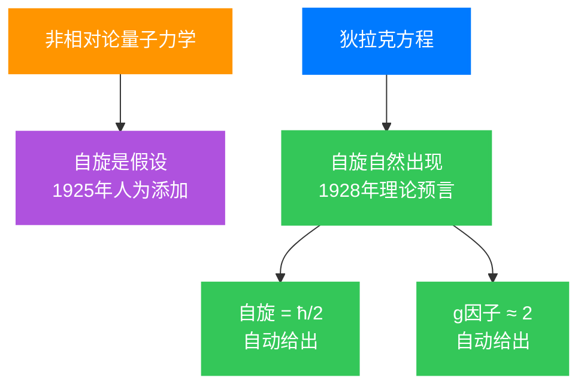
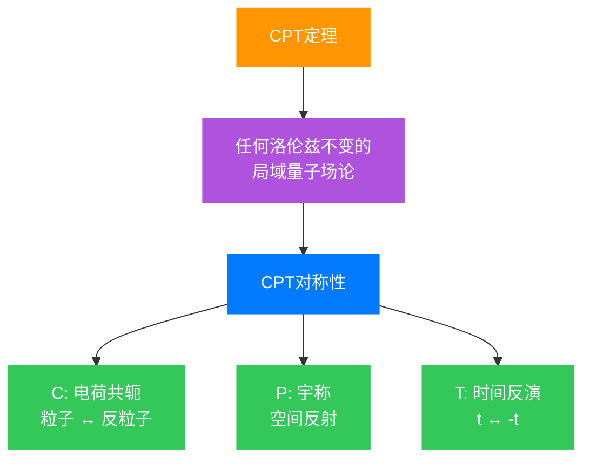

## 引言:1928年的物理学困境

1928年的秋天,剑桥大学。一位26岁的年轻物理学家保罗·狄拉克(Paul Dirac)正面临着物理学界最根本的问题之一:如何将**量子力学**与**狭义相对论**统一起来?

当时的物理学界似乎被分裂成两个不相容的世界。一边是薛定谔方程,它在描述原子中的电子行为时取得了巨大成功,但只在低速情况下有效;另一边是爱因斯坦的狭义相对论,它精确地描述了高速运动物体的行为。问题是——这两个理论在数学结构上似乎根本无法协调。

让我们从这个困境出发,一步步理解狄拉克是如何通过数学的纯粹美感,找到了连接这两个世界的桥梁。

## 第一章:薛定谔方程的困境

### 1.1 非相对论量子力学的成功

1926年,奥地利物理学家埃尔温·薛定谔提出了著名的波动方程:

$$ i\hbar\frac{\partial}{\partial t}\psi(\mathbf{r},t) = \hat{H}\psi(\mathbf{r},t) $$

对于自由粒子(没有外力作用),哈密顿量是:

$$ \hat{H} = \frac{\hat{\mathbf{p}}^2}{2m} = -\frac{\hbar^2}{2m}\nabla^2 $$

这个方程在描述氢原子等低速系统时非常成功。它精确地预言了氢原子的能级,解释了原子光谱的规律。但是,如果你仔细观察这个方程的数学结构,会发现一个根本性的**不对称性**:

- **时间导数是一阶的**: $\frac{\partial}{\partial t}$
- **空间导数是二阶的**: $\nabla^2 = \frac{\partial^2}{\partial x^2} + \frac{\partial^2}{\partial y^2} + \frac{\partial^2}{\partial z^2}$

这种不对称性意味着这个方程在洛伦兹变换下不会保持不变——换句话说,它**不符合狭义相对论**。

### 1.2 相对论的能量-动量关系

在狭义相对论中,自由粒子的能量和动量满足一个简单而优雅的关系:

$$ E^2 = p^2c^2 + m^2c^4 $$

这就是著名的**质能方程**。在低速情况下($p \ll mc$),我们可以对它进行泰勒展开:

$$ E = mc^2\sqrt{1 + \frac{p^2}{m^2c^2}} \approx mc^2 + \frac{p^2}{2m} - \frac{p^4}{8m^3c^2} + \cdots $$

如果我们忽略静止能量 $mc^2$,主导项就是 $\frac{p^2}{2m}$——这正是薛定谔方程中的动能!这告诉我们:薛定谔方程实际上是相对论能量公式在低速情况下的近似。

那么,一个自然的问题是:我们能否直接使用完整的相对论能量-动量关系来构造一个符合相对论的波动方程呢?

## 第二章:克莱因-戈尔登方程的尝试

### 2.1 最直接的构造

最直接的做法是将量子力学中的能量和动量算符代入相对论能量-动量关系:

$$ E \rightarrow i\hbar\frac{\partial}{\partial t}, \quad \mathbf{p} \rightarrow -i\hbar\nabla $$

这样我们得到:

$$ \left(-\frac{1}{c^2}\frac{\partial^2}{\partial t^2} + \nabla^2 - \frac{m^2c^2}{\hbar^2}\right)\psi = 0 $$

这就是**克莱因-戈尔登方程**(Klein-Gordon equation)。这个方程有几个显著特点:

1. **时间和空间导数都是二阶的**,完全对称
2. **明显是洛伦兹协变的**
3. 对于自由粒子,平面波解 $\psi \sim e^{i(\mathbf{p}\cdot\mathbf{r} - Et)/\hbar}$ 直接给出相对论能量-动量关系

### 2.2 概率解释的危机

然而,这个方程有一个严重的问题,几乎使它被物理学家抛弃。

在量子力学中,波函数的模平方 $|\psi|^{2}$ 代表找到粒子的概率密度,它必须是非负的。但对于克莱因-戈尔登方程,如果我们尝试定义概率密度为:

$$ \rho = \frac{i\hbar}{2mc^2}\left(\psi^*\frac{\partial\psi}{\partial t} - \psi\frac{\partial\psi^*}{\partial t}\right) $$

你会发现这个表达式**在某些情况下会是负的**!这在物理上是无法接受的——概率怎么可能小于零呢?

*图1:克莱因-戈尔登方程的概率密度问题。蓝色实线表示波函数实部,红色虚线表示概率密度(在某些区域为负),绿色阴影标记负概率密度区域。*

这个问题困扰着物理学家们。当时甚至有人认为,相对论和量子力学根本无法统一。

## 第三章:狄拉克的革命性洞见

### 3.1 因子分解的灵感

1928年,狄拉克提出了一个革命性的想法。他的思路非常独特:**既然相对论能量-动量关系是二次的,那么如果我们能够将其"因子分解"为两个线性因子的乘积会怎样?**

换句话说,狄拉克想要找到某种数学对象 $\boldsymbol{\alpha} = (\alpha_1, \alpha_2, \alpha_3)$ 和 $\beta$,使得

$$ E^2 - p^2c^2 - m^2c^4 = (\beta mc^2 + c\boldsymbol{\alpha}\cdot\mathbf{p})(\beta mc^2 - c\boldsymbol{\alpha}\cdot\mathbf{p}) = 0 $$

如果这能做到,我们就可以取其中一个因子作为波动方程的基础:

$$ i\hbar\frac{\partial\psi}{\partial t} = \left(c\boldsymbol{\alpha}\cdot\hat{\mathbf{p}} + \beta mc^2\right)\psi $$

这个方程中,**时间导数和空间导数都是一阶的**!完全对称!

### 3.2 代数约束的导出

让我们展开上面的乘积,看看需要满足什么条件:

$$ (\beta mc^2 + c\boldsymbol{\alpha}\cdot\mathbf{p})(\beta mc^2 - c\boldsymbol{\alpha}\cdot\mathbf{p}) $$
$$ = \beta^2m^2c^4 - c^2(\boldsymbol{\alpha}\cdot\mathbf{p})^2 + \beta mc^2 \cdot c\boldsymbol{\alpha}\cdot\mathbf{p} - c\boldsymbol{\alpha}\cdot\mathbf{p} \cdot \beta mc^2 $$

为了使这个表达式等于 $m^2c^4 - p^2c^2 = m^2c^4 - c^2(p_1^2 + p_2^2 + p_3^2)$,我们需要:

1. **$\alpha_i$ 的反对易关系**:当 $i \neq j$ 时,
   $$ \alpha_i\alpha_j + \alpha_j\alpha_i = 0 $$

2. **$\alpha_i$ 和 $\beta$ 的反对易关系**:
   $$ \alpha_i\beta + \beta\alpha_i = 0 $$

3. **平方条件**:
   $$ \alpha_i^2 = \beta^2 = I $$

这里的关键词是**反对易**(anticommute):$AB + BA = 0$。普通的数总是满足交换律 $AB = BA$,不可能满足这样的关系。

但是——**矩阵可以!**

### 3.3 矩阵表示的必要性

让我们验证为什么需要矩阵。假设 $\alpha_1$, $\alpha_2$, $\beta$ 是普通的数(标量),那么:

- 由 $\alpha_1\alpha_2 + \alpha_2\alpha_1 = 0$ 和 $\alpha_1^2 = \alpha_2^2 = 1$,我们得到 $\alpha_1\alpha_2 = -\alpha_2\alpha_1$
- 但对于普通数,$\alpha_1\alpha_2 = \alpha_2\alpha_1$,这意味着 $\alpha_1\alpha_2 = 0$
- 这与 $\alpha_1^2 = \alpha_2^2 = 1$ 矛盾!

因此,我们**必须使用矩阵**。更进一步,通过数学推导可以证明,满足上述关系的矩阵最小需要是 **$4 \times 4$** 的。

这意味着波函数 $\psi$ 不能是一个简单的数(标量),而必须是一个**四分量的对象**:

$$ \psi = \begin{pmatrix} \psi_1 \\ \psi_2 \\ \psi_3 \\ \psi_4 \end{pmatrix} $$

这在当时是非常大胆的想法——波函数不仅是一个数,而是一个有四个分量的"旋量"!

## 第四章:狄拉克矩阵的代数结构

### 4.1 狄拉克-泡利表示

虽然有很多种方式表示这些 $4 \times 4$ 矩阵,但最常用的是**狄拉克-泡利表示**。我们定义四个 $\gamma$ 矩阵:

$$ \gamma^0 = \begin{pmatrix} I & 0 \\ 0 & -I \end{pmatrix} = \begin{pmatrix} 1 & 0 & 0 & 0 \\ 0 & 1 & 0 & 0 \\ 0 & 0 & -1 & 0 \\ 0 & 0 & 0 & -1 \end{pmatrix} $$

$$ \gamma^1 = \begin{pmatrix} 0 & \sigma_1 \\ -\sigma_1 & 0 \end{pmatrix} = \begin{pmatrix} 0 & 0 & 0 & 1 \\ 0 & 0 & 1 & 0 \\ 0 & -1 & 0 & 0 \\ -1 & 0 & 0 & 0 \end{pmatrix} $$

$$ \gamma^2 = \begin{pmatrix} 0 & \sigma_2 \\ -\sigma_2 & 0 \end{pmatrix} = \begin{pmatrix} 0 & 0 & 0 & -i \\ 0 & 0 & i & 0 \\ 0 & i & 0 & 0 \\ -i & 0 & 0 & 0 \end{pmatrix} $$

$$ \gamma^3 = \begin{pmatrix} 0 & \sigma_3 \\ -\sigma_3 & 0 \end{pmatrix} = \begin{pmatrix} 0 & 0 & 1 & 0 \\ 0 & 0 & 0 & -1 \\ -1 & 0 & 0 & 0 \\ 0 & 1 & 0 & 0 \end{pmatrix} $$

其中 $I$ 是 $2 \times 2$ 单位矩阵,$\sigma_i$ 是**泡利矩阵**(Pauli matrices):

$$ \sigma_1 = \begin{pmatrix} 0 & 1 \\ 1 & 0 \end{pmatrix}, \quad \sigma_2 = \begin{pmatrix} 0 & -i \\ i & 0 \end{pmatrix}, \quad \sigma_3 = \begin{pmatrix} 1 & 0 \\ 0 & -1 \end{pmatrix} $$

### 4.2 克利福德代数

这些 $\gamma$ 矩阵满足一个重要的代数关系,称为**克利福德代数**(Clifford algebra):

$$ \{\gamma^\mu, \gamma^\nu\} = \gamma^\mu\gamma^\nu + \gamma^\nu\gamma^\mu = 2g^{\mu\nu}I $$

其中:
- $g^{\mu\nu}$ 是闵可夫斯基度规,$g^{00} = 1$, $g^{ii} = -1$(当 $i = 1,2,3$),其余为零
- $\mu, \nu = 0,1,2,3$ 是时空指标
- $\{A, B\} = AB + BA$ 是**反对易子**
- $I$ 是 $4 \times 4$ 单位矩阵

让我们验证几个关键关系:

1. **$(\gamma^0)^2 = I$**:
   $$ \gamma^0\gamma^0 = \begin{pmatrix} I & 0 \\ 0 & -I \end{pmatrix}\begin{pmatrix} I & 0 \\ 0 & -I \end{pmatrix} = \begin{pmatrix} I^2 & 0 \\ 0 & (-I)^2 \end{pmatrix} = \begin{pmatrix} I & 0 \\ 0 & I \end{pmatrix} = I $$

2. **$(\gamma^1)^2 = -I$**(验证与 $g^{11} = -1$ 一致)

3. **$\gamma^0\gamma^1 + \gamma^1\gamma^0 = 0$**(反对易性)

### 4.3 与 $\boldsymbol{\alpha}$ 和 $\beta$ 的关系

狄拉克最初使用的 $\boldsymbol{\alpha} = (\alpha_1, \alpha_2, \alpha_3)$ 和 $\beta$ 可以通过 $\gamma$ 矩阵表示:

$$ \alpha_i = \gamma^0\gamma^i, \quad \beta = \gamma^0 $$

这样,狄拉克方程可以写成两种等价形式。

## 第五章:狄拉克方程的两种形式

### 5.1 哈密顿形式

狄拉克方程的**哈密顿形式**(Hamiltonian form)是:

$$ i\hbar\frac{\partial\psi}{\partial t} = \hat{H}\psi $$

其中哈密顿算符为:

$$ \hat{H} = c\boldsymbol{\alpha}\cdot\hat{\mathbf{p}} + \beta mc^2 $$

这个形式与薛定谔方程 $i\hbar\frac{\partial\psi}{\partial t} = \hat{H}\psi$ 非常相似,但有两个关键区别:

1. 哈密顿量中**动量算符是一阶的**(而非薛定谔方程中的二阶)
2. 波函数 $\psi$ 是**四分量旋量**(而非标量)

### 5.2 协变形式

使用 $\gamma$ 矩阵,狄拉克方程可以写成更加简洁和优美的**协变形式**(covariant form):

$$ \left(i\hbar\gamma^\mu\partial_\mu - mc\right)\psi = 0 $$

这里使用了爱因斯坦求和约定:重复的指标 $\mu$ 自动求和:

$$ \gamma^\mu\partial_\mu = \gamma^0\frac{\partial}{\partial t} + \gamma^1\frac{\partial}{\partial x} + \gamma^2\frac{\partial}{\partial y} + \gamma^3\frac{\partial}{\partial z} $$

这个形式的美妙之处在于它**明显是洛伦兹协变的**——在任何惯性参考系中,方程的形式都保持不变。这是相对论量子力学的核心要求。

### 5.3 概率密度的正定性

现在让我们验证一个关键性质:概率密度是否非负?

定义概率密度为:

$$ \rho = \psi^\dagger\psi = |\psi_1|^2 + |\psi_2|^2 + |\psi_3|^2 + |\psi_4|^2 $$

其中 $\psi^\dagger = (\psi_1^*, \psi_2^*, \psi_3^*, \psi_4^*)$ 是厄米共轭。由于每一项都是模的平方,$\rho$ **必然是非负的**!

更重要的是,$\rho$ 满足连续性方程:

$$ \frac{\partial\rho}{\partial t} + \nabla\cdot\mathbf{j} = 0 $$

其中概率流密度为:

$$ \mathbf{j} = c\psi^\dagger\boldsymbol{\alpha}\psi $$

这保证了概率的守恒性,解决了克莱因-戈尔登方程的根本问题。

*图2:概率密度对比。蓝色实线表示狄拉克方程的概率密度(恒为正),红色虚线表示克莱因-戈尔登方程的概率密度(在某些区域为负)。*

## 第六章:物理意义的揭示

### 6.1 电子自旋的自然出现

狄拉克方程最令人惊讶的性质之一是:**电子自旋自动出现,不需要人为添加!**

让我们看看总角动量算符。定义轨道角动量:

$$ \mathbf{L} = \mathbf{r} \times \mathbf{p} $$

以及**自旋角动量**:

$$ \mathbf{S} = \frac{\hbar}{2}\boldsymbol{\Sigma} $$

其中 $\boldsymbol{\Sigma} = (\Sigma^1, \Sigma^2, \Sigma^3)$,每个分量为 $4 \times 4$ 矩阵:

$$ \Sigma^i = \begin{pmatrix} \sigma_i & 0 \\ 0 & \sigma_i \end{pmatrix}, \quad i = 1, 2, 3 $$

例如:

$$ \Sigma^1 = \begin{pmatrix} \sigma_1 & 0 \\ 0 & \sigma_1 \end{pmatrix} = \begin{pmatrix} 0 & 1 & 0 & 0 \\ 1 & 0 & 0 & 0 \\ 0 & 0 & 0 & 1 \\ 0 & 0 & 1 & 0 \end{pmatrix} $$

可以证明,总角动量 $\mathbf{J} = \mathbf{L} + \mathbf{S}$ 在狄拉克方程下是守恒的:

$$ \frac{d\mathbf{J}}{dt} = 0 $$

更神奇的是,自旋的值自然地是 $\frac{\hbar}{2}$——**完全由理论给出,无需任何额外的假设**!

在非相对论量子力学中,自旋是乌伦贝克和高德斯密特在1925年"硬塞"进理论中的,用来解释原子光谱的精细结构。但狄拉克告诉我们:**自旋不是外加的,而是相对论和量子力学结合的必然结果!**

### 6.2 负能量之谜与空穴理论

当我们求解狄拉克方程的自由粒子解时,会发现能量本征值是:

$$ E = \pm\sqrt{p^2c^2 + m^2c^4} $$

注意那个 **$\pm$号**——意味着除了正能量解,还有**负能量解**!

这看似是个灾难:
- 如果负能量状态存在,正能量电子应该不断跌落到越来越低的负能级
- 这个过程会释放无限大的能量
- 原子将无法稳定存在

狄拉克提出了一个天才的解释:**空海理论**(Dirac Sea)

想象所有负能量状态都被电子填满,形成"狄拉克海"。根据泡利不相容原理,正能量电子无法跌入这些已被占据的状态。

但是,如果负能海中有一个"空穴"会怎样?这个空穴表现为:
- 带正电的粒子(因为电子带负电,缺少一个电子就相当于多一个正电荷)
- 具有与电子相同的质量
- 具有与电子相反的量子数

这就是**正电子**(positron)——电子的反粒子!

*图3:狄拉克海模型。蓝色区域表示负能量海(被电子填满),绿色点表示空穴(正电子),红色点表示正能量电子。*

1932年,卡尔·安德森(Carl Anderson)在宇宙射线中发现了正电子,完全证实了狄拉克的预言。这是物理学史上**最著名的理论预言之一**。

### 6.3 旋量的四重态结构

狄拉克旋量的四个分量有明确的物理意义。在**标准表示**(Dirac-Pauli representation)中:

$$ \psi = \begin{pmatrix} \psi_1 \\ \psi_2 \\ \psi_3 \\ \psi_4 \end{pmatrix} = \begin{pmatrix} \phi \\ \chi \end{pmatrix} $$

- **上半部分** $\phi = \begin{pmatrix} \psi_1 \\ \psi_2 \end{pmatrix}$:描述**电子**的两个自旋态(自旋向上和向下)
- **下半部分** $\chi = \begin{pmatrix} \psi_3 \\ \psi_4 \end{pmatrix}$:描述**正电子**的两个自旋态

在**非相对论极限**(速度远小于光速)下,上下分量退耦:
- 上分量 $\phi$ 满足泡利方程(描述电子)
- 下分量 $\chi$ 描述反粒子贡献

在**相对论极限**(速度接近光速)下,上下分量变得同等重要,必须作为一个整体处理。

### 6.4 电磁相互作用中的磁矩

当我们将电磁场纳入狄拉克方程时,通过**最小耦合原理**(minimal coupling principle):

$$ \hat{p}_\mu \rightarrow \hat{p}_\mu - eA_\mu $$

狄拉克方程变为:

$$ \left[\gamma^\mu(i\hbar\partial_\mu - eA_\mu) - mc\right]\psi = 0 $$

在非相对论极限下,这个方程给出电子的**磁矩**:

$$ \boldsymbol{\mu} = g\frac{e}{2m}\mathbf{S} $$

其中**朗德g因子**(Lande g-factor)为:

$$ g = 2 $$

这与实验测量值 $g \approx 2.002319...$ 非常接近!(微小的偏差来自量子电动力学的辐射修正)

## 第七章:应用与验证

### 7.1 氢原子精细结构

狄拉克方程的第一个重大应用是解释氢原子光谱的**精细结构**(fine structure)。

当用狄拉克方程求解氢原子(考虑库仑势 $V(r) = -\frac{e^2}{4\pi\epsilon_0 r}$)时,能级为:

$$ E_{n,j} = mc^2\left[1 + \frac{\alpha^2}{\left(n - (j+1/2) + \sqrt{(j+1/2)^2 - \alpha^2}\right)^2}\right]^{-1/2} $$

其中:
- $n = 1, 2, 3, ...$ 是主量子数
- $j = 1/2, 3/2, ...$ 是总角动量量子数
- $\alpha \approx \frac{1}{137}$ 是**精细结构常数**(fine structure constant)

对 $\alpha$ 进行泰勒展开,我们得到:

$$ E_{n,j} \approx mc^2 - \frac{mc^2\alpha^2}{2n^2} - \frac{mc^2\alpha^4}{2n^4}\left(\frac{n}{j+1/2} - \frac{3}{4}\right) + \mathcal{O}(\alpha^6) $$

这个公式与实验数据**完美吻合**,解释了:
1. 能级的精细结构分裂(不同 $j$ 的能级分开)
2. 电子的 $g$ 因子约为 2
3. 相对论效应导致的能量修正

*图4:氢原子精细结构。蓝色水平线表示能级,红色箭头表示允许的跃迁。注意 $n=2$ 能级的精细结构分裂(2P_{3/2} 和 2P_{1/2} 的微小差异)。*

### 7.2 量子电动力学(QED)的基础

狄拉克方程为**量子电动力学**(Quantum Electrodynamics,QED)奠定了基础。QED是描述电磁相互作用的量子场论,是人类历史上**最精确的物理理论**。

在QED中:
- **狄拉克场** $\psi(x)$ 描述电子和正电子
- **电磁场** $A_\mu(x)$ 由光子传递
- 相互作用通过**规范原理**(gauge principle)确定

QED的预言精度惊人。以电子的**反常磁矩**(anomalous magnetic moment)为例:

$$ a_e = \frac{g-2}{2} $$

理论值和实验值的比较:

$$ a_e^{\text{理论}} = 0.00115965218128(77) $$
$$ a_e^{\text{实验}} = 0.00115965218091(26) $$

两者符合到**12位有效数字**——这是人类理论与实验吻合的最高精度!

*图5:电子g因子的QED修正。蓝色点表示实验值,红色曲线表示QED理论值(包含各阶圈图修正)。横轴是修正的阶数。*

### 7.3 正电子的应用:PET扫描

狄拉克方程预言的正电子在实际中有重要的医学应用——**正电子发射断层扫描**(Positron Emission Tomography,PET)。

**PET扫描的原理**:
1. 放射性示踪剂(如¹⁸F-脱氧葡萄糖)注入体内
2. 示踪剂衰变放出正电子: $^{18}\text{F} \rightarrow ^{18}\text{O} + e^+ + \nu_e$
3. 正电子与体内电子湮灭,产生两个光子: $e^+ + e^- \rightarrow 2\gamma$
4. 探测器记录光子,重建体内代谢活动图像

这在**肿瘤检测**、**脑部疾病诊断**(如阿尔茨海默病)、**心脏病评估**等方面有广泛应用。

### 7.4 凝聚态物理:石墨烯与狄拉克材料

令人惊讶的是,狄拉克方程在凝聚态物理中也有重要应用!

2004年,科学家安德烈·海姆和康斯坦丁·诺沃肖洛夫发现了**石墨烯**(Graphene)——单层碳原子构成的二维材料。这个发现获得了2010年诺贝尔物理学奖。

石墨烯中的电子行为可以用**二维狄拉克方程**描述:

$$ v_F\boldsymbol{\sigma}\cdot\mathbf{p}\psi = E\psi $$

其中 $v_F \approx \frac{c}{300}$ 是费米速度(比光速慢约300倍)。

这导致了许多奇异的性质:
1. **量子霍尔效应**(Quantum Hall Effect)——在室温下也能观察到
2. **克莱因隧穿**(Klein Tunneling)——电子可以无阻碍地穿过经典理论认为无法穿越的高势垒
3. **超高电子迁移率**——比传统的半导体材料高很多倍

*图6:石墨烯的狄拉克锥能带结构。蓝色和红色曲面分别表示导带和价带,在狄拉克点(K点)线性接触,形成锥形结构。*

石墨烯的发现开启了**狄拉克材料**(Dirac Materials)的研究热潮。这些材料中的准粒子满足相对论性的狄拉克方程,为我们提供了一个"桌面上的相对论实验室"。

### 7.5 CPT对称性

狄拉克方程满足一个深刻的对称性——**CPT对称性**:

- **C**(电荷共轭,Charge Conjugation):粒子 ↔ 反粒子
- **P**(宇称,Parity):空间反射 $(x,y,z) \leftrightarrow (-x,-y,-z)$
- **T**(时间反演,Time Reversal):$t \leftrightarrow -t$

量子场论的一个基本定理(**CPT定理**)告诉我们:**任何洛伦兹不变的局域量子场论都必须满足CPT对称性**。

这意味着,如果我们同时进行电荷共轭、空间反射和时间反演,物理定律应该保持不变。这个对称性是现代物理学的基石之一。

### 7.6 现代前沿:拓扑材料

近年来,**拓扑绝缘体**(Topological Insulators)和**外尔半金属**(Weyl Semimetals)的发现,再次将狄拉克方程带到研究前沿。

这些材料中的准粒子可以用狄拉克方程或**外尔方程**(Weyl equation,无质量的狄拉克方程)描述,具有:
1. **受拓扑保护的表面态**——非常稳定,不易受到杂质和缺陷的影响
2. **超高电导率**——可能用于下一代电子器件
3. **量子计算的潜在应用**——拓扑量子计算

狄拉克方程,这个近100年前发现的方程,至今仍在凝聚态物理的前沿研究中发挥着关键作用。

## 第八章:数学之美与物理真理

### 8.1 狄拉克的科学哲学

狄拉克本人以其极简主义的科学哲学著称。他相信:

> **"一个物理方程必须在数学上是优美的。"**

狄拉克方程完美地体现了这个信念。它告诉我们:**看似抽象的数学可以揭示宇宙最深层的秘密**。

狄拉克的另一个著名论断是:

> **"数学美是通向真理的指南。"**

这句话在狄拉克方程的发现过程中得到了完美体现。他不是从实验数据出发,而是从数学结构的对称性和美感出发,最终找到了描述自然界的正确方程。

### 8.2 狄拉克方程的美学特征

狄拉克方程之所以被认为是"美"的,是因为它具有:

1. **简洁性**:用最少的基本原理描述最广泛的物理现象
2. **对称性**:时间和空间的完美对称,洛伦兹协变性
3. **统一性**:统一了量子力学和狭义相对论
4. **预言力**:自动给出电子自旋,预言反物质
5. **数学严谨性:克利福德代数的优雅结构

这种美不是表面的装饰,而是**反映了自然界本身的和谐与统一**。

### 8.3 从狄拉克方程到标准模型

狄拉克方程为**粒子物理标准模型**(Standard Model)奠定了基础。标准模型描述了基本粒子(夸克和轻子)以及它们之间的相互作用(强力、弱力、电磁力)。

在标准模型中:
- **费米子**(自旋为1/2的粒子)用狄拉克方程描述
- **规范玻色子**(自旋为1的粒子)传递相互作用
- **希格斯机制**赋予粒子质量

标准模型是人类历史上最成功的物理理论之一,它的所有预言都被实验精确证实(除了中微子振荡等少数现象)。

## 结语:跨越百年的智慧

狄拉克方程的发现是**科学史上最伟大的成就之一**。它不仅统一了量子力学和狭义相对论,还:

1. **预言了反物质**(正电子)
2. **解释了电子自旋**
3. **建立了量子电动力学的基础**
4. **开启了粒子物理标准模型的时代**
5. **启发了凝聚态物理中狄拉克材料的发现**

当我们回顾这段历史,我们会发现一个深刻的真理:**对数学美的追求,往往是发现真理的向导**。这也许是狄拉克留给我们的最宝贵的遗产。

狄拉克方程告诉我们,自然界在最深层次上是数学的。正如伽利略所说:

> **"自然界这本书是用数学语言写成的。"**

狄拉克方程的发现,是人类理性的一次胜利。它展示了数学思维的力量——通过纯粹的逻辑和美学考量,我们能够触及宇宙最深层的秘密。

今天,当我们使用PET扫描仪诊断疾病,当我们研究石墨烯制备新型材料,当我们在实验室中探索拓扑相变,我们都在见证狄拉克方程的持久影响力。这个诞生于1928年的方程,至今仍在指引着人类探索自然的征途。

这,就是数学之美的胜利。

---

## 参考文献

1. Dirac, P. A. M. (1928). "The Quantum Theory of the Electron". *Proceedings of the Royal Society A*. 117 (778): 610–624.

2. Bjorken, J. D., & Drell, S. D. (1964). *Relativistic Quantum Mechanics*. McGraw-Hill.

3. Peskin, M. E., & Schroeder, D. V. (1995). *An Introduction to Quantum Field Theory*. Addison-Wesley.

4. Weinberg, S. (1995). *The Quantum Theory of Fields, Vol. 1: Foundations*. Cambridge University Press.

5. Sakurai, J. J. (1967). *Advanced Quantum Mechanics*. Addison-Wesley.

6. [Dirac equation - Wikipedia](https://en.wikipedia.org/wiki/Dirac_equation)

7. [The Dirac Equation and Its Implications - CERN](https://home.cern/resources/images/2020/06/dirac-equation)

8. [Graphene and Relativistic Quantum Physics - Nature](https://www.nature.com/articles/nphys3649)
