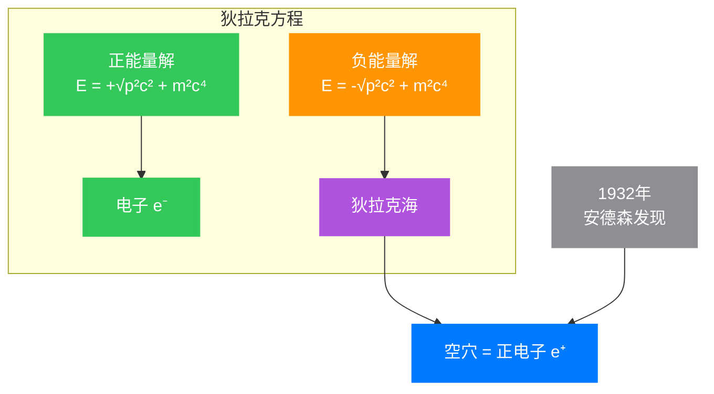

## 引言：1928年的秋天

1928年的剑桥，一位沉默寡言的年轻人正在办公室里来回踱步。26岁的保罗·狄拉克（Paul Dirac）面临着一个困扰整个物理学界的问题：如何将**量子力学**与**狭义相对论**统一起来？

当时的物理学界就像一个分裂的家庭。一边是薛定谔方程（Schrödinger equation），它成功地描述了原子中的电子行为，但只在低速情况下有效；另一边是爱因斯坦的狭义相对论，它告诉我们当速度接近光速时会发生什么。问题是——这两者似乎水火不容。

让我们从这个困境出发，一步步理解狄拉克是如何找到答案的。

## 第一部分：问题的本质

### 1.1 薛定谔方程的成功与局限

1926年，奥地利物理学家埃尔温·薛定谔提出了著名的波动方程：

$$ i\hbar\frac{\partial}{\partial t}\psi(\mathbf{r},t) = \hat{H}\psi(\mathbf{r},t) $$

对于自由粒子（没有外力作用），哈密顿量是：

$$ \hat{H} = \frac{\hat{\mathbf{p}}^2}{2m} = -\frac{\hbar^2}{2m}\nabla^2 $$

这个方程在描述原子中的电子时非常成功，它精确地预言了氢原子的能级。但仔细观察这个方程，你会发现一个根本性的问题：

**时间导数是一阶的**（$\frac{\partial}{\partial t}$），但**空间导数是二阶的**（$\nabla^2 = \frac{\partial^2}{\partial x^2} + \frac{\partial^2}{\partial y^2} + \frac{\partial^2}{\partial z^2}$）。

这种不对称性意味着什么呢？意味着这个方程在洛伦兹变换下不会保持不变——换句话说，它**不符合狭义相对论**。

### 1.2 能量-动量关系的启发

在狭义相对论中，自由粒子的能量和动量满足：

$$ E^2 = p^2c^2 + m^2c^4 $$

这就是著名的**质能方程**。在低速情况下（$p \ll mc$），我们可以展开：

$$ E = mc^2\sqrt{1 + \frac{p^2}{m^2c^2}} \approx mc^2 + \frac{p^2}{2m} $$

减去静止能量 $mc^2$，我们就得到经典的动能表达式 $\frac{p^2}{2m}$——这正是薛定谔方程中的哈密顿量！

所以薛定谔方程实际上只是相对论能量公式在低速情况下的近似。那么，我们能否直接使用完整的相对论能量-动量关系来构造波动方程呢？

### 1.3 克莱因-戈尔登方程的尝试

最直接的尝试是将量子力学中的能量和动量算符代入相对论能量-动量关系：

$$ E \rightarrow i\hbar\frac{\partial}{\partial t}, \quad \mathbf{p} \rightarrow -i\hbar\nabla $$

这样我们得到：

$$ \left(-\frac{1}{c^2}\frac{\partial^2}{\partial t^2} + \nabla^2 - \frac{m^2c^2}{\hbar^2}\right)\psi = 0 $$

这就是**克莱因-戈尔登方程**（Klein-Gordon equation）。它确实符合相对论（时间和空间导数都是二阶），但有一个严重的问题。

在量子力学中，波函数的模平方 $|\psi|^2$ 代表找到粒子的概率密度，它必须是非负的。但对于克莱因-戈尔登方程，如果我们定义概率密度为：

$$ \rho = \frac{i\hbar}{2mc^2}\left(\psi^*\frac{\partial\psi}{\partial t} - \psi\frac{\partial\psi^*}{\partial t}\right) $$

你会发现这个表达式**在某些情况下会是负的**！这在物理上是无法接受的——概率怎么可能小于零呢？

这个问题困扰着物理学家们。直到狄拉克提出了一个革命性的想法。

## 第二部分：狄拉克的洞见

### 2.1 一个疯狂的想法

狄拉克的想法简单但激进：**既然相对论能量-动量关系是二次的，那么如果我们能够将其"因子分解"为两个线性因子的乘积会怎样？**

换句话说，我们想找到某种数学对象 $\boldsymbol{\alpha} = (\alpha_1, \alpha_2, \alpha_3)$ 和 $\beta$，使得：

$$ E^2 - p^2c^2 - m^2c^4 = (E - c\boldsymbol{\alpha}\cdot\mathbf{p} - \beta mc^2)(E + c\boldsymbol{\alpha}\cdot\mathbf{p} + \beta mc^2) = 0 $$

如果这能做到，我们就可以取其中一个因子作为波动方程的基础：

$$ i\hbar\frac{\partial\psi}{\partial t} = \left(c\boldsymbol{\alpha}\cdot\hat{\mathbf{p}} + \beta mc^2\right)\psi $$

这个方程中，**时间导数和空间导数都是一阶的**！完全对称！

### 2.2 矩阵的必要性

但这里有个问题。如果我们尝试用普通的数来构造 $\boldsymbol{\alpha}$ 和 $\beta$，我们会发现这是不可能的。让我们展开上面的乘积：

$$ (E - c\boldsymbol{\alpha}\cdot\mathbf{p} - \beta mc^2)(E + c\boldsymbol{\alpha}\cdot\mathbf{p} + \beta mc^2) $$
$$ = E^2 - c^2(\boldsymbol{\alpha}\cdot\mathbf{p})^2 - \beta^2m^2c^4 - mc^2(\beta E - E\beta) - c(\boldsymbol{\alpha}\cdot\mathbf{p})\beta mc^2 + \beta mc^2(\boldsymbol{\alpha}\cdot\mathbf{p}) $$

要让这个等于 $E^2 - p^2c^2 - m^2c^4$，我们需要：

1. $\alpha_i\alpha_j + \alpha_j\alpha_i = 2\delta_{ij}I$ （当 $i \neq j$ 时，$\alpha_i$ 和 $\alpha_j$ **反对易**）
2. $\alpha_i\beta + \beta\alpha_i = 0$ （$\alpha_i$ 和 $\beta$ **反对易**）
3. $\beta^2 = I$ （$\beta$ 的平方是单位矩阵）

这里的关键词是**反对易**（anticommute）：$AB + BA = 0$。普通的数总是满足交换律 $AB = BA$，不可能满足这样的关系。

但是——**矩阵可以！**

### 2.3 最小的维度

通过数学推导可以证明，满足上述关系的矩阵最小需要是 **$4 \times 4$** 的。这意味着波函数 $\psi$ 不能是一个简单的数（标量），而必须是一个**四分量的对象**：

$$ \psi = \begin{pmatrix} \psi_1 \\ \psi_2 \\ \psi_3 \\ \psi_4 \end{pmatrix} $$

这在当时是非常大胆的想法——波函数不仅是一个数，而是一个有四个分量的"东西"！

## 第三部分：狄拉克方程的推导

### 3.1 狄拉克矩阵的表示

虽然有很多种方式表示这些4×4矩阵，但最常用的是**狄拉克-泡利表示**：

$$ \gamma^0 = \begin{pmatrix} I & 0 \\ 0 & -I \end{pmatrix} = \begin{pmatrix} 1 & 0 & 0 & 0 \\ 0 & 1 & 0 & 0 \\ 0 & 0 & -1 & 0 \\ 0 & 0 & 0 & -1 \end{pmatrix} $$

$$ \gamma^i = \begin{pmatrix} 0 & \sigma_i \\ -\sigma_i & 0 \end{pmatrix}, \quad i = 1,2,3 $$

其中的 $\sigma_i$ 是**泡利矩阵**（Pauli matrices）：

$$ \sigma_1 = \begin{pmatrix} 0 & 1 \\ 1 & 0 \end{pmatrix}, \quad \sigma_2 = \begin{pmatrix} 0 & -i \\ i & 0 \end{pmatrix}, \quad \sigma_3 = \begin{pmatrix} 1 & 0 \\ 0 & -1 \end{pmatrix} $$

这些矩阵满足一个重要的代数关系：

$$ \{\gamma^\mu, \gamma^v\} = \gamma^\mu\gamma^v + \gamma^v\gamma^\mu = 2g^{\mu\nu}I $$

其中 $g^{\mu\nu}$ 是闵可夫斯基度规（$\mu, v = 0,1,2,3$），$\{A, B\} = AB + BA$ 是**反对易子**。

### 3.2 狄拉克方程的协变形式

使用这些 $\gamma$ 矩阵，狄拉克方程可以写成非常简洁的形式：

$$ \left(i\hbar\gamma^\mu\partial_\mu - mc\right)\psi = 0 $$

这里使用了爱因斯坦求和约定：重复的指标 $\mu$ 自动求和。具体展开就是：

$$ \left(i\hbar\gamma^0\frac{\partial}{\partial t} + i\hbar\gamma^1\frac{\partial}{\partial x} + i\hbar\gamma^2\frac{\partial}{\partial y} + i\hbar\gamma^3\frac{\partial}{\partial z} - mc\right)\psi = 0 $$

这个形式的美妙之处在于它**明显是洛伦兹协变的**——在任何惯性参考系中，方程的形式都保持不变。

### 3.3 哈密顿形式

如果我们想更清楚地看到时间演化，可以乘以 $\gamma^0$ 并重新整理：

$$ i\hbar\frac{\partial\psi}{\partial t} = \left(c\boldsymbol{\alpha}\cdot\hat{\mathbf{p}} + \beta mc^2\right)\psi $$

其中 $\boldsymbol{\alpha} = (\alpha_1, \alpha_2, \alpha_3)$ 和 $\beta$ 通过 $\gamma$ 矩阵定义：

$$ \alpha_i = \gamma^0\gamma^i, \quad \beta = \gamma^0 $$

### 3.4 概率密度为正

现在让我们验证一个关键性质：概率密度是否非负？

定义概率密度为：

$$ \rho = \psi^\dagger\psi = |\psi_1|^2 + |\psi_2|^2 + |\psi_3|^2 + |\psi_4|^2 $$

这里 $\psi^\dagger = (\psi_1^*, \psi_2^*, \psi_3^*, \psi_4^*)$ 是厄米共轭。由于每一项都是模的平方，$\rho$ **必然是非负的**！

更重要的是，$\rho$ 满足连续性方程：

$$ \frac{\partial\rho}{\partial t} + \nabla\cdot\mathbf{j} = 0 $$

其中概率流密度为：

$$ \mathbf{j} = c\psi^\dagger\boldsymbol{\alpha}\psi $$

这保证了概率的守恒性。

## 第四部分：物理意义的揭示

### 4.1 电子自旋的自然出现

狄拉克方程最令人惊讶的性质之一是：**电子自旋自动出现，不需要人为添加**！

让我们看看总角动量算符。定义轨道角动量：

$$ \mathbf{L} = \mathbf{r} \times \mathbf{p} $$

以及自旋角动量：

$$ \mathbf{S} = \frac{\hbar}{2}\boldsymbol{\Sigma} $$

其中 $\boldsymbol{\Sigma} = \begin{pmatrix} \boldsymbol{\sigma} & 0 \\ 0 & \boldsymbol{\sigma} \end{pmatrix}$。

可以证明，总角动量 $\mathbf{J} = \mathbf{L} + \mathbf{S}$ 在狄拉克方程下是守恒的。更神奇的是，自旋的值自然地是 $\hbar/2$——**完全由理论给出，无需任何额外的假设**！

在非相对论量子力学中，自旋是乌伦贝克和高德斯密特在1925年"硬塞"进理论中的。但狄拉克告诉我们：**自旋不是外加的，而是相对论和量子力学结合的必然结果**！

### 4.2 负能量之谜

当我们求解狄拉克方程时，会发现能量本征值是：

$$ E = \pm\sqrt{p^2c^2 + m^2c^4} $$

注意那个 **±号**——意味着除了正能量解，还有**负能量解**！

这看似是个灾难：
- 如果负能量状态存在，正能量电子应该不断跌落到越来越低的负能级
- 这个过程会释放无限大的能量
- 原子将无法稳定存在

狄拉克提出了一个天才的解释：**空海理论**（Dirac Sea）

想象所有负能量状态都被电子填满，形成"狄拉克海"。根据泡利不相容原理，正能量电子无法跌入这些已被占据的状态。

但是，如果负能海中有一个"空穴"会怎样？这个空穴表现为：
- 带正电的粒子（因为电子带负电，缺少一个电子就相当于多一个正电荷）
- 具有与电子相同的质量
- 具有与电子相反的量子数

这就是**正电子**（positron）——电子的反粒子！

1932年，卡尔·安德森在宇宙射线中发现了正电子，完全证实了狄拉克的预言。这是物理学史上**最著名的理论预言之一**。

### 4.3 旋量的四重态

狄拉克旋量的四个分量有明确的物理意义：

- **上半部分**（$\psi_1, \psi_2$）：描述**电子**的两个自旋态（自旋向上和向下）
- **下半部分**（$\psi_3, \psi_4$）：描述**正电子**的两个自旋态

在非相对论极限下（速度远小于光速），上下分量退耦，我们得到泡利方程。

## 第五部分：实际应用与验证

### 5.1 氢原子精细结构

狄拉克方程的第一个重大应用是解释氢原子光谱的**精细结构**（fine structure）。

当用狄拉克方程求解氢原子（考虑相对论效应）时，能级为：

$$ E_{n,j} = mc^2\left[1 + \frac{\alpha^2}{\left(n - (j+1/2) + \sqrt{(j+1/2)^2 - \alpha^2}\right)^2}\right]^{-1/2} $$

其中：
- $n$ 是主量子数
- $j$ 是总角动量量子数
- $\alpha \approx 1/137$ 是**精细结构常数**（fine structure constant）

这个公式与实验数据**完美吻合**，解释了：
- 能级的精细结构分裂
- 电子的 $g$ 因子（朗德因子）约为 2
- 相对论效应导致的能量修正

### 5.2 量子电动力学（QED）的基础

狄拉克方程为**量子电动力学**（Quantum Electrodynamics，QED）奠定了基础。QED是描述电磁相互作用的量子场论，是人类历史上**最精确的物理理论**。

在QED中：
- **狄拉克场**描述电子和正电子
- **电磁场**由光子传递
- 相互作用通过**规范原理**确定

QED的预言精度惊人。以电子的反常磁矩为例：

$$ \frac{g-2}{2} = 0.00115965218128(77) \quad \text{(理论值)} $$
$$ \frac{g-2}{2} = 0.00115965218091(26) \quad \text{(实验值)} $$

两者符合到**12位有效数字**——这是人类理论与实验吻合的最高精度！

### 5.3 现代技术：PET扫描

狄拉克方程预言的正电子在实际中有重要的医学应用——**正电子发射断层扫描**（Positron Emission Tomography，PET）。

**PET扫描的原理**：
1. 放射性示踪剂（如¹⁸F-脱氧葡萄糖）注入体内
2. 示踪剂衰变放出正电子
3. 正电子与体内电子湮灭，产生两个γ光子
4. 探测器记录光子，重建体内代谢活动图像

这在**肿瘤检测**、**脑部疾病诊断**、**心脏病评估**等方面有广泛应用。

### 5.4 凝聚态物理：石墨烯与狄拉克材料

令人惊讶的是，狄拉克方程在凝聚态物理中也有重要应用！

2004年，科学家发现了**石墨烯**（Graphene）——单层碳原子构成的二维材料。这个发现获得了2010年诺贝尔物理学奖。石墨烯中的电子行为可以用**二维狄拉克方程**描述：

$$ v_F\boldsymbol{\sigma}\cdot\mathbf{p}\psi = E\psi $$

其中 $v_F \approx c/300$ 是费米速度（比光速慢约300倍）。

这导致了许多奇异的性质：
- **量子霍尔效应**（Quantum Hall Effect）——在室温下也能观察到
- **克莱因隧穿**（Klein Tunneling）——电子可以无阻碍地穿过经典理论认为无法穿越的高势垒
- **超高电子迁移率**——比传统的半导体材料高很多倍

石墨烯的发现开启了**狄拉克材料**（Dirac Materials）的研究热潮。这些材料中的准粒子满足相对论性的狄拉克方程，为我们提供了一个"桌面上的相对论实验室"。

### 5.5 CPT对称性

狄拉克方程满足一个深刻的对称性——**CPT对称性**：

- **C**（电荷共轭，Charge Conjugation）：粒子 ↔ 反粒子
- **P**（宇称，Parity）：空间反射 $(x,y,z) ↔ (-x,-y,-z)$
- **T**（时间反演，Time Reversal）：$t ↔ -t$

量子场论的一个基本定理（CPT定理）告诉我们：**任何洛伦兹不变的局域量子场论都必须满足CPT对称性**。

这意味着，如果我们同时进行电荷共轭、空间反射和时间反演，物理定律应该保持不变。这个对称性是现代物理学的基石之一。

### 5.6 现代前沿：拓扑材料

近年来，**拓扑绝缘体**（Topological Insulators）和**外尔半金属**（Weyl Semimetals）的发现，再次将狄拉克方程带到研究前沿。

这些材料中的准粒子可以用狄拉克方程或外尔方程（无质量的狄拉克方程）描述，具有：
- **受拓扑保护的表面态**——非常稳定，不易受到杂质和缺陷的影响
- **超高电导率**——可能用于下一代电子器件
- **量子计算的潜在应用**——拓扑量子计算

狄拉克方程，这个近100年前发现的方程，至今仍在凝聚态物理的前沿研究中发挥着关键作用。

## 结语：数学之美的胜利

狄拉克方程的发现是**科学史上最伟大的成就之一**。它不仅统一了量子力学和狭义相对论，还：

1. **预言了反物质**（正电子）
2. **解释了电子自旋**
3. **建立了量子电动力学的基础**
4. **开启了粒子物理标准模型的时代**

狄拉克本人以其极简主义的科学哲学著称。他相信：

> **"一个物理方程必须在数学上是优美的。"**

狄拉克方程完美地体现了这个信念。它告诉我们：**看似抽象的数学可以揭示宇宙最深层的秘密**。

当我们回顾这段历史，我们会发现一个深刻的真理：**对数学美的追求，往往是发现真理的向导**。这也许是狄拉克留给我们的最宝贵的遗产。

---

## 参考文献

1. Dirac, P. A. M. (1928). "The Quantum Theory of the Electron". *Proceedings of the Royal Society A*. 117 (778): 610–624.
2. Bjorken, J. D., & Drell, S. D. (1964). *Relativistic Quantum Mechanics*. McGraw-Hill.
3. Peskin, M. E., & Schroeder, D. V. (1995). *An Introduction to Quantum Field Theory*. Addison-Wesley.
4. [Dirac equation - Wikipedia](https://en.wikipedia.org/wiki/Dirac_equation)
5. [The Discovery of Dirac Equation - Indian Academy of Sciences](https://www.ias.ac.in/article/fulltext/reso/008/08/0059-0074)
