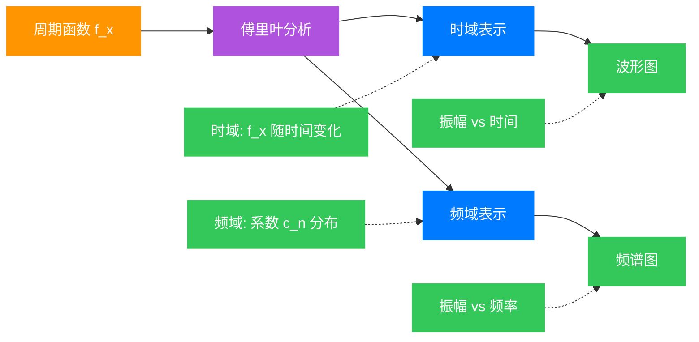
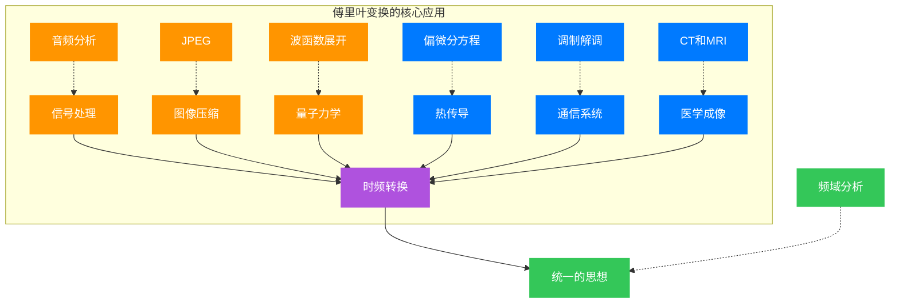

## 引言：1822年的一个大胆断言

想象你站在19世纪初的巴黎，一位头发花白的法国数学家约瑟夫·傅里叶（Joseph Fourier）刚刚完成了一部巨著《热的解析理论》。在这本书中，他提出了一个在当时看来**近乎荒谬**的断言：

**任何周期函数，无论多么复杂，都可以表示为简单的正弦和余弦函数的无穷级数。**

这个想法在当时激起了巨大的争议。著名的数学家拉格朗日（Lagrange）甚至认为这是不可能的。但傅里叶坚持自己的观点，并用这个方法成功解决了困扰数学家多年的热传导方程。

为什么这个想法如此重要？因为正弦函数 $\sin(x)$ 和余弦函数 $\cos(x)$ 是我们最理解、最容易处理的函数。如果任何复杂函数都能分解成这些简单函数的叠加，那么我们就可以把复杂问题转化为简单问题来解决。

今天，从你的手机音乐播放器到医学影像设备，从JPEG图像压缩到量子力学计算，傅里叶的思想无处不在。让我们从历史的长河出发，逐步理解这个改变世界的数学工具。

## 第一章：历史演变——从音乐到数学的千年旅程

### 1.1 古希腊的发现：音乐是数学

公元前6世纪，毕达哥拉斯（Pythagoras）做了一个著名的实验。他拨动不同长度的琴弦，发现：
- 当弦长比例为 $2:1$ 时，听起来是八度音
- 当弦长比例为 $3:2$ 时，听起来是五度音
- 当弦长比例为 $4:3$ 时，听起来是四度音

这让他意识到：**音乐的和谐可以用数学比例来描述**。这是人类第一次认识到声音的"频率"概念——琴弦振动越快，音调越高。

更神奇的是，古希腊人还发现：任何复杂的声音都可以分解为多个"纯音"（正弦波）的组合。这其实就是傅里叶级数思想的萌芽！

### 1.2 18世纪的挑战：弦振动的谜题

时间来到18世纪，物理学家们对弦的振动产生了浓厚兴趣。小提琴、钢琴的弦是如何振动的？如何从数学上描述这种振动？

1747年，达朗贝尔（d'Alembert）得到了弦振动方程：
$$ \frac{\partial^2 y}{\partial t^2} = c^2 \frac{\partial^2 y}{\partial x^2} $$

但这个方程的解是什么？欧拉（Euler）和伯努利（Bernoulli）分别给出了不同的解答。伯努利提出：弦的任何运动都可以表示为"固有模式"（正弦波）的叠加。

$$ y(x,t) = \sum_{n=1}^{\infty} A_n \sin\left(\frac{n\pi x}{L}\right)\cos\left(\frac{n\pi c t}{L}\right) $$

但拉格朗日质疑：**任意函数真的都能这样分解吗？** 这个争论持续了半个多世纪，直到傅里叶给出答案。

### 1.3 1807年：傅里叶的革命性论文

1807年，傅里叶向法国科学院提交了一篇关于热传导的论文。在研究金属棒中热量如何传播时，他遇到了一个难题：如何表示初始温度分布？

傅里叶提出：**初始温度函数 $f(x)$ 可以表示为**

$$ f(x) = a_0 + \sum_{n=1}^{\infty} a_n \cos\left(\frac{n\pi x}{L}\right) + b_n \sin\left(\frac{n\pi x}{L}\right) $$

这个想法太激进了！当时的数学界包括拉格朗日、拉普拉斯等人都持怀疑态度。他们认为：正弦和余弦函数都是光滑的、连续的，怎么可能组合出一个有"尖角"或者"跳跃"的函数？

但傅里叶并没有被质疑吓倒。他给出了**计算系数 $a_n$ 和 $b_n$ 的具体方法**，并用大量例子证明这个方法有效。

### 1.4 最终的胜利：从质疑到教科书

1822年，傅里叶出版了《热的解析理论》，完整阐述了他的理论。这本书的影响力是巨大的：
- 数学家开始重新思考"函数"的定义
- 柯西（Cauchy）、黎曼（Riemann）等人在此基础上建立了严格的函数理论
- 狄利克雷（Dirichlet）给出了傅里叶级数收敛的充分条件

到19世纪末，傅里叶级数已经成为数学分析的核心工具。而到了20世纪，随着电信号处理的出现，这个理论找到了它的用武之地。

今天我们回顾这段历史，不禁感叹：一个源于热传导问题的数学工具，竟然成为理解波、信号、信息的通用语言。

## 第二章：从直觉到推导——理解傅里叶级数

### 2.1 什么是周期函数？

首先，让我们明确什么是周期函数。一个函数 $f(x)$ 称为周期函数，如果存在正数 $T$（称为周期），使得：

$$ f(x+T) = f(x) \quad \text{对所有} \ x \ \text{成立} $$

**例子**：
- $\sin(x)$ 的周期是 $2\pi$
- $\cos(2x)$ 的周期是 $\pi$
- 方波函数也是周期函数

傅里叶的断言是：**任何周期为 $2\pi$ 的函数 $f(x)$ 都可以表示为**

$$ f(x) = \frac{a_0}{2} + \sum_{n=1}^{\infty} \left[a_n \cos(nx) + b_n \sin(nx)\right] $$

### 2.2 直观理解：为什么是正弦和余弦？

选择正弦和余弦函数有几个重要原因：

**1. 简单性**：正弦和余弦是最基本的周期函数
**2. 完备性**：它们足够"丰富"，能组合出任何周期函数
**3. 正交性**：不同频率的正弦/余弦函数在积分意义下"垂直"
**4. 物理意义**：它们对应于"纯音"、"纯色"等基本振动

*图4：波形叠加可视化。黑色虚线显示目标方波，绿色实线显示前4项谐波的叠加结果。蓝色、紫色、橙色、青色分别表示基波（n=1）、3次谐波（n=3）、5次谐波（n=5）、7次谐波（n=7）。通过叠加这些正弦波，可以逐步逼近方波。*

想象你在绘画。如果有红、绿、蓝三种基本颜色，你可以混合出任何颜色。同样，傅里叶告诉我们：正弦和余弦就是函数空间的"基色"。

### 2.3 正交性：计算系数的关键

傅里叶级数的美妙之处在于，我们可以用**正交性**来计算每个系数。什么是正交性？

考虑以下积分（在区间 $[-\pi, \pi]$ 上）：

$$ \int_{-\pi}^{\pi} \cos(mx)\cos(nx)\,dx = \begin{cases} 0, & m \neq n \\ \pi, & m = n \neq 0 \\ 2\pi, & m = n = 0 \end{cases} $$

$$ \int_{-\pi}^{\pi} \sin(mx)\sin(nx)\,dx = \begin{cases} 0, & m \neq n \\ \pi, & m = n \neq 0 \end{cases} $$

$$ \int_{-\pi}^{\pi} \cos(mx)\sin(nx)\,dx = 0 \quad \text{对所有} \ m,n $$

这意味着：**不同频率的正弦/余弦函数在积分意义下互相"垂直"！**

这个性质类似于几何中的向量垂直。如果向量 $\mathbf{v}_1 \perp \mathbf{v}_2$，那么 $\mathbf{v}_1 \cdot \mathbf{v}_2 = 0$。这里，积分 $\int f(x)g(x)\,dx$ 就像向量的点积。

### 2.4 计算系数 $a_0$

让我们从常数项 $a_0$ 开始。对傅里叶级数两边在 $[-\pi, \pi]$ 上积分：

$$ \int_{-\pi}^{\pi} f(x)\,dx = \int_{-\pi}^{\pi} \frac{a_0}{2}\,dx + \sum_{n=1}^{\infty} \left[a_n \int_{-\pi}^{\pi} \cos(nx)\,dx + b_n \int_{-\pi}^{\pi} \sin(nx)\,dx\right] $$

利用正交性，所有正弦和余弦的积分都等于零，只剩下：

$$ \int_{-\pi}^{\pi} f(x)\,dx = \frac{a_0}{2} \cdot 2\pi $$

因此：

$$ a_0 = \frac{1}{\pi} \int_{-\pi}^{\pi} f(x)\,dx $$

**物理解释**：$a_0/2$ 是函数 $f(x)$ 的平均值（直流分量）。

### 2.5 计算系数 $a_n$

要计算 $a_n$（$n \geq 1$），我们在傅里叶级数两边乘以 $\cos(nx)$，然后积分：

$$ \int_{-\pi}^{\pi} f(x)\cos(nx)\,dx = \frac{a_0}{2}\int_{-\pi}^{\pi} \cos(nx)\,dx + \sum_{m=1}^{\infty} \left[a_m \int_{-\pi}^{\pi} \cos(mx)\cos(nx)\,dx + b_m \int_{-\pi}^{\pi} \sin(mx)\cos(nx)\,dx\right] $$

根据正交性：
- $\int_{-\pi}^{\pi} \cos(nx)\,dx = 0$
- $\int_{-\pi}^{\pi} \sin(mx)\cos(nx)\,dx = 0$
- $\int_{-\pi}^{\pi} \cos(mx)\cos(nx)\,dx = 0$（当 $m \neq n$）
- $\int_{-\pi}^{\pi} \cos^2(nx)\,dx = \pi$

因此，级数中只有 $m = n$ 的项留下来：

$$ \int_{-\pi}^{\pi} f(x)\cos(nx)\,dx = a_n \cdot \pi $$

得到：

$$ a_n = \frac{1}{\pi} \int_{-\pi}^{\pi} f(x)\cos(nx)\,dx $$

### 2.6 计算系数 $b_n$

类似地，乘以 $\sin(nx)$ 再积分：

$$ \int_{-\pi}^{\pi} f(x)\sin(nx)\,dx = \frac{a_0}{2}\int_{-\pi}^{\pi} \sin(nx)\,dx + \sum_{m=1}^{\infty} \left[a_m \int_{-\pi}^{\pi} \cos(mx)\sin(nx)\,dx + b_m \int_{-\pi}^{\pi} \sin(mx)\sin(nx)\,dx\right] $$

只有 $\int_{-\pi}^{\pi} \sin^2(nx)\,dx = \pi$ 不为零：

$$ b_n = \frac{1}{\pi} \int_{-\pi}^{\pi} f(x)\sin(nx)\,dx $$

### 2.7 完整的傅里叶级数公式

总结一下，对于周期为 $2\pi$ 的函数 $f(x)$：

**傅里叶级数**：
$$ f(x) \sim \frac{a_0}{2} + \sum_{n=1}^{\infty} \left[a_n \cos(nx) + b_n \sin(nx)\right] $$

**傅里叶系数**：
$$ a_n = \frac{1}{\pi}\int_{-\pi}^{\pi} f(x)\cos(nx)\,dx, \quad n = 0,1,2,\ldots $$
$$ b_n = \frac{1}{\pi}\int_{-\pi}^{\pi} f(x)\sin(nx)\,dx, \quad n = 1,2,\ldots $$

**注意**：这里用 $\sim$ 而不是 $=$，因为级数可能在某些点不收敛到 $f(x)$。

*图3：方波的傅里叶频谱。蓝色条形图显示各次谐波的幅值|b_n|。红色点线表示理论包络4/(nπ)。注意到：只有奇数次谐波（n=1,3,5,7,...）的幅值非零，且幅值按1/n衰减。*

### 2.8 一般周期的情况

如果函数 $f(x)$ 的周期是 $2L$（不是 $2\pi$），我们做变量替换 $u = \frac{\pi x}{L}$：

**傅里叶级数**：
$$ f(x) \sim \frac{a_0}{2} + \sum_{n=1}^{\infty} \left[a_n \cos\left(\frac{n\pi x}{L}\right) + b_n \sin\left(\frac{n\pi x}{L}\right)\right] $$

**傅里叶系数**：
$$ a_n = \frac{1}{L} \int_{-L}^{L} f(x)\cos\left(\frac{n\pi x}{L}\right)\,dx $$

$$ b_n = \frac{1}{L} \int_{-L}^{L} f(x)\sin\left(\frac{n\pi x}{L}\right)\,dx $$

### 2.9 一个具体例子：方波函数

让我们用一个经典例子来实践。考虑周期为 $2\pi$ 的方波函数：

$$ f(x) = \begin{cases} 1, & 0 < x < \pi \\ -1, & -\pi < x < 0 \end{cases} $$

**计算 $a_0$**：
$$ a_0 = \frac{1}{\pi}\left[\int_{-\pi}^{0}(-1)\,dx + \int_{0}^{\pi} 1\,dx\right] = \frac{1}{\pi}[-\pi + \pi] = 0 $$

**计算 $a_n$**：
$$ a_n = \frac{1}{\pi}\left[\int_{-\pi}^{0}(-1)\cos(nx)\,dx + \int_{0}^{\pi} \cos(nx)\,dx\right] = 0 $$

因为 $\cos(nx)$ 是偶函数，对称区间上的积分抵消了。

**计算 $b_n$**：
$$ b_n = \frac{1}{\pi}\left[\int_{-\pi}^{0}(-1)\sin(nx)\,dx + \int_{0}^{\pi} \sin(nx)\,dx\right] $$

$$ = \frac{1}{\pi}\left[\frac{\cos(nx)}{n}\Big|_{-\pi}^{0} - \frac{\cos(nx)}{n}\Big|_{0}^{\pi}\right] $$

$$ = \frac{1}{\pi n}\left[(1 - \cos(-n\pi)) - (\cos(n\pi) - 1)\right] $$

由于 $\cos(n\pi) = (-1)^n$，我们得到：

$$ b_n = \frac{2}{n\pi}(1 - (-1)^n) = \begin{cases} \frac{4}{n\pi}, & n \ \text{为奇数} \\ 0, & n \ \text{为偶数} \end{cases} $$

**方波的傅里叶级数**：
$$ f(x) = \frac{4}{\pi}\left(\sin x + \frac{\sin(3x)}{3} + \frac{\sin(5x)}{5} + \cdots\right) $$

*图1：方波的傅里叶级数逼近。红色虚线表示精确的方波，彩色实线显示不同项数的傅里叶级数逼近（N=1,3,5,10,20,50）。随着N增加，逼近越来越接近精确方波。*

这个结果令人惊叹：**方波（有尖角！）竟然可以完全由光滑的正弦波组合而成！**

## 第三章：深入理解——收敛性与奇观现象

### 3.1 狄利克雷条件：什么时候傅里叶级数收敛？

不是所有函数的傅里叶级数都收敛到函数本身。1837年，狄利克雷给出了著名的**狄利克雷条件**：

如果函数 $f(x)$ 在 $[-\pi, \pi]$ 上满足：
1. **有界**：存在 $M$ 使得 $|f(x)| \leq M$
2. **分段连续**：只有有限个间断点
3. **分段单调**：可以分成有限个单调区间

那么傅里叶级数在连续点收敛到 $f(x)$，在间断点 $x_0$ 收敛到左右极限的平均值：

$$ \frac{f(x_0^+) + f(x_0^-)}{2} $$

这些条件相当宽松，意味着傅里叶级数对**几乎所有的实用函数**都有效！

### 3.2 吉布斯现象：跳跃点的"过冲"

让我们重新看方波的傅里叶级数：
$$ f_N(x) = \frac{4}{\pi}\sum_{k=1}^{N} \frac{\sin((2k-1)x)}{2k-1} $$

如果我们要取前 $N$ 项（部分和），在 $x = 0$ 附近会发生什么？

**吉布斯现象**（Gibbs Phenomenon）：在函数的跳跃间断点附近，傅里叶级数的部分和会出现约 $9\%$ 的"过冲"（overshoot）。

*图2：吉布斯现象的放大视图。在x=0附近，傅里叶级数在间断点处出现过冲。随着项数N增加，最大值趋向于约1.089（比理论值1.0高出约8.9%），但这个过冲永远不会消失，只是宽度越来越窄。*

具体来说，对于高度从 $-1$ 跳到 $1$ 的方波：
- 部分和的最大值约为 $1.08949$（而不是 $1$）
- 这个过冲不会随着 $N \to \infty$ 而消失
- 但过冲的宽度会趋于零

这个现象在1899年由吉布斯（Gibbs）首次解释。它告诉我们：**傅里叶级数在间断点的收敛不是一致的**。

### 3.3 复数形式：更简洁的表达

利用欧拉公式 $e^{ix} = \cos x + i\sin x$，我们可以将傅里叶级数写成更紧凑的复数形式：

$$ f(x) \sim \sum_{n=-\infty}^{\infty} c_n e^{inx} $$

其中复数系数为：

$$ c_n = \frac{1}{2\pi} \int_{-\pi}^{\pi} f(x)e^{-inx}\,dx $$

**与实数形式的关系**：
- $c_0 = a_0/2$
- $c_n = (a_n - ib_n)/2$（$n > 0$）
- $c_{-n} = (a_n + ib_n)/2$（$n > 0$）

复数形式在理论推导和计算中往往更方便，特别是在信号处理领域。

### 3.4 帕塞瓦尔等式：能量守恒

帕塞瓦尔等式（Parseval's Identity）揭示了傅里叶级数的一个深刻性质：

$$ \frac{1}{2\pi}\int_{-\pi}^{\pi} |f(x)|^2\,dx = \frac{|a_0|^2}{4} + \frac{1}{2}\sum_{n=1}^{\infty}(|a_n|^2 + |b_n|^2) = \sum_{n=-\infty}^{\infty} |c_n|^2 $$

**物理意义**：函数的"能量"（$|f|^2$ 的积分）等于各频率分量能量的总和。这是**能量守恒**在频域的体现！

## 第四章：广泛应用——从理论到技术

### 4.1 信号处理：分析声音的本质

最直接的应用是声音信号分析。当你听到音乐时，你的耳朵正在做傅里叶分析！

**例子**：钢琴演奏中央C（频率 $261.6\,\text{Hz}$）
- **基频**：$261.6\,\text{Hz}$
- **泛音**：$523.2\,\text{Hz}$, $784.8\,\text{Hz}$, $1046.4\,\text{Hz}$, ...

每个音色的区别在于**泛音的强度分布不同**：
- 钢琴：泛音丰富，高频分量较强
- 长笛：泛音较少，接近纯正弦波
- 小提琴：泛音很多，且有特殊的共振峰

音乐的**频谱**就是傅里叶系数的模 $|c_n|$ 随频率 $n$ 的分布图。

### 4.2 图像压缩：JPEG格式的秘密

你的数码相机拍摄的照片大多是JPEG格式。JPEG压缩的核心思想就是**频域分析**：

1. **分块**：将图像分成 $8 \times 8$ 的像素块
2. **二维离散余弦变换（DCT）**：每个块用64个"基础图像"的加权和表示
3. **量化**：高频分量（细节）用较少的比特表示
4. **熵编码**：进一步压缩数据

DCT本质上是二维的傅里叶余弦变换。由于人眼对高频细节不敏感，我们可以大幅削减高频分量而几乎不影响视觉效果。

这就是为什么JPEG能在**10:1甚至20:1的压缩比**下仍保持较好的图像质量！

### 4.3 量子力学：波函数的展开

在量子力学中，粒子状态用波函数 $\psi(x)$ 描述。如果粒子处于有限深势阱中，$\psi(x)$ 可以用能量本征态展开：

$$ \psi(x) = \sum_{n=1}^{\infty} c_n \phi_n(x) $$

其中 $\phi_n(x)$ 是薛定谔方程的解。这完全类似于傅里叶级数！

**系数的物理意义**：$|c_n|^2$ 是测量粒子处于第 $n$ 个能级的概率。

更一般地，在希尔伯特空间（Hilbert Space）中，**任何波函数都可以用一组正交归一基函数展开**——这就是量子力学的数学语言。

### 4.4 热传导方程：傅里叶的原始动机

让我们回到傅里叶研究的问题：一根长度为 $L$ 的金属棒，初始温度分布为 $f(x)$，两端保持 $0^\circ\text{C}$。温度 $u(x,t)$ 如何随时间演化？

热传导方程是：
$$ \frac{\partial u}{\partial t} = \alpha^2 \frac{\partial^2 u}{\partial x^2} $$

边界条件：$u(0,t) = u(L,t) = 0$

**傅里叶的解法**：
1. 将 $f(x)$ 展开为傅里叶正弦级数：
   $$ f(x) = \sum_{n=1}^{\infty} b_n \sin\left(\frac{n\pi x}{L}\right) $$

2. 对每个模式 $\sin\left(\frac{n\pi x}{L}\right)$，方程的解是：
   $$ u_n(x,t) = b_n e^{-\alpha^2(n\pi/L)^2 t} \sin\left(\frac{n\pi x}{L}\right) $$

3. 叠加所有模式：
   $$ u(x,t) = \sum_{n=1}^{\infty} b_n e^{-\alpha^2(n\pi/L)^2 t} \sin\left(\frac{n\pi x}{L}\right) $$

**物理直觉**：高频模式（$n$ 大）衰减得更快，因为指数因子 $e^{-\alpha^2(n\pi/L)^2 t}$。这解释了为什么温度分布会逐渐变得平滑。

### 4.5 调幅广播：无线电信号的传输

传统的AM收音机使用调幅（Amplitude Modulation）技术。原理是：

1. **音频信号**：$m(t) = A_m \cos(\omega_m t)$（例如音乐）
2. **载波信号**：$c(t) = A_c \cos(\omega_c t)$（高频，例如 $1\,\text{MHz}$）
3. **调制信号**：$s(t) = A_c[1 + k_am(t)]\cos(\omega_c t)$

展开后：
$$ s(t) = A_c\cos(\omega_c t) + \frac{A_c k_a A_m}{2}[\cos((\omega_c+\omega_m)t) + \cos((\omega_c-\omega_m)t)] $$

这里出现了**三个频率分量**：
- 载波频率 $\omega_c$
- 上边带 $\omega_c + \omega_m$
- 下边带 $\omega_c - \omega_m$

这正是傅里叶分析的应用！通过调制，我们将低频音频信号"搬移"到高频载波上，便于天线发射。

### 4.6 CT扫描：从投影重建图像

医院中的CT（Computed Tomography）扫描仪利用**傅里叶切片定理**（Fourier Slice Theorem）重建人体内部的三维图像。

**基本原理**：
1. X射线从不同角度穿过人体
2. 探测器测量衰减后的强度
3. 每个角度的测量是物体在某个方向的"投影"
4. **傅里叶切片定理**：投影的傅里叶变换等于物体二维傅里叶变换的一条径向切片
5. 通过反傅里叶变换重建图像

这个技术让医生能够"看到"人体内部的结构，拯救了无数生命。

## 第五章：数学之美——简单性背后的深刻

### 5.1 为什么傅里叶级数如此有效？

傅里叶级数的神奇之处在于：**复杂的函数可以分解为简单的正弦波**。但这为什么可能？

从几何角度看，函数空间是一个**无穷维向量空间**。正弦和余弦函数 $\{1, \cos x, \sin x, \cos 2x, \sin 2x, \ldots\}$ 构成了这个空间的**正交基**。

就像三维空间中任何向量 $\mathbf{v} = v_x\mathbf{i} + v_y\mathbf{j} + v_z\mathbf{k}$ 可以用基向量 $\{\mathbf{i}, \mathbf{j}, \mathbf{k}\}$ 表示一样，函数空间中任何函数都可以用傅里叶基函数表示。

### 5.2 泛函分析：完备性与收敛性

20世纪初，数学家们建立了泛函分析（Functional Analysis），为傅里叶级数提供了严格的数学基础：

- **希尔伯特空间**（Hilbert Space）：完备的内积空间
- **$L^2$ 空间**：平方可积函数空间
- **里斯-费舍尔定理**（Riesz-Fischer Theorem）：傅里叶级数在 $L^2$ 意义下收敛

这些定理告诉我们：**对于"大部分"函数，傅里叶级数都有效**。

### 5.3 从傅里叶级数到傅里叶变换

傅里叶级数处理**周期函数**。如果函数不是周期的怎么办？

令周期 $T \to \infty$，离散频率 $n\omega_0$ 变成连续频率 $\omega$，求和变成积分：

$$ f(x) = \frac{1}{2\pi}\int_{-\infty}^{\infty} \hat{f}(\omega)e^{i\omega x}\,d\omega $$

$$ \hat{f}(\omega) = \int_{-\infty}^{\infty} f(x)e^{-i\omega x}\,dx $$

这就是**傅里叶变换**（Fourier Transform）！它将我们带到了更广阔的领域。

## 总结：用简单构建复杂

傅里叶级数的故事从2000多年前毕达哥拉斯的音乐发现开始，经过18世纪数学家们的争论，在19世纪初由傅里叶完成理论框架，最终在20世纪成为现代科技的基础。

这个理论告诉我们：

**1. 简单可以构建复杂**：正弦波看似简单，但它们的叠加可以产生任何复杂波形
**2. 对称性是关键**：正交性让系数计算变得简单而优雅
**3. 抽象理论有实际价值**：一个纯数学工具最终改变了通信、医学、信息处理等领域
**4. 数学是通用的语言**：从音乐到量子力学，同样的数学描述不同的现象

傅里叶的遗产是巨大的。每当你：
- 用手机听音乐
- 看JPEG照片
- 做CT扫描
- 使用Wi-Fi

你都在体验傅里叶级数的应用。这个由热传导问题引发的数学工具，已经成为现代文明的基石之一。

正如数学家亨利·庞加莱（Henri Poincaré）所说：
> "数学不仅给予真理，还给予我们认识真理的能力。它教会我们，简单性的追求往往是发现真理的向导。"

傅里叶级数，正是这句话的完美例证。

---

## 附录：重要公式汇总

### A. 傅里叶级数的各种形式

**实数形式（周期 $2\pi$）**：
$$ f(x) \sim \frac{a_0}{2} + \sum_{n=1}^{\infty} [a_n\cos(nx) + b_n\sin(nx)] $$

$$ a_n = \frac{1}{\pi}\int_{-\pi}^{\pi} f(x)\cos(nx)\,dx $$
$$ b_n = \frac{1}{\pi}\int_{-\pi}^{\pi} f(x)\sin(nx)\,dx $$

**复数形式**：
$$ f(x) \sim \sum_{n=-\infty}^{\infty} c_n e^{inx} $$
$$ c_n = \frac{1}{2\pi}\int_{-\pi}^{\pi} f(x)e^{-inx}\,dx $$

### B. 重要定理

**帕塞瓦尔等式**：
$$ \frac{1}{2\pi}\int_{-\pi}^{\pi} |f(x)|^2\,dx = \sum_{n=-\infty}^{\infty} |c_n|^2 $$

**狄利克雷条件**：若 $f(x)$ 有界、分段连续、分段单调，则傅里叶级数在连续点收敛到 $f(x)$，在间断点收敛到左右极限的平均值。

### C. 傅里叶变换

$$ \hat{f}(\omega) = \int_{-\infty}^{\infty} f(x)e^{-i\omega x}\,dx $$
$$ f(x) = \frac{1}{2\pi}\int_{-\infty}^{\infty} \hat{f}(\omega)e^{i\omega x}\,d\omega $$

## 参考文献

1. Fourier, J. (1822). *Théorie analytique de la chaleur*. Paris: Firmin Didot Père et Fils.
2. Körner, T. W. (1988). *Fourier Analysis*. Cambridge University Press.
3. Stein, E. M., & Shakarchi, R. (2003). *Fourier Analysis: An Introduction*. Princeton University Press.
4. Folland, G. B. (2009). *Fourier Analysis and Its Applications*. American Mathematical Society.
5. Bracewell, R. N. (2000). *The Fourier Transform and Its Applications*. McGraw-Hill.
6. Tolstov, G. P. (1976). *Fourier Series*. Dover Publications.
7. [傅里叶级数 - 维基百科](https://en.wikipedia.org/wiki/Fourier_series)
8. [吉布斯现象 - Wolfram MathWorld](https://mathworld.wolfram.com/GibbsPhenomenon.html)

---

**作者注**：本文试图以通俗易懂的方式介绍傅里叶级数这一深刻的数学工具。建议读者在学习时：
1. **动手计算**：自己推导几个函数的傅里叶级数（如三角波、锯齿波）
2. **可视化**：用Python或MATLAB绘制不同项数的部分和，观察逼近过程
3. **思考应用**：在日常生活中寻找傅里叶级数的应用实例

傅里叶级数的美妙之处在于，它不仅是一个数学工具，更是一种思维方式——将复杂问题分解为简单部分的叠加。
