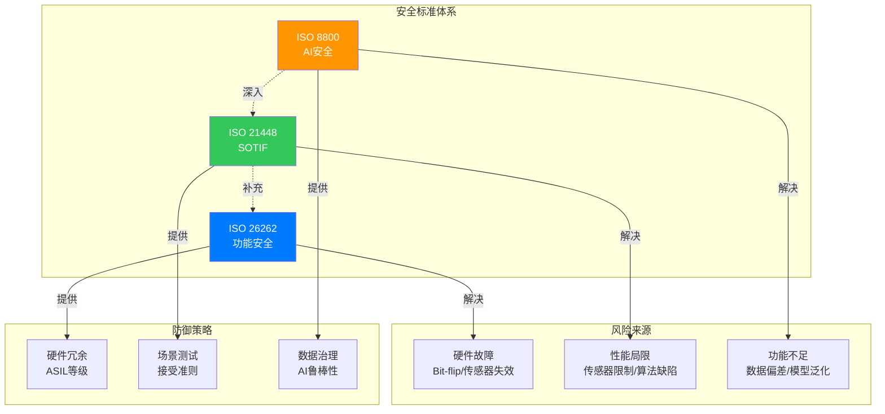
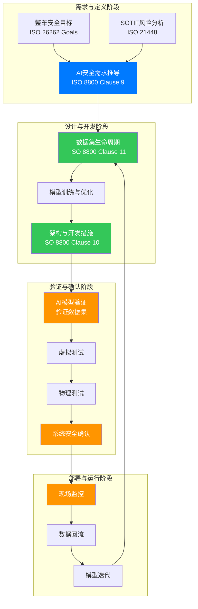
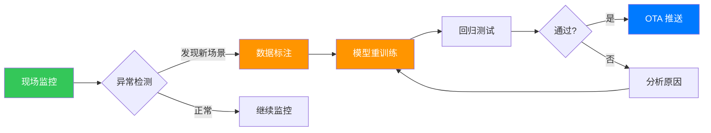
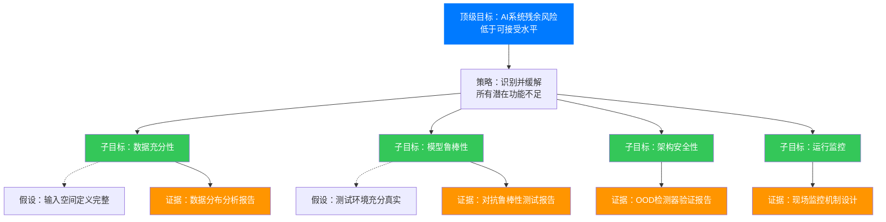

## 引言：确定性基石的动摇与重构

**本文仅代表本人以及所使用的AI工具的观点， 不代表任何公司或者机构实体的意见！**

在汽车工业百年的发展历程中，安全工程的基石始终建立在确定性逻辑之上。传统的 **ISO 26262 功能安全标准**，其核心哲学是"防错"——通过严格的流程控制和硬件冗余，防止电子电气系统发生非预期的故障。这种思想在数学上对应着清晰的布尔代数：系统要么正常（$x = 1$），要么失效（$x = 0$），边界分明。

然而，随着人工智能（AI），特别是深度学习技术在自动驾驶感知、预测及决策模块中的深度渗透，这一确定性基石遭遇了前所未有的冲击。AI 系统的行为不再完全由代码行数决定，而是由**数据分布**、**模型架构**及**训练过程中的随机性**共同涌现而成。以神经网络为例，其输出可以表示为：

$$
y = f(x; \theta) = \sigma_L(W_L \cdot \sigma_{L-1}(W_{L-1} \cdot \ldots \cdot \sigma_1(W_1 \cdot x + b_1) \ldots) + b_L)
$$

其中 $\theta = \{W_1, b_1, \ldots, W_L, b_L\}$ 是通过训练过程优化的参数。这种"黑盒"特性与概率性输出，使得传统的安全保障体系面临巨大的逻辑真空。

**ISO/PAS 8800:2024《道路车辆——安全与人工智能》** 的发布，标志着汽车安全工程正式进入了"**数据定义安全**"的新纪元。这不仅仅是一份新的技术规范，它是对现有安全方法论的一次系统性重构：它不再试图将 AI 强行塞入确定性的框架，而是承认 AI 的不确定性，并提供了一套全新的数学与工程语言来量化、管理和控制这种不确定性。

本文将从数学原理出发，系统性地解读 ISO 8800 的核心概念，并通过实战案例，展示如何在不确定的 AI 世界中构建可信的安全系统。

---

## 第一章：标准定位——三大安全支柱的逻辑互补

### 1.1 安全体系的演进：从单点防御到立体防护

理解 ISO 8800 的首要任务，是厘清其在现有安全标准体系中的生态位。现代汽车安全体系正演变为由 **ISO 26262**、**ISO 21448** 和 **ISO 8800** 共同支撑的三维架构。这三大标准并非简单的并列关系，而是形成了一个严密的逻辑闭环：



#### 1.1.1 与 ISO 26262 的接口：处理"硬件故障"

ISO 26262 关注的是**故障行为**（Malfunctioning Behaviour），即系统因软硬件失效而未能按设计意图执行功能。对于 AI 系统而言，其运行的硬件（如 GPU、NPU）和外周的传统软件代码（如数据预处理脚本）依然遵循 ISO 26262 的管控逻辑。

ISO 8800 明确指出，针对 AI 系统的硬件随机失效和系统性失效，需通过**裁剪和扩展** ISO 26262 来解决。例如，AI 芯片的存储器位翻转（Bit-flip）可能导致推理结果错误，这属于 ISO 26262 的范畴，但 ISO 8800 补充了 AI 模型对硬件噪声的**鲁棒性要求**。

#### 1.1.2 与 ISO 21448 (SOTIF) 的接口：处理"功能不足"

ISO 21448（SOTIF，预期功能安全）关注的是在系统无故障的情况下，由于**性能局限**（Performance Limitation）导致的不合理风险。ISO 8800 实际上是 SOTIF 方法论在 AI 技术栈上的具体化身，专门解决由 AI 模型的**功能不足**（Functional Insufficiency）引发的风险。

### 1.2 核心因果模型：解构 AI 错误的发生机理

ISO 8800 的理论核心在于其提出的**因果模型**（Causal Model）。这一模型打破了传统"故障-失效"的简单线性逻辑，引入了更符合 AI 特性的"缺陷-触发-表现"链条：

$$
\text{触发条件} \xrightarrow{\text{激活}} \text{功能不足} \xrightarrow{\text{导致}} \text{输出不足} \xrightarrow{\text{贡献于}} \text{整车级危害行为}
$$

#### 1.2.1 风险来源的三分法

标准将 AI 系统的错误根源归纳为三大类：

**1. 系统性错误（Systematic Errors）**
源于开发过程中的人为错误或工具缺陷。例如，使用了错误的损失函数，或者数据标注工具存在坐标系转换 bug。这类错误是确定性的，只要条件具备必然复现。

**2. 随机硬件错误（Random Hardware Errors）**
源于物理硬件的退化或干扰。例如，中子辐射导致的张量处理器（TPU）计算单元错误。虽然 AI 模型本身具有一定的容错性，但关键路径上的位翻转可能导致灾难性的输出跳变。

**3. 功能不足（Functional Insufficiencies）**
这是 ISO 8800 的灵魂所在。它指的是 AI 模型即使在硬件完好、代码无 bug 的情况下，由于训练数据覆盖不全、模型架构容量限制或训练过程陷入局部最优，导致模型无法正确表征现实世界。

---

## 第二章：数学基础——不确定性量化的理论框架

### 2.1 输入空间的数学描述

ISO 8800 要求将运行设计域（ODD）映射为 AI 系统的输入空间（Input Space），并区分为两个维度：

#### 2.1.1 语义输入空间（Semantic Input Space）

使用人类自然语言描述的场景特征集合。例如：
- "雨天"、"隧道出口"、"逆光"
- "穿着深色衣服的行人"

在数学上，语义空间可以表示为一个有限集合：

$$
\mathcal{S} = \{s_1, s_2, \ldots, s_n\}
$$

其中每个元素 $s_i$ 代表一个语义场景标签。

#### 2.1.2 句法输入空间（Syntactic Input Space）

传感器实际接收到的数据特征集合。例如：
- "图像的亮度均值 $\mu < 30$"
- "噪点信噪比 $\text{SNR} < 20\,\text{dB}$"
- "激光雷达点云密度 $\rho < 50\,\text{点/m}^2$"

句法空间是一个连续的多维空间：

$$
\mathcal{X} \subseteq \mathbb{R}^d
$$

其中 $d$ 是输入数据的维度。对于一个分辨率为 $H \times W$ 的 RGB 图像，$d = 3 \times H \times W$。

#### 2.1.3 语义-句法映射

工程实践的关键在于建立语义与句法的映射关系：

$$
\phi: \mathcal{S} \to 2^{\mathcal{X}}
$$

其中 $2^{\mathcal{X}}$ 表示 $\mathcal{X}$ 的幂集。例如，需求不能只写"能识别雨天"，而应定义：

$$
\forall x \in \phi(\text{"雨天"}), \quad \text{Acc}(f(x)) > 0.95
$$

其中 $\text{Acc}(f(x))$ 表示模型在输入 $x$ 上的分类准确率。

### 2.2 基于贝叶斯推理的风险评估

ISO 8800 引入贝叶斯框架来量化 AI 系统的不确定性。对于一个给定的输入 $x$，模型不仅要输出预测类别 $\hat{y}$，还要输出置信度 $p(\hat{y}|x)$。

#### 2.2.1 认知不确定性与随机不确定性

**认知不确定性**（Epistemic Uncertainty）源于对给定样本是否使用正确模型的不确定性，通常可以通过更多数据解决。在贝叶斯神经网络中，可以通过对后验分布的采样来估计：

$$
p(y|x, \mathcal{D}) = \int p(y|x, \theta) p(\theta|\mathcal{D}) \, d\theta
$$

其中 $\mathcal{D}$ 是训练数据集，$p(\theta|\mathcal{D})$ 是参数的后验分布。

**随机不确定性**（Aleatoric Uncertainty）源于训练数据中的固有噪声，无法通过增加数据来消除。它可以通过 heteroscedastic 模型来建模：

$$
p(y|x, \theta) = \mathcal{N}(f(x; \theta), \sigma^2(x; \theta))
$$

其中 $\sigma^2(x; \theta)$ 是依赖于输入的方差。

#### 2.2.2 置信度校准

ISO 8800 强调**置信度校准**（Calibration）的重要性。一个良好的校准模型应满足：

$$
\mathbb{P}(\hat{Y} = y \,|\, p(\hat{Y}=y|X) = t) = t, \quad \forall t \in [0, 1]
$$

常用的校准指标包括**期望校准误差**（Expected Calibration Error, ECE）：

$$
\text{ECE} = \sum_{i=1}^m \frac{|B_i|}{n} \left| \text{acc}(B_i) - \text{conf}(B_i) \right|
$$

其中 $B_1, \ldots, B_m$ 是将 $[0,1]$ 区间划分为 $m$ 个小区间后的 bin，$\text{acc}(B_i)$ 和 $\text{conf}(B_i)$ 分别是第 $i$ 个 bin 的准确率和平均置信度。

### 2.3 鲁棒性的数学定义

ISO 8800 引入了形式化的鲁棒性定义。对于一个分类器 $f: \mathcal{X} \to \mathcal{Y}$ 和输入 $x \in \mathcal{X}$，其鲁棒性可以定义为：

$$
\rho(x) = \min_{\delta \in \Delta} \|\delta\| \quad \text{s.t.} \quad f(x + \delta) \neq f(x)
$$

其中 $\Delta$ 是允许的扰动集合（例如 $\ell_\infty$ 球：$\Delta = \{\delta : \|\delta\|_\infty \leq \epsilon\}$）。

**对抗训练**（Adversarial Training）可以形式化为：

$$
\min_\theta \mathbb{E}_{(x,y) \sim \mathcal{D}} \left[ \max_{\delta \in \Delta} \mathcal{L}(f(x+\delta; \theta), y) \right]
$$

其中 $\mathcal{L}$ 是损失函数。

---

## 第三章：AI 安全生命周期——迭代闭环的核心环节

### 3.1 参考生命周期的阶段划分

ISO 8800 提出的 AI 安全生命周期不再是线性的瀑布模型，而是一个包含多重闭环的迭代体系：



### 3.2 数据集生命周期：从原材料到安全组件

在 ISO 8800 中，数据不仅仅被视作原材料，而是被定义为一类特殊的**安全组件**。Clause 11 建立了完整的数据集生命周期（Data Lifecycle）管理体系：

#### 3.2.1 数据安全属性的数学定义

ISO 8800 定义了必须在全生命周期中监控的数据安全属性：

**1. 完整性（Completeness）**

数据集必须覆盖输入空间的所有相关子域。形式化地，给定语义场景集合 $\mathcal{S}$ 和期望的覆盖次数 $N_{\min}$，完整性要求：

$$
\forall s \in \mathcal{S}: \quad |\{x \in \mathcal{D} : x \in \phi(s)\}| \geq N_{\min}
$$

**2. 准确性（Accuracy/Correctness）**

标签必须真实反映客观事实。对于标注质量，可以定义：

$$
\text{LabelAccuracy} = \frac{1}{|\mathcal{D}|} \sum_{i=1}^{|\mathcal{D}|} \mathbb{1}[\hat{y}_i = y_i^{\text{GT}}]
$$

其中 $y_i^{\text{GT}}$ 是经过验证的真实值。

**3. 独立性（Independence）**

训练集、验证集和测试集必须严格物理隔离，且在统计分布上独立同分布（IID）。ISO 8800 要求检测数据泄露：

$$
\text{Leakage}(x_{\text{test}}) = \max_{x_{\text{train}} \in \mathcal{D}_{\text{train}}} \text{SIM}(x_{\text{test}}, x_{\text{train}})
$$

其中 $\text{SIM}(\cdot, \cdot)$ 是相似度度量函数（如余弦相似度）。

**4. 代表性（Representativeness）**

数据分布应与目标环境分布一致。可以使用**最大均值差异**（Maximum Mean Discrepancy, MMD）来衡量：

$$
\text{MMD}(\mathcal{D}, \mathcal{P}) = \left\| \frac{1}{|\mathcal{D}|} \sum_{i=1}^{|\mathcal{D}|} \phi(x_i) - \mathbb{E}_{x \sim \mathcal{P}}[\phi(x)] \right\|_{\mathcal{H}}
$$

其中 $\mathcal{H}$ 是再生核希尔伯特空间（RKHS），$\phi$ 是特征映射。

#### 3.2.2 数据验证的统计方法

ISO 8800 推荐使用**统计假设检验**来验证数据集质量：

**覆盖率检验**：使用卡方检验验证各类别的分布是否符合预期：

$$
\chi^2 = \sum_{i=1}^k \frac{(O_i - E_i)^2}{E_i}
$$

其中 $O_i$ 是观测频数，$E_i$ 是期望频数。

### 3.3 验证与确认策略：多维度测试体系

Clause 12 构建了一套多层次、多模态的 V&V 体系：

#### 3.3.1 蜕变测试（Metamorphic Testing）

蜕变测试解决了"测试结果难以判定"的问题。其核心思想是利用输入与输出之间的**蜕变关系**（Metamorphic Relation）：

$$
\text{MR}: \quad (x_1, x_2) \in \mathcal{R} \implies (f(x_1), f(x_2)) \in \mathcal{S}
$$

例如，对于图像分类任务：
- 如果 $x_2$ 是 $x_1$ 的水平翻转，则类别标签应保持不变，位置坐标应发生镜像变化。

#### 3.3.2 组合测试（Combinatorial Testing）

针对输入参数（如天气、光照、路面材质、障碍物类型）进行 $N$ 维组合覆盖。常用的方法是 **t-way 组合测试**：

$$
\forall C \subseteq \mathcal{P}, |C| = t: \quad \text{Cover}(C) = \text{True}
$$

其中 $\mathcal{P}$ 是参数集合，$t$ 是组合强度。

#### 3.3.3 虚拟测试与物理测试的协同

ISO 8800 强烈建议采用虚拟测试来解决物理测试无法覆盖长尾场景的问题：

**虚拟测试的置信度论证**需要建立仿真环境与真实世界的相关性：

$$
\text{Correlation} = \frac{\text{Cov}(Y_{\text{sim}}, Y_{\text{real}})}{\sigma_{Y_{\text{sim}}} \cdot \sigma_{Y_{\text{real}}}}
$$

---

## 第四章：实战案例——自动紧急制动系统（AEB）的端到端开发

### 4.1 系统定义与架构设计

让我们通过一个具体的自动紧急制动（AEB）系统案例，演示 ISO 8800 的实战应用。

**系统功能**：当车辆前方出现行人时，AEB 系统应能够在碰撞前 $2$ 秒触发制动。

**AI 组件**：基于深度神经网络的行人检测器。

#### 4.1.1 输入空间定义

**语义输入空间** $\mathcal{S}$：
- 天气：$\{\text{晴天}, \text{阴天}, \text{雨天}, \text{雪天}, \text{雾天}\}$
- 光照：$\{\text{白天}, \text{夜晚}, \text{隧道}\}$
- 行人类型：$\{\text{成人}, \text{儿童}, \text{骑行者}, \text{特殊服装}\}$
- 遮挡：$\{\text{无遮挡}, \text{部分遮挡}, \text{严重遮挡}\}$

**句法输入空间** $\mathcal{X} \subseteq \mathbb{R}^{3 \times 640 \times 480}$（RGB 图像）

**映射关系示例**：

| 语义场景 | 句法约束 |
|---------|---------|
| 雨天 | 图像对比度 $< 0.6$，边缘模糊度 $> 0.3$ |
| 夜间 | 亮度均值 $\mu < 50$，暗部占比 $> 70\%$ |
| 隧道 | 局部对比度标准差 $\sigma_{\text{local}} > 80$ |

### 4.2 安全需求推导

#### 4.2.1 基于影响因素的需求分解

根据 ISO 8800 Table 9-2，我们从四个维度推导需求：

**观测维度**：
$$
\text{需求 O1: } \forall x \in \phi(\text{"镜头2°偏移"}): \text{IoU}(f(x), y^{\text{GT}}) > 0.7
$$

**标签维度**：
$$
\text{需求 L1: } \text{标注误差} \leq 5\,\text{像素}, \text{IoU}_{\text{inter}} \geq 0.9
$$

**模型维度**：
$$
\text{需求 M1: } \forall x: \text{InferenceTime}(f(x)) \leq 30\,\text{ms} \quad (99.9\%\text{分位点})
$$

**运行维度**：
$$
\text{需求 OP1: } \text{OODDetection}(x) = \begin{cases}
\text{REJECT} & \text{if } p(x \in \mathcal{D}_{\text{train}}) < 0.2 \\
\text{ACCEPT} & \text{otherwise}
\end{cases}
$$

#### 4.2.2 鲁棒性需求的数学表达

ISO 8800 要求针对特定扰动定义鲁棒性。对于 AEB 系统，我们定义：

$$
\forall x \in \mathcal{X}_{\text{critical}}: \quad f(x + \delta) = f(x), \quad \forall \delta: \|\delta\|_\infty \leq \epsilon
$$

其中：
- $\mathcal{X}_{\text{critical}} = \{x : \text{存在行人且 TTC} \leq 3\,\text{s}\}$
- $\epsilon = 0.01$（允许的最大噪声水平）

### 4.3 架构设计：安全笼 + 异构冗余

#### 4.3.1 安全监控器设计

我们采用**安全笼**（Safety Cage）架构，在 AI 模型外部包裹基于规则的安全监控器：

```python
# 伪代码：安全监控器逻辑
def safety_monitor(ai_output, sensor_inputs):
    # 规则 R1：物理合理性检查
    if ai_output['TTC'] < 0:
        return 'REJECT', 'Negative TTC'

    # 规则 R2：时序一致性检查
    if not temporal_consistency_check(ai_output, history=3):
        return 'REJECT', 'Inconsistent detection'

    # 规则 R3：多传感器融合验证
    lidar_obj = lidar_detection(sensor_inputs['lidar'])
    if lidar_obj['distance'] < 10 and ai_output['confidence'] < 0.5:
        return 'OVERRIDE', 'Lidar override'

    return 'ACCEPT', ai_output
```

#### 4.3.2 异构冗余设计

**通道 A**：基于深度神经网络（DNN）的视觉感知
- 优势：擅长识别物体类别
- 劣势：对光照、天气敏感

**通道 B**：基于传统聚类算法的激光雷达感知
- 优势：精确的距离测量，不受光照影响
- 劣势：无法识别物体类别

**仲裁逻辑**：

$$
\text{Brake} = \begin{cases}
\text{TRUE} & \text{if } \text{ChannelB.distance} < 10\,\text{m} \\
\text{TRUE} & \text{if } \text{ChannelA.class} = \text{"行人"} \land \text{ChannelA.conf} > 0.7 \\
\text{FALSE} & \text{otherwise}
\end{cases}
$$

### 4.4 数据集准备与验证

#### 4.4.1 数据完整性规划

根据 ISO 8800 Clause 11，我们制定数据完整性表格：

| 场景类别 | 最小样本数 | 覆盖要求 | 验证方法 |
|---------|-----------|---------|---------|
| 晴天-成人-无遮挡 | 10,000 | 不同角度、距离 | 统计抽样 |
| 夜间-儿童-部分遮挡 | 5,000 | 不同服装、光照 | 人工审核 |
| 雨天-骑行者-严重遮挡 | 3,000 | 不同雨量、遮挡率 | 合成数据补充 |

**完整性公式验证**：

$$
\forall s \in \mathcal{S}_{\text{critical}}: \quad N_s \geq N_{\min}(s) \cdot (1 + \alpha \cdot \text{Risk}(s))
$$

其中 $\text{Risk}(s)$ 是场景风险等级，$\alpha$ 是安全系数。

#### 4.4.2 数据分布分析

使用**核密度估计**（Kernel Density Estimation）分析数据分布：

$$
\hat{f}_h(x) = \frac{1}{n h} \sum_{i=1}^n K\left(\frac{x - x_i}{h}\right)
$$

其中 $K$ 是核函数（如高斯核），$h$ 是带宽。

### 4.5 验证与确认策略

#### 4.5.1 虚拟测试场景设计

我们设计以下关键测试场景：

**场景 1：儿童突然冲出**
- 初始状态：儿童在车辆右侧 $3\,\text{m}$，被 parked car 遮挡
- 触发条件：儿童以 $2\,\text{m/s}$ 速度冲入车道
- 预期行为：AEB 在 $1.5\,\text{s}$ 后触发

**场景 2：雨天 + 逆光**
- 环境条件：雨量 $50\,\text{mm/h}$，太阳仰角 $10^\circ$
- 目标：穿深色衣服的行人
- 预期行为：检测置信度 $> 0.6$，AEB 正常触发

#### 4.5.2 验证指标的统计论证

ISO 8800 要求使用**统计假设检验**验证安全性：

**零假设** $H_0$: 行人检测的假阴性率 $\text{FNR} \geq 10^{-4}$

**备择假设** $H_1$: $\text{FNR} < 10^{-4}$

使用**单侧置信区间**：

$$
\text{FNR}_{\text{UB}} = \hat{p} + z_{1-\alpha} \sqrt{\frac{\hat{p}(1-\hat{p})}{n}}
$$

其中 $\hat{p}$ 是观测到的假阴性率，$z_{1-\alpha}$ 是标准正态分布的 $(1-\alpha)$ 分位数。

**样本量计算**：

对于 $95\%$ 置信水平，$\alpha = 0.05$，$z_{0.95} \approx 1.645$。如果观测到 $\hat{p} = 0$，则：

$$
n \geq \frac{z_{1-\alpha}^2}{\text{FNR}_{\text{target}}^2} = \frac{1.645^2}{(10^{-4})^2} \approx 2.7 \times 10^8
$$

这显然不现实。因此，ISO 8800 建议**分层测试**和**等效性验证**：

$$
n_{\text{effective}} = \sum_{i=1}^k w_i \cdot n_i
$$

其中 $w_i$ 是第 $i$ 个场景的权重因子（基于风险等级）。

#### 4.5.3 对抗鲁棒性测试

使用**Projected Gradient Descent (PGD)** 生成对抗样本：

$$
x^{(t+1)} = \Pi_{x+\mathcal{S}} \left(x^{(t)} + \alpha \cdot \text{sign}(\nabla_x \mathcal{L}(f(x^{(t)}), y))\right)
$$

其中 $\Pi_{x+\mathcal{S}}$ 是投影到 $\ell_\infty$ 球的算子，$\mathcal{S} = \{\delta : \|\delta\|_\infty \leq \epsilon\}$。

**鲁棒性验证**：

$$
\text{RobustAccuracy} = \frac{1}{|\mathcal{D}_{\text{test}}|} \sum_{i=1}^{|\mathcal{D}_{\text{test}}|} \mathbb{1}[f(x_i + \delta_{\text{PGD}}) = y_i]
$$

ISO 8800 要求：对于 $\epsilon = 0.01$，$\text{RobustAccuracy} \geq 95\%$。

### 4.6 运行阶段监控

#### 4.6.1 现场监控机制

部署后的车辆必须具备**现场监控**（On-board Monitoring）能力：

**触发条件**：
- AEB 触发
- 驾驶员突然接管
- OOD 检测器发出高置信度警报

**数据回传**：

$$
\text{Upload}(x) = \begin{cases}
\text{TRUE} & \text{if } \text{TriggerCondition}(x) = \text{TRUE} \\
\text{FALSE} & \text{otherwise}
\end{cases}
$$

#### 4.6.2 分布漂移检测

使用**KL 散度**（Kullback-Leibler Divergence）检测分布漂移：

$$
D_{\text{KL}}(P_{\text{deploy}} \| P_{\text{train}}) = \sum_{i} P_{\text{deploy}}(i) \log \frac{P_{\text{deploy}}(i)}{P_{\text{train}}(i)}
$$

如果 $D_{\text{KL}} > \text{threshold}$，触发模型重训练流程。

#### 4.6.3 持续改进闭环



---

## 第五章：安全保证论证——构建信任的证据链

### 5.1 GSN 论证结构

ISO 8800 推荐使用**目标结构化表示法**（GSN, Goal Structuring Notation）来构建安全保证论证：



### 5.2 证据链的数学论证

#### 5.2.1 数据充分性论证

**统计充分性**：对于输入空间 $\mathcal{X}$ 和置信水平 $1-\alpha$，数据集 $\mathcal{D}$ 被称为充分的，如果：

$$
\mathbb{P}_{x \sim \mathcal{P}_{\text{real}}} \left[ \exists x' \in \mathcal{D}: \|x - x'\| < \epsilon \right] \geq 1-\alpha
$$

使用**覆盖函数**（Covering Function）估计：

$$
N(\epsilon, \mathcal{D}) = \min \left\{ n : \bigcup_{i=1}^n B(x_i, \epsilon) \supseteq \mathcal{X} \right\}
$$

其中 $B(x_i, \epsilon)$ 是以 $x_i$ 为中心、半径为 $\epsilon$ 的球。

#### 5.2.2 模型鲁棒性论证

**泛化误差界**：根据 VC 维理论，对于二分类器，泛化误差满足：

$$
R(f) \leq \hat{R}(f) + \sqrt{\frac{h(\log(2n/h) + 1) - \log(\eta/4)}{n}}
$$

其中：
- $R(f)$ 是真实风险
- $\hat{R}(f)$ 是经验风险
- $h$ 是 VC 维
- $n$ 是样本数
- $1-\eta$ 是置信水平
---

## 结语：拥抱不确定性，构建可信 AI

ISO/PAS 8800:2024 的发布，标志着汽车安全领域的一次重大范式转移。它告诉我们：在 AI 时代，安全不再仅仅来源于精密的硬件和严谨的代码，更来源于**高质量的数据**、**可解释的模型**以及**持续迭代的闭环体系**。

### 核心启示

**1. 数据即资产，更是风险**
必须建立极其严苛的数据治理体系，数据质量直接决定安全上限。完整性、准确性、独立性、代表性不再是抽象概念，而是可以用数学公式精确度量的安全指标。

**2. 拥抱不确定性**
承认 AI 永远无法达到 $100\%$ 正确，因此系统架构设计必须具备包容失效的能力（Fail-Safe / Fail-Operational）。鲁棒性、泛化能力、可控性、韧性这些安全属性，必须通过对抗训练、正则化、异构冗余等技术手段来保证。

**3. 全生命周期思维**
安全工作贯穿从数据采集到车辆报废的每一天，停止迭代即意味着风险的累积。现场监控、分布漂移检测、持续改进闭环是应对开放世界不确定性的最后防线。

### 展望未来

ISO 8800 作为一个 PAS（Publicly Available Specification）文档，仍在持续演进中。未来的版本可能会纳入：
- **可解释性 AI（XAI）** 的更严格要求
- **联邦学习**和**隐私保护**的安全考量
- **强化学习**和**因果推理**的安全框架
- **大规模语言模型（LLM）** 在车载系统中的应用

掌握并应用 ISO 8800，不仅是满足合规性的要求，更是构建真正可信赖、大规模量产自动驾驶系统的必由之路。在这个数据定义安全的新时代，唯有深入理解其数学本质，并将理论与实践紧密结合，才能在不确定性中找到确定性，在复杂性中构建简单性，在演进中保持稳定性。

---

## 参考文献

1. ISO/PAS 8800:2024, *Road vehicles — Safety and artificial intelligence*, International Organization for Standardization, Geneva, 2024.

2. ISO 26262:2018, *Road vehicles — Functional safety*, International Organization for Standardization.

3. ISO 21448:2022, *Road vehicles — Safety of the intended functionality*, International Organization for Standardization.

4. Goodfellow, I., Bengio, Y., & Courville, A. (2016). *Deep Learning*. MIT Press.

5. Bishop, C. M. (2006). *Pattern Recognition and Machine Learning*. Springer.

6. Vapnik, V. N. (1998). *Statistical Learning Theory*. Wiley.

7. Kelly, T. (2019). *Arguing Safety - The Goal Structuring Notation*. Springer.

8. Fraunhofer Institute for Experimental Software Engineering. (2025). *AI Safety Assurance in Automotive Systems*.

---

## 附录：关键术语对照表

| 英文术语 | 中文翻译 | 数学符号/定义 |
|---------|---------|--------------|
| AI System | AI系统 | $S_{\text{AI}} = \{f, \mathcal{D}, \theta\}$ |
| Input Space | 输入空间 | $\mathcal{X} \subseteq \mathbb{R}^d$ |
| Semantic Input Space | 语义输入空间 | $\mathcal{S} = \{s_1, s_2, \ldots, s_n\}$ |
| Functional Insufficiency | 功能不足 | $\exists x: f(x) \neq y^{\text{true}}$ |
| AI Triggering Condition | AI触发条件 | $C_{\text{trigger}}: \mathcal{X} \to \{0, 1\}$ |
| Robustness | 鲁棒性 | $\rho(x) = \min_{\delta \in \Delta} \|\delta\| \text{ s.t. } f(x+\delta) \neq f(x)$ |
| Generalization | 泛化能力 | $R(f) - \hat{R}(f)$ |
| OOD Detection | 分布外检测 | $p(x \in \mathcal{D}_{\text{train}})$ |