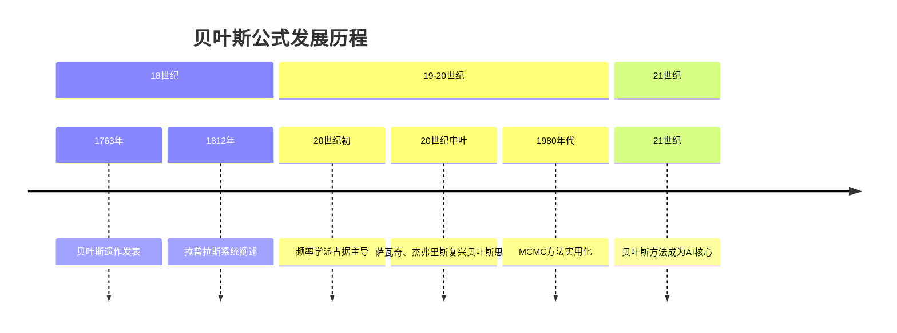
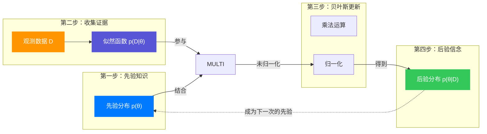
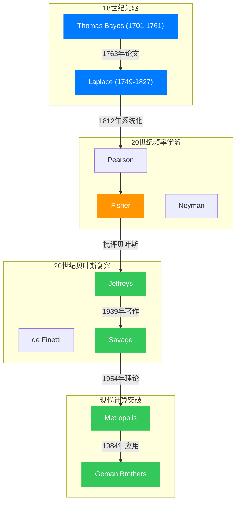

## 引言：从"上帝的视角"到"凡人的推断"

想象你是一名医生，患者刚刚做完某种疾病的筛查测试。测试结果是阳性。那么，这位患者真正患病的概率是多少？

如果你回答"既然测试准确率是95%，那么患病的概率就是95%"，那你和大多数人的直觉一样——但也一样错了。

正确答案可能让你吃惊：哪怕测试准确率达到95%，如果这种疾病在人群中发病率只有1%，那么一个阳性结果意味着患者真正患病的概率可能只有16%左右。

这个反直觉的结果，正是贝叶斯公式的核心思想：**我们的信念应该随着新证据的到来而更新**，但更新的方式不是简单的替换，而是要结合我们已有的知识（先验信息）。

贝叶斯公式不仅是一个数学定理，更是一种思维方式。它告诉我们：在信息不完整的世界里，我们如何从有限的数据中学习，如何科学地调整我们的信念。从18世纪的一位英国牧师兼数学家，到21世纪的人工智能，贝叶斯的思想经历了一段跌宕起伏的旅程。

## 第一章：贝叶斯牧师的那篇遗作

### 1.1 托马斯·贝叶斯其人

托马斯·贝叶斯（Thomas Bayes，1701-1761）是18世纪英国的一位长老会牧师，同时也是一位业余数学家。他出生于英格兰的一个显赫家庭，父亲是非国教牧师乔舒亚·贝叶斯。托马斯在爱丁堡大学学习神学和逻辑学，后来接任父亲的教职，在坦布里奇韦尔斯（Tunbridge Wells）担任牧师。

尽管贝叶斯在世时并未在数学领域发表太多作品，但他对概率论有着深刻的思考。他最著名的著作《机会问题的求解方法》（*An Essay towards solving a Problem in the Doctrine of Chances*）在他去世后于1763年发表在《皇家学会哲学汇刊》上。这篇论文由他的朋友理查德·普莱斯（Richard Price）整理并提交。

### 1.2 问题的提出：从"已知原因求结果"到"已知结果求原因"

贝叶斯关注的是一个根本性的哲学和数学问题：**如果我们观察到某个结果，如何推断导致这个结果的原因？**

在贝叶斯之前，概率论主要处理"正向概率"问题：如果我们知道某种原因，可以计算它产生特定结果的概率。例如，如果一枚硬币是均匀的，那么抛掷得到正面的概率是50%。

但现实中我们经常面临"逆向概率"问题：我们观察到了结果，想要推断原因。例如，我们观察到病人有某种症状，想推断他患某种疾病的概率；或者我们观察到数据，想推断产生这些数据的参数。

贝叶斯的天才之处在于，他用条件概率建立了因果推断的数学框架。

### 1.3 贝叶斯的台球模型

贝叶斯在原文中使用了一个巧妙的台球模型来说明他的思想：

想象一张台球桌，一个球被随机抛到桌面上，停在一个未知位置（这个位置决定了某种"未知的概率"）。然后另一个球被反复抛出，我们观察它落在第一个球左侧还是右侧。

通过观察第二个球落在左侧的频率，贝叶斯想要推断：第一个球停在哪里（即"未知的概率"是多少）？

这个模型的关键洞察是：即使我们永远无法直接"看见"第一个球的位置（真实的概率值），我们也可以通过第二个球的表现（观察数据）不断更新对第一个球位置的信念。

## 第二章：从条件概率到贝叶斯公式

### 2.1 条件概率的基础

在介绍贝叶斯公式之前，我们需要先理解条件概率。条件概率 $P(A|B)$ 表示在事件 $B$ 已经发生的条件下，事件 $A$ 发生的概率。

**定义**：若 $P(B) > 0$，则
$$
P(A|B) = \frac{P(A \cap B)}{P(B)}
$$

其中 $P(A \cap B)$ 表示 $A$ 和 $B$ 同时发生的概率。

这个定义很直观：在 $B$ 发生的所有可能情况中，$A$ 也发生的比例是多少。

### 2.2 乘法公式

从条件概率的定义，我们可以直接得到乘法公式：
$$
P(A \cap B) = P(A|B) \cdot P(B) = P(B|A) \cdot P(A)
$$

这个公式告诉我们：两个事件同时发生的概率，等于一个事件发生的概率乘以在此条件下另一个事件的条件概率。

### 2.3 全概率公式

如果我们有一个**完备的事件组** $\{B_1, B_2, \ldots, B_n\}$，满足：
1. 互斥性：$i \neq j$ 时，$B_i \cap B_j = \emptyset$
2. 完备性：$\bigcup_{i=1}^n B_i = \Omega$（整个样本空间）
3. $P(B_i) > 0$ 对所有 $i$

那么对于任意事件 $A$，有：
$$
P(A) = \sum_{i=1}^n P(A|B_i) \cdot P(B_i)
$$

这就是**全概率公式**。它的直观含义是：事件 $A$ 可以通过各种"原因" $B_i$ 发生，把所有可能路径的概率加起来，就得到 $A$ 的总概率。

### 2.4 贝叶斯公式的推导

现在我们可以推导贝叶斯公式了。根据条件概率的定义：
$$
P(B_i|A) = \frac{P(B_i \cap A)}{P(A)}
$$

利用乘法公式 $P(B_i \cap A) = P(A|B_i) \cdot P(B_i)$ 和全概率公式，我们得到：
$$
P(B_i|A) = \frac{P(A|B_i) \cdot P(B_i)}{\sum_{j=1}^n P(A|B_j) \cdot P(B_j)}
$$

这就是**贝叶斯公式**！

让我们解释每一项的含义：
- **$P(B_i)$**：**先验概率**（Prior），在观察证据之前对假设 $B_i$ 的信念
- **$P(A|B_i)$**：**似然度**（Likelihood），如果假设 $B_i$ 为真，观察到证据 $A$ 的概率
- **$P(B_i|A)$**：**后验概率**（Posterior），在观察到证据 $A$ 后对假设 $B_i$ 的更新信念
- **$\sum_{j=1}^n P(A|B_j) \cdot P(B_j)$**：**证据因子**（Evidence），证据 $A$ 在所有可能假设下的总概率

### 2.5 贝叶斯公式的连续形式

如果参数 $\theta$ 是连续变量（而不是离散假设），贝叶斯公式变为：
$$
p(\theta|D) = \frac{p(D|\theta) \cdot p(\theta)}{\int p(D|\theta') \cdot p(\theta') \, d\theta'}
$$

其中：
- $D$ 表示观测数据
- $p(\theta)$ 是参数的**先验分布**
- $p(D|\theta)$ 是**似然函数**
- $p(\theta|D)$ 是**后验分布**
- 分母是**边缘似然**（Marginal Likelihood），也称证据

**连续形式的直观理解**：数据 $D$ 更新了我们对参数 $\theta$ 的整个概率分布，而不仅仅是得到一个点估计。

### 2.6 一个具体例子：疾病诊断

让我们回到开头提到的疾病诊断问题。定义：
- $D$：患病事件
- $\neg D$：不患病
- $T^+$：测试阳性
- $T^-$：测试阴性

已知：
- 先验概率（发病率）：$P(D) = 0.01$
- 测试准确率：$P(T^+|D) = 0.95$（真阳性率，灵敏度）
- 假阳性率：$P(T^+|\neg D) = 0.05$

我们要求：在测试阳性的条件下，真正患病的概率 $P(D|T^+)$

根据贝叶斯公式：
$$
\begin{align}
P(D|T^+) &= \frac{P(T^+|D) \cdot P(D)}{P(T^+|D) \cdot P(D) + P(T^+|\neg D) \cdot P(\neg D)} \\
&= \frac{0.95 \times 0.01}{0.95 \times 0.01 + 0.05 \times 0.99} \\
&= \frac{0.0095}{0.0095 + 0.0495} \\
&= \frac{0.0095}{0.059} \\
&\approx 0.161
\end{align}
$$

所以即使测试阳性，真正患病的概率只有约16.1%！

**为什么直觉会错？** 因为假阳性的"基数"太大：虽然健康人假阳性的概率只有5%，但健康人占总人群的99%，所以假阳性的绝对数量（$0.05 \times 0.99 = 0.0495$）远超真阳性（$0.95 \times 0.01 = 0.0095$）。

下面用一个流程图展示贝叶斯推断的完整过程：

这个流程图展示了贝叶斯学习的核心：**后验分布成为下一次更新的先验**，形成了一个不断学习的循环。

## 第三章：从被遗忘到被重新发现

在深入了解贝叶斯理论的发展之前，让我们先通过一个图表来看关键人物之间的关系：

### 3.1 拉普拉斯的独立贡献

在贝叶斯论文发表后不久，法国数学家皮埃尔-西蒙·拉普拉斯（Pierre-Simon Laplace，1749-1827）独立推导出了类似的公式。1812年，拉普拉斯在《概率的分析理论》中系统阐述了贝叶斯方法，并将其应用于天文学和统计学问题。

拉普拉斯给出了一个经典例子：如果太阳连续 $n$ 天升起，那么明天太阳继续升起的概率是多少？

使用贝叶斯方法，拉普拉斯推导出著名的**拉普拉斯 succession law**：
$$
P(\text{明天升起} | \text{过去 } n \text{ 天都升起}) = \frac{n+1}{n+2}
$$

如果你观察到太阳连续100天升起，那么明天它升起的概率是 $\frac{101}{102} \approx 99.02\%$。

### 3.2 频率学派的崛起与贝叶斯的边缘化

19世纪末到20世纪初，统计学领域出现了**频率学派**（Frequentist School）的崛起，代表人物包括卡尔·皮尔逊（Karl Pearson）、罗纳德·费希尔（Ronald Fisher）、耶日·内曼（Jerzy Neyman）等。

频率学派对贝叶斯方法提出了严厉批评：
1. **主观性**：贝叶斯方法中的"先验概率"被视为主观的、不科学的
2. **不可知论**：频率学派认为概率是长期频率，不能谈论"参数的概率"（参数是客观存在的固定值，不是随机变量）
3. **实用主义**：频率学派发展出了置信区间、假设检验等不需要先验的方法

费希尔提出了**极大似然估计**（Maximum Likelihood Estimation, MLE），这种方法只需要似然函数，不需要先验分布，成为20世纪统计学的主流方法。

在很长一段时间里，贝叶斯方法被视为异端，被主流统计学边缘化。

### 3.3 贝叶斯复兴的先驱

尽管受到压制，贝叶斯思想仍有一些坚定的支持者：

**布鲁诺·德·芬内蒂（Bruno de Finetti，1906-1985）**：意大利概率学家，提出了"可换性"（Exchangeability）概念，证明了一切概率本质上都是主观的。他的名言："概率不存在"（Probability does not exist）——意思是客观概率不存在，只有主观信念。

**哈罗德·杰弗里斯（Harold Jeffreys，1891-1989）**：英国地球物理学家和统计学家，1939年发表《概率理论》，系统阐述了贝叶斯方法在科学推断中的应用。他提出了**无信息先验**（Non-informative Prior）的概念，试图解决先验选择的主观性问题。

**伦纳德·萨瓦奇（Leonard Savage，1917-1971）**：美国统计学家，1954年发表《统计学基础》，将概率解释为个人信念，并用效用理论论证了贝叶斯决策的合理性。

**丹尼斯·林德利（Dennis Lindley，1923-2013）**：英国统计学家，著名的贝叶斯倡导者，他的名言包括："贝叶斯方法是统计学中唯一连贯、一致、可辩护的方法"。

### 3.4 计算机的突破：MCMC方法

贝叶斯方法在实际应用中的一个重大障碍是**计算困难**。对于复杂模型，后验分布的归一化常数（即贝叶斯公式分母中的积分）往往是高维积分，难以解析计算。

20世纪80-90年代，**马尔可夫链蒙特卡洛方法**（Markov Chain Monte Carlo, MCMC）的实用化改变了这一切。MCMC方法的核心思想是：不需要精确计算后验分布，只需从后验分布中采样，然后用样本均值近似期望。

**Metropolis-Hastings算法**（1953年提出，但直到90年代才广泛应用）和**Gibbs采样**（Geman & Geman, 1984）使得贝叶斯方法可以处理以前无法想象的高维复杂模型。

1990年代，**BUGS软件**（Bayesian inference Using Gibbs Sampling）的开发，让非统计学家也能方便地使用贝叶斯方法。这标志着贝叶斯方法从理论走向大规模应用。

## 第四章：现代应用：机器学习与人工智能

### 4.1 贝叶斯机器学习

在机器学习领域，贝叶斯方法提供了一种优雅的框架来处理不确定性：

**贝叶斯线性回归**：
传统线性回归给出参数的点估计 $\hat{\beta}$，而贝叶斯线性回归给出参数的后验分布 $p(\beta|D)$，从而可以对预测进行不确定性量化。

预测分布为：
$$
p(y^*|x^*, D) = \int p(y^*|x^*, \beta) \cdot p(\beta|D) \, d\beta
$$

这个积分考虑了参数的所有可能取值，给出了更全面的预测。

**高斯过程**（Gaussian Process, GP）：
高斯过程是贝叶斯非参数方法的重要代表。它不是对参数建模，而是直接对函数建模：假设函数 $f(x)$ 是高斯过程，则任何有限个函数值的联合分布都是多元高斯分布。

高斯过程不仅给出预测值，还给出预测方差（不确定性），在超参数优化、贝叶斯优化等领域有重要应用。

### 4.2 贝叶斯神经网络

传统神经网络使用最大似然估计训练权重，容易过拟合。贝叶斯神经网络将权重视为随机变量，计算权重的后验分布：

$$
p(W|D) = \frac{p(D|W) \cdot p(W)}{p(D)}
$$

这使得神经网络可以：
1. **量化不确定性**：知道模型什么时候"不确定"
2. **正则化效果**：先验分布相当于L2正则化
3. **主动学习**：选择信息量大的样本标注

虽然精确贝叶斯神经网络计算困难，但近年来发展出了**变分推断**（Variational Inference）、**Dropout近似**等方法，使得贝叶斯深度学习成为可能。

### 4.3 贝叶斯优化

贝叶斯优化是黑盒函数优化的强大工具，特别适用于：
- 超参数调优
- 实验设计
- 机器人控制

**核心思想**：
1. 用高斯过程建模目标函数
2. 用采集函数（Acquisition Function，如Expected Improvement）决定下一个评估点
3. 观察新数据，更新高斯过程
4. 重复直到收敛

**期望改进**（Expected Improvement）：
$$
EI(x) = \mathbb{E}[\max(f(x) - f(x^+), 0)]
$$

其中 $f(x^+)$ 是当前最优值。贝叶斯优化平衡了"开发"（exploitation，在已知好区域搜索）和"探索"（exploration，在不确定区域搜索）。

### 4.4 朴素贝叶斯分类器

朴素贝叶斯是最简单但最有效的贝叶斯方法之一。给定特征 $x = (x_1, x_2, \ldots, x_n)$，预测类别 $y$：

$$
P(y|x_1, \ldots, x_n) \propto P(y) \prod_{i=1}^n P(x_i|y)
$$

**"朴素"假设**：特征之间条件独立

尽管这个假设在实际中很少成立，朴素贝叶斯在文本分类、垃圾邮件过滤等任务上表现惊人地好。

**文本分类应用**：
- 特征：单词是否出现
- 类别：文档主题
- 先验：$P(y)$ = 类 $y$ 的文档比例
- 似然：$P(x_i|y)$ = 类 $y$ 中单词 $x_i$ 的频率

### 4.5 AlphaGo与蒙特卡洛树搜索

2016年，DeepMind的AlphaGo击败人类围棋冠军，其核心算法之一是**蒙特卡洛树搜索**（Monte Carlo Tree Search, MCTS）结合深度神经网络。

MCTS本质上是一个贝叶斯决策过程：
- **先验**：神经网络给出的策略网络 $p(a|s)$
- **更新**：通过模拟对局更新动作价值 $Q(s, a)$
- **后验**：结合先验和模拟结果的PUCT算法

PUCT选择公式：
$$
a = \arg\max_a \left( Q(s, a) + c \cdot P(s, a) \cdot \frac{\sqrt{\sum_b N(s, b)}}{1 + N(s, a)} \right)
$$

其中第一项是"开发"（exploitation），第二项是"探索"（exploration），完美体现了贝叶斯思想。

### 4.6 现代贝叶斯工具箱

今天，贝叶斯方法已经有一整套成熟的工具：

**概率编程语言**（Probabilistic Programming Languages）：
- **Stan**：基于Hamiltonian Monte Carlo（HMC），性能强大
- **PyMC**：Python生态，易用性强
- **TensorFlow Probability**：与TensorFlow深度集成
- **Pyro**：基于PyTorch，支持变分推断

这些工具使得复杂的贝叶斯模型可以像写普通代码一样实现，后端自动进行推断。

## 第五章：深入理解——先验选择与哲学思考

### 5.1 先验分布的选择

贝叶斯方法中最具争议（也最有趣）的问题是：**如何选择先验？**

**无信息先验**（Non-informative Priors）：
- **均匀先验**：$p(\theta) \propto 1$
- **Jeffreys先验**：$p(\theta) \propto \sqrt{I(\theta)}$，其中 $I(\theta)$ 是Fisher信息

**共轭先验**（Conjugate Priors）：
如果先验和后验属于同一分布族，则称该先验为共轭先验。这简化了计算。

例子：二项分布的Beta共轭先验
- 似然：$p(k|\theta) = \binom{n}{k} \theta^k (1-\theta)^{n-k}$
- 先验：$p(\theta) = \text{Beta}(\alpha, \beta) \propto \theta^{\alpha-1}(1-\theta)^{\beta-1}$
- 后验：$p(\theta|k) \propto \theta^{k+\alpha-1}(1-\theta)^{n-k+\beta-1} = \text{Beta}(k+\alpha, n-k+\beta)$

**层次先验**（Hierarchical Priors）：
先验本身也有超参数，超参数也有超先验……形成层次结构：
$$
p(\theta, \phi, \psi) = p(\theta|\phi) \cdot p(\phi|\psi) \cdot p(\psi)
$$

### 5.2 贝叶斯vs频率学派的哲学之争

**核心分歧**：概率的解释

- **频率学派**：概率是长期频率，参数是固定值
- **贝叶斯学派**：概率是主观信念，参数是随机变量

**实际影响**：

| 问题 | 频率学派 | 贝叶斯学派 |
|------|---------|-----------|
| 参数估计 | 点估计（MLE） | 后验分布 |
| 区间估计 | 置信区间（包含真值的概率是0或1） | 可信区间（参数在区间内的概率为95%） |
| 假设检验 | p值（$P(\text{数据}|H_0)$） | 后验概率（$P(H_0|\text{数据})$） |
| 预测 | 点预测+标准误 | 预测分布 |

**现实态度**：
现代统计学家大多采用实用主义态度：
- 简单问题用频率方法（计算快）
- 复杂问题用贝叶斯方法（更自然地处理不确定性）
- 两者都是工具箱中的工具

### 5.3 贝叶斯公式的认知启示

贝叶斯公式不仅是数学工具，更是一种认知方式：

**1. 信念应该随着证据更新**
我们不应对新证据教条，也不应轻率放弃旧有知识。贝叶斯公式告诉我们要平衡两者。

**2. 先验知识很重要**
数据有限时，先验知识可以避免过拟合；数据充足时，先验的影响会被"洗掉"。

**3. 不确定性是内在的**
我们永远无法获得"上帝视角"，只能在有限信息下做出最优推断。贝叶斯方法诚实地量化了这种不确定性。

**4. 理性学习的过程**
贝叶斯更新可以看作是"理性学习"的数学模型：观察-更新-预测，循环往复。

## 结语：信念更新的数学之美

从贝叶斯牧师18世纪的台球桌，到21世纪人工智能的神经网络，贝叶斯公式走过了一条漫长而曲折的道路。它曾经被主流统计学边缘化，被认为是主观和不科学的；但今天，它已成为机器学习、人工智能、数据科学的核心方法。

贝叶斯公式的魅力在于，它用简洁的数学表达了一个深刻的哲学思想：**我们的所有知识都是临时的，应该在证据面前随时准备更新**。这不是摇摆不定，而是理性的最高形式——既不固执己见，也不轻信盲从。

在信息爆炸、假新闻泛滥的时代，贝叶斯思维比以往任何时候都更有价值。它提醒我们：不要让单一证据颠覆判断，也不要因先入为主拒绝新知。先验、似然、后验——这三者的舞蹈，就是理性思考的本质。

正如统计学家George Box所说："**所有模型都是错的，但有些是有用的**"。贝叶斯方法不承诺给我们"真理"，但给了我们在不确定世界中做出最优决策的数学框架。这或许就是它从18世纪穿越到21世纪，依然焕发生机的原因。

---

**参考文献**：

1. Bayes, T. (1763). An Essay towards solving a Problem in the Doctrine of Chances. *Philosophical Transactions of the Royal Society*, 53, 370-418.

2. Laplace, P. S. (1812). *Théorie Analytique des Probabilités*. Paris: Courcier.

3. McGrayne, S. B. (2011). *The Theory That Would Not Die: How Bayes' Rule Cracked the Enigma Code, Hunted Down Russian Submarines, and Emerged Triumphant from Two Centuries of Controversy*. Yale University Press.

4. Gelman, A., et al. (2013). *Bayesian Data Analysis* (3rd ed.). CRC Press.

5. Bishop, C. M. (2006). *Pattern Recognition and Machine Learning*. Springer.

6. Murphy, K. P. (2012). *Machine Learning: A Probabilistic Perspective*. MIT Press.

---

**延伸阅读**：

- **书籍**：Sharon Bertsch McGrayne的《The Theory That Would Not Die》生动讲述了贝叶斯理论的历史
- **在线课程**：Statistical Rethinking（Richard McElreath）是贝叶斯统计的经典课程
- **实践工具**：推荐从PyMC或Stan开始，亲手实现贝叶斯模型
