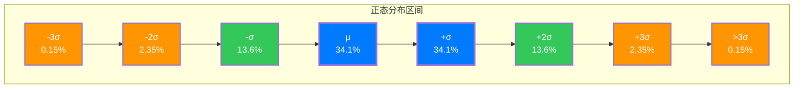

## 引言：钟声隐隐

如果你走进一个 crowded 的教室，测量每个人的身高；或者在同一条件下反复测量一个物理量；又或者在工厂里统计成千上万件产品的尺寸——你会发现，这些数据总是呈现出一种奇特的规律：大部分数值聚集在中间，越往两端越少。

画出分布图，你会看到一条优雅的曲线——中间隆起如钟，两侧缓缓下降，渐近于零却永不触及。这就是**正态分布**（Normal Distribution），也叫**高斯分布**（Gaussian Distribution）或**钟形曲线**（Bell Curve）。

它是概率论中最重要、最自然的分布。从气体分子的运动到股票价格的波动，从人类的身高到测量的误差，正态分布无处不在。

但你是否想过：**为什么**大自然偏爱这种分布？这条曲线是如何被人类发现的？它背后隐藏着怎样的数学之美？

让我们穿越回17、18世纪，去看看这条曲线是如何在历史的迷雾中逐渐浮现的。

---

## 第一章：前史——测量与误差的困惑

### 伽利略的洞见

早在1632年，伽利略在他的《关于两大世界体系的对话》中就观察到了一个有趣的现象：当你反复测量某个物理量时，误差总是呈现出一种规律——小的误差比大的误差更常见，正误差和负误差出现的频率大致相等。

这是人类对"误差分布"最早的直觉认知之一。伽利略并没有给出数学公式，但他敏锐地察觉到：**观测误差并非杂乱无章，而是遵循某种规律**。

### 早期天文学家的困扰

17、18世纪的天文学家面临着一个实际问题：同一颗行星或恒星，不同观测者得到的数据总有微小差异。如何从这些"有误差"的观测值中推断出真实值？

当时流行的方法是**取平均值**，但没有人能从理论上解释为什么这样做是合理的。一个困扰着那个时代科学家的问题是：**是否存在一种"最优"的估计方法？**

这些朴素的问题和观察，为正态分布的发现埋下了种子。

---

## 第二章：意外发现——棣莫弗与二项分布的极限

正态分布的第一次正式登场，来自一个看似毫不相关的问题：**赌博**。

### 亚伯拉罕·棣莫弗

亚伯拉罕·棣莫弗（Abraham de Moivre, 1667-1754）是一位法国-英国数学家。他年轻时因宗教迫害流亡英国，在伦敦靠当家庭教师和赌博顾问维生。

1733年，棣莫弗在研究一个具体问题时做出了一个重大发现：**当伯努利试验的次数 $n$ 很大时，二项分布可以用一条光滑的曲线来近似**。

这个发现最初只是他一本小册子中的一段内容，后来被收录进1738年出版的《机遇原理》（*The Doctrine of Chances*）第二版中。

### 从二项分布到正态曲线

考虑抛硬币的问题：抛 $n$ 次硬币，出现 $k$ 次正面的概率由二项分布给出：

$$P(X = k) = \binom{n}{k}p^k(1-p)^{n-k}$$

当 $n$ 很大时，直接计算这个公式非常困难——阶乘会变得极其巨大。棣莫弗想知道：能否找到一个**近似公式**？

通过巧妙的数学技巧（斯特林公式的早期版本），棣莫弗发现：当 $n \to \infty$ 时，标准化的二项分布收敛到：

$$f(x) = \frac{1}{\sqrt{2\pi}}e^{-x^2/2}$$

这就是**标准正态分布**的概率密度函数！

### 历史的遗憾

有趣的是，棣莫弗并不知道自己发现了一个"普适"的分布。他只是把它当作计算二项分布的一个**实用技巧**。他的工作也没有引起当时学术界的广泛关注。

直到多年后，这条曲线才被拉普拉斯和高斯重新发掘，并赋予其更深刻的意义。

---

## 第三章：高斯的革命——误差理论与最小二乘法

正态分布真正成为概率论的核心，要归功于**卡尔·弗里德里希·高斯**（Carl Friedrich Gauss, 1777-1855）。

### 天文的难题

1801年，意大利天文学家皮亚齐发现了小行星**谷神星**（Ceres）。但观测时间很短，随后谷神星就消失在太阳的光芒中。如何从有限的观测数据中预测谷神星的位置，成为了当时天文学界的难题。

年仅24岁的高斯接受了这个挑战。他使用自己发展的方法，成功预测了谷神星的位置，使其被重新观测到。这一成就让高斯声名鹊起。

### 误差的正态分布假设

1809年，高斯在《天体运动理论》中系统阐述了他的方法。他提出了一个革命性的假设：**观测误差服从正态分布**。

但高斯没有简单地"假设"这一点。相反，他采用了一种巧妙的方法——**逆向推导**：

1. 假设我们有一组观测值 $x_1, x_2, \ldots, x_n$
2. 我们要估计真实值 $\mu$
3. **什么样的误差分布**，才能保证**算术平均值**是 $\mu$ 的最优估计？

高斯证明：如果要求"算术平均值是最大似然估计"，那么误差分布**必须**是正态分布。

这个结论被称为**高斯证明**（Gauss's Proof），它深刻地揭示了正态分布的特殊地位。

### 最小二乘法的诞生

高斯进一步发展了**最小二乘法**（Method of Least Squares），其核心思想是：选择使**误差平方和**最小的参数值：

$$\min_{\mu} \sum_{i=1}^n (x_i - \mu)^2$$

在高斯的框架下，最小二乘法与正态分布完美契合：如果误差服从正态分布，那么最小二乘估计就是**最大似然估计**。

### 为什么是"高斯分布"？

尽管棣莫弗更早发现了这条曲线，但正是高斯的工作建立了正态分布与误差理论的深刻联系，并将其广泛应用于科学测量的各个领域。因此，后世将这条曲线称为"高斯分布"，实至名归。

---

## 第四章：拉普拉斯与中心极限定理——为什么世界是正态的

如果说高斯从实用角度确立了正态分布的地位，那么**皮埃尔-西蒙·拉普拉斯**（Pierre-Simon Laplace, 1749-1827）则从理论上解释了**为什么**正态分布如此普遍。

### 中心极限定理的萌芽

拉普拉斯在1810年左右证明了：**大量独立随机变量之和，趋向于正态分布**。

这是概率论中最重要的定理之一——**中心极限定理**（Central Limit Theorem, CLT）的早期形式。

### 直观理解：为什么相加会产生正态？

想象你在扔一枚质地均匀的骰子，每次掷出的结果是 $X_i \in \{1, 2, 3, 4, 5, 6\}$。扔一次，结果是均匀分布的。但如果你扔 $n$ 次，把结果加起来：

$$S_n = X_1 + X_2 + \cdots + X_n$$

当 $n$ 很大时，$S_n$ 的分布会趋向于正态分布！

**为什么？**

可以这样理解：要使总和 $S_n$ 等于某个特定值，需要各个 $X_i$ 的结果恰好相互"抵消"或"累加"到那个值。随着 $n$ 的增大，可能的组合方式呈指数增长，而其中大多数组合都会使总和接近某个"中心"值——因为远离中心需要许多变量"恰好"都偏向同一方向，这是一个**小概率事件**。

数学上，正态分布的 $e^{-x^2/2}$ 形式正是这种"指数衰减"特征的体现。

### 普适性的解释

中心极限定理揭示了正态分布普适性的根源：**许多自然现象都是大量微小独立因素共同作用的结果**。

- 人的身高 = 遗传因素 + 营养因素 + 环境因素 + ...
- 测量误差 = 仪器误差 + 观测者误差 + 环境扰动 + ...
- 股票收益 = 宏观经济 + 行业动态 + 公司因素 + ...

当这些独立因素相加时，无论单个因素服从什么分布，它们的和都趋向于正态分布。

这就是为什么正态分布**无处不在**。

---

## 第五章：数学推导——多角度理解正态分布

现在让我们从数学角度深入理解正态分布。我们将从几个不同的角度推导它，每一条路径都能带来不同的洞察。

### 推导一：棣莫弗-拉普拉斯极限定理

这是正态分布最初的推导路径。考虑 $n$ 次伯努利试验，成功概率为 $p$，成功次数为 $S_n$。

使用**斯特林公式**（Stirling's Formula）：

$$n! \sim \sqrt{2\pi n}\left(\frac{n}{e}\right)^n$$

可以证明，当 $n \to \infty$ 时，标准化的二项分布：

$$Z_n = \frac{S_n - np}{\sqrt{np(1-p)}}$$

的分布函数收敛到标准正态分布。

### 推导二：高斯的误差理论

假设观测误差 $X$ 服从某个对称的连续分布，概率密度为 $f(x)$。

**假设**：算术平均值是最大似然估计。这意味着对于观测值 $x_1, \ldots, x_n$，似然函数：

$$L(\mu) = \prod_{i=1}^n f(x_i - \mu)$$

在 $\mu = \frac{1}{n}\sum x_i$ 处取最大值。

取对数并求导，得到条件：

$$\sum_{i=1}^n \frac{f'(x_i - \bar{x})}{f(x_i - \bar{x})} = 0$$

经过推导（这里需要巧妙地让 $n \to \infty$ 并利用对称性），可以得到微分方程：

$$\frac{f'(x)}{f(x)} = -kx$$

解这个微分方程：

$$\ln f(x) = -\frac{k}{2}x^2 + C$$

$$f(x) = A e^{-kx^2/2}$$

由概率密度函数的归一化条件 $\int_{-\infty}^{\infty} f(x) dx = 1$，得到 $A = \sqrt{k/(2\pi)}$。设 $k = 1/\sigma^2$，则：

$$f(x) = \frac{1}{\sqrt{2\pi}\sigma}e^{-x^2/(2\sigma^2)}$$

### 推导三：最大熵原理

从信息论的角度，正态分布是在**给定方差**约束下**熵最大**的分布。

**问题**：在约束条件 $\int_{-\infty}^{\infty} f(x) dx = 1$ 和 $\int_{-\infty}^{\infty} x^2 f(x) dx = \sigma^2$ 下，求使微分熵

$$H(f) = -\int_{-\infty}^{\infty} f(x) \ln f(x) dx$$

最大的分布 $f(x)$。

使用拉格朗日乘数法，设泛函：

$$\mathcal{L}[f] = -\int f \ln f \, dx - \lambda_1\left(\int f \, dx - 1\right) - \lambda_2\left(\int x^2 f \, dx - \sigma^2\right)$$

变分 $\delta \mathcal{L} = 0$ 给出：

$$-\ln f - 1 - \lambda_1 - \lambda_2 x^2 = 0$$

$$f(x) = e^{-1-\lambda_1-\lambda_2 x^2} = A e^{-kx^2}$$

这与高斯推导的形式一致！

**物理意义**：在只知道方差（"离散程度"）的情况下，正态分布是"最不确定"的分布——它不包含任何额外的假设或偏置。

### 推导四：赫歇尔-麦克斯韦推导

这是一个基于几何对称性的优美推导，由约翰·赫歇尔（John Herschel, 1850）和詹姆斯·麦克斯韦（James Maxwell, 1860）独立给出。

**假设**：
1. 误差在 $x$ 方向和 $y$ 方向相互独立
2. 误差分布只依赖于到原点的距离 $r = \sqrt{x^2 + y^2}$（旋转对称性）

设二维误差密度为 $f(x, y) = f(r)$。由独立性：

$$f(x, y) = g(x) \cdot g(y) = f(r)$$

取对数并设 $h(x) = \ln g(x)$，则：

$$h(x) + h(y) = h(r)$$

对这个泛函方程求导，可得 $h'(x) = -2kx$，因此：

$$h(x) = -kx^2 + C$$

$$g(x) = A e^{-kx^2}$$

再次得到正态分布！

---

## 第六章：正态分布的性质与推广

### 核心性质

正态分布 $\mathcal{N}(\mu, \sigma^2)$ 的概率密度函数为：

$$f(x) = \frac{1}{\sqrt{2\pi}\sigma} \exp\left[-\frac{(x-\mu)^2}{2\sigma^2}\right]$$

**重要性质**：

1. **对称性**：关于 $\mu$ 对称
2. **均值=中位数=众数**：都是 $\mu$
3. **68-95-99.7 规则**（下图示意）：

   - 约 **68%** 的数据在 $\mu \pm \sigma$ 内（蓝色区域）
   - 约 **95%** 的数据在 $\mu \pm 2\sigma$ 内（蓝色+绿色区域）
   - 约 **99.7%** 的数据在 $\mu \pm 3\sigma$ 内（全部区域）

4. **线性变换封闭性**：若 $X \sim \mathcal{N}(\mu, \sigma^2)$，则 $aX + b \sim \mathcal{N}(a\mu + b, a^2\sigma^2)$
5. **可加性**：独立的正态变量之和仍是正态的

### 特征函数与矩生成函数

正态分布的特征函数形式极为简洁：

$$\varphi_X(t) = \mathbb{E}[e^{itX}] = \exp\left(i\mu t - \frac{\sigma^2 t^2}{2}\right)$$

这个形式在证明中心极限定理时至关重要。

### 多元正态分布

推广到向量 $\mathbf{X} \in \mathbb{R}^n$，多元正态分布的密度为：

$$f(\mathbf{x}) = \frac{1}{(2\pi)^{n/2}|\boldsymbol{\Sigma}|^{1/2}} \exp\left[-\frac{1}{2}(\mathbf{x}-\boldsymbol{\mu})^\mathsf{T}\boldsymbol{\Sigma}^{-1}(\mathbf{x}-\boldsymbol{\mu})\right]$$

其中 $\boldsymbol{\mu}$ 是均值向量，$\boldsymbol{\Sigma}$ 是协方差矩阵。

多元正态分布在统计学、机器学习、信号处理等领域有着极其重要的应用。

---

## 结语：完美曲线的回响

正态分布的故事，横跨两个世纪，连接起赌桌、天文台和数学证明。

- **棣莫弗**从二项分布的极限中首次瞥见这条曲线
- **高斯**从误差理论中确立了它的实用价值
- **拉普拉斯**用中心极限定理解释了它的普适性
- **麦克斯韦等人**从对称性中推导出它的必然性

今天，正态分布已经成为了科学和工程领域的"通用语言"。从量子力学到金融建模，从质量控制到人工智能，它的身影无处不在。

但也许最令人惊叹的是，这条曲线并非某人的"发明"——它是**被发现**的。它原本就存在于随机现象的深层结构中，等待着人类的理性之光照亮它。

当我们再次看到钟形曲线时，不妨想起：这不仅仅是一个数学公式，更是人类理性与自然规律完美交汇的见证。

---

> "数学是上帝书写宇宙的语言。" —— 伽利略
>
> 而正态分布，或许正是这种语言中最优美的句式之一。
