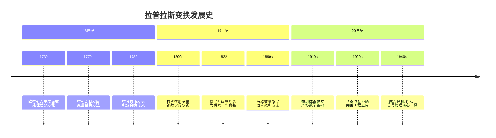
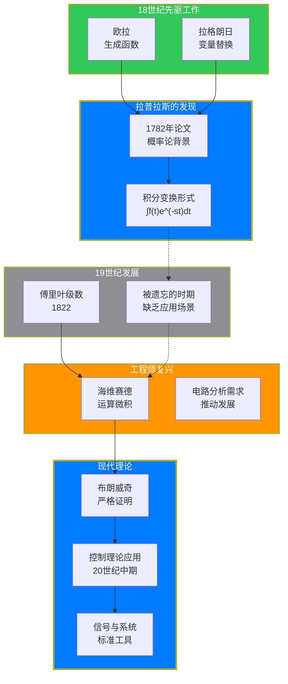

## 引言：一个被遗忘又重新发现的数学工具

如果你学过信号与系统或者控制理论，你一定见过拉普拉斯变换。它像是一把魔法钥匙，能将复杂的微分方程变成简单的代数方程。但你知道吗？这个以拉普拉斯命名的工具，在拉普拉斯生前几乎无人问津，甚至被遗忘了整整一个世纪。

今天，拉普拉斯变换是工程数学中最基础的工具之一。它的故事不仅关于一个数学公式的诞生，更关于纯粹数学与应用数学之间曲折的关系——有时候，最实用的数学发现并不是由应用驱动的，而最深刻的应用也往往来自于那些最初看起来"毫无用处"的理论工作。

让我们回到18世纪末，从一切开始的地方说起。

## 第一章：前传——微积分时代的挑战

### 欧拉的先声

在拉普拉斯之前，莱昂哈德·欧拉（Leonhard Euler）就已经在思考类似的问题。1739年，欧拉在研究微分方程时，引入了一种后来被称为"生成函数"的方法。他的想法很巧妙：如果你有一个数列 $a_0, a_1, a_2, \ldots$，你可以把它"包装"成一个幂级数

$$
A(z) = \sum_{n=0}^{\infty} a_n z^n
$$

然后，通过对 $A(z)$ 进行运算，你就可以间接地操作整个数列。这就像是把一堆散乱的珍珠串成一条项链，然后通过移动整条项链来调整每颗珍珠的位置。

欧拉用这种方法解决了一些差分方程。差分方程是微分方程的"离散版"，描述的是数列之间的关系，而不是连续函数之间的关系。但欧拉可能没有意识到，这个思想可以推广到连续世界。

### 拉格朗日的尝试

约瑟夫·路易·拉格朗日（Joseph-Louis Lagrange）在1770年代进一步发展了这个思想。他研究的不是差分方程，而是真正的微分方程。拉格朗日发现，某些类型的微分方程可以通过"变量替换"的方法简化。

想象一下，你有一个复杂的机器，操作起来很困难。但如果你换一个视角——比如把机器拆开，从另一个角度观察——可能会发现原来复杂的操作变得简单了。拉格朗日的变量替换就是这种"换个视角"的方法。

但真正系统化这个想法的人，是皮埃尔-西蒙·拉普拉斯。

## 第二章：拉普拉斯的登场——从概率论开始

### 1782年的论文

1782年，年轻的拉普拉斯发表了一篇关于概率论的论文。这篇论文的标题很长，但核心思想很清晰：他想研究如何从有限的观察中推断出背后的规律。

在概率论中，一个核心问题是：如果你知道一个随机变量服从某种分布，但不知道分布的参数，你应该如何从观测数据中推断这些参数？拉普拉斯意识到，这个问题可以转化成一个积分方程的问题。

他考虑这样一个积分：

$$
F(s) = \int_0^{\infty} f(t) e^{-st} \, dt
$$

这里的 $f(t)$ 是某个概率密度函数，而 $F(s)$ 是它的"像函数"。拉普拉斯发现，通过这个变换，原来关于 $f(t)$ 的复杂运算可以转化成关于 $F(s)$ 的简单运算。

### 为什么是 $e^{-st}$？

你可能会问：为什么拉普拉斯选择了 $e^{-st}$ 这个核函数？这不是凭空的选择，而是有深刻的原因。

首先，指数函数 $e^{-st}$ 有一个美妙的性质：它的导数和它自己成比例

$$
\frac{d}{dt} e^{-st} = -s e^{-st}
$$

这意味着，如果你对 $e^{-st}$ 乘以 $f(t)$ 然后积分，再对 $s$ 求导，你得到的会是 $t$ 乘以原函数的某种变换。具体来说：

$$
\frac{d}{ds} F(s) = \frac{d}{ds} \int_0^{\infty} f(t) e^{-st} \, dt = \int_0^{\infty} f(t) \frac{\partial}{\partial s} e^{-st} \, dt = \int_0^{\infty} f(t) (-t) e^{-st} \, dt
$$

这告诉我们，在原像空间乘以 $t$，对应于像空间对 $s$ 求导（加个负号）。这种对应关系是拉普拉斯变换能够简化微分方程的关键。

拉普拉斯在他的论文中展示了如何用这个变换来解决某些类型的积分方程，然后——就像许多伟大的数学发现一样——他把这个工具放在一边，继续研究其他问题了。

## 第三章：被遗忘的百年

### 数学家们的冷漠

拉普拉斯的这项工作，在他生前并没有引起太多关注。有几个原因：

首先，拉普拉斯本人最著名的成就是天体力学和概率论，他的积分变换工作相比之下显得太"技术性"了。当时的数学家们更关注的是：行星轨道如何计算？概率论的基础是什么？这些问题似乎更"宏大"。

其次，19世纪的数学发展有其自身的逻辑。柯西（Cauchy）等人正在为微积分建立严格的基础，傅里叶（Fourier）发现了三角级数在求解偏微分方程中的威力。相比之下，拉普拉斯变换显得有些"冷门"。

最重要的是，在拉普拉斯的时代，并没有一个迫切的"工程需求"来推动这个工具的发展。没有电话网络，没有控制系统，没有电力传输——这些后来让拉普拉斯变换变得不可或缺的领域，当时根本不存在。

### 埋在文献中的种子

但这项工作并没有完全消失。它像一颗种子一样，埋在数学文献的土壤里，等待合适的时机发芽。

19世纪中叶，一些数学家在研究特殊函数时，重新发现了类似的积分变换。比如，拉梅（Lamé）函数和马蒂厄（Mathieu）函数的研究中，就出现了类似的结构。但这些工作都是零散的，没有形成一个统一的理论框架。

## 第四章：工程师的复兴——海维赛德的革命

### 一个没有学位的天才

奥利弗·海维赛德（Oliver Heaviside, 1850–1925）是一个奇特的人物。他没有大学学位，却对电磁学和电路理论做出了基础性的贡献。他自学了微积分和物理，然后在电报公司当了一名电报员。

正是这份工作让他接触到了实际工程问题：如何计算长距离电缆中的信号传输？如何设计电路来实现特定的滤波效果？

这些问题最终都归结到求解微分方程。但在19世纪末，求解微分方程并不是一件容易的事。每一个问题都需要独特的技巧，没有通用的方法。

### 运算微积

海维赛德发展了一套他称为"运算微积"（operational calculus）的方法。他的核心思想很简单：把微分运算 $\frac{d}{dt}$ 看成一个代数符号，记作 $p$。然后，你就可以像处理代数表达式一样处理微分方程。

举个例子，考虑微分方程

$$
\frac{dy}{dt} + ay = f(t)
$$

海维赛德会把它写成

$$
(p + a)y = f(t)
$$

然后形式化地"解出" $y$

$$
y = \frac{1}{p + a} f(t)
$$

这里的 $\frac{1}{p + a}$ 是什么？海维赛德通过大量的实验和归纳，发现它对应于一个积分运算：把 $f(t)$ 乘以 $e^{-at}$ 然后积分。

换句话说，海维赛德发现

$$
\frac{1}{p + a} f(t) = \int_0^t f(\tau) e^{-a(t-\tau)} \, d\tau
$$

这个结果今天被称为"卷积定理"，是拉普拉斯变换理论的核心之一。

### 从直觉到严格

海维赛德的方法非常实用，但它有一个问题：**不够严格**。

数学家们批评海维赛德："你凭什么说 $\frac{1}{p}$ 可以被解释为积分？你凭什么说 $p$ 可以像普通代数符号一样运算？"

海维赛德的回应是："它有效，这就够了。"

但数学家们不满意。他们需要一个理论基础，来解释为什么海维赛德的"魔术"能够奏效。

## 第五章：现代理论的诞生——从傅里叶到拉普拉斯

### 布朗威奇的桥梁

20世纪初，英国数学家托马斯·布朗威奇（Thomas Bromwich, 1875–1929）建立了连接海维赛德运算微积和拉普拉斯变换的理论桥梁。

布朗威奇发现，海维赛德的算子 $p$ 实际上对应于拉普拉斯变换中的复变量 $s$。更准确地说，海维赛德的形式运算可以在拉普拉斯变换的框架内得到严格的解释。

让我们看看这是如何工作的。

### 从傅里叶到拉普拉斯：完整推导

傅里叶变换是我们理解拉普拉斯变换的最好起点。傅里叶变换告诉我们，任何"足够好"的函数 $f(t)$ 都可以分解成不同频率的正弦波的叠加

$$
\hat{f}(\omega) = \int_{-\infty}^{\infty} f(t) e^{-i\omega t} \, dt
$$

这里的 $e^{-i\omega t} = \cos(\omega t) - i\sin(\omega t)$ 是一个复指数函数，它的模长总是1。这意味着傅里叶变换把 $f(t)$ 分解成"单位圆上的波"。

但这里有一个问题：许多工程中常见的函数——比如阶跃函数、指数增长的函数——根本没有傅里叶变换，因为积分不收敛。

拉普拉斯的洞察是：如果我们在指数函数上加一个"衰减因子"，问题就解决了。具体来说，把 $e^{-i\omega t}$ 改成 $e^{-st}$，其中 $s = \sigma + i\omega$ 是一个复数，$\sigma > 0$

$$
\mathcal{L}\{f(t)\} = \int_0^{\infty} f(t) e^{-st} \, dt
$$

这里的 $e^{-st} = e^{-\sigma t} e^{-i\omega t}$ 是一个"螺旋线"：它既有旋转（来自 $e^{-i\omega t}$），又有衰减（来自 $e^{-\sigma t}$）。这个衰减因子保证了积分在更广泛的条件下收敛。

这就是为什么拉普拉斯变换比傅里叶变换更"宽容"——它能处理更多类型的函数。

### 微分定理：核心魔法

现在我们可以解释为什么拉普拉斯变换能把微分方程变成代数方程了。考虑函数 $f(t)$ 的导数 $f'(t)$ 的拉普拉斯变换

$$
\mathcal{L}\{f'(t)\} = \int_0^{\infty} f'(t) e^{-st} \, dt
$$

使用分部积分法，令 $u = e^{-st}$，$dv = f'(t) dt$

$$
\begin{aligned}
\mathcal{L}\{f'(t)\} &= \left[ f(t) e^{-st} \right]_0^{\infty} - \int_0^{\infty} f(t) (-s e^{-st}) \, dt \\
&= -f(0) + s \int_0^{\infty} f(t) e^{-st} \, dt \\
&= s\mathcal{L}\{f(t)\} - f(0)
\end{aligned}
$$

这就是著名的**微分定理**：在像空间中，微分变成了乘以 $s$（减去初始条件）。

类似地，二阶导数的变换是

$$
\mathcal{L}\{f''(t)\} = s^2\mathcal{L}\{f(t)\} - sf(0) - f'(0)
$$

这就是为什么拉普拉斯变换能够简化微分方程：每一个 $\frac{d}{dt}$ 变成了 $s$，每一个 $\frac{d^2}{dt^2}$ 变成了 $s^2$，如此类推。

### 举例：RL电路

让我们看一个具体的例子。一个RL电路（电阻-电感电路）满足微分方程

$$
L \frac{di}{dt} + Ri = V(t)
$$

其中 $i(t)$ 是电流，$V(t)$ 是电压，$L$ 和 $R$ 是常数。

对两边取拉普拉斯变换（假设初始电流为零）

$$
L(sI(s) - i(0)) + RI(s) = V(s)
$$

因为 $i(0) = 0$

$$
(Ls + R)I(s) = V(s)
$$

所以

$$
I(s) = \frac{V(s)}{Ls + R}
$$

如果我们知道 $V(t)$ 的具体形式，就可以求出 $I(s)$，然后通过拉普拉斯逆变换得到 $i(t)$。

这个例子展示了拉普拉斯变换的威力：原来的微分方程变成了一个关于 $I(s)$ 的代数方程。

## 拉普拉斯变换发展史

## 知识谱系图

## 结语：理论与实践的对话

拉普拉斯变换的故事，是数学史上一个典型的案例：一个最初为了解决纯理论问题（概率论）而发展出来的工具，在沉睡了一个世纪后，被工程师们重新发现，成为现代技术的基石。

这个故事告诉我们几个重要的道理：

**第一，基础研究的价值往往需要时间来体现。** 拉普拉斯在1782年的工作，在当时看来可能只是一个小小的技术性贡献。但如果没有这个"种子"，海维赛德在19世纪末的工程师们可能需要多走很多弯路。

**第二，直觉和严格性同样重要。** 海维赛德凭借直觉发展了运算微积，虽然不够严格，但解决了实际问题。而数学家们后来提供的严格证明，不仅验证了海维赛德的结果，还拓展了这个理论的适用范围。

**第三，最好的数学工具往往连接着不同的领域。** 拉普拉斯变换同时连接了概率论、微分方程、复分析和电路理论。这种跨领域的连接，正是数学之美所在。

今天，当你使用拉普拉斯变换设计控制系统、分析信号或者求解微分方程时，你不仅是在使用一个数学工具——你是在延续一个跨越两百年的知识传统，从欧拉的生成函数到海维赛德的运算微积，从拉普拉斯的概率论到现代工程数学。

这就是数学的累积性：每一个发现都是建立在之前的工作之上，而每一个看似抽象的理论，都可能在未来某一天成为解决实际问题的钥匙。

---

**参考文献**

1. Laplace, P. S. (1782). *Mémoire sur les probabilités*. Mémoires de l'Académie Royale des Sciences de Paris.
2. Heaviside, O. (1893). *Electromagnetic Theory*. The Electrician Printing and Publishing Company.
3. Bromwich, T. J. (1916). *Normal Coordinates in Dynamical Systems*. Proceedings of the London Mathematical Society.
4. Deakin, M. A. B. (1981). *The Development of the Laplace Transform, 1737-1937*. Archive for History of Exact Sciences.
5. Carslaw, H. S., & Jaeger, J. C. (1941). *Operational Methods in Applied Mathematics*. Oxford University Press.
