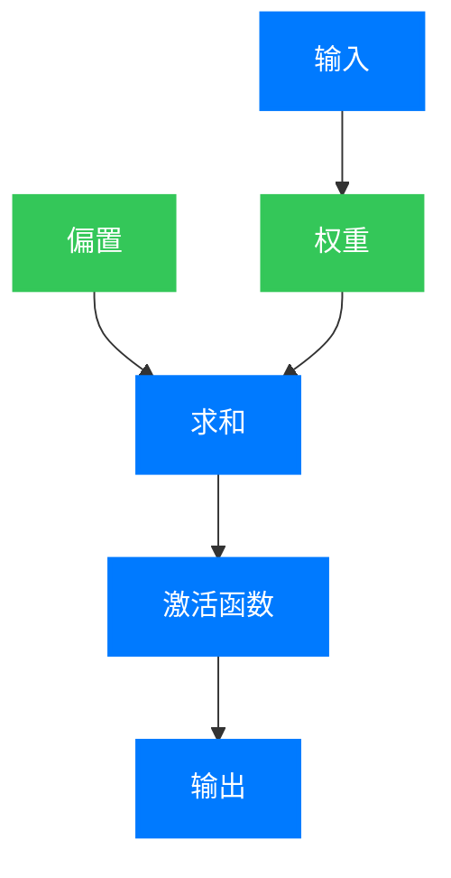
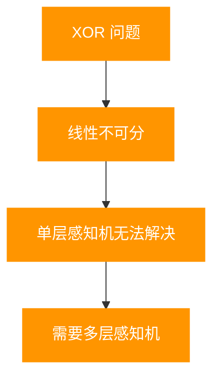

## 引言：人工智能的原点

在人工智能的发展历程中，感知机（Perceptron）是一个具有里程碑意义的概念。它不仅是最早的机器学习算法之一，也是现代深度学习和神经网络的基础。

感知机的故事开始于 20 世纪中叶，当时计算机科学刚刚萌芽，科学家们开始探索如何让机器具备"学习"的能力。

## 第一章：感知机的诞生背景

### 1.1 早期人工智能研究的梦想

20 世纪 40 年代末到 50 年代初，随着计算机的诞生，科学家们开始思考：机器能否像人一样思考和学习？

- **图灵测试**：1950 年，艾伦·图灵提出了著名的图灵测试，为人工智能的发展奠定了理论基础。
- **神经网络的早期构想**：1943 年，麦卡洛克和皮茨提出了第一个人工神经网络模型，称为麦卡洛克-皮茨神经元。

### 1.2 罗森布拉特的突破

1957 年，美国心理学家弗兰克·罗森布拉特（Frank Rosenblatt）在康奈尔航空实验室提出了感知机模型。他将感知机描述为"能够通过经验自动学习的机器"。

罗森布拉特的工作受到了神经科学的启发，他试图模拟人类大脑中神经元的工作方式。

## 第二章：感知机的核心原理

### 2.1 感知机的基本结构

感知机是一个简单的线性分类器，它的结构非常简单：



### 2.2 感知机的工作原理

感知机的工作原理可以用以下公式表示：

$$
y = \begin{cases}
1, & \text{if} \; w \cdot x + b \geq 0 \\\\
0, & \text{otherwise}
\end{cases}
$$

其中：
- $x$ 是输入向量
- $w$ 是权重向量
- $b$ 是偏置
- $\cdot$ 表示点积

### 2.3 感知机的学习算法

罗森布拉特还提出了感知机的学习算法，通过调整权重和偏置来实现分类：

1. 初始化权重和偏置
2. 对于每个训练样本，计算输出
3. 根据错误调整权重和偏置
4. 重复步骤 2-3，直到收敛

下图展示了感知机学习AND问题时，权重和偏置随迭代次数的收敛过程：


图1：感知机学习过程的权重收敛动态。可以看到，经过约4-5轮迭代后，权重 $w_1$、$w_2$ 和偏置 $b$ 都收敛到稳定值，此时感知机能够正确分类所有训练样本。

## 第三章：感知机的发展历程

下图展示了从1943年麦卡洛克-皮茨神经元到2012年深度学习爆发的重要里程碑：


图5：感知机与神经网络发展历程时间线。从1943年的理论雏形，到1957年的感知机诞生，经历了1969年的低谷（AI寒冬），1986年反向传播算法带来复兴，最终在2012年深度学习爆发。

### 3.1 早期的成功与热潮

在感知机提出后的几年里，罗森布拉特和他的团队进行了一系列实验，包括使用感知机识别手写数字和简单的图像。

1960 年，《纽约时报》甚至发表了一篇文章，标题为"一台电子计算机能够自学：康奈尔大学展示的设备能够识别字母和数字"。

### 3.2 局限性的发现

1969 年，马文·明斯基（Marvin Minsky）和西摩尔·帕普特（Seymour Papert）出版了《感知机》（Perceptrons）一书，指出了感知机的局限性。

他们证明了感知机无法解决非线性分类问题，最著名的例子是异或（XOR）问题。

**为什么感知机无法解决 XOR 问题？**

首先，让我们理解 XOR 问题的定义。XOR（异或）是一个二元运算，其真值表如下：

| 输入 x₁ | 输入 x₂ | 输出 y |
|:-------:|:-------:|:------:|
|    0    |    0    |    0   |
|    0    |    1    |    1   |
|    1    |    0    |    1   |
|    1    |    1    |    0   |

感知机的决策函数是：

$$
y = \begin{cases}
1, & \text{如果} \; w_1 x_1 + w_2 x_2 + b \geq 0 \\\\
0, & \text{否则}
\end{cases}
$$

这个决策边界 $w_1 x_1 + w_2 x_2 + b = 0$ 在二维空间中是一条**直线**。感知机的本质就是寻找一条直线，把不同类别的点分开。

现在让我们看看为什么无法找到一条直线将 XOR 问题的两类样本正确分开。

在二维平面上，四个样本点的位置为：
- $(0, 0) \to$ 类别 0
- $(0, 1) \to$ 类别 1
- $(1, 0) \to$ 类别 1
- $(1, 1) \to$ 类别 0


如图所示，类别 0（蓝色）的点 $(0,0)$ 和 $(1,1)$ 位于主对角线上，类别 1（橙色）的点 $(0,1)$ 和 $(1,0)$ 位于副对角线上。

从几何上看，要使得一条直线能够正确分类，类别 0 的两个点必须在直线的一侧，类别 1 的两个点必须在直线的另一侧。然而，观察这四个点的位置：

- 类别 0 的点 $(0,0)$ 和 $(1,1)$ 位于主对角线上
- 类别 1 的点 $(0,1)$ 和 $(1,0)$ 位于副对角线上

**几何上的直观理解**：任意一条直线都会将对角线上的两点分开到两侧，因此无法同时将 $(0,0)$ 和 $(1,1)$ 放在同一侧，同时将 $(0,1)$ 和 $(1,0)$ 放在另一侧。无论你怎么画这条直线，总有一个点会被分错。

**代数上的严格证明**：

为了更严谨地说明这个问题，让我们用代数方法来证明。假设存在权重 $w_1, w_2$ 和偏置 $b$ 能够正确分类 XOR 问题，那么必须满足以下四个不等式：

1. 对于 $(0,0) \to 0$：$w_1 \cdot 0 + w_2 \cdot 0 + b < 0$，即 **$b < 0$**
2. 对于 $(0,1) \to 1$：$w_1 \cdot 0 + w_2 \cdot 1 + b \geq 0$，即 **$w_2 + b \geq 0$**
3. 对于 $(1,0) \to 1$：$w_1 \cdot 1 + w_2 \cdot 0 + b \geq 0$，即 **$w_1 + b \geq 0$**
4. 对于 $(1,1) \to 0$：$w_1 \cdot 1 + w_2 \cdot 1 + b < 0$，即 **$w_1 + w_2 + b < 0$**

从不等式 (2) 和 (3) 可得：

$$w_2 \geq -b \quad \text{和} \quad w_1 \geq -b$$

由于 $b < 0$，所以 $-b > 0$，这意味着 $w_1 > 0$ 且 $w_2 > 0$。也就是说，两个权重都必须是正数。

现在，让我们从不等式 (2) 和 (3) 出发，将两个不等式相加：

$$w_1 + w_2 \geq -2b$$

两边同时加上 $b$：

$$w_1 + w_2 + b \geq -2b + b = -b$$

由于 $b < 0$，所以 $-b > 0$，这意味着：

$$w_1 + w_2 + b \geq -b > 0$$

但是，这与不等式 (4) **$w_1 + w_2 + b < 0$** 矛盾！

因此，不存在任何权重 $w_1, w_2$ 和偏置 $b$ 能够使感知机正确解决 XOR 问题。

**更一般的结论**：感知机只能解决**线性可分**的问题，而 XOR 问题是**线性不可分**的。这是单层感知机的根本局限性。

下图直观对比了线性可分的AND问题与线性不可分的XOR问题：


图2：左图展示AND问题是线性可分的，可以找到一条直线（绿色）将两类样本分开；右图展示XOR问题是线性不可分的，任何直线都无法同时将两个红色点（输出0）分到一侧，两个蓝色点（输出1）分到另一侧。



### 3.3 人工智能寒冬

《感知机》一书的出版对人工智能研究产生了深远的影响。许多研究机构和政府机构减少了对神经网络研究的资助，人工智能进入了"寒冬"时期。

### 3.4 突破与复兴

20 世纪 80 年代，神经网络研究迎来了复兴。但为什么感知机在遭受致命打击后又"复活"了呢？关键在于研究者们找到了绕过感知机局限性的方法。

#### 3.4.1 多层感知机的突破

明斯基和帕普特的证明有一个关键的限制：它只适用于**单层**感知机。如果我们能够把多个感知机串联起来，形成多层网络，情况会如何呢？

1986 年，鲁梅尔哈特（Rumelhart）、辛顿（Hinton）和威廉姆斯（Williams）发表了具有里程碑意义的论文，展示了**多层感知机**（Multi-Layer Perceptron, MLP）可以完美解决 XOR 问题。这个发现为感知机的复兴奠定了基础。

**多层感知机为什么能解决 XOR 问题？**

多层感知机的秘密武器在于**隐藏层**（Hidden Layer）。通过在输入层和输出层之间插入一层或多层隐藏神经元，我们可以将多条直线（线性边界）组合成复杂的非线性边界。

一个解决 XOR 问题的典型网络结构是：

```
输入层 (2个神经元) $\to$ 隐藏层 (2个神经元) $\to$ 输出层 (1个神经元)
```

让我们用几何直觉来理解这个"魔法"是如何发生的：

1. **第一层感知机**画出两条直线，开始对空间进行划分：
   - 直线 1：$x_1 + x_2 - 0.5 = 0$
   - 直线 2：$x_1 + x_2 - 1.5 = 0$

2. **第二层感知机**将第一层的输出进行逻辑组合，相当于对两个线性分类区域进行**非线性组合**。

从数学上看，多层感知机的决策函数变成了复合函数的形式：

$$
\begin{align}
f(x) = \sigma(&w^{(2)}_1 \cdot \sigma(w^{(1)}_{11} x_1 + w^{(1)}_{12} x_2 + b^{(1)}_1) \\
&+ w^{(2)}_2 \cdot \sigma(w^{(1)}_{21} x_1 + w^{(1)}_{22} x_2 + b^{(1)}_2) + b^{(2)})
\end{align}
$$

其中 $\sigma$ 是激活函数（如 Sigmoid 或 ReLU）。这个函数不再是简单的线性函数 $w \cdot x + b$，而是一个**非线性复合函数**。

具体来说，我们可以将 XOR 问题分解为更基本的逻辑运算：

- **隐藏层神经元 1**：实现 AND 逻辑（$x_1 \land x_2$）
- **隐藏层神经元 2**：实现 OR 逻辑（$x_1 \lor x_2$）
- **输出神经元**：实现组合逻辑

XOR 的本质可以表示为：

$$
x_1 \oplus x_2 = (x_1 \lor x_2) \land \neg(x_1 \land x_2)
$$

也就是说，XOR = OR **且不** AND。多层感知机通过组合多个线性分类器（隐藏层神经元），最终实现了这个非线性分类任务。这就是为什么单层感知机做不到的事情，多层感知机可以轻松做到。

下图展示了多层感知机如何用两条直线解决XOR问题：


图3：多层感知机的隐藏层用两条直线（橙色和绿色）将输入空间划分为四个区域。通过将区域B和区域C（位于两条直线之间）归为一类，区域A和区域D归为另一类，实现了XOR的非线性分类。

#### 3.4.2 反向传播算法的突破

你可能会问：既然多层感知机的理论早在 60 年代就存在了，为什么直到 80 年代才真正发挥作用？答案是：**训练方法**。

虽然我们知道多层网络可以解决 XOR 问题，但如何找到合适的权重和偏置呢？单层感知机的学习规则对于多层网络不再适用。**反向传播算法**（Backpropagation）的出现，终于解决了这个难题。

反向传播算法的核心思想非常优雅：

1. **前向传播**：输入数据通过网络，计算每一层的输出，最终得到预测结果
2. **误差计算**：比较预测结果与真实标签，计算误差
3. **反向传播**：这是关键！将误差从输出层向输入层反向传播，利用微积分中的**链式法则**计算每个权重对总误差的贡献（梯度）
4. **权重更新**：根据计算出的梯度，使用梯度下降法更新每个权重

链式法则在反向传播中扮演着核心角色。对于一个多层网络，第 $l$ 层的权重 $w^{(l)}$ 对损失函数 $L$ 的梯度可以表示为：

$$
\frac{\partial L}{\partial w^{(l)}} = \frac{\partial L}{\partial a^{(l)}} \cdot \frac{\partial a^{(l)}}{\partial z^{(l)}} \cdot \frac{\partial z^{(l)}}{\partial w^{(l)}}
$$

这个公式告诉我们：要计算某一层权重的梯度，需要将误差从后往前逐层传递，每一层都乘以该层的局部梯度。这种"分而治之"的思想，使得训练深层神经网络成为可能。

#### 3.4.3 理论认识的发展


随着实践的发展，研究者们对感知机的局限性有了更深入的认识：

1. **万能逼近定理**（Universal Approximation Theorem，1989）：Cybenko 和 Hornik 等人独立证明了一个令人惊讶的定理：一个具有至少一个隐藏层的神经网络，只要有足够多的隐藏神经元，就可以以任意精度逼近任何连续函数。这意味着理论上，神经网络可以解决任何复杂的分类问题。

2. **感知机并没有"死"**：明斯基和帕普特的批评虽然指出了单层感知机的局限性，但这并不意味着感知机的思想是错误的。单层感知机虽然有限制，但它是多层网络的基本组成单元。现代深度学习的每一层，本质上仍然是感知机的变体——加权求和加非线性激活。

3. **计算能力的提升**：20 世纪 80 年代以后，计算机性能大幅提升，使得训练复杂的神经网络成为可能。理论和实践的结合，终于让感知机迎来了春天。

#### 3.4.4 突破与复兴的关键技术

总结起来，感知机复兴的关键技术突破包括：

- **多层感知机（MLP）**：通过堆叠多个感知机构成多层网络，实现非线性分类。这是绕过线性可分限制的直接方法。

- **反向传播算法**：高效训练深层神经网络的关键算法。没有它，多层网络只是一个理论模型；有了它，多层网络变成了可训练的实用工具。

- **新的激活函数**：
  - **Sigmoid**：早期的选择，将输出映射到 $(0,1)$ 区间，便于概率解释
  - **ReLU（2010s）**：$f(x) = max(0, x)$，看似简单的改进，却解决了梯度消失问题，大幅加速了训练过程，成为现代深度学习的默认选择

下图对比了感知机与神经网络中常用的激活函数：


图4：四种常用激活函数的对比。阶跃函数是原始感知机的激活函数，但不连续不可导；Sigmoid和Tanh是平滑的可导函数，适合梯度下降但存在梯度消失问题；ReLU简单高效，解决了梯度消失问题，成为现代深度学习的默认选择。

### 3.5 深度学习的崛起

21 世纪初，随着大数据和 GPU 的普及，深度学习开始崛起：

- **卷积神经网络（CNN）**：用于图像处理
- **循环神经网络（RNN）**：用于序列数据处理
- **Transformer**：用于自然语言处理

## 第四章：感知机的现代应用

### 4.1 图像识别

感知机的原理被应用于图像识别系统，包括：

- 手写数字识别
- 人脸识别
- 物体检测

### 4.2 自然语言处理

感知机的概念被扩展到自然语言处理领域：

- 文本分类
- 情感分析
- 机器翻译

### 4.3 医疗诊断

感知机和神经网络被用于医疗诊断：

- 疾病预测
- 影像分析
- 药物发现

## 第五章：感知机的影响与意义

### 5.1 理论意义

感知机的提出为机器学习和人工智能的发展奠定了基础：

- 它是第一个可以自动学习的算法
- 它引入了权重调整和监督学习的概念
- 它为后来的神经网络研究提供了基础

### 5.2 实践意义

感知机的原理在现代人工智能系统中得到了广泛应用：

- 所有的深度学习模型都是基于感知机的扩展
- 感知机的学习算法是现代优化方法的基础
- 感知机的思想影响了整个机器学习领域

## 结语：感知机的未来

感知机从诞生到现在已经有了近 70 年的历史。虽然它本身是一个简单的线性分类器，但它的思想和原理对人工智能的发展产生了深远的影响。

随着计算能力的不断提高和新算法的不断提出，感知机的原理将继续在人工智能领域发挥重要作用。从简单的线性分类到复杂的深度学习系统，感知机的演变历程展示了人类对智能的不断探索和追求。

正如罗森布拉特在 1958 年所写的那样："感知机不仅是一种工具，更是一种思考方式。"

---

**参考文献**：
1. Rosenblatt, F. (1958). The Perceptron: A Probabilistic Model for Information Storage and Organization in the Brain. Psychological Review, 65(6), 386-408.
2. Minsky, M., & Papert, S. (1969). Perceptrons: An Introduction to Computational Geometry. MIT Press.
3. Rumelhart, D. E., Hinton, G. E., & Williams, R. J. (1986). Learning representations by back-propagating errors. Nature, 323(6088), 533-536.
