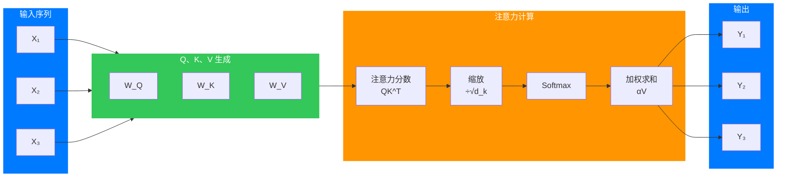
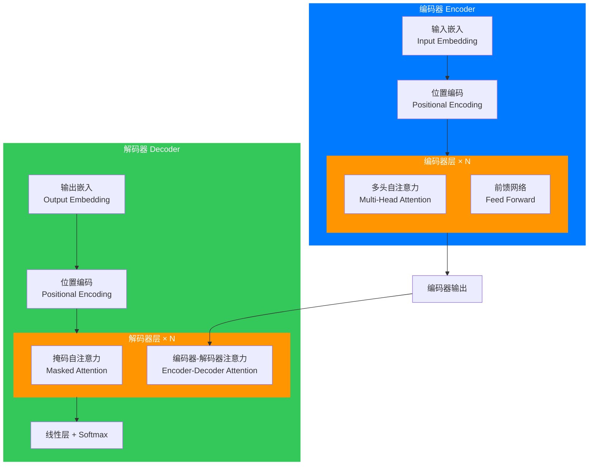

# 引言

在人工智能的发展历程中，有几个时刻标志着技术范式的根本性转变。2017年10月就是这样一个时刻——Google Research 和多伦多大学的研究者们发表了一篇名为《Attention Is All You Need》的论文，提出了 Transformer 架构。

这篇论文的标题本身就是一种宣言：在这篇论文中，作者们向世界宣告，在处理序列数据时，注意力机制就是你所需要的一切。这篇论文不仅解决了长期困扰自然语言处理领域的难题，更开创了一个全新的 AI 时代。从 BERT 到 GPT 系列，从 PaLM 到 Claude，支撑现代大语言模型的核心架构都是 Transformer。

但 Transformer 到底是什么？它为什么如此重要？它是如何工作的？作为一个 AI 领域的深度从业者，我希望通过这篇文章，用最通俗易懂的方式，为你彻底解读这个重塑 AI 世界的重要架构。

## 第一章 背景：为什么我们需要 Transformer？

### 1.1 序列数据处理的困境

在深入 Transformer 之前，让我们先理解它试图解决的问题。在自然语言处理、语音识别、机器翻译等任务中，我们面对的都是序列数据——句子是一系列词语的序列，语音是一系列声波的序列，DNA 是一系列碱基的序列。

对于序列数据的处理，传统的做法是使用循环神经网络（RNN）及其变体，如长短期记忆网络（LSTM）和门控循环单元（GRU）。这些网络的设计理念是：按顺序处理序列中的每个元素，将信息一步一步地传递下去。

**RNN 的工作原理**：想象你在读一本书。你的眼睛一次看一个字（或者一个词），然后大脑会记住这个字的意思，并结合之前记住的内容来理解整个句子。RNN 就是这样工作的——它按顺序处理输入序列，将之前的信息"记住"在隐藏状态中，然后用于处理下一个输入。

### 1.2 RNN 的致命缺陷

然而，RNN 存在几个根本性的问题：

**第一个问题是长距离依赖问题**。在处理长序列时，RNN 很难捕获序列前端和序列后端之间的关联。想象一个很长的句子："那个在巴黎出生的，后来搬到纽约生活的，最后在北京去世的老人，年轻时是个著名的科学家。"要让 RNN 理解"老人"和"年轻时"之间的关系，信息需要从句子的一端传递到另一端。在这个过程中，信息会逐渐衰减，最终可能完全丢失。

**第二个问题是计算效率问题**。RNN 必须按顺序处理序列，这意味着第一步计算完成后才能开始第二步。这种串行计算的方式无法充分利用现代 GPU 的并行计算能力。在处理长序列时，计算变得非常耗时。

**第三个问题是梯度消失和梯度爆炸问题**。在反向传播过程中，梯度需要通过多个时间步传播。当序列很长时，梯度可能会变得非常小（消失）或非常大（爆炸），导致训练困难。

### 1.3 注意力机制的兴起

为了解决 RNN 的问题，研究者们提出了注意力机制（Attention Mechanism）。注意力机制的核心思想是：在处理序列中的每个元素时，我们不应该只依赖之前的信息，而应该能够"回顾"序列中的任意位置。

**注意力的直观理解**：想象你在嘈杂的咖啡馆里听朋友说话。即使周围很吵，你的大脑也能够聚焦于朋友的声音，而忽略背景噪音。注意力机制就是模拟这个过程——它让模型学会在处理每个词时，应该"关注"输入序列的哪些部分。

Bahdanau 等人在 2014 年提出了第一个注意力机制，用于机器翻译。这个注意力机制允许解码器在生成每个目标词时，关注源句子中的相关部分。这大大改善了机器翻译的性能。

但早期的注意力机制仍然是与 RNN 结合使用的。真正的革命性突破来自于 2017 年的那篇论文——作者们意识到，如果只使用注意力机制，我们就可以完全摆脱 RNN 的束缚。

## 第二章 核心概念：什么是注意力机制？

### 2.1 注意力机制的本质

在 Transformer 中，核心是"自注意力"（Self-Attention）机制，也称为"缩放点积注意力"（Scaled Dot-Product Attention）。理解自注意力是理解 Transformer 的关键。

**自注意力的核心问题**：对于序列中的每个元素，我们想了解它与序列中其他所有元素的关系。换句话说，当我们处理序列中的一个词时，我们想知道它应该"关注"序列中的哪些其他词。

### 2.2 Q、K、V：注意力机制的三个角色

在实现上，自注意力机制引入了三个重要的向量：查询（Query）、键（Key）和值（Value）。这三个向量的命名来自于信息检索的类比。

**类比说明**：想象你在图书馆找书。你有一个查询（Query）——你想找的主题。图书馆有一个索引系统，由一系列键（Key）组成——每本书的标题、作者等。你的查询会与每个键进行比较，找到最匹配的书，然后获取相应的值（Value）——书的内容。

在自注意力中：
- **查询（Q）**：代表当前正在处理的元素"想要问的问题"
- **键（K）**：代表序列中每个元素"能回答的问题"
- **值（V）**：代表序列中每个元素"包含的信息"



### 2.3 详细的数学过程

让我们一步步解析自注意力的计算过程。

**第一步：线性变换**

对于输入序列中的每个元素，我们首先通过线性变换将其投影为三个向量：

$$ Q = XW_Q $$
$$ K = XW_K $$
$$ V = XW_V $$

其中 $X$ 是输入矩阵，每一行代表序列中的一个元素（通常是一个词向量）。$W_Q$、$W_K$、$W_V$ 是可学习的权重矩阵。

**第二步：计算注意力分数**

对于每个查询，我们计算它与所有键的相似度。在 Transformer 中，使用点积作为相似度度量：

$$ \text{Attention Score} = QK^T $$

**第三步：缩放**

为了防止点积结果过大导致梯度不稳定，我们对结果进行缩放：

$$ \text{Scaled Score} = \frac{QK^T}{\sqrt{d_k}} $$

其中 $d_k$ 是键向量的维度。

**第四步：Softmax**

将缩放后的分数通过 Softmax 函数转换为概率分布：

$$ \alpha = \text{Softmax}\left(\frac{QK^T}{\sqrt{d_k}}\right) $$

Softmax 确保所有注意力权重的和为 1，每个权重代表当前元素应该"关注"序列中其他元素的程度。

**第五步：加权求和**

最后，用注意力权重对值向量进行加权求和：

$$ \text{Output} = \alpha V $$

### 2.4 完整的自注意力公式

将上述步骤合并，完整的自注意力公式是：

$$ \text{Attention}(Q, K, V) = \text{Softmax}\left(\frac{QK^T}{\sqrt{d_k}}\right)V $$

这个公式看起来很简单，但它蕴含着强大的能力。通过这个运算，每个位置的输出都包含了整个序列的信息，而且每个位置关注的程度是由数据自动学习得到的。

### 2.5 多头注意力：并行多个"视角"

Transformer 不仅仅使用一个自注意力，而是使用"多头注意力"（Multi-Head Attention）。这意味着我们并行地运行多组自注意力计算，然后将结果拼接起来。

**为什么需要多头？**

想象你要理解一段文字。你可能会从多个角度来理解：语法结构、语义含义、情感色彩、上下文关联等。多头注意力就是模拟这个过程——每组注意力头可以专注于不同类型的关系。

**数学表达**：

$$ \text{MultiHead}(Q, K, V) = \text{Concat}(head_1, head_2, ..., head_h)W^O $$

其中每个 $head_i$ 是：

$$ head_i = \text{Attention}(QW_{Q_i}, KW_{K_i}, VW_{V_i}) $$

通常，Transformer 使用 8 个或 16 个注意力头。每个头的维度是原始维度的 $1/h$，所以总的计算量与单头注意力相当。

## 第三章 Transformer 架构：逐层解析

### 3.1 整体架构概览

Transformer 的架构可以用一句话概括：**编码器-解码器结构，完全基于注意力机制**。

整个模型由两部分组成：
- **编码器（Encoder）**：处理输入序列，生成一个表示序列信息的向量
- **解码器（Decoder）**：基于编码器的输出和之前已经生成的内容，生成目标序列

### 3.2 编码器结构

每个编码器层（Encoder Layer）包含两个主要的子层：
1. **多头自注意力机制**
2. **前馈神经网络**

每个子层后面都跟着：
- **残差连接（Residual Connection）**：将子层的输入直接加到输出上
- **层归一化（Layer Normalization）**：对输出进行归一化

用公式表示：

$$ \text{LayerNorm}(x + \text{Sublayer}(x)) $$

### 3.3 解码器结构

解码器层（Decoder Layer）稍微复杂一些，包含三个子层：
1. **掩码多头自注意力（Masked Multi-Head Self-Attention）**
2. **编码器-解码器注意力（Encoder-Decoder Attention）**
3. **前馈神经网络**

**掩码自注意力的作用**：在解码器中，我们只能"看到"之前已经生成的内容，不能"看到"未来的内容。掩码机制通过将未来的注意力权重设置为负无穷（Softmax 后变为 0）来实现这一点。

**编码器-解码器注意力**：这是解码器"关注"编码器输出的方式。在机器翻译任务中，这允许解码器在生成每个目标词时，关注源句子中相关的部分。

### 3.4 位置编码：让模型感知序列顺序

Transformer 完全基于注意力机制，没有循环结构，因此无法感知序列中元素的顺序。为了解决这个问题，Transformer 引入了位置编码（Positional Encoding）。

**位置编码的直观理解**：给序列中的每个位置分配一个独特的"位置标签"，将这个标签加入到输入嵌入中，这样模型就能知道每个元素的相对位置。

**Transformer 使用正弦和余弦函数生成位置编码**：

$$ PE_{(pos, 2i)} = \sin\left(\frac{pos}{10000^{2i/d_{model}}}\right) $$
$$ PE_{(pos, 2i+1)} = \cos\left(\frac{pos}{10000^{2i/d_{model}}}\right) $$

其中 $pos$ 是位置，$i$ 是维度索引，$d_{model}$ 是模型的维度。

**为什么选择正弦和余弦函数？** 因为它们具有一个有用的性质：对于任何固定的偏移量 $k$，$PE_{pos+k}$ 可以表示为 $PE_{pos}$ 的线性组合。这意味着模型可以通过相对位置来学习关注模式。

### 3.5 前馈神经网络

除了注意力层，Transformer 的每个编码器和解码器层都包含一个前馈神经网络：

$$ \text{FFN}(x) = \max(0, xW_1 + b_1)W_2 + b_2 $$

这个前馈网络对每个位置独立地进行相同的变换。它的作用是为模型提供非线性变换能力和额外的表达能力。

### 3.6 完整的 Transformer 架构



现在，让我们把所有的组件放在一起，看看完整的 Transformer 架构：

**编码器部分**：
1. 输入嵌入（Input Embedding）
2. 位置编码（Positional Encoding）
3. N 个编码器层（每层包含多头自注意力和前馈网络）

**解码器部分**：
1. 输出嵌入（Output Embedding）
2. 位置编码
3. N 个解码器层（每层包含掩码自注意力、编码器-解码器注意力和前馈网络）
4. 线性层和 Softmax（将输出转换为概率分布）

在原始论文中，$N=6$，意味着有 6 个编码器层和 6 个解码器层。

## 第四章 为什么 Transformer 如此重要？

### 4.1 并行计算：效率的革命

Transformer 相比 RNN 的最大优势之一是计算并行化。

**RNN 的局限性**：在 RNN 中，第 t 步的计算依赖于第 t-1 步的隐藏状态。这意味着必须按顺序进行计算，无法并行处理序列中的不同位置。

**Transformer 的突破**：在自注意力机制中，序列中所有位置之间的注意力分数可以同时计算。查询、键、值的计算也是并行进行的。这使得 Transformer 能够充分利用 GPU 的并行计算能力。

**实际影响**：在处理长序列时，Transformer 的速度可以比 RNN 快几个数量级。这意味着我们可以训练更大规模的模型，处理更长的序列。

### 4.2 长距离依赖：直接建立关联

**RNN 的信息传递**：在 RNN 中，从序列开头到序列结尾的信息需要通过多个步骤逐步传递。在这个过程中，信息可能会衰减或丢失。

**Transformer 的直接连接**：在自注意力机制中，序列中的任何两个位置都可以直接相互作用。通过一次注意力计算，序列开头的元素就可以"关注"序列结尾的元素。

**数学上的优势**：从数学上看，自注意力计算的是一个全连接图上的信息传递。所有位置之间的关系都是直接建模的，不存在信息传递的"路径长度"问题。

### 4.3 可解释性：看见模型的"思考过程"

相比 RNN 和其他深度学习模型，Transformer 的注意力权重提供了一定程度的可解释性。

**可视化注意力**：我们可以将注意力权重可视化，观察模型在处理某个输入时"关注"了哪些部分。这对于理解模型行为、调试模型和建立信任都非常有帮助。

**例如**：在翻译任务中，我们可以观察解码器在生成某个目标词时，注意力权重集中在源句子的哪些词上。这让我们能够直观地看到模型的"翻译策略"。

### 4.4 通用性：一个架构，多种任务

Transformer 架构的通用性是其另一个重要优势。

**最初设计用于机器翻译**：Transformer 是为机器翻译任务设计的，但它很快被应用于各种其他任务。

**NLP 任务**：文本分类、命名实体识别、问答、摘要生成、文本生成等。

**其他领域**：图像处理（Vision Transformer）、语音识别、音乐生成、蛋白质结构预测（AlphaFold）、代码生成等。

**为什么 Transformer 如此通用？** 因为序列是表示各种数据的自然方式。无论是文本、图像（可以分割成 patches）、还是蛋白质序列（氨基酸序列），都可以表示为序列。Transformer 的自注意力机制能够捕获序列内部的长距离依赖关系，这使得它成为一个通用的序列建模框架。

### 4.5 规模化的成功：越大越好

Transformer 架构的一个重要特性是它能够从规模化中获益。

**神经网络规模化的规律**：在深度学习中，模型的性能通常随着参数数量、训练数据和计算量的增加而提升。这就是著名的"规模定律"（Scaling Laws）。

**Transformer 适合规模化**：Transformer 的并行计算特性使得它可以高效地利用大量计算资源。随着模型规模的增大，Transformer 的性能持续提升，没有明显的饱和迹象。

**GPT 系列的例子**：
- GPT-1：1.17 亿参数
- GPT-2：15 亿参数
- GPT-3：1750 亿参数
- GPT-4：参数数量未知，但可能超过万亿

随着规模的增大，这些模型展现出了越来越强大的能力，包括涌现能力（Emergent Abilities）——在小模型上不存在的能力在大模型上突然出现。

## 第五章 深入理解：关键概念的更多细节

### 5.1 注意力机制的变体

除了原始的缩放点积注意力，Transformer 论文还提到了另一种注意力：加性注意力（Additive Attention）。

**加性注意力的公式**：

$$ \text{Attention}(Q, K, V) = \text{Softmax}(w^T \tanh(W_q Q + W_k K))V $$

这种注意力使用一个前馈网络来计算相似度，而不是点积。它在早期的一些模型中使用，但计算效率不如点积注意力。

**现代的变体**：
- **Rotary Position Embedding（RoPE）**：在注意力计算中引入相对位置信息
- **ALiBi（Attention with Linear Biases）**：通过简单的偏置项来编码位置信息
- **FlashAttention**：优化的注意力计算，利用 GPU 内存层次结构提高效率

### 5.2 层归一化的位置

在原始的 Transformer 论文中，层归一化位于残差连接之后：

$$ y = \text{LayerNorm}(x + \text{Sublayer}(x)) $$

这被称为"Post-LN" Transformer。

后来的研究（如 GPT-2）发现，将层归一化放在注意力层和前馈网络之前（Pre-LN）可能更有利于训练：

$$ y = x + \text{Sublayer}(\text{LayerNorm}(x)) $$

这种变化使得梯度流动更加稳定，便于训练更深的模型。

### 5.3 Dropout 的使用

Transformer 在多个地方使用 Dropout 来防止过拟合：
- 注意力权重计算后
- 前馈网络的激活函数后
- 嵌入层

原始论文使用 0.1 的 Dropout 率。

### 5.4 训练技巧

**标签平滑（Label Smoothing）**：在计算交叉熵损失时，不使用硬标签（0 或 1），而是使用平滑后的标签（如 0.1 和 0.9）。这可以防止模型对预测结果过于自信。

**warmup 学习率调度**：学习率不是一开始就使用最大值，而是从一个很小的值逐渐增加到最大值，然后再按某种策略衰减。公式是：

$$ lr = d_{model}^{-0.5} \cdot \min(step^{-0.5}, step \cdot warmup^{-1.5}) $$

这种策略有助于模型在训练初期找到好的优化方向。

## 第六章 Transformer 的应用：从 NLP 到多模态

### 6.1 自然语言处理

**BERT（Bidirectional Encoder Representations from Transformers）**：仅使用 Transformer 编码器的模型，通过掩码语言建模和下一句预测进行预训练。BERT 在各种 NLP 基准测试中取得了突破性的成果。

**GPT（Generative Pre-trained Transformer）**：仅使用 Transformer 解码器的模型，通过预测下一个词进行训练。GPT 系列模型展示了大语言模型的强大能力。

**T5（Text-to-Text Transfer Transformer）**：将所有 NLP 任务统一为文本到文本的格式，使用完整的编码器-解码器结构。

### 6.2 计算机视觉

**Vision Transformer（ViT）**：将图像分割成固定大小的 patches，然后将这些 patches 视为一个序列，用 Transformer 进行处理。ViT 证明了 Transformer 也可以很好地处理图像任务。

**DETR（Detection Transformer）**：使用 Transformer 进行目标检测，通过注意力机制直接预测物体的边界框。

### 6.3 多模态模型

**CLIP（Contrastive Language-Image Pre-training）**：使用 Transformer 编码器处理图像和文本，学习它们之间的对应关系。

**GPT-4V 和 Gemini**：支持图像输入的多模态大语言模型，可以理解和生成关于图像的内容。

### 6.4 其他领域

**语音识别**：Transformer 已被应用于端到端语音识别模型。

**音乐生成**：如 MusicLM 等模型使用 Transformer 生成音乐。

**生物学**：AlphaFold 使用 Transformer 架构预测蛋白质的三维结构。

**代码生成**：如 CodeBERT、Codex 等模型使用 Transformer 理解和生成代码。

## 第七章 Transformer 的局限性与未来

### 7.1 计算复杂度

Transformer 的一个主要局限是计算复杂度。对于长度为 $n$ 的序列，自注意力的计算复杂度是 $O(n^2)$。当序列很长时，这成为一个严重的瓶颈。

**解决方案**：
- **稀疏注意力**：只计算部分位置之间的注意力
- **线性注意力**：使用核函数将复杂度降低到 $O(n)$
- **局部-全局混合**：将长序列分成多个短片段

### 7.2 位置编码的局限

虽然位置编码允许 Transformer 感知序列顺序，但它们有一些局限性：
- 外推能力有限：对训练时未见过的序列长度表现不佳
- 相对位置信息编码不够自然

**改进方案**：
- RoPE（Rotary Position Embedding）
- ALiBi（Attention with Linear Biases）
- 绝对位置编码的替代方案

### 7.3 Transformer 的变体

为了解决上述问题，研究者们提出了许多 Transformer 的变体：

**高效 Transformer**：
- **Longformer**：结合局部注意力和全局注意力
- **BigBird**：使用随机注意力和局部注意力
- **Performer**：使用核函数实现线性复杂度

**状态空间模型**：
- **Mamba**：最近引起广泛关注的选择性状态空间模型，在保持序列建模能力的同时实现了线性复杂度

### 7.4 未来的方向

**更高效的架构**：研究者们继续探索比 Transformer 更高效、更强大的架构。

**多模态融合**：将 Transformer 扩展到更多模态，实现真正的多模态理解。

**持续学习**：让模型能够持续学习新知识，而不会遗忘旧知识。

**可解释性和安全性**：深入理解 Transformer 的工作原理，提高模型的可解释性和安全性。

## 第八章 实践：如何开始使用 Transformer

### 8.1 Hugging Face Transformers 库

Hugging Face 提供了最流行的 Transformer 库，使得使用和微调预训练模型变得非常简单。

**基本使用示例**：

```python
from transformers import pipeline

# 情感分析
classifier = pipeline("sentiment-analysis")
result = classifier("I love learning about Transformers!")

# 问答
question_answerer = pipeline("question-answering")
result = question_answerer(question="What is Transformer?", context="Transformer is a deep learning model.")

# 使用预训练模型
from transformers import AutoModelForSequenceClassification, AutoTokenizer

model_name = "bert-base-uncased"
tokenizer = AutoTokenizer.from_pretrained(model_name)
model = AutoModelForSequenceClassification.from_pretrained(model_name)
```

### 8.2 微调 Transformer 模型

微调是让预训练模型适应特定任务的关键技术：

```python
from transformers import Trainer, TrainingArguments

training_args = TrainingArguments(
    output_dir="./results",
    num_train_epochs=3,
    per_device_train_batch_size=16,
    evaluation_strategy="epoch",
)

trainer = Trainer(
    model=model,
    args=training_args,
    train_dataset=train_dataset,
    eval_dataset=eval_dataset,
)

trainer.train()
```

### 8.3 从头实现 Transformer

对于想要深入理解 Transformer 的读者，从头实现是一个很好的学习方式：

**关键组件的实现**：
1. 多头注意力层
2. 前馈神经网络
3. 编码器层
4. 解码器层
5. 完整模型

**参考资源**：
- 原始论文《Attention Is All You Need》
- Harvard NLP 团队的注释版论文（http://nlp.seas.harvard.edu/2018/04/03/attention.html）
- 各种在线教程和课程

## 结语

从 2017 年论文发表至今，Transformer 已经彻底改变了人工智能领域。它不仅仅是一个技术突破，更代表了一种新的思维方式——通过注意力机制直接建模序列元素之间的关系。

Transformer 的成功教会我们一个重要的 lesson：有时候，简单的想法如果足够强大，也可以改变世界。自注意力的概念并不复杂，但它所释放的能量是巨大的。

今天，我们正处于大语言模型时代的浪尖。从 ChatGPT 到 Claude，从 Gemini 到 Copilot，这些令人惊叹的 AI 应用都建立在 Transformer 架构之上。理解 Transformer，不仅是理解现代 AI 的基础，更是参与 AI 革命的入场券。

但这只是开始。Transformer 之后，研究者们提出了许多改进和新架构。人工智能领域仍在快速演进，新的突破随时可能出现。作为这个时代的见证者和参与者，我们有幸能够亲历这一切，也有责任去理解和贡献。

最后，用一句话总结 Transformer 的意义：**它证明了，当我们给予模型足够的能力和对数据的恰当归纳偏置，它就能学会我们无法预先设计的复杂模式**。这或许就是深度学习最深刻的哲学启示。

---

## 参考文献

1. Vaswani, A., et al. (2017). "Attention Is All You Need". Advances in Neural Information Processing Systems.
2. Devlin, J., et al. (2018). "BERT: Pre-training of Deep Bidirectional Transformers for Language Understanding". NAACL-HLT.
3. Brown, T., et al. (2020). "Language Models are Few-Shot Learners". NeurIPS.
4. Dosovitskiy, A., et al. (2020). "An Image is Worth 16x16 Words: Transformers for Image Recognition at Scale". ICLR.
5. Bahdanau, D., et al. (2014). "Neural Machine Translation by Jointly Learning to Align and Translate". ICLR.
