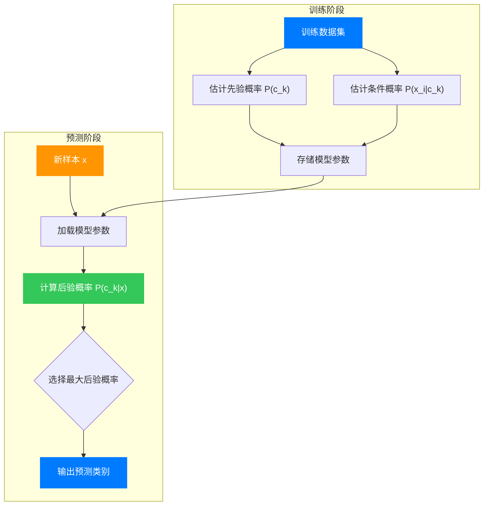
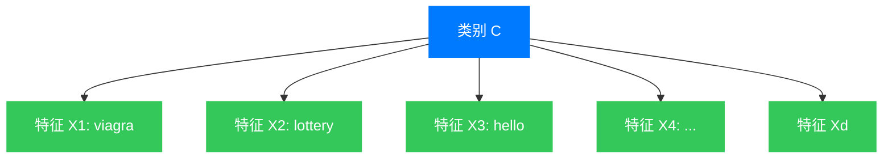

## 引言：不确定世界中的决策智慧

想象你在一家医院工作，面对一位病人。医生告诉你，这位病人有两种可能的疾病：疾病 A 和疾病 B。通过检查，你发现病人出现了某种症状 S。现在的关键问题是：这种症状的出现，是更倾向于指向疾病 A，还是疾病 B？

这就是分类问题的本质——根据观察到的特征，将样本划分到不同的类别中。而在众多分类算法中，贝叶斯分类器以其优美的数学形式和深刻的思想基础，始终占据着不可替代的位置。

它不依赖于复杂的神经网络或深度学习结构，仅仅基于概率论的基本原理，就能在许多实际应用中展现出令人惊讶的效果。更重要的是，它给了我们一种"在不确定情况下进行理性决策"的思维方式。

## 第一章：概率论的基石

在进入贝叶斯分类器的核心之前，让我们先回顾一些基础的概率概念。这些概念看似简单，却构成了整个贝叶斯理论的数学大厦。

### 1.1 条件概率

条件概率是贝叶斯理论的起点。它的直观含义是：在事件 B 发生的条件下，事件 A 发生的概率是多少？数学记为：

$$P(A|B) = \frac{P(A \cap B)}{P(B)}$$

其中 $P(A \cap B)$ 表示 A 和 B 同时发生的概率，$P(B)$ 是事件 B 发生的概率。这个公式的直观理解是：如果我们把所有可能的情况看作一个空间，条件概率就是在"给定 B 发生"这个子空间内，A 所占的比重。

### 1.2 全概率公式

当我们面对一个复杂事件时，常常需要将其分解为若干互不相容的简单事件。这就是全概率公式的思想：

$$P(A) = \sum_{i=1}^{n} P(A|B_i) P(B_i)$$

其中 $B_1, B_2, \ldots, B_n$ 构成一个完备事件组（即它们互不相容且并集为整个样本空间）。全概率公式的几何直观是：将事件 A 的"面积"按照不同条件 $B_i$ 进行"切片"，然后将这些切片的面积加起来。

### 1.3 贝叶斯公式的诞生

将条件概率公式"反过来"使用，就得到了著名的贝叶斯公式：

$$P(B|A) = \frac{P(A|B) P(B)}{P(A)}$$

这个公式看似简单，却蕴含着深刻的哲学意义。它告诉我们：如果我们知道"在 B 发生的条件下 A 的概率"（$P(A|B)$），以及"先验概率" $P(B)$，就可以推导出"观察到 A 后，B 的概率"（$P(B|A)$）。

这里的关键词是**后验概率**（Posterior Probability）与**先验概率**（Prior Probability）的转换。先验概率是在观察到数据之前我们对某个事件可能性的判断，而后验概率是在观察到数据之后更新的判断。

## 第二章：从贝叶斯定理到贝叶斯分类器

### 2.1 分类决策问题的概率视角

现在让我们回到分类问题。假设我们有 $K$ 个类别 $c_1, c_2, \ldots, c_K$，和一个包含 $d$ 个特征的特征向量 $\mathbf{x} = (x_1, x_2, \ldots, x_d)^T$。

分类的目标是：给定观测到的特征 $\mathbf{x}$，判断它属于哪个类别。

从贝叶斯决策的角度来看，我们需要计算**后验概率** $P(c_k|\mathbf{x})$，即"在观察到特征 $\mathbf{x}$ 的条件下，样本属于类别 $c_k$ 的概率"。然后选择后验概率最大的那个类别作为分类结果：

$$\hat{y} = \arg\max_{c_k} P(c_k|\mathbf{x})$$

### 2.2 贝叶斯公式的应用

根据贝叶斯公式，后验概率可以展开为：

$$P(c_k|\mathbf{x}) = \frac{P(\mathbf{x}|c_k) P(c_k)}{P(\mathbf{x})}$$

这里：
- $P(c_k)$ 是先验概率（Prior），即样本属于类别 $c_k$ 的先验概率
- $P(\mathbf{x}|c_k)$ 是类条件概率（Likelihood），即在类别 $c_k$ 中观察到特征 $\mathbf{x}$ 的概率
- $P(\mathbf{x})$ 是证据因子（Evidence），即观察到特征 $\mathbf{x}$ 的总概率

在分类决策中，我们实际上只需要比较不同类别的后验概率，而 $P(\mathbf{x})$ 对所有类别都是相同的，可以忽略。因此决策规则简化为：

$$\hat{y} = \arg\max_{c_k} P(\mathbf{x}|c_k) P(c_k)$$

这个公式的物理直觉非常清晰：我们将"先验信息"（类别的普遍性）与"观测到的证据"（特征在各类别中的可能性）结合起来，做出最优决策。

这个流程图展示了贝叶斯分类器的完整工作流程。训练阶段负责从数据中学习概率分布参数，预测阶段利用这些参数计算后验概率并做出决策。

## 第三章：朴素贝叶斯分类器

### 3.1 "朴素"假设的动机

理论上，如果我们能够准确估计 $P(\mathbf{x}|c_k)$，就可以得到最优的贝叶斯分类器。但这里面临一个致命的困难：当特征维度 $d$ 很大时，$P(\mathbf{x}|c_k)$ 是一个 $d$ 维的概率分布，其参数数量随维度指数增长。

例如，假设每个特征有 $m$ 种可能取值，那么需要估计的参数数量是 $(m^d-1) \times K$。当 $d=20, m=2$ 时，这已经是天文数字了。

朴素贝叶斯分类器引入了一个"朴素"的假设：**特征之间相互独立**。即：

$$P(\mathbf{x}|c_k) = \prod_{i=1}^{d} P(x_i|c_k)$$

这个假设在实际中几乎总是不成立的（很少有特征真正完全独立），但却带来了极大的计算简化。更重要的是，实践证明，即使在独立性假设严重违反的情况下，朴素贝叶斯往往仍然能取得很好的分类效果。

这种现象被称为"朴素贝叶斯的神奇"，其数学原因之一是：分类只关心后验概率的**相对大小**，而不是绝对值。即使独立假设导致概率估计不准确，只要各类别的相对顺序保持不变，分类结果依然正确。

### 3.2 朴素贝叶斯的核心公式

在独立性假设下，决策准则变为：

$$\hat{y} = \arg\max_{c_k} P(c_k) \prod_{i=1}^{d} P(x_i|c_k)$$

为了避免数值下溢（当 $d$ 很大时，多个小于 1 的数相乘会导致计算机下溢），我们通常取对数：

$$\hat{y} = \arg\max_{c_k} \left[ \log P(c_k) + \sum_{i=1}^{d} \log P(x_i|c_k) \right]$$

这个公式不仅数值稳定，而且将乘法转化为加法，计算更加高效。

### 3.3 三种常见的概率模型

根据特征类型的不同，朴素贝叶斯有三种常见的概率模型。

#### 3.3.1 多项式朴素贝叶斯（Multinomial Naive Bayes）

适用于**计数型特征**（Count Features），如文本分类中的词频统计。

在类别 $c_k$ 中，特征 $x_i$ 的概率分布建模为多项式分布：

$$P(x_i|c_k) = \frac{n_{ik} + \alpha}{N_k + \alpha d}$$

其中：
- $n_{ik}$ 是类别 $c_k$ 中特征 $x_i$ 的总计数
- $N_k$ 是类别 $c_k$ 中所有特征的总计数
- $\alpha$ 是平滑参数（Laplace 平滑），通常取 $\alpha = 1$

平滑参数的作用是避免零概率问题：如果某个特征在训练数据的某个类别中从未出现，不加平滑会导致概率为零，从而整个乘积为零。

#### 3.3.2 伯努利朴素贝叶斯（Bernoulli Naive Bayes）

适用于**二值特征**（Binary Features），如"词是否出现"。

每个特征 $x_i$ 只能取 0 或 1，其条件概率为：

$$P(x_i|c_k) = p_{ik}^{x_i} (1-p_{ik})^{1-x_i}$$

其中 $p_{ik}$ 是类别 $c_k$ 中特征 $x_i$ 取值为 1 的概率。

#### 3.3.3 高斯朴素贝叶斯（Gaussian Naive Bayes）

适用于**连续型特征**（Continuous Features）。

假设在类别 $c_k$ 中，特征 $x_i$ 服从高斯分布：

$$P(x_i|c_k) = \frac{1}{\sqrt{2\pi}\sigma_{ik}} \exp\left[ -\frac{(x_i - \mu_{ik})^2}{2\sigma_{ik}^2} \right]$$

其中 $\mu_{ik}$ 和 $\sigma_{ik}^2$ 分别是类别 $c_k$ 中特征 $x_i$ 的均值和方差。

## 第四章：垃圾邮件过滤的实践应用

让我们通过一个具体的例子来理解朴素贝叶斯的工作原理。

### 4.1 问题建模

假设我们要构建一个垃圾邮件过滤器。每封邮件表示为一个词袋（Bag of Words），只关注词的出现与否，不关心词序和语法。

定义：
- 类别：$c_0$（正常邮件），$c_1$（垃圾邮件）
- 特征：$x_i = 1$ 表示词 $w_i$ 在邮件中出现，$x_i = 0$ 表示不出现
- 词汇表大小：$d$

### 4.2 训练阶段

在训练集中，我们需要估计以下参数：

1. **先验概率**：
   $$P(c_1) = \frac{\text{垃圾邮件数量}}{\text{总邮件数量}}$$
   $$P(c_0) = 1 - P(c_1)$$

2. **条件概率**（对每个词 $w_i$）：
   $$P(x_i=1|c_1) = \frac{\text{包含词 } w_i \text{ 的垃圾邮件数} + \alpha}{\text{垃圾邮件总数} + \alpha d}$$
   $$P(x_i=1|c_0) = \frac{\text{包含词 } w_i \text{ 的正常邮件数} + \alpha}{\text{正常邮件总数} + \alpha d}$$

### 4.3 预测阶段

给定一封新邮件，计算它属于垃圾邮件的对数后验概率：

$$\log P(c_1|\mathbf{x}) \propto \log P(c_1) + \sum_{i: x_i=1} \log P(x_i=1|c_1) + \sum_{i: x_i=0} \log [1-P(x_i=1|c_1)]$$

同样计算 $\log P(c_0|\mathbf{x})$，比较大小，选择概率较大的类别。

### 4.4 一个数值例子

假设词汇表只有三个词：{viagra, lottery, hello}，训练数据如下：

- 垃圾邮件：100 封，其中：
  - 60 封包含 "viagra"
  - 50 封包含 "lottery"
  - 10 封包含 "hello"
- 正常邮件：400 封，其中：
  - 5 封包含 "viagra"
  - 10 封包含 "lottery"
  - 300 封包含 "hello"

**先验概率**：
$$P(c_1) = \frac{100}{500} = 0.2, \quad P(c_0) = 0.8$$

**条件概率**（使用 Laplace 平滑 $\alpha=1$）：

| 词 | $P(x_i=1|c_1)$ | $P(x_i=1|c_0)$ |
|---|---|---|
| viagra | $\frac{60+1}{100+3} \approx 0.592$ | $\frac{5+1}{400+3} \approx 0.015$ |
| lottery | $\frac{50+1}{100+3} \approx 0.495$ | $\frac{10+1}{400+3} \approx 0.027$ |
| hello | $\frac{10+1}{100+3} \approx 0.107$ | $\frac{300+1}{400+3} \approx 0.747$ |

**预测一封新邮件**：内容为 "viagra lottery hello"

计算对数后验概率：

$$\begin{aligned}
\log P(c_1|\mathbf{x}) &\propto \log 0.2 + \log 0.592 + \log 0.495 + \log 0.107 \\
&= -1.609 - 0.524 - 0.703 - 2.236 \\
&= -5.072
\end{aligned}$$

$$\begin{aligned}
\log P(c_0|\mathbf{x}) &\propto \log 0.8 + \log 0.015 + \log 0.027 + \log 0.747 \\
&= -0.223 - 4.200 - 3.612 - 0.292 \\
&= -8.327
\end{aligned}$$

因为 $-5.072 > -8.327$，所以分类为**垃圾邮件**。

这个例子展示了朴素贝叶斯的工作机制：即使 "hello" 更常出现在正常邮件中，但 "viagra" 和 "lottery" 这两个词的垃圾邮件指示性太强，足以压倒 "hello" 的正常邮件指示性。

为了更直观地理解朴素贝叶斯的网络结构，下图展示了邮件分类的贝叶斯网络：

在这个网络中，类别节点 $C$ 是唯一的父节点，所有特征节点 $X_i$ 只依赖于类别，而特征之间相互独立。这就是朴素贝叶斯的"朴素"假设在网络结构上的体现。

## 第五章：贝叶斯网络

朴素贝叶斯假设所有特征相互独立，这过于简化。贝叶斯网络（Bayesian Network）是更一般化的概率图模型，它允许特征之间存在有限的依赖关系。

### 5.1 贝叶斯网络的定义

贝叶斯网络是一个有向无环图（DAG），其中：
- 每个节点表示一个随机变量
- 边表示变量之间的直接依赖关系
- 每个节点有一个条件概率表（CPT），给定其父节点的取值

### 5.2 联合概率的因式分解

贝叶斯网络的核心优势在于：联合概率分布可以因式分解为条件概率的乘积：

$$P(X_1, X_2, \ldots, X_n) = \prod_{i=1}^{n} P(X_i|\text{Pa}(X_i))$$

其中 $\text{Pa}(X_i)$ 表示节点 $X_i$ 的父节点集合。

这种因式分解大大减少了需要估计的参数数量。例如，一个有 $n$ 个变量的全连接网络需要 $O(2^n)$ 个参数，而一个树状结构的贝叶斯网络只需要 $O(n)$ 个参数。

### 5.3 推理与学习

贝叶斯网络的核心任务有两个：

1. **推理（Inference）**：给定部分变量的观测值，推断其他变量的后验概率
   - 精确推理：变量消元法、信念传播
   - 近似推理：MCMC 采样、变分推断

2. **学习（Learning）**：从数据中学习网络结构和参数
   - 参数学习：最大似然估计、贝叶斯估计
   - 结构学习：基于评分的方法、约束方法

### 5.4 应用领域

贝叶斯网络的应用非常广泛：
- **医疗诊断**：症状、疾病、病因之间的关系建模
- **故障诊断**：设备故障的因果推理
- **推荐系统**：用户偏好、商品特征之间的依赖关系
- **自然语言处理**：句法分析、语义理解

## 结语：贝叶斯思想的不朽价值

贝叶斯分类器不仅仅是一种算法，更是一种思维方式。它教导我们：

1. **先验知识的重要性**：我们不应完全依赖数据，而应该结合先验知识。这与人类的学习方式一致——我们带着已有的经验去理解新事物。

2. **不确定性是常态**：世界充满了不确定性，我们不应该追求绝对的确定性，而应该在不确定性中做出最优决策。

3. **模型的简洁性**：朴素贝叶斯的"天真"假设虽然在数学上不成立，但在实践中却屡建奇功。这提醒我们：一个好的模型不一定是最精确的，而是最能在效果和效率之间取得平衡的。

4. **概率论是智能的数学语言**：无论是从哲学层面还是技术层面，概率论都为我们提供了理解和建模不确定性的强大工具。

在深度学习大行其道的今天，贝叶斯分类器及其衍生方法（变分推断、贝叶斯神经网络等）依然保持着旺盛的生命力。它们不仅在理论上的优雅令人着迷，更在实践中的可靠性让人信赖。

正如统计学家 George Box 所说："所有模型都是错的，但有些是有用的。" 贝叶斯分类器就是这样一类"有用"的模型——它用简洁的数学形式，捕捉了分类问题的本质，为我们提供了一套在不确定世界中理性决策的工具。

---

**参考文献**：
1. Bishop, C. M. (2006). *Pattern Recognition and Machine Learning*. Springer.
2. Murphy, K. P. (2012). *Machine Learning: A Probabilistic Perspective*. MIT Press.
3. Duda, R. O., Hart, P. E., & Stork, D. G. (2000). *Pattern Classification*. Wiley.
4. Russell, S., & Norvig, P. (2020). *Artificial Intelligence: A Modern Approach*. Pearson.
