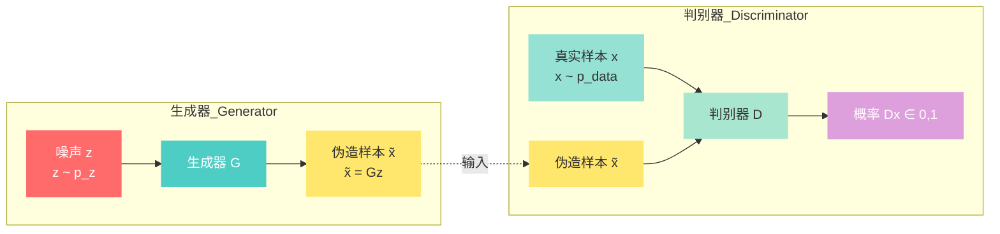

# 引言：从混沌中创造秩序

想象你是一位艺术鉴赏家,正在试图辨别一幅画作是大师真迹还是现代仿品。你仔细观察笔触、色彩、构图,试图找出破绽。与此同时,另一位艺术家正在努力学习大师的风格,试图创作出能骗过你的作品。这是一个永恒的博弈:一方越来越擅长伪造,另一方越来越擅长辨别。

这正是生成对抗网络的核心思想。2014年,Ian Goodfellow 在一个学术研讨会上提出了这个想法,当时有人认为这是"在酒吧里想出来的疯狂主意"。然而,这个"疯狂的主意"彻底改变了生成式人工智能的格局。

## 第一章：生成问题的本质

在深入 GAN 之前,让我们先理解什么是"生成"问题。假设我们有一个数据集,比如一堆手写数字图片。我们希望创建一个模型,能够生成"看起来像"这些手写数字的新图片。

这个问题有两个核心挑战:

1. **数据分布建模**: 我们需要学习数据的概率分布 $p_{data}(\mathbf{x})$,其中 $\mathbf{x}$ 表示一个样本。
2. **从分布中采样**: 一旦我们学到了分布,我们需要能够从中采样来生成新样本。

### 1.1 传统生成方法

在 GAN 出现之前,研究者已经尝试了多种方法:

**自编码器**: 先将数据压缩到低维空间,然后试图从低维表示重建原始数据。但这种方法生成的样本往往模糊不清。

**玻尔兹曼机**: 基于能量函数的方法,通过马尔可夫链蒙特卡洛采样。但训练极其困难,采样效率低。

**变分自编码器 (VAE)**: 通过变分推断近似后验分布。数学上优美,但生成的图像仍然不够真实。

这些方法都有一个共同点:它们试图显式地建模数据分布 $p_{data}(\mathbf{x})$。这就像试图精确描述"什么样的数字图像看起来像真实的",这本身就是一个极其困难的问题。

### 1.2 GAN 的突破思想

GAN 的革命性在于:**不需要显式建模数据分布**。

相反,GAN 将生成问题转化为一个**对抗游戏**:

- **生成器 (Generator, $G$)**: 从随机噪声 $\mathbf{z} \sim p_z(\mathbf{z})$ 出发,生成伪造样本 $\tilde{\mathbf{x}} = G(\mathbf{z})$。目标:让判别器无法区分真假。

- **判别器 (Discriminator, $D$)**: 接收一个样本 $\mathbf{x}$,判断它是来自真实数据($\mathbf{x} \sim p_{data}$)还是生成器($\tilde{\mathbf{x}} = G(\mathbf{z})$)。输出是概率 $D(\mathbf{x}) \in [0, 1]$。目标:准确区分真假。

这是一个**零和博弈**:生成器试图最小化判别器的准确率,而判别器试图最大化准确率。当两者达到平衡时,生成器就"学会"了生成真实样本。



*图 1：GAN 的架构示意图。生成器将噪声映射为图像，判别器区分真实和伪造样本*

## 第二章：数学框架与目标函数

### 2.1 极大极小博弈

让我们将这个想法形式化。定义:

- $\mathbf{z} \sim p_z(\mathbf{z})$: 先验噪声分布(通常为高斯分布)
- $\mathbf{x} \sim p_{data}(\mathbf{x})$: 真实数据分布
- $G(\mathbf{z}; \theta_g)$: 生成器,参数为 $\theta_g$
- $D(\mathbf{x}; \theta_d)$: 判别器,参数为 $\theta_d$

判别器的目标是最大化对真实样本正确分类的概率,同时最小化对生成样本的错误分类概率:

$$V(D, G) = \mathbb{E}_{\mathbf{x} \sim p_{data}(\mathbf{x})}[\log D(\mathbf{x})] + \mathbb{E}_{\mathbf{z} \sim p_z(\mathbf{z})}[\log(1 - D(G(\mathbf{z})))]$$

其中:
- 第一项:判别器对真实样本 $\mathbf{x}$ 输出接近 $1$ 的概率
- 第二项:判别器对伪造样本 $G(\mathbf{z})$ 输出接近 $0$ 的概率

生成器的目标是**最小化**这个价值函数(让判别器犯错):

$$\min_G \max_D V(D, G)$$

这就是著名的**极大极小博弈**。

### 2.2 判别器的最优解

让我们先固定生成器 $G$,求解判别器的最优解。对于任何给定的输入 $\mathbf{x}$,判别器输出 $D(\mathbf{x})$。我们想要最大化对数似然:

$$\max_{D(\mathbf{x})} \left[ p_{data}(\mathbf{x}) \log D(\mathbf{x}) + p_g(\mathbf{x}) \log(1 - D(\mathbf{x})) \right]$$

其中 $p_g(\mathbf{x})$ 是生成样本的分布。

这是一个标量优化问题。对 $D(\mathbf{x})$ 求导并令为零:

$$\frac{d}{dD(\mathbf{x})} \left[ p_{data}(\mathbf{x}) \log D(\mathbf{x}) + p_g(\mathbf{x}) \log(1 - D(\mathbf{x})) \right] = 0$$

$$\frac{p_{data}(\mathbf{x})}{D(\mathbf{x})} - \frac{p_g(\mathbf{x})}{1 - D(\mathbf{x})} = 0$$

$$p_{data}(\mathbf{x})(1 - D(\mathbf{x})) = p_g(\mathbf{x}) D(\mathbf{x})$$

$$p_{data}(\mathbf{x}) - p_{data}(\mathbf{x}) D(\mathbf{x}) = p_g(\mathbf{x}) D(\mathbf{x})$$

$$D^*(\mathbf{x}) = \frac{p_{data}(\mathbf{x})}{p_{data}(\mathbf{x}) + p_g(\mathbf{x})}$$

这是判别器的**全局最优解**。

**直观解释**:判别器的输出应该等于"这个样本来自真实数据而非生成数据的概率"。如果 $p_{data}(\mathbf{x})$ 很高而 $p_g(\mathbf{x})$ 很低,那么 $D(\mathbf{x}) \approx 1$;反之则接近 $0$。

### 2.3 生成器的目标函数

有了最优判别器,我们可以将其代回价值函数:

$$V(G, D^*) = \mathbb{E}_{\mathbf{x} \sim p_{data}}\left[\log \frac{p_{data}(\mathbf{x})}{p_{data}(\mathbf{x}) + p_g(\mathbf{x})}\right] + \mathbb{E}_{\mathbf{x} \sim p_g}\left[\log \frac{p_g(\mathbf{x})}{p_{data}(\mathbf{x}) + p_g(\mathbf{x})}\right]$$

这个表达式看起来复杂,但可以简化。注意到:

$$\int [p_{data}(\mathbf{x}) \log \frac{p_{data}(\mathbf{x})}{p_{data}(\mathbf{x}) + p_g(\mathbf{x})} + p_g(\mathbf{x}) \log \frac{p_g(\mathbf{x})}{p_{data}(\mathbf{x}) + p_g(\mathbf{x})}] d\mathbf{x}$$

这可以写成:

$$\mathbb{E}_{\mathbf{x} \sim p_{data}}\left[-\log 2 - \log \left(\frac{p_{data}(\mathbf{x}) + p_g(\mathbf{x})}{2 p_{data}(\mathbf{x})}\right)\right] + \mathbb{E}_{\mathbf{x} \sim p_g}\left[-\log 2 - \log \left(\frac{p_{data}(\mathbf{x}) + p_g(\mathbf{x})}{2 p_g(\mathbf{x})}\right)\right]$$

$$= -\log 4 + \text{KL}\left(p_{data} \parallel \frac{p_{data} + p_g}{2}\right) + \text{KL}\left(p_g \parallel \frac{p_{data} + p_g}{2}\right)$$

其中 $\text{KL}$ 是 KL 散度。这个表达式恰好等于:

$$-\log 4 + 2 \cdot \text{JSD}(p_{data} \parallel p_g)$$

其中 JSD 是 Jensen-Shannon 散度。

**关键洞察**:生成器的目标是最小化 JSD 散度。当 $p_g = p_{data}$ 时,JSD 散度为 $0$,价值函数达到最小值 $-\log 4$。

**结论**:GAN 的训练目标是让生成分布 $p_g$ 收敛到真实数据分布 $p_{data}$。

### 2.4 实际训练过程

虽然理论分析很有趣,但实际训练时我们使用交替优化:

1. **固定 $G$,更新 $D$**:
   - 采样真实数据: $\{\mathbf{x}^{(1)}, \ldots, \mathbf{x}^{(m)}\} \sim p_{data}$
   - 采样噪声: $\{\mathbf{z}^{(1)}, \ldots, \mathbf{z}^{(m)}\} \sim p_z$
   - 生成伪造样本: $\{\tilde{\mathbf{x}}^{(1)}, \ldots, \tilde{\mathbf{x}}^{(m)}\}, \tilde{\mathbf{x}}^{(i)} = G(\mathbf{z}^{(i)})$
   - 梯度上升:
     $$\nabla_{\theta_d} \frac{1}{m} \sum_{i=1}^{m} \left[\log D(\mathbf{x}^{(i)}) + \log(1 - D(\tilde{\mathbf{x}}^{(i)}))\right]$$

2. **固定 $D$,更新 $G$**:
   - 采样噪声: $\{\mathbf{z}^{(1)}, \ldots, \mathbf{z}^{(m)}\} \sim p_z$
   - 梯度下降:
     $$\nabla_{\theta_g} \frac{1}{m} \sum_{i=1}^{m} \log(1 - D(G(\mathbf{z}^{(i)})))$$

**实际改进**:在实践中,生成器通常最大化 $\log D(G(\mathbf{z}))$ 而不是最小化 $\log(1 - D(G(\mathbf{z})))$,因为后者在训练初期梯度会消失。

## 第三章：GAN 的架构与实现

### 3.1 神经网络基础

让我们先回顾多层感知机的基本结构。一个典型的神经网络:

$$\mathbf{h}^{(l)} = \sigma(\mathbf{W}^{(l)} \mathbf{h}^{(l-1)} + \mathbf{b}^{(l)})$$

其中:
- $\mathbf{W}^{(l)} \in \mathbb{R}^{n^{(l)} \times n^{(l-1)}}$: 第 $l$ 层的权重矩阵
- $\mathbf{b}^{(l)} \in \mathbb{R}^{n^{(l)}}$: 第 $l$ 层的偏置向量
- $\sigma(\cdot)$: 激活函数(如 ReLU, sigmoid, tanh)
- $\mathbf{h}^{(0)} = \mathbf{x}$: 输入
- $\mathbf{h}^{(L)}$: 输出

**反向传播**:训练神经网络的核心是反向传播算法。给定损失函数 $L$,我们使用链式法则计算梯度:

$$\frac{\partial L}{\partial \mathbf{W}^{(l)}} = \frac{\partial L}{\partial \mathbf{h}^{(l)}} \cdot \frac{\partial \mathbf{h}^{(l)}}{\partial \mathbf{z}^{(l)}} \cdot \frac{\partial \mathbf{z}^{(l)}}{\partial \mathbf{W}^{(l)}}$$

其中 $\mathbf{z}^{(l)} = \mathbf{W}^{(l)} \mathbf{h}^{(l-1)} + \mathbf{b}^{(l)}$。

### 3.2 GAN 的具体实现

让我们看看 GAN 的具体实现。假设我们生成 $64 \times 64$ 的 RGB 图像。

**生成器 $G$**:
```python
# 输入: 噪声向量 z ∈ R^100
# 输出: 图像 x ∈ R^(64×64×3)

# 第一层: 全连接层 + Reshape
z → Dense(4×4×512) → Reshape(4, 4, 512)

# 上采样层 (使用转置卷积或上采样 + 卷积)
4×4×512 → Conv2DTranspose(256, 5×5, stride=2) → 8×8×256
8×8×256 → BatchNorm → ReLU
8×8×256 → Conv2DTranspose(128, 5×5, stride=2) → 16×16×128
16×16×128 → BatchNorm → ReLU
16×16×128 → Conv2DTranspose(64, 5×5, stride=2) → 32×32×64
32×32×64 → BatchNorm → ReLU
32×32×64 → Conv2DTranspose(3, 5×5, stride=2, activation='tanh') → 64×64×3
```

**判别器 $D$**:
```python
# 输入: 图像 x ∈ R^(64×64×3)
# 输出: 概率 D(x) ∈ [0, 1]

64×64×3 → Conv2D(64, 5×5, stride=2, leaky_relu) → 32×32×64
32×32×64 → Dropout(0.3)

32×32×64 → Conv2D(128, 5×5, stride=2, leaky_relu) → 16×16×128
16×16×128 → BatchNorm → Dropout(0.3)

16×16×128 → Conv2D(256, 5×5, stride=2, leaky_relu) → 8×8×256
8×8×256 → BatchNorm → Dropout(0.3)

8×8×256 → Flatten → Dense(1, activation='sigmoid')
```

**关键设计决策**:

1. **激活函数选择**:
   - 判别器: 使用 LeakyReLU 而非 ReLU,避免"死亡神经元"
   - 生成器: 使用 tanh 作为输出激活函数(输出范围 $[-1, 1]$)

2. **批归一化 (Batch Normalization)**:
   - 稳定训练,防止梯度爆炸/消失
   - 生成器的所有层都使用,判别器的部分层使用

3. **转置卷积 vs 上采样**:
   - 转置卷积可能导致棋盘格效应
   - 现代 GAN 更多使用上采样 + 卷积

### 3.3 GAN 架构图

```mermaid
graph TB
    subgraph 生成器_G
        Z[噪声 z<br/>z ∈ R^100] --> FC1[全连接层<br/>4×4×512]
        FC1 --> US1[上采样层<br/>8×8×256]
        US1 --> US2[上采样层<br/>16×16×128]
        US2 --> US3[上采样层<br/>32×32×64]
        US3 --> US4[上采样层<br/>64×64×3]
        US4 --> X_hat[生成图像<br/>x̃ = Gz]
    end

    subgraph 判别器_D
        X[真实图像<br/>x ∈ R^64×64×3]
        X_hat_in[生成图像<br/>x̃ = Gz]

        X --> C1[卷积层<br/>32×32×64]
        X_hat_in --> C1

        C1 --> C2[卷积层<br/>16×16×128]
        C2 --> C3[卷积层<br/>8×8×256]
        C3 --> F[展平层]
        F --> OUT[输出概率<br/>Dx ∈ 0 1]
    end

    style Z fill:#FF9500,stroke:#FF9500,stroke-width:3px,color:#ffffff
    style X fill:#34C759,stroke:#34C759,stroke-width:3px,color:#ffffff
    style X_hat fill:#FF9500,stroke:#FF9500,stroke-width:2px,color:#ffffff
    style X_hat_in fill:#FF9500,stroke:#FF9500,stroke-width:2px,color:#ffffff
    style FC1 fill:#5AC8FA,stroke:#5AC8FA,stroke-width:2px,color:#ffffff
    style US1 fill:#5AC8FA,stroke:#5AC8FA,stroke-width:1px,color:#ffffff
    style US2 fill:#5AC8FA,stroke:#5AC8FA,stroke-width:1px,color:#ffffff
    style US3 fill:#5AC8FA,stroke:#5AC8FA,stroke-width:1px,color:#ffffff
    style US4 fill:#5AC8FA,stroke:#5AC8FA,stroke-width:1px,color:#ffffff
    style C1 fill:#AF52DE,stroke:#AF52DE,stroke-width:2px,color:#ffffff
    style C2 fill:#AF52DE,stroke:#AF52DE,stroke-width:2px,color:#ffffff
    style C3 fill:#AF52DE,stroke:#AF52DE,stroke-width:2px,color:#ffffff
    style F fill:#AF52DE,stroke:#AF52DE,stroke-width:1px,color:#ffffff
    style OUT fill:#FF3B30,stroke:#FF3B30,stroke-width:3px,color:#ffffff
```



## 第四章：训练的挑战与解决方案

GAN 的理论虽然优美,但实际训练极其困难。让我们探讨主要挑战和解决方案。

### 4.1 模式崩溃

**问题描述**:生成器可能学会只生成少数几种样本,无法覆盖数据分布的多样性。

**原因分析**:假设判别器对某一类样本输出 $D(\mathbf{x}) \approx 0.5$,生成器发现欺骗判别器最简单的方法是只生成这一类样本。

**解决方案**:

1. **小批量判别 (Mini-batch Discrimination)**:
   - 让判别器能够判断"一个小批量的样本是否都来自同一分布"
   - 特征之间的相似度被纳入考虑

2. **特征匹配 (Feature Matching)**:
   - 生成器不再试图欺骗判别器的输出,而是匹配判别器中间层的统计量
   - 目标:让生成样本的激活统计量与真实样本相似

3. **使用不同架构**:
   - WGAN-GP:使用 Wasserstein 距离
   - SNGAN:谱归一化
   - BigGAN:自注意力机制

### 4.2 收敛性问题

**问题描述**:GAN 的训练是两个网络的对抗,容易陷入不稳定状态。

**原因分析**:
- 纳什均衡的存在性和可达性
- 两个网络的训练速度不匹配
- 梯度在训练过程中震荡

**解决方案**:

1. **标签平滑 (Label Smoothing)**:
   - 不使用硬标签 $\{0, 1\}$,而是使用 $\{0.1, 0.9\}$
   - 防止判别器过度自信

2. **梯度惩罚 (Gradient Penalty)**:
   - WGAN-GP 引入梯度约束
   - 目标:让判别器的梯度在真实和生成样本之间保持一致

3. **学习率调度**:
   - 使用不同的学习率
   - 使用衰减学习率

### 4.3 评估困难

**问题描述**:GAN 的评估没有统一的标准。不像分类任务有准确率,生成任务的主观性很强。

**常用指标**:

1. **Inception Score (IS)**:
   $$IS(G) = \exp\left(\mathbb{E}_{\mathbf{x} \sim p_g}[\text{KL}(p(y|\mathbf{x}) \parallel p(y))]\right)$$
   - 高 IS 意味着生成图像清晰(低熵)且多样化(高熵)

2. **Fréchet Inception Distance (FID)**:
   $$FID(p_r, p_g) = \|\mathbf{\mu}_r - \mathbf{\mu}_g\|^2 + \text{Tr}(\mathbf{\Sigma}_r + \mathbf{\Sigma}_g - 2(\mathbf{\Sigma}_r \mathbf{\Sigma}_g)^{1/2})$$
   - 基于 Inception 特征的距离度量
   - 越低越好

3. **人类评估**:
   - 图灵测试式的评估
   - 主观但最有说服力

## 第五章：高级 GAN 架构

### 5.1 DCGAN:深度卷积生成对抗网络

DCGAN 是第一个稳定训练的 GAN 架构,奠定了后续发展的基础。

**关键改进**:

1. **使用卷积层而非全连接层**:
   - 判别器使用步长卷积(strided convolution)代替池化
   - 生成器使用转置卷积或上采样

2. **批归一化**:
   - 在生成器和判别器中都使用
   - 稳定训练,防止梯度问题

3. **架构设计**:
   - 去除全连接层
   - 生成器除输出层外使用 ReLU
   - 判别器所有层都使用 LeakyReLU

**几何直观**:卷积操作捕捉空间层次结构,从低级特征(边缘、纹理)到高级特征(形状、物体)。

### 5.2 WGAN:Wasserstein GAN

WGAN 的核心思想是使用 Wasserstein 距离代替 JS 散度。

**Wasserstein 距离(地球移动距离)**:

$$W(p_r, p_g) = \inf_{\gamma \in \Pi(p_r, p_g)} \mathbb{E}_{(\mathbf{x}, \mathbf{y}) \sim \gamma}[\|\mathbf{x} - \mathbf{y}\|]$$

其中 $\Pi(p_r, p_g)$ 是所有联合分布的集合,满足边缘分布分别为 $p_r$ 和 $p_g$。

**直观解释**:将分布 $p_r$ 的"土堆"移动到 $p_g$ 的"坑洞"所需的最小"功"。


*图 2：Wasserstein 距离的几何直观。我们需要将真实分布的质量移动到生成分布的位置，最小化所需的"功"*

**关键优势**:

1. **更好的梯度性质**:即使分布没有重叠,Wasserstein 距离仍然提供有意义的梯度
2. **与训练稳定性相关**:判别器的损失可以用于衡量训练进度

**WGAN-GP 的改进**:
- 使用梯度惩罚代替权重裁剪
- 目标:让判别器的梯度范数接近 $1$
- 更稳定的训练

### 5.3 SNGAN:谱归一化

SNGAN 通过谱归一化(Spectral Normalization)稳定判别器的训练。

**谱归一化的定义**:

$$\bar{\mathbf{W}}_{SN} = \frac{\mathbf{W}}{\sigma(\mathbf{W})}$$

其中 $\sigma(\mathbf{W})$ 是权重矩阵 $\mathbf{W}$ 的谱范数(最大奇异值)。

**效果**:
- 限制判别器的 Lipschitz 常数
- 稳定训练,不需要批归一化
- 适用于各种架构

### 5.4 JS 散度 vs Wasserstein 距离

理解为什么 Wasserstein 距离比 JS 散度更好,我们需要看它们的性质。


*图 3：JS 散度与 Wasserstein 距离的对比。当两个分布没有重叠时，JS 散度饱和而 Wasserstein 距离继续提供有意义的梯度*

**JS 散度的局限**:
- 当 $p_r$ 和 $p_g$ 没有重叠时,JS 散度为 $\log 2$
- 这意味着梯度消失,生成器无法学习

**Wasserstein 距离的优势**:
- 即使分布没有重叠,仍然提供有意义的梯度
- 与分布的支撑集无关
- 更好的训练稳定性

### 5.5 StyleGAN:基于风格的生成

StyleGAN 引入了"风格迁移"的思想,将图像分解为风格和内容。

**核心思想**:

1. **风格编码器**:
   - 将噪声 $\mathbf{z}$ 映射到风格向量 $\mathbf{w}$
   - 风格向量控制图像的高级属性(年龄、姿态等)

2. **自适应实例归一化**:
   $$\text{AdaIN}(\mathbf{x}_i, \mathbf{y}) = \mathbf{y}_{s,i} \frac{\mathbf{x}_i - \mu(\mathbf{x}_i)}{\sigma(\mathbf{x}_i)} + \mathbf{y}_{b,i}$$
   - 使用风格向量对特征进行归一化
   - $\mathbf{y}_s$ 控制尺度,$\mathbf{y}_b$ 控制偏移

3. **潜在空间解耦**:
   - 将风格空间与潜在空间分离
   - 更好的属性可控性

**效果**:生成极高保真度的人脸图像,支持精细的属性控制。

### 5.6 条件 GAN

条件 GAN 在生成器中引入条件信息。

**架构变化**:

$$G(\mathbf{z}, \mathbf{y}) \to \tilde{\mathbf{x}}$$
$$D(\mathbf{x}, \mathbf{y}) \to \text{真/假}$$

其中 $\mathbf{y}$ 是条件信息(类别标签、文本描述等)。

**应用场景**:
- 文本到图像生成
- 类别条件生成
- 图像到图像翻译

## 第六章：实际应用

### 6.1 图像生成与编辑

**应用举例**:
- 人脸生成:StyleGAN 可以生成逼真的人脸
- 超分辨率:SRGAN 将低分辨率图像提升到高分辨率
- 图像修复:Context Encoders 可以修复图像中的缺失部分

**数学原理**:GAN 学习数据分布的流形(manifold)。通过在潜空间中插值,可以实现平滑的图像变换。

### 6.2 图像到图像翻译

**Pix2Pix**:
- 使用条件 GAN 进行配对图像的翻译
- 应用:语义分割到图像、灰度到彩色、航拍到地图

**CycleGAN**:
- 无配对数据的图像到图像翻译
- 引入循环一致性损失(cycle consistency loss)
- 应用:马到斑马、夏天到冬天、照片到画作

**CycleGAN 的核心思想**:

对于两个域 $\mathcal{X}$ 和 $\mathcal{Y}$,定义两个生成器:
- $G: \mathcal{X} \to \mathcal{Y}$
- $F: \mathcal{Y} \to \mathcal{X}$

循环一致性损失:

$$\mathcal{L}_{cyc} = \mathbb{E}_{\mathbf{x} \sim p_{\mathcal{X}}}[\|F(G(\mathbf{x})) - \mathbf{x}\|_1] + \mathbb{E}_{\mathbf{y} \sim p_{\mathcal{Y}}}[\|G(F(\mathbf{y})) - \mathbf{y}\|_1]$$

**直观解释**:将图像从 $\mathcal{X}$ 转换到 $\mathcal{Y}$,再转换回 $\mathcal{X}$,应该得到原图。

### 6.3 文本到图像生成

**StackGAN**:
- 分阶段生成:先生成粗略草图,再精细化
- 使用文本编码器提取文本特征

**AttnGAN**:
- 引入注意力机制,关注文本的不同部分
- 更精细的文本-图像对应

**数学挑战**:
- 文本是离散的,图像是连续的
- 需要将文本编码为连续的潜在向量

### 6.4 数据增强

GAN 可以用于生成合成数据,增强训练集。

**优势**:
- 生成与真实数据相似的样本
- 适用于数据稀缺的场景
- 可以控制生成样本的属性

**注意事项**:
- 生成质量必须足够高
- 避免过度依赖合成数据
- 需要验证合成数据的有效性

## 第七章：前沿方向与挑战

### 7.1 大规模 GAN

BigGAN 等架构将 GAN 推向大规模图像生成。

**关键改进**:
- 使用大模型(数亿参数)
- 批量大小增大(数千)
- 自注意力机制
- 类别条件生成

**挑战**:
- 计算资源需求极高
- 训练不稳定
- 模式崩溃仍然存在

### 7.2 3D 生成

GAN 正在扩展到 3D 领域。

**应用**:
- 3D 物体生成
- 点云生成
- 神经渲染

**技术挑战**:
- 3D 数据表示(体素、点云、网格)
- 计算复杂度
- 评估标准

### 7.3 理论突破

GAN 的理论基础仍在发展。

**研究方向**:
- 收敛性证明:何时 GAN 一定收敛?
- 分布匹配:更好的距离度量
- 稳定性分析:训练稳定性的理论保证

**数学挑战**:
- 非凸优化问题
- 博弈论与优化的交叉
- 高维空间中的分布性质

### 7.4 伦理考量

GAN 的强大能力也带来伦理问题。

**问题**:
- 深度伪造(Deepfake):可以生成虚假的视频和音频
- 隐私:从生成样本推断训练数据
- 偏见:继承训练数据的偏见

**应对**:
- 检测技术:识别 GAN 生成的内容
- 合规使用:负责任地使用技术
- 公平性:确保生成模型的公平性

## 第八章：潜空间探索

GAN 的潜空间(latent space)是一个迷人的概念。理解潜空间有助于我们更好地控制和生成图像。

### 8.1 潜空间的几何结构

生成器的输入空间 $\mathcal{Z}$ 通常是高斯分布 $\mathcal{N}(0, \mathbf{I})$。生成器 $G$ 将这个空间映射到图像空间:

$$G: \mathcal{Z} \to \mathcal{X}$$

**关键洞察**:
- $\mathcal{Z}$ 中的每个点对应一个图像
- $\mathcal{Z}$ 中的路径对应图像的连续变换
- $\mathcal{Z}$ 中的线性方向对应图像属性的变化

### 8.2 潜空间插值

潜空间插值是 GAN 最重要的应用之一。给定两个噪声向量 $\mathbf{z}_1$ 和 $\mathbf{z}_2$,我们可以插值:

$$\mathbf{z}(\alpha) = (1-\alpha)\mathbf{z}_1 + \alpha\mathbf{z}_2, \quad \alpha \in [0, 1]$$

生成图像序列:

$$G(\mathbf{z}(\alpha))$$


*图 4：潜空间插值的可视化。通过在两个噪声向量之间线性插值，我们可以获得从一种图像到另一种图像的平滑过渡*

**数学解释**:
- $\alpha = 0$: 第一张图像 $G(\mathbf{z}_1)$
- $\alpha = 1$: 第二张图像 $G(\mathbf{z}_2)$
- $\alpha \in (0, 1)$: 中间状态的图像

### 8.3 属性控制

通过在潜空间中移动,我们可以控制图像的特定属性:

$$\mathbf{z}' = \mathbf{z} + \alpha \mathbf{v}_{\text{attribute}}$$

其中 $\mathbf{v}_{\text{attribute}}$ 是对应某个属性的向量方向。

**常见属性**:
- 年龄:年轻 $\leftrightarrow$ 年老
- 朝向:左 $\leftrightarrow$ 右
- 发型:长发 $\leftrightarrow$ 短发
- 表情:微笑 $\leftrightarrow$ 严肃

**挑战**:
- 如何找到属性向量?
- 如何保证属性互不干扰?
- 如何实现精确控制?

## 第九章：训练实践与技巧

### 9.1 训练损失曲线

GAN 的训练损失曲线有独特的模式。


*图 5：典型的 GAN 训练损失曲线。判别器和生成器的损失会相互振荡，最终趋于平衡*

**观察**:
- 判别器损失:先下降,然后稳定在某个值附近
- 生成器损失:通常较高,然后缓慢下降
- 震荡:两个网络对抗导致损失振荡

**正常 vs 异常**:
- 正常:损失合理波动,生成质量逐步提升
- 异常:损失持续上升或趋于零,生成质量退化

### 9.2 实用技巧

1. **判别器更新频率**:
   - 通常更新 $k$ 次判别器,再更新 $1$ 次生成器
   - 推荐 $k \in [3, 5]$

2. **学习率选择**:
   - 生成器和判别器可以使用不同学习率
   - 推荐: $10^{-4}$ 到 $10^{-3}$
   - 使用 Adam 优化器, $\beta_1 = 0.5$ (而非 $0.9$)

3. **噪声分布**:
   - 推荐:标准高斯分布 $\mathcal{N}(0, \mathbf{I})$
   - 维度:通常 $100$ 到 $512$

4. **归一化**:
   - 输入图像归一化到 $[-1, 1]$
   - 使用 tanh 作为生成器输出层激活函数

### 9.3 调试策略

1. **先训练判别器**:
   - 暂时固定生成器,训练判别器
   - 确保判别器能准确区分真实和伪造样本

2. **检查梯度**:
   - 使用梯度裁剪或梯度惩罚
   - 避免梯度爆炸或消失

3. **监控生成质量**:
   - 定期保存生成样本
   - 观察质量变化趋势

4. **调整超参数**:
   - 学习率、批大小、网络架构
   - 使用网格搜索或贝叶斯优化

## 结语:博弈与合作的平衡

生成对抗网络的美妙之处在于它将生成问题转化为一个博弈论问题。生成器和判别器在对抗中相互促进,最终达到纳什均衡。

从数学角度看,GAN 最小化生成分布与真实分布之间的距离。从工程角度看,GAN 是两个神经网络的对抗训练。从艺术角度看,GAN 是创造与鉴别的永恒博弈。

但 GAN 的故事远未结束。新的架构、新的理论、新的应用层出不穷。从 DCGAN 到 StyleGAN,从 WGAN 到 BigGAN,每个进展都推动着生成式 AI 的边界。

在这个混沌的世界中,GAN 提供了一种从噪声中创造秩序的方法。就像那位艺术鉴赏家和伪造艺术家的博弈,最终的赢家不是某一方,而是整个系统——一个能够创造逼真世界的系统。

---

## 参考文献

1. Goodfellow, I., et al. (2014). "Generative Adversarial Nets." NeurIPS.
2. Radford, A., et al. (2015). "Unsupervised Representation Learning with Deep Convolutional Generative Adversarial Networks." ICLR.
3. Arjovsky, M., et al. (2017). "Wasserstein GAN." ICML.
4. Karras, T., et al. (2018). "Progressive Growing of GANs for Improved Quality, Stability, and Variation." ICLR.
5. Miyato, T., et al. (2018). "Spectral Normalization for Generative Adversarial Networks." ICLR.
6. Zhu, J.-Y., et al. (2017). "Unpaired Image-to-Image Translation using Cycle-Consistent Adversarial Networks." ICCV.
7. Karras, T., et al. (2019). "A Style-Based Generator Architecture for GANs." CVPR.
8. Brock, A., et al. (2018). "Large Scale GAN Training for High Fidelity Natural Image Synthesis." ICLR.
