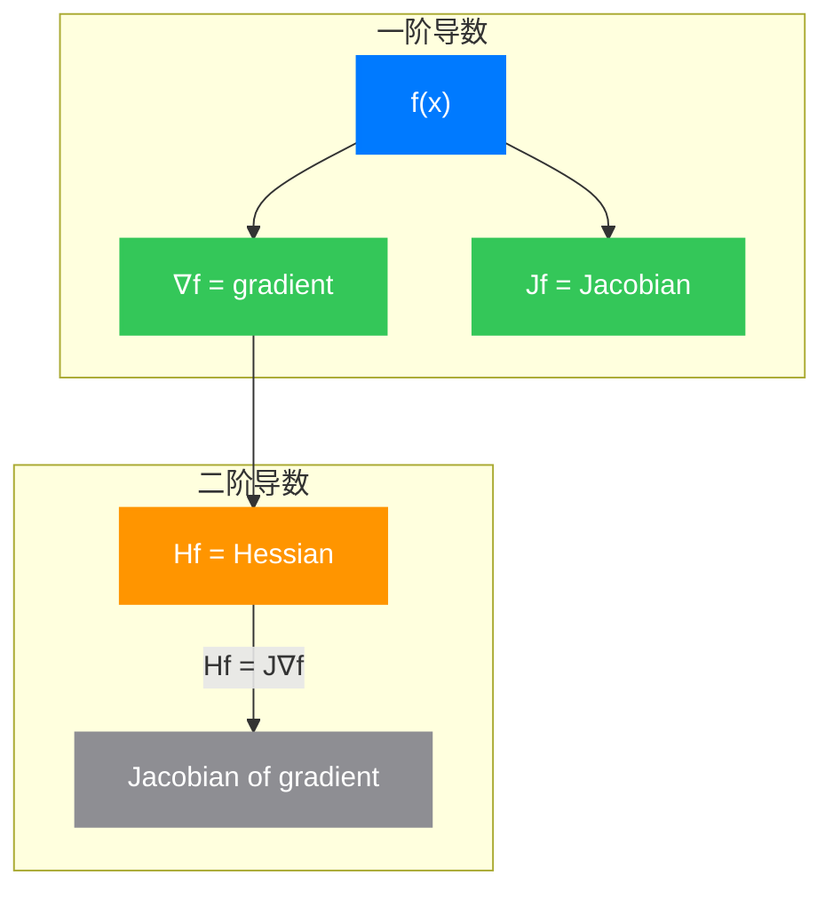

---
categories:
- 数学
cover:
  alt: Jacobian and Hessian Matrices cover image
  caption: Photo by Unsplash
  image: images/covers/jacobian-hessian-cover.jpg
date: '2026-01-28T21:54:27+08:00'
description: 深入探讨雅可比矩阵与黑塞矩阵的数学原理、几何直观和广泛应用，从多元微积分的基础出发，揭示这两个矩阵在多变量分析中的核心地位。
draft: false
math: true
tags:
- 综述
- 微分几何
- 机器学习
- 算法
title: 雅可比矩阵与黑塞矩阵：多变量微积分的双璧
---

## 引言

当我们从单变量微积分迈向多变量微积分时，一个核心问题浮现出来：如何描述多元函数的变化？在单变量情形中，导数 $f'(x)$ 告诉我们函数在某点的瞬时变化率。但当函数 $f: \mathbb{R}^n \to \mathbb{R}^m$ 拥有多个输入和输出时，情况变得复杂起来。

想象一下，你正在攀登一座山峰。在任何一个位置，你都想知道：
- 哪个方向最陡峭？（梯度的方向）
- 这个陡峭程度在各个方向如何变化？（曲率的描述）

雅可比矩阵和黑塞矩阵正是回答这些问题的数学工具。它们是多变量微积分中的"双璧"——一个描述一阶变化（线性近似），一个描述二阶变化（曲率特性）。从牛顿法到神经网络训练，从机器人运动学到广义相对论，这对"双璧"无处不在。

## 第一章：从一维到多维

### 1.1 单变量函数的局限性

回顾单变量微积分，函数 $f: \mathbb{R} \to \mathbb{R}$ 在点 $x$ 处的导数定义为：

$$
f'(x) = \lim_{h \to 0} \frac{f(x+h) - f(x)}{h}
$$

这个定义告诉我们函数在 $x$ 处的瞬时变化率。几何上，它表示函数曲线在该点切线的斜率。

但当函数有多个输入时，例如 $f(x, y) = x^2 + y^2$，我们可以问：
- 沿 $x$ 方向的变化率是多少？
- 沿 $y$ 方向的变化率是多少？
- 沿任意方向的变化率是多少？

这就引出了**偏导数**的概念。

### 1.2 偏导数与方向导数

函数 $f(x_1, x_2, \ldots, x_n)$ 关于 $x_i$ 的偏导数定义为：

$$
\frac{\partial f}{\partial x_i} = \lim_{h \to 0} \frac{f(x_1, \ldots, x_i+h, \ldots, x_n) - f(x_1, \ldots, x_i, \ldots, x_n)}{h}
$$

偏导数告诉我们，当保持其他变量不变时，函数沿某一坐标轴方向的变化率。

**方向导数**则更进一步。设 $\mathbf{u} = (u_1, u_2, \ldots, u_n)$ 是单位向量，函数 $f$ 在点 $\mathbf{x}$ 沿方向 $\mathbf{u}$ 的方向导数为：

$$
D_{\mathbf{u}} f(\mathbf{x}) = \lim_{h \to 0} \frac{f(\mathbf{x} + h\mathbf{u}) - f(\mathbf{x})}{h} = \sum_{i=1}^{n} \frac{\partial f}{\partial x_i} u_i
$$

这引出了梯度的概念。

### 1.3 梯度：最速上升方向

函数 $f: \mathbb{R}^n \to \mathbb{R}$ 的**梯度**定义为：

$$
\nabla f = \left( \frac{\partial f}{\partial x_1}, \frac{\partial f}{\partial x_2}, \ldots, \frac{\partial f}{\partial x_n} \right)^T
$$

梯度是一个向量，指向函数增长最快的方向，其模长表示增长的速率。

上图展示了函数 $f(x,y) = x^2 + y^2$ 的梯度向量场。红色箭头表示梯度方向，蓝色等高线表示函数值相等的位置。可以看到，梯度总是垂直于等高线，指向函数值增大的方向。

## 第二章：雅可比矩阵——多变量函数的"导数"

### 2.1 从单变量到多变量的推广

现在考虑更一般的情形：向量值函数 $\mathbf{f}: \mathbb{R}^n \to \mathbb{R}^m$。设输入为 $\mathbf{x} = (x_1, \ldots, x_n)^T$，输出为 $\mathbf{y} = (y_1, \ldots, y_m)^T$，其中每个 $y_i = f_i(x_1, \ldots, x_n)$。

如何描述这个函数在某点 $\mathbf{x}$ 附近的行为？

**雅可比矩阵**（Jacobian Matrix）给出了答案：

$$
J_{\mathbf{f}}(\mathbf{x}) = \begin{pmatrix}
\frac{\partial f_1}{\partial x_1} & \frac{\partial f_1}{\partial x_2} & \cdots & \frac{\partial f_1}{\partial x_n} \\
\frac{\partial f_2}{\partial x_1} & \frac{\partial f_2}{\partial x_2} & \cdots & \frac{\partial f_2}{\partial x_n} \\
\vdots & \vdots & \ddots & \vdots \\
\frac{\partial f_m}{\partial x_1} & \frac{\partial f_m}{\partial x_2} & \cdots & \frac{\partial f_m}{\partial x_n}
\end{pmatrix}
$$

雅可比矩阵是一个 $m \times n$ 矩阵，其第 $i$ 行是函数 $f_i$ 的梯度转置，第 $j$ 列是各函数关于 $x_j$ 的偏导数。

### 2.2 几何意义：最佳线性近似

雅可比矩阵的核心意义在于：它给出了函数在某点附近的**最佳线性近似**。

对于可微函数 $\mathbf{f}$，在点 $\mathbf{x}_0$ 附近有：

$$
\mathbf{f}(\mathbf{x}) \approx \mathbf{f}(\mathbf{x}_0) + J_{\mathbf{f}}(\mathbf{x}_0)(\mathbf{x} - \mathbf{x}_0)
$$

这正是多元函数的泰勒展开一阶近似。

上图展示了雅可比矩阵作为线性变换的几何意义。蓝色单位圆经过线性变换后成为红色椭圆。雅可比矩阵的行列式（当 $m=n$ 时）告诉我们：变换对面积（或体积）的伸缩比例。

### 2.3 雅可比行列式与变量替换

当 $m = n$ 时，雅可比矩阵是方阵，可以计算其行列式，称为**雅可比行列式**：

$$
\det(J_{\mathbf{f}}) = \left| \frac{\partial(y_1, \ldots, y_n)}{\partial(x_1, \ldots, x_n)} \right|
$$

雅可比行列式在多变量积分中扮演关键角色。当我们进行变量替换时：

$$
\int_{\mathbf{f}(D)} g(\mathbf{y}) \, d\mathbf{y} = \int_{D} g(\mathbf{f}(\mathbf{x})) \left| \det(J_{\mathbf{f}}(\mathbf{x})) \right| \, d\mathbf{x}
$$

这解释了为什么极坐标变换 $x = r\cos\theta, y = r\sin\theta$ 会引入因子 $r$——因为：

$$
\det \begin{pmatrix} \frac{\partial x}{\partial r} & \frac{\partial x}{\partial \theta} \\ \frac{\partial y}{\partial r} & \frac{\partial y}{\partial \theta} \end{pmatrix} = \det \begin{pmatrix} \cos\theta & -r\sin\theta \\ \sin\theta & r\cos\theta \end{pmatrix} = r
$$

### 2.4 链式法则的矩阵形式

单变量链式法则 $\frac{d}{dx}f(g(x)) = f'(g(x)) \cdot g'(x)$ 在多变量情形中如何表达？

设 $\mathbf{f}: \mathbb{R}^m \to \mathbb{R}^p$，$\mathbf{g}: \mathbb{R}^n \to \mathbb{R}^m$，则复合函数 $\mathbf{f} \circ \mathbf{g}: \mathbb{R}^n \to \mathbb{R}^p$ 的雅可比矩阵为：

$$
J_{\mathbf{f} \circ \mathbf{g}}(\mathbf{x}) = J_{\mathbf{f}}(\mathbf{g}(\mathbf{x})) \cdot J_{\mathbf{g}}(\mathbf{x})
$$

这就是**链式法则的矩阵形式**：复合函数的雅可比等于各函数雅可比的矩阵乘积。

上图展示了链式法则的几何直观。左图显示内函数 $\mathbf{g}(t)$ 将参数 $t$ 映射到平面上的螺旋曲线；右图显示复合函数 $(f \circ \mathbf{g})(t)$ 的值随参数 $t$ 的变化。

## 第三章：黑塞矩阵——曲率的数学描述

### 3.1 从一阶到二阶

雅可比矩阵告诉我们函数如何变化，但它没有告诉我们变化率本身如何变化。这就好比知道车速，但不知道加速度。

对于标量函数 $f: \mathbb{R}^n \to \mathbb{R}$，**黑塞矩阵**（Hessian Matrix）收集了所有的二阶偏导数：

$$
H_f(\mathbf{x}) = \begin{pmatrix}
\frac{\partial^2 f}{\partial x_1^2} & \frac{\partial^2 f}{\partial x_1 \partial x_2} & \cdots & \frac{\partial^2 f}{\partial x_1 \partial x_n} \\
\frac{\partial^2 f}{\partial x_2 \partial x_1} & \frac{\partial^2 f}{\partial x_2^2} & \cdots & \frac{\partial^2 f}{\partial x_2 \partial x_n} \\
\vdots & \vdots & \ddots & \vdots \\
\frac{\partial^2 f}{\partial x_n \partial x_1} & \frac{\partial^2 f}{\partial x_n \partial x_2} & \cdots & \frac{\partial^2 f}{\partial x_n^2}
\end{pmatrix}
$$

黑塞矩阵是一个 $n \times n$ 对称矩阵（当二阶偏导数连续时，根据施瓦茨定理有 $\frac{\partial^2 f}{\partial x_i \partial x_j} = \frac{\partial^2 f}{\partial x_j \partial x_i}$）。

### 3.2 泰勒展开的二阶近似

结合梯度和黑塞矩阵，我们可以写出多元函数的泰勒展开二阶近似：

$$
f(\mathbf{x}) \approx f(\mathbf{x}_0) + \nabla f(\mathbf{x}_0)^T (\mathbf{x} - \mathbf{x}_0) + \frac{1}{2}(\mathbf{x} - \mathbf{x}_0)^T H_f(\mathbf{x}_0) (\mathbf{x} - \mathbf{x}_0)
$$

这个近似在优化算法中至关重要——梯度告诉我们向哪个方向走，黑塞矩阵告诉我们应该走多远。

### 3.3 黑塞矩阵与曲率

黑塞矩阵最直观的几何意义是描述函数在某点附近的**曲率**。通过分析黑塞矩阵的特征值，我们可以了解函数在各个方向的弯曲程度。

设 $H_f(\mathbf{x})$ 的特征值为 $\lambda_1, \lambda_2, \ldots, \lambda_n$，对应的特征向量为 $\mathbf{v}_1, \mathbf{v}_2, \ldots, \mathbf{v}_n$。则：

- 若所有 $\lambda_i > 0$：函数在该点沿所有方向向上凸，是局部极小值
- 若所有 $\lambda_i < 0$：函数在该点沿所有方向向下凹，是局部极大值  
- 若有正有负：函数在该点是鞍点

上图展示了函数 $f(x,y) = x^2 - y^2$ 的鞍点结构。左图是三维曲面，右图是等高线。红色线表示沿 $x$ 方向向上凸（$\lambda_1 > 0$），绿色线表示沿 $y$ 方向向下凹（$\lambda_2 < 0$）。原点是一个典型的鞍点。

### 3.4 高斯曲率与黑塞行列式

在微分几何中，黑塞行列式与高斯曲率密切相关。对于曲面 $z = f(x,y)$，高斯曲率 $K$ 可以用黑塞矩阵表示为：

$$
K = \frac{\det(H_f)}{(1 + |\nabla f|^2)^2}
$$

当梯度较小时，$K \approx \det(H_f) = \lambda_1 \lambda_2$。这告诉我们：

- $\det(H_f) > 0$：椭圆点（局部极值）
- $\det(H_f) < 0$：双曲点（鞍点）
- $\det(H_f) = 0$：抛物点（柱面或平面）

## 第四章：雅可比与黑塞的关系

### 4.1 梯度与雅可比的联系

对于标量函数 $f: \mathbb{R}^n \to \mathbb{R}$，其雅可比矩阵是 $1 \times n$ 矩阵：

$$
J_f = \begin{pmatrix} \frac{\partial f}{\partial x_1} & \cdots & \frac{\partial f}{\partial x_n} \end{pmatrix} = (\nabla f)^T
$$

因此，雅可比矩阵就是梯度的转置。

### 4.2 黑塞是梯度的雅可比

更有趣的关系是：黑塞矩阵是**梯度的雅可比矩阵**。

设 $\mathbf{g}(\mathbf{x}) = \nabla f(\mathbf{x})$，则：

$$
J_{\mathbf{g}} = \begin{pmatrix}
\frac{\partial}{\partial x_1}(\frac{\partial f}{\partial x_1}) & \cdots & \frac{\partial}{\partial x_n}(\frac{\partial f}{\partial x_1}) \\
\vdots & \ddots & \vdots \\
\frac{\partial}{\partial x_1}(\frac{\partial f}{\partial x_n}) & \cdots & \frac{\partial}{\partial x_n}(\frac{\partial f}{\partial x_n})
\end{pmatrix} = H_f
$$

这正是黑塞矩阵的定义！

**图例说明**：
- 🔵 蓝色节点：原函数
- 🟢 绿色节点：一阶导数（梯度/雅可比）
- 🟠 橙色节点：二阶导数（黑塞）

### 4.3 连续性方程与李导数

在更高级的微分几何中，雅可比矩阵和黑塞矩阵的概念可以推广到流形上的李导数和协变导数。雅可比矩阵对应着向量场的推进（pushforward），而黑塞矩阵的推广涉及联络（connection）的概念。

## 第五章：应用实例

### 5.1 优化算法

#### 梯度下降法

梯度下降法只使用一阶信息：

$$
\mathbf{x}_{k+1} = \mathbf{x}_k - \alpha \nabla f(\mathbf{x}_k)
$$

其中 $\alpha$ 是学习率。这种方法简单但收敛慢，且容易陷入鞍点。

#### 牛顿法

牛顿法利用黑塞矩阵的二阶信息：

$$
\mathbf{x}_{k+1} = \mathbf{x}_k - [H_f(\mathbf{x}_k)]^{-1} \nabla f(\mathbf{x}_k)
$$

牛顿法在二次函数上可以一步收敛！

上图对比了梯度下降（橙色路径，15步）和牛顿法（红色虚线，1步）的优化过程。可以看到，利用黑塞矩阵的二阶信息后，牛顿法直接指向最优解，而梯度下降需要多次迭代。

#### 拟牛顿法

当变量维度很高时（如深度学习中的数百万参数），计算和存储黑塞矩阵及其逆矩阵是不现实的。**拟牛顿法**（如BFGS算法）通过迭代近似黑塞矩阵的逆，在计算效率和收敛速度之间取得平衡。

### 5.2 机器学习中的损失函数分析

在机器学习中，损失函数的 landscape（景观）决定了训练的难度。

上图展示了著名的 Rosenbrock 函数（香蕉函数）的优化景观。红色星标表示全局最小值，橙色路径表示优化轨迹。这种函数对优化算法是严峻的考验，因为其狭窄的峡谷形状使得梯度下降容易震荡。

黑塞矩阵的特征值分析可以告诉我们：
- **条件数** $\kappa = \frac{\lambda_{\max}}{\lambda_{\min}}$：条件数大表示优化景观在某些方向很陡峭，某些方向很平坦，导致梯度下降收敛慢
- **鞍点密度**：高维空间中，鞍点比局部极小值更常见，理解黑塞矩阵有助于设计逃离鞍点的算法

### 5.3 机器人运动学

在机器人学中，雅可比矩阵描述了关节速度与末端执行器速度之间的关系。

设 $\mathbf{\theta} = (\theta_1, \ldots, \theta_n)^T$ 是关节角度，$\mathbf{x}$ 是末端执行器的位置，则：

$$
\dot{\mathbf{x}} = J(\mathbf{\theta}) \dot{\mathbf{\theta}}
$$

其中 $J$ 是雅可比矩阵。这个关系在：
- 逆运动学求解
- 奇异位形分析
- 力控制

中都有重要应用。

### 5.4 物理与广义相对论

在物理学中，雅可比矩阵和黑塞矩阵的概念以不同形式出现：

- **哈密顿力学**：雅可比矩阵描述相空间流的演化
- **广义相对论**：克里斯托费尔符号（Christoffel symbols）与黑塞矩阵相关，描述时空的曲率
- **统计力学**：费舍尔信息矩阵是某种意义上的"黑塞矩阵"

### 5.5 计算机视觉与图像配准

在图像配准问题中，我们需要找到最优的几何变换将一幅图像对齐到另一幅。这通常通过最小化某种距离函数来实现，其中雅可比矩阵用于计算变换的局部变形，黑塞矩阵用于加速优化收敛。

## 第六章：计算注意事项

### 6.1 自动微分

在现代机器学习中，手动计算雅可比矩阵和黑塞矩阵是不现实的。**自动微分**（Automatic Differentiation, AD）技术通过链式法则的计算机实现，可以高效准确地计算任意阶导数。

深度学习框架（PyTorch、TensorFlow、JAX）都实现了反向传播算法，这实际上就是自动微分的一种高效实现。

### 6.2 数值稳定性

实际计算中需要注意：
- **有限差分近似**：$\frac{\partial f}{\partial x} \approx \frac{f(x+h) - f(x)}{h}$，但 $h$ 的选择需要权衡截断误差和舍入误差
- **黑塞矩阵的稀疏性**：在许多实际问题中，黑塞矩阵是稀疏的，利用这一点可以显著降低计算成本
- **低秩近似**：对于大规模问题，可以使用低秩近似来表示黑塞矩阵

### 6.3 高维挑战

当维度 $n$ 很大时：
- 存储黑塞矩阵需要 $O(n^2)$ 空间
- 计算黑塞矩阵需要 $O(n^2)$ 或更多时间
- 求逆需要 $O(n^3)$ 时间

这促使了各种近似方法的发展：
- **对角近似**：只保留黑塞矩阵的对角元素
- **Kronecker 积近似**：在神经网络中，利用网络结构近似黑塞矩阵
- **随机近似**：使用随机采样估计黑塞-向量乘积

## 结语

雅可比矩阵和黑塞矩阵是多变量微积分的两大支柱。雅可比矩阵描述了函数在某点处的最佳线性近似，是多变量函数"导数"的自然推广；黑塞矩阵则描述了函数的二阶特性，告诉我们曲率和变化的加速度。

这对"双璧"不仅在纯数学中地位重要，在机器学习、物理学、工程学等应用领域中更是无处不在。理解它们的几何直观和代数性质，对于深入掌握多变量分析和解决实际问题至关重要。

从单变量到多变量，从一阶到二阶，数学思维的这种推广揭示了更深层次的结构和联系。正如雅可比矩阵是梯度的自然延伸，黑塞矩阵又是雅可比矩阵的再次应用——这种层层递进的结构，正是数学之美的体现。

## 参考文献

1. Rudin, W. (1976). *Principles of Mathematical Analysis*. McGraw-Hill.
2. Boyd, S., & Vandenberghe, L. (2004). *Convex Optimization*. Cambridge University Press.
3. Nocedal, J., & Wright, S. (2006). *Numerical Optimization*. Springer.
4. Goodfellow, I., Bengio, Y., & Courville, A. (2016). *Deep Learning*. MIT Press.
5. do Carmo, M. P. (1976). *Differential Geometry of Curves and Surfaces*. Prentice-Hall.
