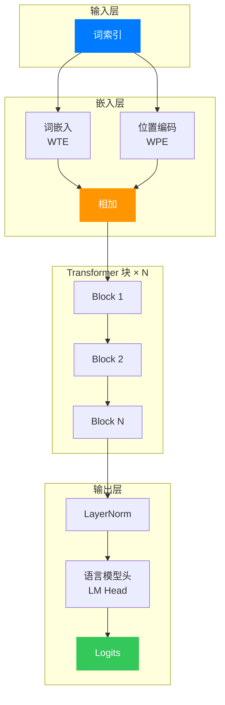

2017 年 Transformer 提出后，OpenAI 在 2018 年沿着 decoder-only 路线做出了 GPT，并在 GPT-2、GPT-3、GPT-4 上不断放大规模，验证了自回归预训练的威力。问题是，工业代码通常太大，关键细节被工程封装遮住了。

如果你想从代码层面真正看懂 GPT，Andrej Karpathy 的 minGPT 几乎是最短路径：不到 300 行，就把核心机制完整串起来。

> **GPT（Generative Pre-trained Transformer）**：一种 decoder-only 的自回归语言模型，本质是“给定前文预测下一个 token”。可以想象成超大规模自动补全系统。它重要在于同一目标函数就能覆盖写作、问答和代码生成。

## 一、GPT 的本质：预测下一个词

在深入代码前，先抓住任务本质。你看到“他推开那扇沉重的”，大脑会自动补“门”。GPT 做的就是这种 next-token 预测，只是它把这件事做到了海量语料和超大参数规模。

用数学语言表达，GPT 建模的是条件概率分布：

$$
P(x_t | x_1, x_2, ..., x_{t-1})
$$

给定前 $t-1$ 个词，模型输出第 $t$ 个词的概率分布；不断重复这个过程，就得到完整生成。

> **自回归（Autoregressive）**：每一步只用历史信息预测下一步。可以想象成边写边续句。它重要在于训练目标和生成过程完全一致。

GPT 通过 next-token prediction 学习，不是随机挖空，而是把序列整体右移一位：

$$
\text{input}=(x_1, x_2, \ldots, x_{T-1}), \quad \text{target}=(x_2, x_3, \ldots, x_T)
$$

模型每一步都预测“下一个 token”，再用交叉熵计算损失。这种训练方式既简单又有效，让 GPT 能从海量文本中自动学习语言规律。

> **Teacher Forcing**：训练时用真实上文而不是模型自己的上一步输出。可以想象成每一步都给参考答案前缀。它重要在于让训练更稳定、收敛更快。

## 二、Transformer Decoder 架构

原始 Transformer 有 Encoder 和 Decoder 两半，而 GPT 采用 **decoder-only**：保留 masked self-attention + MLP 堆叠，不使用 encoder-decoder cross-attention。

> **Cross-Attention**：Decoder 读取 Encoder 表示的注意力机制。可以想象成写作时查资料。它重要在于 seq2seq 任务很依赖它，但 GPT 的 decoder-only 路线不使用它。

在进入主干前，还有一个关键模块：Tokenizer。minGPT 在 `mingpt/bpe.py` 实现了与 GPT-2 对齐的 byte-level BPE，流程是“字节可逆映射 -> 正则预分词 -> 按 merge rank 合并 -> 映射词表索引”。

> **BPE（Byte Pair Encoding）**：一种子词分词方法，通过高频合并在“字符级”和“词级”之间取平衡。可以想象成把常一起出现的小积木拼成大积木。它重要在于直接决定 token 长度和训练效率。

minGPT 主干可以概括成三层：`wte/wpe` 嵌入、`N` 个 Transformer Block、`lm_head` 读出。

先看结论：前向路径就是 `token/position embedding -> N 个 Transformer Block -> lm_head`。




**图1**：minGPT 的整体前向路径。从 token id 出发，经由 `wte + wpe`、`N` 个 Block、`lm_head` 输出 logits。

## 三、核心代码解读

现在让我们深入 minGPT 的源代码。整个模型定义在 `mingpt/model.py` 中，约 300 行代码。我们将逐段剖析其中的精妙之处。

### 3.1 GELU 激活函数

首先看一个小但关键的组件：GELU。它相比 ReLU 的硬截断更平滑。

先看结论：这段实现的核心价值是让激活在零点附近连续变化，通常比 ReLU 更利于深层优化。

```python
class NewGELU(nn.Module):
    def forward(self, x):
        return 0.5 * x * (1.0 + torch.tanh(
            math.sqrt(2.0 / math.pi) * (x + 0.044715 * torch.pow(x, 3.0))
        ))
```

这段代码是 GELU 近似式。和 ReLU 相比，它不会在负区间直接“砍零”，而是平滑衰减，所以在深层 Transformer 里往往更稳定。

### 3.2 因果自注意力机制

这是 GPT 的核心模块。自注意力决定“看哪里”，因果掩码决定“只能看过去”。

先看结论：这段代码同时完成 QKV 投影、多头拆分、掩码注意力和输出回投影，构成单层 attention 的完整闭环。

```python
class CausalSelfAttention(nn.Module):
    def __init__(self, config):
        super().__init__()
        assert config.n_embd % config.n_head == 0
        # key, query, value 投影
        self.c_attn = nn.Linear(config.n_embd, 3 * config.n_embd)
        # 输出投影
        self.c_proj = nn.Linear(config.n_embd, config.n_embd)
        # dropout
        self.attn_dropout = nn.Dropout(config.attn_pdrop)
        self.resid_dropout = nn.Dropout(config.resid_pdrop)
        # 因果掩码：确保只能看到当前及之前的词
        self.register_buffer("bias", torch.tril(torch.ones(config.block_size, config.block_size))
                                     .view(1, 1, config.block_size, config.block_size))
        self.n_head = config.n_head
        self.n_embd = config.n_embd

    def forward(self, x):
        B, T, C = x.size()  # batch, sequence length, embedding dim

        # 计算 q, k, v 并 reshape 为多头形式
        q, k, v = self.c_attn(x).split(self.n_embd, dim=2)
        k = k.view(B, T, self.n_head, C // self.n_head).transpose(1, 2)
        q = q.view(B, T, self.n_head, C // self.n_head).transpose(1, 2)
        v = v.view(B, T, self.n_head, C // self.n_head).transpose(1, 2)

        # 注意力计算
        att = (q @ k.transpose(-2, -1)) * (1.0 / math.sqrt(k.size(-1)))
        att = att.masked_fill(self.bias[:,:,:T,:T] == 0, float('-inf'))
        att = F.softmax(att, dim=-1)
        att = self.attn_dropout(att)
        
        y = att @ v
        y = y.transpose(1, 2).contiguous().view(B, T, C)
        y = self.resid_dropout(self.c_proj(y))
        return y
```


**图2**：因果自注意力的计算路径。先做 Q/K/V 投影，再做掩码注意力，最后拼接多头并投影回原维度。

> **自注意力机制（Self-Attention）**：让每个位置按相关性聚合其它位置信息。可以想象成每个词都在“检索上下文”。它重要在于直接决定模型如何建模长程依赖。Q 是“我要找什么”，K 是“我有哪些索引”，V 是“我输出什么内容”。

关键点有三个：

**Q、K、V 生成**：`c_attn` 一次线性层同时产出三者，再 `split` 拆开，效率高且实现简洁。

**多头机制**：通过 `view + transpose` 把通道切成多个 head 并行计算，让不同 head 学到不同关联模式。

**形状推演**（读代码最关键）：

1. `q,k,v` 从 $(B,T,C)$ 变为 $(B,n_h,T,h_s)$，其中 $h_s=C/n_h$。
2. 注意力分数 `att` 是 $(B,n_h,T,T)$。
3. `att @ v` 后再拼接，回到 $(B,T,C)$。

**因果掩码**：`self.bias` 是下三角，`masked_fill` 把未来位置置为 $-\infty$，softmax 后这些权重就是 0。

**缩放点积注意力**：除以 $\sqrt{d_k}$ 是为了抑制点积方差膨胀，避免 softmax 过早饱和。

$$
\mathrm{Attn}(Q,K,V)=\mathrm{softmax}\left(\frac{QK^\top}{\sqrt{d_k}}+M\right)V
$$

### 3.3 Transformer 块

一个 Transformer 块就是“注意力子层 + MLP 子层”，每个子层都配 LayerNorm 和残差。

先看结论：`x = x + sublayer(LN(x))` 是 GPT-2 经典 pre-norm 模式，训练稳定性很高。

```python
class Block(nn.Module):
    def __init__(self, config):
        super().__init__()
        self.ln_1 = nn.LayerNorm(config.n_embd)
        self.attn = CausalSelfAttention(config)
        self.ln_2 = nn.LayerNorm(config.n_embd)
        self.mlp = nn.ModuleDict(dict(
            c_fc    = nn.Linear(config.n_embd, 4 * config.n_embd),
            c_proj  = nn.Linear(4 * config.n_embd, config.n_embd),
            act     = NewGELU(),
            dropout = nn.Dropout(config.resid_pdrop),
        ))
        m = self.mlp
        self.mlpf = lambda x: m.dropout(m.c_proj(m.act(m.c_fc(x))))

    def forward(self, x):
        x = x + self.attn(self.ln_1(x))
        x = x + self.mlpf(self.ln_2(x))
        return x
```

这就是 GPT-2 的 pre-norm 结构：先 LN，再过子层，最后残差相加。残差负责保留主干信息，LayerNorm 负责控制激活尺度，MLP 用 4 倍扩展带来更强非线性表达。

### 3.4 GPT 主类

现在看整机装配。

先看结论：`wte+wpe` 构造输入表示，`h` 负责深度变换，`ln_f+lm_head` 把隐藏态映射为词表 logits。

```python
class GPT(nn.Module):
    def __init__(self, config):
        super().__init__()
        # 嵌入层
        self.transformer = nn.ModuleDict(dict(
            wte = nn.Embedding(config.vocab_size, config.n_embd),
            wpe = nn.Embedding(config.block_size, config.n_embd),
            drop = nn.Dropout(config.embd_pdrop),
            h = nn.ModuleList([Block(config) for _ in range(config.n_layer)]),
            ln_f = nn.LayerNorm(config.n_embd),
        ))
        self.lm_head = nn.Linear(config.n_embd, config.vocab_size, bias=False)

        # 特殊的初始化：对残差投影层使用缩放初始化
        self.apply(self._init_weights)
        for pn, p in self.named_parameters():
            if pn.endswith('c_proj.weight'):
                torch.nn.init.normal_(p, mean=0.0, std=0.02/math.sqrt(2 * config.n_layer))

    def forward(self, idx, targets=None):
        device = idx.device
        b, t = idx.size()
        
        # 位置编码
        pos = torch.arange(0, t, dtype=torch.long, device=device).unsqueeze(0)
        
        # 前向传播
        tok_emb = self.transformer.wte(idx)
        pos_emb = self.transformer.wpe(pos)
        x = self.transformer.drop(tok_emb + pos_emb)
        
        for block in self.transformer.h:
            x = block(x)
        
        x = self.transformer.ln_f(x)
        logits = self.lm_head(x)

        # 计算损失
        loss = None
        if targets is not None:
            loss = F.cross_entropy(logits.view(-1, logits.size(-1)), targets.view(-1), ignore_index=-1)

        return logits, loss
```

关键点有三个：

**位置编码**：GPT 使用可学习位置嵌入（`wpe`），而不是固定正弦编码。

**缩放初始化**：`c_proj.weight` 额外除以 $\sqrt{2N}$，用于抑制残差堆叠带来的方差累积。

**权重绑定（需要严谨）**：这份 minGPT 代码里，`wte` 和 `lm_head` 默认没有显式绑定为同一参数。很多工业实现会做 weight tying，以减少参数并提升一部分泛化能力，但教育实现里不绑定也完全可以工作。

### 3.5 预训练权重迁移

minGPT 里还有一段很“工程”的代码：`from_pretrained`。它把 Hugging Face 的 GPT-2 权重映射到 minGPT，关键细节是 `Conv1D` 到 `nn.Linear` 的权重转置。

这一步的价值是验证实现等价性，让 logits 对齐可被直接检查。

### 3.6 文本生成

训练好的模型如何生成文本？本质是自回归采样循环。

先看结论：每轮只看最后一步 logits，采样一个新 token，再拼回上下文继续跑。

```python
@torch.no_grad()
def generate(self, idx, max_new_tokens, temperature=1.0, do_sample=False, top_k=None):
    for _ in range(max_new_tokens):
        # 如果序列太长，截断到 block_size
        idx_cond = idx if idx.size(1) <= self.block_size else idx[:, -self.block_size:]
        
        # 前向传播获取 logits
        logits, _ = self(idx_cond)
        
        # 取最后一个时间步的 logits
        logits = logits[:, -1, :] / temperature
        
        # 可选：Top-K 采样，只保留概率最高的 K 个词
        if top_k is not None:
            v, _ = torch.topk(logits, top_k)
            logits[logits < v[:, [-1]]] = -float('Inf')
        
        # 转换为概率
        probs = F.softmax(logits, dim=-1)
        
        # 采样或贪婪解码
        if do_sample:
            idx_next = torch.multinomial(probs, num_samples=1)
        else:
            _, idx_next = torch.topk(probs, k=1, dim=-1)
        
        # 将新词添加到序列
        idx = torch.cat((idx, idx_next), dim=1)

    return idx
```


**图3**：自回归生成循环。每次只取最后一个时间步的 logits，再把新 token 拼回上下文继续预测。

生成过程就是“预测一个，接回去，再预测”。

**温度参数**：`temperature` 调节随机性，高温更发散，低温更保守。

**Top-K 采样**：只在最高概率的 K 个 token 中采样，控制胡言乱语概率。

在实际系统里，常见策略还包括 Top-p（nucleus）采样、重复惩罚、最小长度约束和 EOS 终止控制。minGPT 的 `generate` 提供了最核心的最小实现，便于读懂原理。

## 四、训练流程

minGPT 的训练代码在 `mingpt/trainer.py` 中，约 100 行。

先看结论：训练主循环就是 `取 batch -> 前向求 loss -> 反传 -> 梯度裁剪 -> optimizer.step`。

```python
class Trainer:
    def run(self):
        model, config = self.model, self.config
        self.optimizer = model.configure_optimizers(config)
        
        train_loader = DataLoader(
            self.train_dataset,
            sampler=torch.utils.data.RandomSampler(
                self.train_dataset, 
                replacement=True, 
                num_samples=int(1e10)
            ),
            shuffle=False,
            pin_memory=True,
            batch_size=config.batch_size,
            num_workers=config.num_workers,
        )

        model.train()
        data_iter = iter(train_loader)
        
        while True:
            batch = next(data_iter)
            batch = [t.to(self.device) for t in batch]
            x, y = batch

            logits, self.loss = model(x, y)
            
            model.zero_grad(set_to_none=True)
            self.loss.backward()
            torch.nn.utils.clip_grad_norm_(model.parameters(), config.grad_norm_clip)
            self.optimizer.step()

            self.trigger_callbacks('on_batch_end')
            self.iter_num += 1

            if config.max_iters is not None and self.iter_num >= config.max_iters:
                break
```

训练过程很直接。真正容易被忽略的是监督信号如何构造。以 `projects/adder/adder.py` 为例：

先看结论：`x=dix[:-1]`、`y=dix[1:]` 是标准 next-token 标签右移，`-1` 用来屏蔽不计损失的位置。

```python
x = torch.tensor(dix[:-1], dtype=torch.long)
y = torch.tensor(dix[1:], dtype=torch.long)
y[:ndigit*2-1] = -1
```

这三行就是 GPT 训练目标的完整落地：`x` 是当前步输入，`y` 是下一步标签。前半段设为 `-1` 后，配合 `ignore_index=-1`，模型只在“答案区间”计算损失。

**梯度裁剪**：`clip_grad_norm_` 限制梯度范数，避免异常 batch 导致更新失控。

**无限采样器**：`num_samples=int(1e10)` + `replacement=True` 近似无限流，训练长度直接用 iter 控制。

**优化器配置**：`configure_optimizers` 把参数分成“需要衰减”和“不需要衰减”两组，让正则化只作用在合适的位置。

### 4.1 `configure_optimizers` 逐行解剖

下面这段逻辑是很多实现最容易写错的工程细节。

先看结论：参数要被“互斥且完备”地分到 `decay/no_decay`，否则优化器配置会悄悄出错。

```python
decay = set()
no_decay = set()
whitelist_weight_modules = (torch.nn.Linear, )
blacklist_weight_modules = (torch.nn.LayerNorm, torch.nn.Embedding)

for mn, m in self.named_modules():
    for pn, p in m.named_parameters():
        fpn = '%s.%s' % (mn, pn) if mn else pn
        if pn.endswith('bias'):
            no_decay.add(fpn)
        elif pn.endswith('weight') and isinstance(m, whitelist_weight_modules):
            decay.add(fpn)
        elif pn.endswith('weight') and isinstance(m, blacklist_weight_modules):
            no_decay.add(fpn)
```

逐行理解：

1. `decay/no_decay` 两个集合先分桶，避免重复和遗漏。
2. `Linear.weight` 进 `decay`，因为它通常承载主要参数容量，适合做权重衰减。
3. `LayerNorm.weight`、`Embedding.weight` 进 `no_decay`，这些参数的几何意义和线性层权重不同，盲目衰减往往有副作用。
4. `bias` 一律不衰减，这是大多数大模型训练的稳定经验。
5. 后续代码会做集合交并校验，确保每个参数恰好落在一个桶里，这一步非常关键，能提前发现配置漏洞。

## 五、一个完整的例子：加法器

`projects/adder/adder.py` 给了一个非常典型的任务改写例子：让 GPT 做加法。

思路是把算式编码成序列。比如“85 + 50 = 135”编码成“8550531”，前半是操作数，后半是逆序答案。逆序让模型先预测低位，更贴近人工加法的进位顺序。

这个例子说明：只要任务能改写成序列预测，GPT 就可能学到内部规则。

### 5.1 `adder.py` 逐行解剖

`AdditionDataset.__getitem__` 这段代码几乎是“序列建模任务改写模板”。

先看结论：它把“算术题”改写成“条件前缀 + next-token 预测”任务，并用 `-1` 精确对齐监督区间。

```python
idx = self.ixes[idx].item()
nd = 10**ndigit
a = idx // nd
b = idx % nd
c = a + b
astr = f'%0{ndigit}d' % a
bstr = f'%0{ndigit}d' % b
cstr = (f'%0{ndigit+1}d' % c)[::-1]
render = astr + bstr + cstr
dix = [int(s) for s in render]
x = torch.tensor(dix[:-1], dtype=torch.long)
y = torch.tensor(dix[1:], dtype=torch.long)
y[:ndigit*2-1] = -1
```

逐行理解：

1. `idx -> a,b`：把样本索引还原成一道具体加法题。
2. `c = a + b`：得到标准答案。
3. `astr/bstr`：固定宽度补零，保证输入长度恒定，便于 batch。
4. `cstr[::-1]`：把结果倒序，等价于把最容易的低位先预测，降低学习难度。
5. `x=dix[:-1], y=dix[1:]`：经典 next-token 监督构造。
6. `y[:ndigit*2-1] = -1`：前半段只作为条件，不计损失，训练焦点落在答案段。

这段设计非常值得迁移。你在做任意“输入条件 + 输出序列”的任务时，都可以复用这种思路。

## 六、总结

minGPT 的魅力在于简洁。300 行代码，没有多余抽象，每一行都贴着 GPT 的主干逻辑。通过阅读这些代码，我们看到了：

1. **GELU** 提供了平滑的非线性变换
2. **因果自注意力** 让模型在只看到过去的前提下关注相关信息
3. **残差连接和层归一化** 稳定了深层网络的训练
4. **自回归生成** 通过循环采样将预测能力转化为创造能力

更重要的是，minGPT 说明了 Transformer 的本质并不神秘。核心想法很朴素：注意力建模依赖，残差支撑深层，预训练放大能力。

当你理解这些原理，再看 GPT-4、Claude、Gemini，就不会只看到黑箱，而会看到一条清晰的技术延长线。

> **最后的话**：minGPT 的价值不在性能，而在透明度。若你要继续实战，可以转到 nanoGPT；若你要最快吃透原理，minGPT 仍是最佳入口。

## 参考资料

1. [minGPT GitHub 仓库](https://github.com/karpathy/minGPT) - Andrej Karpathy 的原项目
2. [Attention Is All You Need](https://arxiv.org/abs/1706.03762) - Transformer 原论文
3. [GPT-2 论文](https://cdn.openai.com/better-language-models/language_models_are_unsupervised_multitask_learners.pdf) - Language Models are Unsupervised Multitask Learners
4. [The Illustrated Transformer](http://jalammar.github.io/illustrated-transformer/) - Jay Alammar 的可视化解释
