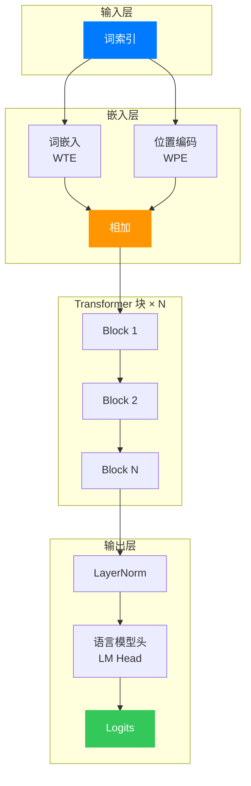

2017年，Google 发表论文《Attention Is All You Need》，提出了 Transformer 架构。这个原本用于机器翻译的模型，却在随后的几年里席卷了整个 AI 领域。2018年，OpenAI 发布 GPT（Generative Pre-trained Transformer），证明了只需要 Decoder 部分的 Transformer 就能在语言建模任务上取得惊人的效果。此后 GPT-2、GPT-3、GPT-4 相继问世，参数规模从 1.17 亿爆炸式增长到数千亿，能力边界不断被突破。

但当你想真正理解 GPT 的工作原理时，却常常陷入一个尴尬的局面：官方实现藏在庞大的代码库中，Hugging Face 的 transformers 库虽然易用却封装了太多细节。 Andrej Karpathy 的 minGPT 项目正是为了解决这个痛点而生——用不到 300 行代码，实现一个清晰、完整的 GPT 模型。

> **GPT（Generative Pre-trained Transformer）**：一种基于 Transformer Decoder 架构的自回归语言模型。核心思想是"预测下一个词"——给定前文，模型学习预测下一个最可能出现的词。可以想象成一个极其聪明的自动补全系统，但它不仅能补全句子，还能写诗、编代码、回答问题。

## 一、GPT 的本质：预测下一个词

在深入代码之前，我们需要理解 GPT 究竟在做什么。想象你正在读一本小说，当你看到"他推开那扇沉重的"，你下意识地期待下一个词是"门"。GPT 做的就是这件事——它学习了海量文本中的统计规律，从而能够预测"接下来最可能出现什么"。

用数学语言表达，GPT 建模的是条件概率分布：

$$
P(x_t | x_1, x_2, ..., x_{t-1})
$$

这意味着，给定前 $t-1$ 个词，模型输出第 $t$ 个词的概率分布。通过在每一步采样，GPT 就能源源不断地生成文本。

> **自回归（Autoregressive）**：一种序列建模方式，每个时刻的输出只依赖于当前时刻之前的输入。就像你读小说时，每个新词的理解都建立在你已经读过的内容之上。

那么，GPT 如何学习这种预测能力呢？答案是**自监督学习**。我们不需要人工标注数据，只需要让模型在大量文本上做"完形填空"：遮住后面的词，让模型预测。这种训练方式既简单又有效，让 GPT 能从互联网上的海量文本中自动学习语言规律。

## 二、Transformer Decoder 架构

原始 Transformer 包含 Encoder 和 Decoder 两部分，而 GPT 只用了 Decoder。为什么呢？

Encoder 擅长"理解"——它可以看到整个输入序列，适合做分类、翻译等任务。Decoder 擅长"生成"——它只能看到已经生成的内容，必须一个词一个词地"写"出来，这正是语言模型需要的。

minGPT 的架构非常简洁，核心只有三个组件：

1. **词嵌入（Token Embedding）**：将离散的文字转换为连续的向量
2. **位置编码（Positional Encoding）**：告诉模型每个词在句子中的位置
3. **Transformer 块**：处理序列信息的核心，包含自注意力机制和前馈网络




## 三、核心代码解读

现在让我们深入 minGPT 的源代码。整个模型定义在 `mingpt/model.py` 中，约 300 行代码。我们将逐段剖析其中的精妙之处。

### 3.1 GELU 激活函数

首先是一个看似不起眼却很重要的组件——GELU 激活函数。ReLU 简单地将负数截断为 0，而 GELU（Gaussian Error Linear Unit）则提供了一种更平滑的非线性变换。

```python
class NewGELU(nn.Module):
    def forward(self, x):
        return 0.5 * x * (1.0 + torch.tanh(
            math.sqrt(2.0 / math.pi) * (x + 0.044715 * torch.pow(x, 3.0))
        ))
```

这段代码实现了 GELU 的近似公式。为什么选择 GELU 而不是 ReLU？想象一下，ReLU 就像一个严格的一刀切：只要输入是负的，输出就归零。这种"硬截断"可能导致训练不稳定。GELU 则像一个柔和的衰减函数，让负值以平滑的方式趋近于零。这种柔和性让模型更容易优化，尤其是在深层网络中。

### 3.2 因果自注意力机制

这是 GPT 的核心，也是 Transformer 的灵魂。自注意力机制让模型能够关注序列中的不同位置，而"因果"（Causal）二字意味着模型只能关注当前位置及其之前的位置——它不能"偷看"未来的词。

```python
class CausalSelfAttention(nn.Module):
    def __init__(self, config):
        super().__init__()
        assert config.n_embd % config.n_head == 0
        # key, query, value 投影
        self.c_attn = nn.Linear(config.n_embd, 3 * config.n_embd)
        # 输出投影
        self.c_proj = nn.Linear(config.n_embd, config.n_embd)
        # dropout
        self.attn_dropout = nn.Dropout(config.attn_pdrop)
        self.resid_dropout = nn.Dropout(config.resid_pdrop)
        # 因果掩码：确保只能看到当前及之前的词
        self.register_buffer("bias", torch.tril(torch.ones(config.block_size, config.block_size))
                                     .view(1, 1, config.block_size, config.block_size))
        self.n_head = config.n_head
        self.n_embd = config.n_embd

    def forward(self, x):
        B, T, C = x.size()  # batch, sequence length, embedding dim

        # 计算 q, k, v 并 reshape 为多头形式
        q, k, v = self.c_attn(x).split(self.n_embd, dim=2)
        k = k.view(B, T, self.n_head, C // self.n_head).transpose(1, 2)
        q = q.view(B, T, self.n_head, C // self.n_head).transpose(1, 2)
        v = v.view(B, T, self.n_head, C // self.n_head).transpose(1, 2)

        # 注意力计算
        att = (q @ k.transpose(-2, -1)) * (1.0 / math.sqrt(k.size(-1)))
        att = att.masked_fill(self.bias[:,:,:T,:T] == 0, float('-inf'))
        att = F.softmax(att, dim=-1)
        att = self.attn_dropout(att)
        
        y = att @ v
        y = y.transpose(1, 2).contiguous().view(B, T, C)
        y = self.resid_dropout(self.c_proj(y))
        return y
```


> **自注意力机制（Self-Attention）**：一种让序列中每个位置都能"看到"其他位置的机制。可以把每个词想象成一个人在黑暗中伸出手去触摸其他词，然后根据触摸的反馈决定给予多少关注。Q（Query）是"我要找什么"，K（Key）是"我有什么"，V（Value）是"我能提供什么信息"。

让我们拆解这段代码的关键点：

**Q、K、V 的生成**：通过一次线性变换 `c_attn` 同时生成 Query、Key、Value。这种"打包"方式提高了计算效率。随后用 `split` 将它们分开。

**多头机制**：`n_head` 表示注意力头的数量。每个头关注不同的方面，有的关注语法，有的关注语义，有的关注指代关系。代码通过 `view` 和 `transpose` 将嵌入维度切分成多个头，让每个头独立计算注意力。

**因果掩码**：这是 GPT 与 BERT 的关键区别。`self.bias` 是一个下三角矩阵，第 $i$ 行只有前 $i$ 列是 1，其余是 0。`masked_fill` 将上三角部分（未来位置）设为负无穷，softmax 后这些位置的权重就变成了 0。这就像阅读时你只能回头看，不能偷看后面的内容。

**缩放点积注意力**：`att = (q @ k.transpose(-2, -1)) * (1.0 / math.sqrt(k.size(-1)))`。为什么要除以 $\sqrt{d_k}$？因为当维度很大时，点积的结果会非常大，导致 softmax 梯度消失。这个缩放因子保持了梯度的健康流动。

### 3.3 Transformer 块

一个 Transformer 块包含两部分：多头自注意力 + 前馈网络，以及层归一化和残差连接。

```python
class Block(nn.Module):
    def __init__(self, config):
        super().__init__()
        self.ln_1 = nn.LayerNorm(config.n_embd)
        self.attn = CausalSelfAttention(config)
        self.ln_2 = nn.LayerNorm(config.n_embd)
        self.mlp = nn.ModuleDict(dict(
            c_fc    = nn.Linear(config.n_embd, 4 * config.n_embd),
            c_proj  = nn.Linear(4 * config.n_embd, config.n_embd),
            act     = NewGELU(),
            dropout = nn.Dropout(config.resid_pdrop),
        ))
        m = self.mlp
        self.mlpf = lambda x: m.dropout(m.c_proj(m.act(m.c_fc(x))))

    def forward(self, x):
        x = x + self.attn(self.ln_1(x))
        x = x + self.mlpf(self.ln_2(x))
        return x
```

这里的结构遵循了 GPT-2 论文中的"预归一化"设计：先对输入做 LayerNorm，再通过子层（注意力或 MLP），最后加上残差连接。

**残差连接**（`x = x + ...`）是深度网络训练的关键。想象你在爬一座很高的山，每一步都从零开始会很累。残差连接就像是给了你一根绳子——你可以在新的基础上继续攀爬，而不需要重新学习所有知识。

**层归一化**（LayerNorm）稳定了每层的分布。在神经网络中，每一层的输出分布都在变化，这种现象被称为"内部协变量偏移"。LayerNorm 让每个样本的特征分布保持稳定，就像给混乱的数据流梳理了秩序。

**MLP 部分**是一个简单的两层全连接网络，中间维度放大 4 倍（`4 * config.n_embd`）。这个"瓶颈"结构让模型学习复杂的非线性变换。为什么放大 4 倍？这是经验设计，给模型足够的容量学习复杂的特征组合。

### 3.4 GPT 主类

现在来看整个模型的组装：

```python
class GPT(nn.Module):
    def __init__(self, config):
        super().__init__()
        # 嵌入层
        self.transformer = nn.ModuleDict(dict(
            wte = nn.Embedding(config.vocab_size, config.n_embd),
            wpe = nn.Embedding(config.block_size, config.n_embd),
            drop = nn.Dropout(config.embd_pdrop),
            h = nn.ModuleList([Block(config) for _ in range(config.n_layer)]),
            ln_f = nn.LayerNorm(config.n_embd),
        ))
        self.lm_head = nn.Linear(config.n_embd, config.vocab_size, bias=False)

        # 特殊的初始化：对残差投影层使用缩放初始化
        self.apply(self._init_weights)
        for pn, p in self.named_parameters():
            if pn.endswith('c_proj.weight'):
                torch.nn.init.normal_(p, mean=0.0, std=0.02/math.sqrt(2 * config.n_layer))

    def forward(self, idx, targets=None):
        device = idx.device
        b, t = idx.size()
        
        # 位置编码
        pos = torch.arange(0, t, dtype=torch.long, device=device).unsqueeze(0)
        
        # 前向传播
        tok_emb = self.transformer.wte(idx)
        pos_emb = self.transformer.wpe(pos)
        x = self.transformer.drop(tok_emb + pos_emb)
        
        for block in self.transformer.h:
            x = block(x)
        
        x = self.transformer.ln_f(x)
        logits = self.lm_head(x)

        # 计算损失
        loss = None
        if targets is not None:
            loss = F.cross_entropy(logits.view(-1, logits.size(-1)), targets.view(-1), ignore_index=-1)

        return logits, loss
```

这里有几个关键点：

**权重绑定**：词嵌入 `wte` 和输出层 `lm_head` 使用相同的权重矩阵（虽然代码中没有显式绑定，但 OpenAI 的实现是这样做的）。这种绑定减少了参数数量，同时让模型在嵌入空间和输出空间有一致的语义表示。就像用一个字典查词，也用同一个字典来翻译。

**位置编码**：GPT 使用可学习的位置嵌入（`wpe`）而非 Transformer 原论文中的正弦编码。为什么？可学习的编码更灵活，模型可以根据数据自动学习最合适的位置表示方式。

**缩放初始化**：注意到对 `c_proj.weight` 的特殊处理——初始化标准差除以 $\sqrt{2N}$。这是 GPT-2 论文中的技巧，用于补偿残差连接中的方差累积。想象信号穿过多个残差块，如果不加控制，方差会不断放大。这个缩放因子就像是音量调节器，保持信号的稳定。

### 3.5 文本生成

训练好的模型如何生成文本？这就是自回归采样的过程：

```python
@torch.no_grad()
def generate(self, idx, max_new_tokens, temperature=1.0, do_sample=False, top_k=None):
    for _ in range(max_new_tokens):
        # 如果序列太长，截断到 block_size
        idx_cond = idx if idx.size(1) <= self.block_size else idx[:, -self.block_size:]
        
        # 前向传播获取 logits
        logits, _ = self(idx_cond)
        
        # 取最后一个时间步的 logits
        logits = logits[:, -1, :] / temperature
        
        # 可选：Top-K 采样，只保留概率最高的 K 个词
        if top_k is not None:
            v, _ = torch.topk(logits, top_k)
            logits[logits < v[:, [-1]]] = -float('Inf')
        
        # 转换为概率
        probs = F.softmax(logits, dim=-1)
        
        # 采样或贪婪解码
        if do_sample:
            idx_next = torch.multinomial(probs, num_samples=1)
        else:
            _, idx_next = torch.topk(probs, k=1, dim=-1)
        
        # 将新词添加到序列
        idx = torch.cat((idx, idx_next), dim=1)

    return idx
```


生成过程是一个循环：预测下一个词，把它添加到序列，再预测下一个。

**温度参数**：`temperature` 控制采样的随机性。高温（>1）让概率分布更平坦，模型更"有创意"；低温（<1）让分布更尖锐，模型更"保守"。这就像调酒时的酒精度数，影响输出的"烈度"。

**Top-K 采样**：如果不加限制，模型可能选中概率极低的奇怪词。Top-K 采样只从概率最高的 K 个词中选择，既保持了多样性，又避免了生成荒谬的内容。

## 四、训练流程

minGPT 的训练代码在 `mingpt/trainer.py` 中，约 100 行，同样简洁优雅。

```python
class Trainer:
    def run(self):
        model, config = self.model, self.config
        self.optimizer = model.configure_optimizers(config)
        
        train_loader = DataLoader(
            self.train_dataset,
            sampler=torch.utils.data.RandomSampler(
                self.train_dataset, 
                replacement=True, 
                num_samples=int(1e10)
            ),
            shuffle=False,
            pin_memory=True,
            batch_size=config.batch_size,
            num_workers=config.num_workers,
        )

        model.train()
        data_iter = iter(train_loader)
        
        while True:
            batch = next(data_iter)
            batch = [t.to(self.device) for t in batch]
            x, y = batch

            logits, self.loss = model(x, y)
            
            model.zero_grad(set_to_none=True)
            self.loss.backward()
            torch.nn.utils.clip_grad_norm_(model.parameters(), config.grad_norm_clip)
            self.optimizer.step()

            self.trigger_callbacks('on_batch_end')
            self.iter_num += 1

            if config.max_iters is not None and self.iter_num >= config.max_iters:
                break
```

训练过程很直接：采样一个 batch，前向传播计算损失，反向传播更新梯度，重复直到达到最大迭代次数。

**梯度裁剪**：`clip_grad_norm_` 限制了梯度的最大范数。在 RNN 时代，梯度爆炸是噩梦。Transformer 虽然不那么敏感，但裁剪仍然是一个好习惯，防止偶尔的异常数据导致参数剧烈更新。

**无限采样器**：`num_samples=int(1e10)` 配合 `replacement=True` 创建了一个几乎无限的随机采样流。这意味着不需要关心 epoch 的概念，直接用迭代次数控制训练长度。

**优化器配置**：`configure_optimizers` 方法（在 GPT 类中定义）将参数分成两组——需要 weight decay 的（Linear 层的权重）和不需要的（bias、LayerNorm 和 Embedding 的参数）。这种精细的控制让正则化只作用于应该被正则化的参数。

## 五、一个完整的例子：加法器

minGPT 项目中有一个有趣的例子：`projects/adder/adder.py`。它训练一个 GPT 模型做加法运算。是的，你没听错，纯文本模型学习做数学题。

核心思想是将加法问题编码成序列。比如"85 + 50 = 135"被编码为"8550531"——前 4 位是操作数，后 3 位是逆序的结果（逆序是为了让模型先预测最低位，因为加法从右往左算）。

这个例子展示了 GPT 的强大之处：只要你把问题表示成序列预测的形式，它就能学习其中的规律。不需要显式的算法，模型自己从数据中发现"逢十进一"的规则。

## 六、总结

minGPT 的魅力在于它的简洁性。300 行代码，没有花哨的封装，没有复杂的抽象，每一行都直指 GPT 的核心逻辑。通过阅读这些代码，我们看到了：

1. **GELU** 提供了平滑的非线性变换
2. **因果自注意力** 让模型在只看到过去的前提下关注相关信息
3. **残差连接和层归一化** 稳定了深层网络的训练
4. **自回归生成** 通过循环采样将预测能力转化为创造能力

更重要的是，minGPT 证明了 Transformer 架构的本质并不复杂。真正的魔法不在于代码行数，而在于架构设计背后的洞察——自注意力机制捕捉长距离依赖，残差连接实现深层堆叠，大规模预训练释放涌现能力。

当你理解了这些基本原理，再去看 GPT-4、Claude、Gemini 这样的大模型，你看到的就不再是神秘的黑箱，而是这些简单想法在更大规模上的自然延伸。

> **最后的话**：minGPT 是一个教育项目，它的价值不在于性能，而在于透明度。如果你想进一步探索，Karpathy 后来写的 nanoGPT 在保持简洁的同时增加了更多的工程优化，更适合实际训练。但如果你想最快地理解 GPT 的工作原理，minGPT 仍然是最好的起点。

## 参考资料

1. [minGPT GitHub 仓库](https://github.com/karpathy/minGPT) - Andrej Karpathy 的原项目
2. [Attention Is All You Need](https://arxiv.org/abs/1706.03762) - Transformer 原论文
3. [GPT-2 论文](https://cdn.openai.com/better-language-models/language_models_are_unsupervised_multitask_learners.pdf) - Language Models are Unsupervised Multitask Learners
4. [The Illustrated Transformer](http://jalammar.github.io/illustrated-transformer/) - Jay Alammar 的可视化解释
